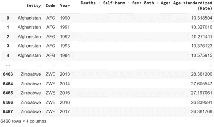
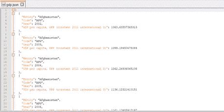
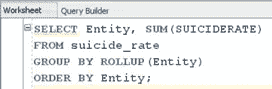
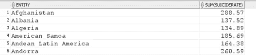
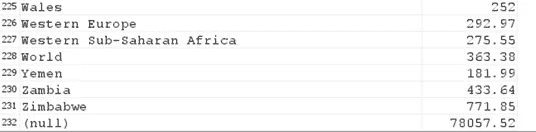
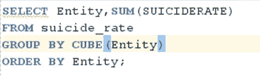
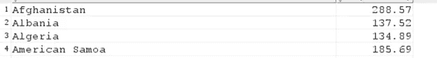
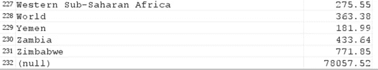
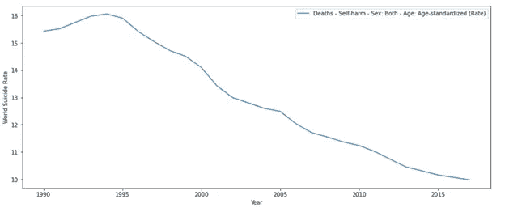
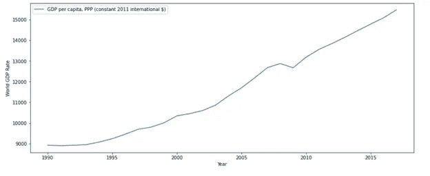

# 国内生产总值影响自杀率吗？

> 原文：<https://medium.com/geekculture/does-the-gross-domestic-product-affect-the-suicide-rate-303f2c6ed327?source=collection_archive---------56----------------------->

**假设**:国内生产总值(GDP)是促成自杀率上升的因素之一。

自杀在全世界都是一个非常复杂的问题，每年都会影响许多人。这是年轻人死亡的主要原因之一。数据还预测，每 40 秒就有一人死于自杀。这份文件的主要目的是找出各国国内生产总值和各国自杀死亡率之间的关系。为了实现以下假设，我们选择了 2 个数据集:

自杀死亡率. csv

gdp.json

这两个数据集都来自在线网站 ourworldindata.org，具体来说，数据集的链接是[https://ourworldindata . org/suitary #自杀是导致死亡的主要原因，尤其是在年轻人中](https://ourworldindata.org/suicide#suicide-is-a-leading-cause-of-death-especially-in-young-people)和[https://ourworldindata.org/economic-growth](https://ourworldindata.org/economic-growth)。

我们可以使用基本的 pandas 和 python 浏览数据集包含的数据。csv 包含大约 6469 条记录，足以提取信息。

suicide-death-rates.csv data

类似地，gdp.json 文件也可以被视为 python 中的数据帧，但是我们以 json 格式查看它。

gdp.json data

## 数据清理

我们必须了解我们正在处理的数据，这一点非常重要。在 Oracle 或其他数据库管理系统中导入数据集时，数值型数据会以 VARCHAR 格式加载，这使得统计分析非常困难。由于我们处理的是经过预处理的分析数据，因此不需要太多清理工作。有关数据清理的更多信息，请参见附录部分。

我们可以看看数据集中缺失的值。

我们可以看到 Code 列有 980 个缺失值。因为 Code 只是列实体的缩写，所以我们可以使用 dataset 而不用清除丢失的值。

**SQL Developer 中的查询**

为了处理大型数据集并提取有价值的信息，SQL 包含 OLAP 查询。OLAP 代表在线分析处理。这是 SQL 数据库的优势之一，因为 NoSQL 数据库不支持 OLAP。在当前上下文中，我们将使用 ROLLUP 和 CUBE。

让我们使用 SQL 中的 ROLLUP 查询来计算每个国家的自杀率总和以及所有国家的总和。

类似地，我们也可以使用多维数据集查询来描述类似的信息。

我们可以看到两个结果似乎相似。ROLLUP 和 CUBE 之间的唯一区别是，ROLLUP 为所有选定的列生成聚合值，而 CUBE 聚合所有可能的组合。

## 可视化两个数据集

为了验证和支持我们的假设，我们尝试使用 python 编程语言来可视化数据集。所用数据集的集合以及 python 中的可视化被上传到链接[https://github.com/sandesh8888/suicidevsgdp](https://github.com/sandesh8888/suicidevsgdp)中，任何感兴趣的人都可以一睹为快。

**时间序列可视化**

**世界自杀率对比年**

Time Series (I)

**世界 GDP 对比年份**

Time Series (ii)

可视化旨在发现所有国家的自杀与 gdp 趋势以及世界数据的趋势。为了提取有用的信息，绘制了 GDP 与世界自杀率数据的散点图，显示:

World suicide vs gdp

如你所见，我们想找出自杀率与 gdp 比率的关系。从图中我们可以清楚地看到，这两个数据之间存在着负的线性关系。这表明，如果国内生产总值增长率提高，自杀率就会下降，反之亦然。