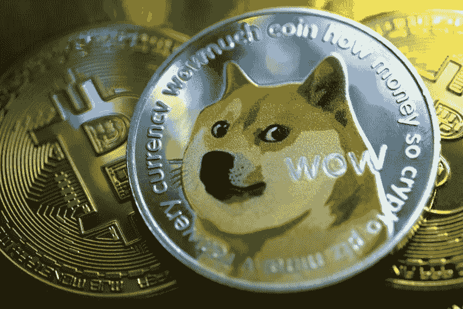

# Dogecoin (DOGE):埃隆马斯克对价格还有多大的影响力？

> 原文：<https://medium.com/geekculture/dogecoin-doge-how-much-influence-does-elon-musk-still-have-on-the-course-de23362282dd?source=collection_archive---------21----------------------->

埃隆·马斯克(Elon Musk)又这么做了，他在 Twitter 上公开谈论加密货币。只是在 5 月份,“狗爸爸”马斯克让 Dogecoin 陷入了混乱。DOGE 在一段时间内损失了 70%。然而，当时它正处于巅峰状态，市值高达 950 亿美元。此外，就在几天前，密码社区宣布他们不…