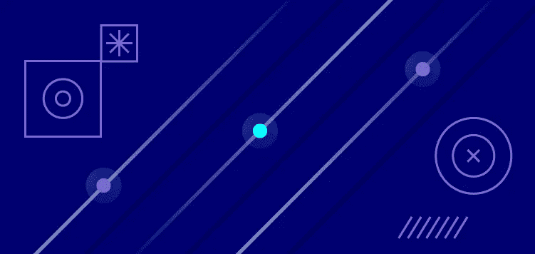
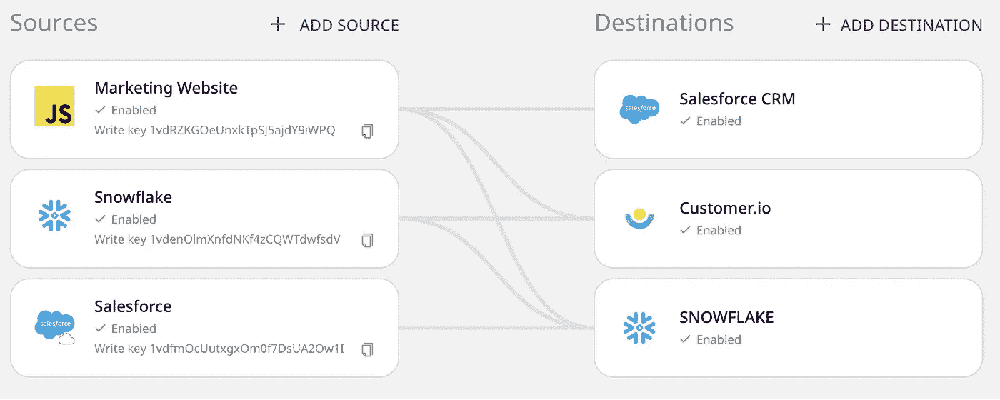
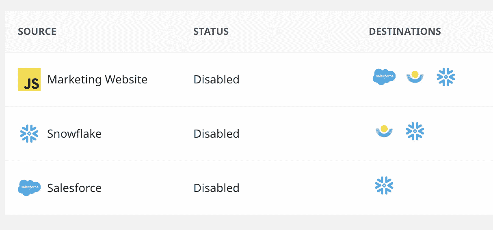
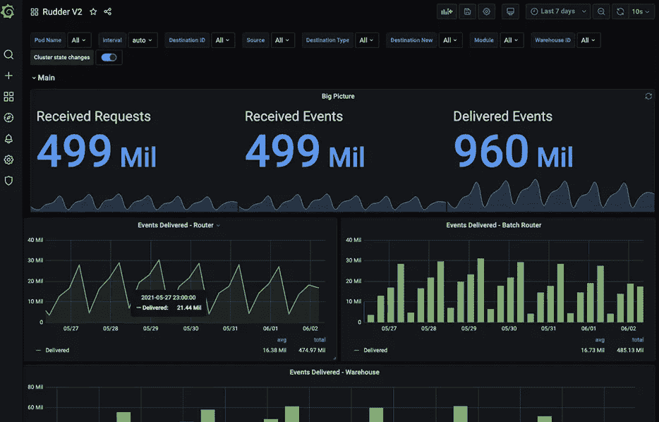

# 舵栈的狗食:我们的数据栈

> 原文：<https://medium.com/geekculture/dogfooding-at-rudderstack-our-data-stack-42823a452c89?source=collection_archive---------63----------------------->



这里有一个关于我们如何利用 RudderStack 应用程序功能的快速指南。

# 概观

我们利用我们的事件流和云提取管道从我们的应用、网站和云工具中获取数据。这为我们提供了整个堆栈的全面覆盖，以及跨每个数字接触点的用户旅程和用户档案的完整视图。事件流实时向云工具提供数据，每 30 分钟向雪花和 S3 转储一次行为数据。Cloud Extract 从我们的云营销和销售工具以及广告平台中提取数据，并将数据加载到雪花中，使我们可以轻松获得仓库中的完整图片。随着我们更多地了解我们的客户并丰富仓库中的各种数据，我们通过仓库操作将这些有价值的数据聚合回云工具。

下面是我们在管道以及如何使用管道方面的堆栈的高级分类。在这篇文章中，我们将简要概述如何使用每个管道，在下一篇文章中，我们将深入探讨我们的云和仓库目的地。

# 客户数据管道

*   [事件流](https://rudderstack.com/product/event-stream) —分析、转化、第三方 SDK(标签)管理
*   [云提取](https://rudderstack.com/product/cloud-extract) —针对云数据的 ETL，实现更丰富的分析
*   [仓库动作](https://rudderstack.com/product/warehouse-actions) —向堆栈发送丰富的数据和受众

我们还向我们的内部团队征求了一些“专业建议”,告诉他们在使用 RudderStack 执行特定功能时最有用的一两件事。

# 事件流—实时

# 营销网站和 web 应用前端

当我们说你可以在 5 分钟内开始流媒体活动时，我们是认真的，从你的网站上设置一个直播流是非常简单的。以我们自己的营销网站为例，它是用 [Gatsby](https://www.gatsbyjs.com/) 编写的，运行在 Sanity 上，当用户浏览网站、提交演示请求表格和注册参加网络研讨会时，我们收集各种客户端事件(页面、跟踪和识别)。这些事件都是客户端的，通过 Javascript SDK 源传递给 RudderStack。4 行代码和简单的 JavaScript 来执行页面，跟踪和识别呼叫，我们开始比赛。

```
<script> 
rudderanalytics=window.rudderanalytics=[];for(var methods=["load","page","track","identify","alias","group","ready","reset","getAnonymousId","setAnonymousId"],i=0;i<methods.length;i++){var method=methods[i];rudderanalytics[method]=function(a){return function(){rudderanalytics.push([a].concat(Array.prototype.slice.call(arguments)))}}(method)}rudderanalytics.load(<YOUR_WRITE_KEY>,<DATA_PLANE_URL>),rudderanalytics.page();
</script>

<script src="https://cdn.rudderlabs.com/v1/rudder-analytics.min.js"></script>
```

这些事件被实时传输到 RudderStack 数据平面，然后传输到各种不同的下游目的地，包括 Salesforce (CRM)、Snowflake(数据仓库)、Customer.io(电子邮件营销)和 Google Analytics 等(我们将在下一篇文章中详细介绍我们的云工具)。

```
window.rudderanalytics.track(
        "form_submit",
        {
          page: document.title,
          page_URL: window.location.href,
          form_id: form_id,
          label: form_id,
          category: section_id,
          conversion_page: document.title,
          utm_source: params.get("utm_source"),
          utm_medium: params.get("utm_medium"),
          utm_campaign: params.get("utm_campaign"),
          utm_content: params.get("utm_content"),
          utm_term: params.get("utm_term"),
          raid: params.get("raid"),
          test_user: params.get("test_user"),
        },
        {
          traits: {
            ...data,
            form_id: form_id,
            conversion_page: document.title,
          },
        }
      )
```

***专业提示*** :我们的营销部门使用来自 RudderStack 的独特匿名 ID，作为比他们从谷歌分析(因为眼见为实)获得的更准确的网站流量和转换计数。他们也发送。跟踪客户端和服务器端向广告平台的转换，他们说这比摆弄谷歌标签管理器方便一百倍。

# Rudderstack web 应用程序注册和帐户创建

除了在 web 应用程序中捕获客户端事件，我们还使用 Node.js SDK 在用户确认初始登录时生成服务器端事件。这些跟踪和识别调用包含的上下文数据比客户端事件少，但不容易受到广告拦截器和其他浏览器工具的影响，这些工具可能会阻止 RudderStack 事件到达 RudderStack 源。错过注册的情况很少，但这是客户旅程中最重要的事件之一，因此我们不会冒任何风险。

***专业提示*** :我们的产品和营销团队都使用 Customer.io 进行信息传递。同时拥有服务器端和客户端活动使他们能够协作，并轻松地为行为触发的交易电子邮件(即跟踪电话)以及营销电子邮件活动(即注册后 3 天内未创建来源)构建细分市场。

# 云提取物

我们使用 Cloud Extract 从多个来源提取数据，包括 Salesforce、Customer.io、谷歌广告、脸书广告和 Stripe。在本概述中，我们将让您大致了解我们如何使用 Salesforce 数据。

**Salesforce** —我们每 24 小时使用 RudderStack 云提取将各种 Salesforce 对象加载到雪花中。有了雪花中更新的销售信息，我们可以通过使用仓库操作(下面将详细介绍仓库操作)将特定线索和帐户状态的变化通知堆栈中的其他工具。



***专业提示*** :提取销售线索和业务机会的变更历史日志，通过来自您仓库中 Salesforce 的类似事件的数据提供非凡的洞察力。您不仅可以看到所有的销售互动和时间表，还可以跟踪带有用户和日期时间戳的现场级编辑，这让法规遵从性部门非常高兴！

# 仓库活动

**雪花** —仓库行动是我们堆栈中的无名英雄。我们的客户喜欢使用这个特性，但我们自己也喜欢，因为它实在太有用了。由于我们所有的客户数据都是在 Snowflake 中捕获的，仓库操作使我们所有的工具保持最新。例如，当用户成为客户时，销售团队会更新帐户类型和业务机会状态。然后每天运行一个更新 Customer.io 和其他营销工具的作业，以便这些用户退出某些营销活动和细分市场。



***亲提示*** :我们从哪里开始！选择退出状态标志是每个企业都非常关心的问题。为您的所有客户及其每个通信渠道的退出状态创建一个统一的视图是至关重要的，而 Warehouse Actions 可以轻松地更新堆栈中每个工具和数据存储的状态

# 实时转换

我们开发了许多用户转换来支持各种不同的流程，包括在将用户特征发送到云目的地之前对其进行映射和重命名，以及阻止匿名页面调用流向 Customer.io。我们还使用转换来增强事件，并在将它们传递到最终目的地之前修改有效负载。例如，当用户提交一个企业报价请求时，我们调用 Clearbit API 来收集基于电子邮件域的特定业务的额外帐户信息。

***Pro 提示*** :为了保持转换代码的整洁，利用转换库来存储适用于多个目的地的函数。例如，我们的营销和产品团队不断测试新的注册流量和转化率，因此我们阻止所有 rudderstack.com 电子邮件流向下游目的地，这让我们的营销和销售团队非常高兴。

**库:**

```
/***
* Docs: https://docs.rudderstack.com/getting-started/adding-a-new-user-library-in-rudderstack
* Examples: https://github.com/rudderlabs/sample-user-transformers
***/
export function rudderEmail(email) {
    return /@(rudderlabs|rudderstack)|\+ruddertest/.test(email);
};
export function rudder_email(arg) {
    return;
}
```

**将库加载到转换中:**

```
/***
* Docs: https://docs.rudderstack.com/getting-started/adding-a-new-user-transformation-in-rudderstack
* Examples: https://github.com/rudderlabs/sample-user-transformers
***/
// Load the Library 
import {rudderEmail} from 'isRudderEmail';
// Transform Event Here
export function transformEvent(event) {
        // Evaluate the email address
        const notRudderEmail = !rudderEmail(event.context.traits.email);
  if (
            // Ignore Rudder Emails 
            notRudderEmail
            )  {   
                  // do some code here 
                ];
                // Because Not Rudder Email, return event    
                return event;
        }
    return;
}
```

# 目标转换

您在 UI 中看不到这些，但是我们在数据平面中的目的地转换会自动地将 RudderStack 有效负载转换成适合每个下游工具的格式。换句话说，我们的集成团队已经为我们做了艰苦的工作，因此一个简单的 identify 调用就可以在 Salesforce、Customer.io Intercom 中创建一个用户，并在雪花中填充 users 表。

***Pro 提示*** :您可以通过将 integrations 对象添加到您的有效负载来配置事件将被发送到哪个目的地。如果 Salesforce 是目标，则 integrations 对象需要包含 Salesforce: true。默认情况下，我们会自动发送到所有其他目的地，除非您特别将该值设置为 false(即 Customer.io: false)。

# 通过 Grafana 的系统可观测性

系统性能指标存储在 InfluxDB 中，我们通过 Grafana 监控所有管道的健康状况，这为我们提供了关于 RudderStack 云实例的性能和状态的详细信息。Grafana 为我们提供了摄取、处理和交付事件的实时视图，以及各种其他指标，如负载下的性能、错误和交付统计数据。我们的 SRE 团队也将 Grafana 连接到我们的警报系统。



**本博客最初发表于:
[https://rudder stack . com/blog/dogfooding-at-rudder stack-our-data-stack](https://rudderstack.com/blog/dogfooding-at-rudderstack-our-data-stack)**