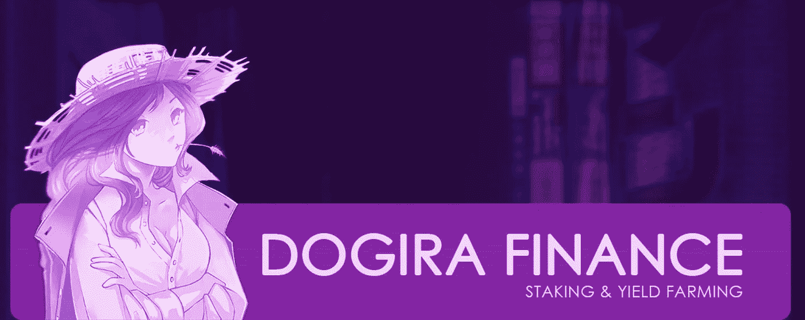
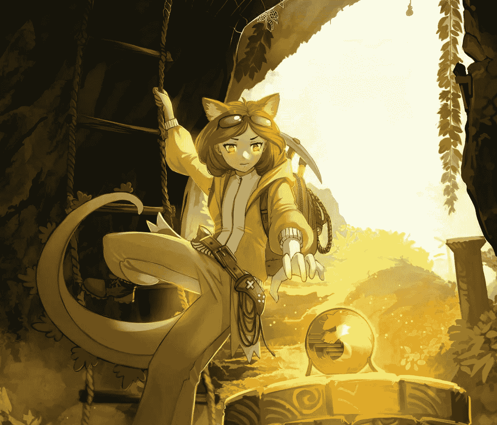

# Dogira 准备成为 DeFi 游戏巨头

> 原文：<https://medium.com/geekculture/dogira-poised-to-become-a-defi-gaming-powerhouse-1fdc3a8c5cc0?source=collection_archive---------12----------------------->

## 分散金融|游戏

## 他们可能成功的三个原因

Screenshot from [Dogira](https://www.dogira.net/) website

**由**[**Hogefather**](https://twitter.com/Hogefather)**又名 Jesse J Rogers |由**[**Dogira Finance**](https://www.dogira.net/)*不是财务建议。为了透明起见，作者个人拥有 50，000 个 Dogira 代币(在撰写本文时大约值 500 美元)。*

# 什么是 DeFi 游戏？

在 2021 年夏天，一款名为 [Axie Infinity](/geekculture/the-future-of-bullshit-jobs-is-kind-of-adorable-a5179270a14e) 的游戏赚钱的神奇宝贝克隆产品取得了令人瞠目结舌的成功，重新定义了多个行业。

仅在 **30 天**内，它就带来了**8400 万美元的收入，超过了所有其他协议在分权财务(DeFi)*方面的总和。突然间，每个人都在谈论加麦菲。***

***这一惊人的收入也在加密领域之外产生了冲击波。育碧等游戏巨头注意到了这一点，并转向区块链和 NFTs，尽管为技术而技术并不一定是他们的玩家想要的。***

***传统游戏工作室能否既让股东满意，又放弃足够的控制权来赢得玩家，还有待观察。特别是在 Steam 拒绝销售区块链游戏(T30)的情况下，我预计老牌电影公司在保持现有发行渠道的同时，将面临一场向区块链过渡的艰苦战斗。***

***像我一样的 DeFi 本地人倾向于相信，最好的机会和最大的成功故事将会在小型的、独立的草根项目中找到，这些项目将会跟随 Axie 的脚步从底层开始建设。***

***Dogira Finance 就是一个让我觉得有潜力的 GameFi 项目。以下是我的理由。***

# ***行业专业人士的第一个精益创业***

******

***Screenshot from [Dogira Whitepaper](https://dogira.net/whitepaper.pdf)***

***关于 Dogira，你注意到的第一件事可能是五名 doxed 团队成员之一的 Mary Mabiruna 的作品。正如你从她在 [ArtStation](https://www.artstation.com/mabiruna) 上的画廊中看到的，她是一位才华横溢的自由职业者，既有游戏和加密背景，又有独特的风格。她创造的 Dogira-chan 角色已经成为整个品牌的标志性吉祥物。***

*****项目负责人 Eoghan Hayes** ，也有两个世界的背景。他是最初的 Dogecoin 开发者之一，在 2013/14 年与 Digibyte 团队一起将 memecoin 升级为今天的样子。此外，他还是一名成功的企业级项目经理和 indy 游戏开发人员。***

***事实上，我有机会坐下来采访一名团队成员——沟通经理 Elijah MacDougall。为了深入了解这个项目，您将从他第一人称的幕后视角中学到很多东西。***

***剩下的成员，丹尼尔·古丁和斯凯勒·拉姆齐都是退伍军人，有很强的领导能力和作战背景。他们每个人都有销售和营销经验，使这些人具备社区建设和建立业务伙伴关系所需的多面性。***

***一个团队不一定要很大才能有效。它只是需要有行业经验的专业专家。多吉拉有那个。还有透明度，因为该团队已经做了大约 12 个 ama 以及教育视频。***

***和 Hoge Finance 的情况一样，这个团体不是最初的团队，他们的事业也不仅仅是一个 memecoin。这是一个来自社区内部的团体，在创始人考虑放弃这个项目后，他们站了出来。合同签给了他们，从这一点上，新的多吉拉团队成立了。他们真诚地相信品牌和概念的可行性。那种韧性和决心就是在[三月](/compounding-interest-podcast/is-hoge-coin-legit-22802aacd4b)把我拉到 Hoge 的那种品质。***

***这个新团队保持了这个想法和社区的活力，但与 Hoge 不同(到目前为止)，他们最终放弃了他们的旧令牌。他们已经在多边形网络上成功升级到 v2 Dogira 令牌。这就把我们带到了下一个话题。***

# ***极点位置的#2 多边形***

******

***Polygon (Matic)在 2017 年开始作为以太坊的第二层扩展解决方案，到 2021 年初，它的使用量仍然非常少。现在，它已经获得了如此多的采用，以至于有时它的交易量甚至超过了以太坊本身！***

***关键是快速、廉价的交易。因为 Polygon 使用下一代的利益证明协议，在以太坊上可能花费 100 美元或更多的交易在 Polygon 上以不到 1 美分的价格执行。***

***你可以想象，对于区块链游戏来说，这是至关重要的。如果玩家不得不为常规游戏动作支付数百美元，这是一个完全的交易破坏者。***

***回过头来研究一下 Axie Infinity 的成功，作为以太坊主网上的一个 ERC-20 代币，Axie 实际上并没有受到重视。但当他们转向自己的浪人侧链——一种类似于 Polygon 的 L2 解决方案——时，交易成本几乎降至零，游戏人气飙升。***

***便宜的交易是关键，在最受欢迎的三个连锁店(以太坊、Polygon、BSC)中，Polygon 是迄今为止交易成本最低的一个。甚至[以太坊的联合创始人 Vitalik Buterin](https://youtu.be/b1m_PTVxD-s) 也认为用户将不得不从 L1 迁移到 L2 解决方案。***

***为了充分发挥潜力，一棵树必须在合适的季节种植在肥沃的土壤里。类似地，技术项目必须在正确的时间、正确的环境中成长。我相信 Polygon 是 GameFi 行业中很大一部分的主机连锁店。我还认为，2022 年是主流意识到区块链游戏是 crypto 迄今为止最强大的用例的一年。***

***多吉拉在正确的时间把自己放在了正确的位置，去实现一个不可思议的愿景。因此，让我们来详细了解一下这个愿景是什么，以及我为什么如此喜欢它。***

# ***#3 游戏生态系统愿景***

***Video by my friend Crypto Camel (strongly recommended!)***

***推出一款有趣的原创游戏很难。***

***将它集成到区块链上更加困难。这就是我在[自学稳健](https://www.youtube.com/watch?v=I3NiUmxb0qc&list=PLggmFRX-Y7mtX37T7vjw_ZJwVHzXrH-Ua)时发现的。聪明的合同是无情的。如果有任何缺陷，它们都可能被利用，用户可能会失去价值。***

***为了让像我这样有抱负的独立游戏开发者自信地推出我们的区块链游戏，我们真的需要一些专家的指导和帮助，他们知道自己在做什么。这种技术支持、指导和咨询正是 Dogira 向其合作伙伴项目提供的。在这种模式中有巨大的互利机会。如果没有 Dogira 提供的那种网络和解决方案，有好想法的人往往无法实现。***

***已经有几项合作正在进行中。***

*   ***第三方开发商 [Hanzo Inu](https://dogira-team.medium.com/hanzo-x-dogira-bringing-one-of-the-first-games-to-the-dofi-ecosystem-a9659c9aea8d) 在 Dogira 的咨询下，正在开发一款很酷的、以动物为主题的、先玩后赚的 NFT 武士游戏。***
*   ***多吉拉也建议另一个第三方， [PolyDoge](https://dogira-team.medium.com/polydoge-x-dogira-growing-the-ecosystem-336fd5ad5da2) ，如何将区块链整合到他们雄心勃勃的游戏中，以赚取虚拟现实游戏。***
*   ***一对叫做 Jupiter Lighthouse Games 的 Unity 开发者，他们有着多年的 AAA 工作室经验，正在直接为 Dogira 开发一款游戏。***

***至于事情的不利方面，do gira token 的流动性不是通过税收或 tokenomics 获得的，而是通过高产农场和与分散交易所 [Apeswap](https://twitter.com/ape_swap/status/1446890788768698374) 、[多晶体](https://www.polycrystal.finance/)和 [PolyCat](https://polycat.finance/) 的伙伴关系获得的。***

***对于这个竞争激烈的 GameFi 空间中的公用事业令牌来说，他们避税是有道理的，因为税收不幸地增加了摩擦，阻碍了用户和流动性提供商的交易，而不仅仅是投机者。***

***Dogira 代币的主要用途是作为赌注工具，允许玩家为合作游戏赢得代币或独特的 NFT。在 [dogira.finance](https://dogira.finance/) 中已经有 290 万美元的锁定价值。随着他们的游戏生态系统变得越来越大，越来越有价值，不难想象这个数字会上升。我本人目前正把我的 matic 和 dogira 的一半放在一个资金池中，以每年 130%的速度赚取更多的 dogira。***

***这个生态系统将在 Polygon 中建立，这对我来说有多重要，我怎么强调都不为过。经过三年的默默无闻的发展，2021 年 Axie Infinity 从 L1 以太坊搬到 L2 后，销售额总计 11 亿美元。令人兴奋的是，经过 3 年的发展，Dogira 的生态系统会是什么样子，尤其是在 Polygon 的派对还为时尚早的时候？***

# ***想参与进来吗？***

***Dogira 团队正在积极招募中型作家。如果你想通过创作像这样的 Dogira 相关内容获得报酬，请联系 marketing@dogira.net 的**。*****

## ***快速链接***

***[主网站](https://www.dogira.net/)
[财经网站](https://dogira.finance/)
[YouTube](https://www.youtube.com/c/Dogira/videos)
[Twitter](https://twitter.com/DogiraOfficial)
[Medium](https://dogira-team.medium.com/)
官方电报群:@DogiraToken***