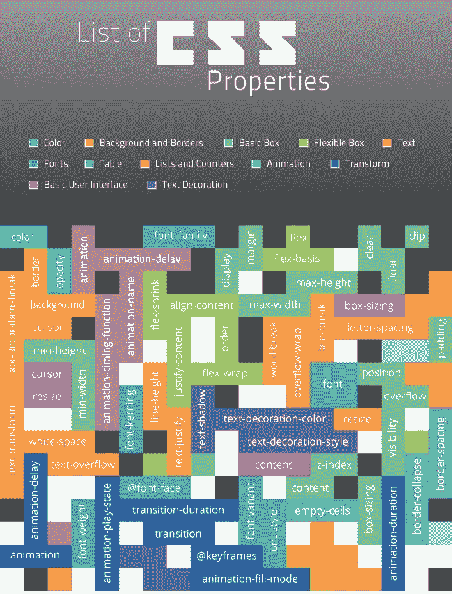

# 用最少的资源做最多的事

> 原文：<https://medium.com/geekculture/doing-the-most-with-the-least-24f2deb9f7d?source=collection_archive---------28----------------------->

*添加额外物品的简单技巧*

我认为强调一些技术或方法来为您的项目或应用程序增加一点活力会很有趣。虽然有很多真正深入的方法，但肯定有一些更简单的方法。我遇到了一些 CSS 库，它们可以帮助即使是最新手的程序员在他们的项目中加入一些东西，增加一些趣味。

# CSS 动画

当谈到在 CSS 中什么可以被动画化的参数时，可能性有几十种。它基本上是一个元素变成不同的东西的过程。这些动画也可以以多种方式开始。比如用鼠标悬停在一个元素上或者让一个元素进入/退出。你甚至可以制作一个整页扭曲的艺术作品。

事实上，当你听到 CSS 时，大多数人只会想到样式组件，但事实是 CSS 比你想象的要强大得多。

## 动画的类型

*   **视差滚动** —用于模拟 3d 效果的技术，其中前景中的元素比背景中的项目滚动得更快
*   **无限加载** —用动画隐藏页面加载，减少等待时间

*   **悬停** —让元素翻转、旋转、扩展、收缩等。当鼠标悬停在它上面时，增强了参与度
*   **排版**——将一些文本制作成动画，让它看起来像是当场写的，以吸引或抓住用户的注意力
*   **过渡** —让下一页滑入或以其他创意方式出现也会增加与用户的互动感

# Animate.css 入门

这些库主要按照相同的程序运行。他们会让你在 CLI 中使用 **npm** 或 **yarn** 安装一个包，在你的 index.html 文件中写几行<脚本>，或者将一个文件导入你的样式表。

`npm install animate.css`

`yarn add animate.css`

`import 'animate.css'`

然后你所要做的就是调用一个特定的类或者类名到你想要激活的元素中，然后你就离开了比赛。

一旦你调用了动画，还有一些其他的东西可以根据你的喜好来玩和定制。

`--animate-duration: 1s; (how long you want it to be animated)`

`--animate-delay: 3s; (how long you want to wait before it starts)`

当然，还有许多其他的课程可供选择，请到[网页](http://animate.style)来展示它们。

这是 Animate.css 库的处理过程，但是正如我前面提到的，还有很多其他库的操作也一样简单。

## 其他著名的 CSS 动画库

*   [Hover.css](https://ianlunn.github.io/Hover/)
*   [CSShake](https://elrumordelaluz.github.io/csshake/)
*   [cssanimation.io](https://cssanimation.io/)
*   [WickedCSS](https://kristofferandreasen.github.io/wickedCSS/#)

对于那些真正喜欢它的人来说…

*   [讨厌的](https://tholman.com/obnoxious/)
*   [Woah.css](http://www.joerezendes.com/projects/Woah.css/)

# 放弃

您应该始终根据自己的判断使用这些动画。超载会降低它们的冲击力。

尽量避免无限动画。它甚至会让人非常讨厌或分心，这不是我们的目标。

动画制作像`<body>`或`<html>`这样的较大/根元素会使 UX 变得笨拙，可能会让用户感到困惑。

# 结论

对于任何项目、应用程序或网站来说，这些库都是增加参与度和促进与用户互动的有趣方式。有时候，只需要一点点额外的东西就能让用户不断向你走来。如果你喜欢这些内容，一定要看看我的其他博客，或者随时在我的 linkedIn 上与我联系。超！

 [## Jamon Dixon -熨斗学校-德克萨斯州奥斯汀大都会区| LinkedIn

### 全栈式 web 开发人员，对事物的工作原理充满好奇，并具有解决问题的能力。拥有强大的…

www.linkedin.com](https://www.linkedin.com/in/jamondixon/)