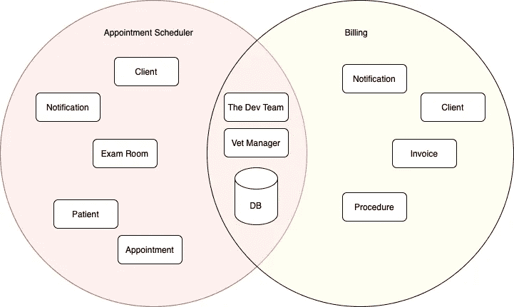

# 领域驱动设计|深入了解上下文映射

> 原文：<https://medium.com/geekculture/domain-driven-design-deep-dive-into-context-mapping-f9cd8acddd7e?source=collection_archive---------6----------------------->

几个月前，我写了一个关于领域驱动设计(DDD)的故事，高度概括了什么是 DDD 语言的一部分，什么不是。在这个故事中，我想对 DDD 中的上下文映射有更具体的了解。

# 为什么要使用上下文映射？

顾名思义，上下文映射帮助您以最直观的方式定义应用程序不同上下文之间的关系。这是非常有用的，例如，如果一个单词在一个上下文中有一个意思，而在另一个上下文中完全不同。这可能发生得相当快，并会导致两种语境之间的混淆的语言障碍。

# 什么是上下文映射？

上下文映射是一种工具，它允许开发人员和领域专家识别有界上下文之间的关系以及负责它们的团队之间的关系。

我们可以通过不同的方式在两个或多个有界环境之间进行集成:

*   **合伙关系**
*   **共享内核**
*   **客户供应商**
*   **墨守成规**
*   **防腐层**
*   **打开主机服务**
*   **发布语言**
*   **分道扬镳**
*   **大泥球**

## 合作关系

当两个环境中的团队一起成功或失败时，需要出现一种合作关系。这些团队建立了一个协调发展规划和联合管理集成的流程。团队必须在接口的发展上合作，以适应两个系统的开发需求。应该安排相互依赖的特性，以便它们在同一个版本中完成。

## 共享内核

共享模型的一部分和相关的代码形成了一个非常紧密的相互依赖关系，它可以利用设计工作，也可以破坏它。用明确的边界指定团队同意共享的领域模型的子集。保持内核较小。这种明确共享的东西具有特殊的地位，在没有与其他团队协商的情况下不应该改变。定义一个持续的集成过程，该过程将保持内核模型的紧密性，并调整团队中无处不在的语言。

## 客户-供应商开发

当两个团队处于上下游关系时，上游团队的成功可能依赖于下游团队的命运，下游团队的需求会以各种方式得到满足，并产生各种后果。下游优先考虑上游计划。为下游需求协商和预算任务，以便每个人都理解承诺和时间表。

## 遵奉者

当两个开发团队有一个上游/下游关系，其中上游团队没有动力提供下游团队的需求时，下游团队是无助的。利他主义可能会激励上游开发者做出承诺，但不太可能兑现。下游团队通过盲目地遵循上游团队的模型，消除了有界上下文之间翻译的复杂性。

## 防腐层

翻译层可以很简单，甚至是优雅的，当把设计良好的有界环境和合作团队联系起来的时候。但是，当控制或沟通不足以实现共享内核、合作伙伴或客户-供应商关系时，翻译就变得更加复杂。翻译层采取了更具防御性的语气。作为下游客户端，创建一个隔离层，根据您自己的域模型为您的系统提供上游系统的功能。这一层通过其现有的接口与另一个系统对话，几乎不需要对另一个系统进行修改。在内部，该层根据需要在两个模型之间单向或双向平移。

## 开放主机服务

定义一个协议，将对子系统的访问作为一组服务。开放协议，让所有需要与你集成的人都可以使用。增强和扩展协议以处理新的集成需求，除非单个团队有特殊的需求。使用一个一次性的翻译器来增强该特殊情况下的协议，以便共享的协议可以保持简单和一致。

## 出版语言

两个有界上下文的模型之间的转换需要一种共同的语言。使用记录良好的共享语言，该语言可以将必要的领域信息表达为通用的交流媒介，并在必要时翻译成该语言或从该语言翻译出来。发布语言通常与开放主机服务相结合。

## 分道扬镳

在定义需求时，我们必须毫不留情。如果两组功能没有显著的关系，它们可以完全分开。整合总是代价很大，有时候收益很小。声明一个有界的上下文，使其与其他上下文没有任何联系，从而使开发人员能够在这个小范围内找到简单的、专门的解决方案。

## 大泥球

当我们调查现有的系统时，我们发现，事实上，在系统的某些部分，通常是大型系统中，模型是混合的，边界是不一致的。在整个混乱的周围画一个边界，指定它是一个大泥球。不要试图在这种情况下应用复杂的建模。警惕这种系统蔓延到其他环境的趋势。

总之，理解各种上下文映射技术允许有界上下文之间更有效的集成。同样重要的是，首先要考虑集成是否必要，是否能给业务带来好处。同时使用多种方法也是可以接受的，有时甚至是首选。例如，拥有一个 RESTful API 自然会提供 **OHS** ，但同时，下游也可能被鼓励实现自己的 **ACL** ，尤其是当上游服务由第三方提供时。您和您的团队将是根据各自的情况决定使用哪种方法的最佳人选。

如果你想了解更多关于上下文映射的信息，请访问 https://github.com/ddd-crew/context-mapping

关于 DDD 的更多信息，我只能推荐由沃恩·弗农所著的书[实现领域驱动设计](https://www.amazon.de/Implementing-Domain-Driven-Design-Vaughn-Vernon/dp/0321834577)

# 反射

## 什么进展顺利

因为这篇文章是关于基于 Eric Evans 的 DDD 的上下文映射，所以我可以从这本书上获得关于这个主题的大部分信息，这真的很棒。

## 什么需要改进

下一次，在我开始阅读理论之前，我会快速浏览一些例子。通过这种方式，我可以提前更清楚地了解这是怎么回事，并且可以将新学到的东西与示例联系起来。