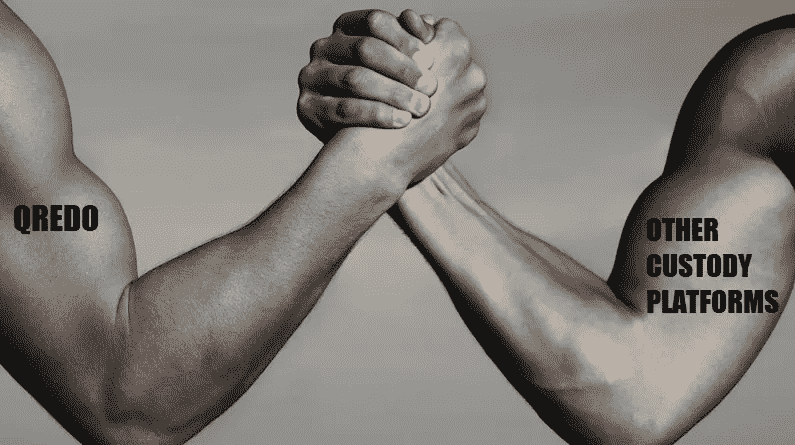
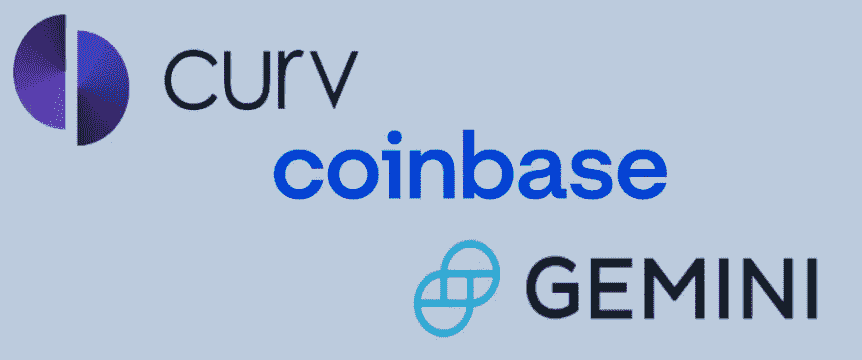
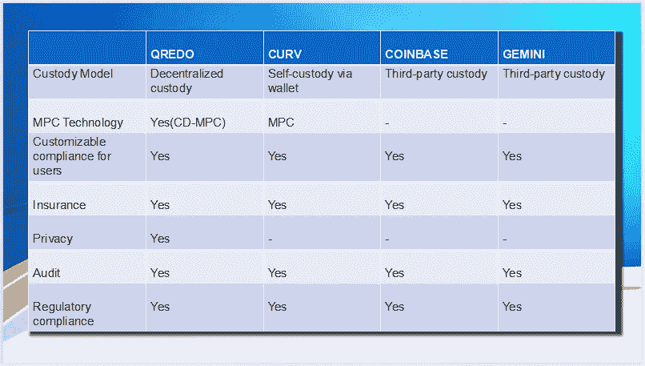
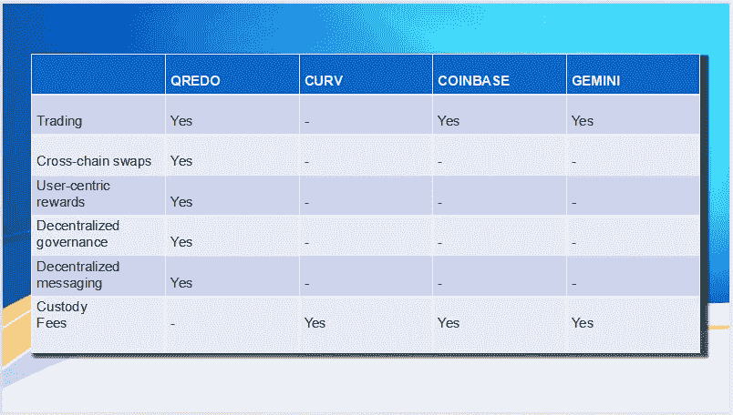
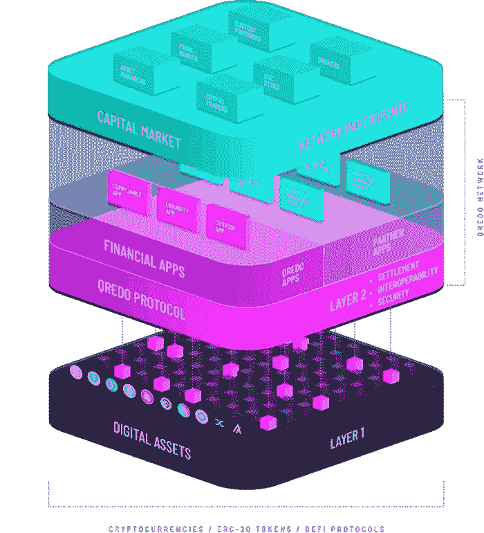
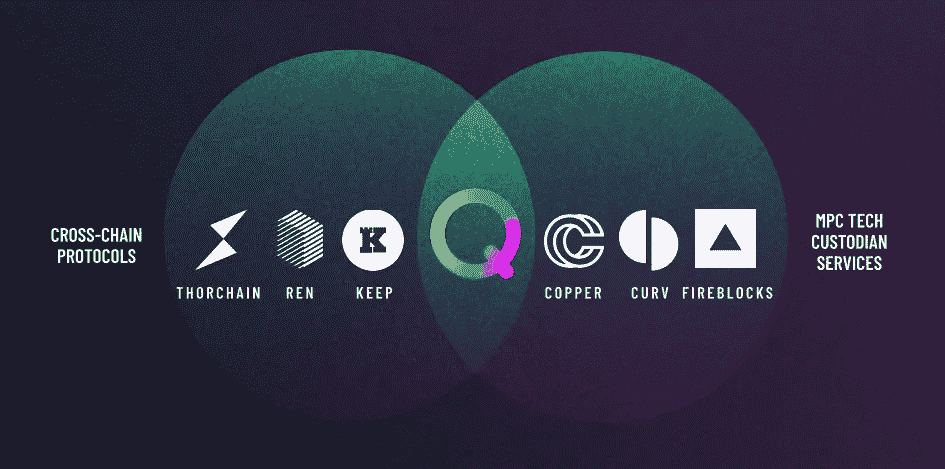

# 主宰巨头 Qredo 如何改变数字资产托管业务

> 原文：<https://medium.com/geekculture/dominating-giants-how-qredo-is-transforming-the-digital-assets-custody-business-fca6c7f06adf?source=collection_archive---------23----------------------->

数字资产托管机构是加密货币领域的主要参与者，有助于机构投资者从传统金融领域轻松进入快速增长和不断发展的分散金融市场，同时还提供数字资产的安全托管。[比特币基地托管](https://custody.coinbase.com/)、[双子星托管](https://www.gemini.com/custody)、 [Curv](https://www.curv.co/) 和[铜](https://copper.co/)是一些流行的加密托管平台。

[比特币基地托管公司](https://custody.coinbase.com/)——纽约州银行法下的受托人——是比特币基地公司的独立资本化业务，该公司运营着交易量最大的交易所之一，[比特币基地](https://www.coinbase.com/)。 [Gemini 托管](https://www.gemini.com/custody)，另一个受欢迎的托管平台隶属于 [Gemini exchange](https://www.gemini.com/) ，而最近被 Paypal 收购的 [Curv 是采用多方计算(MPC)技术的领先数字资产托管公司之一。](https://ihodl.com/topnews/2021-03-08/paypal-acquires-curv-custodian/)

毫无疑问，数字资产托管机构是拥有大量资金的交易所和投资者的首选，这使它们成为黑客的理想目标。因此，必须始终确保他们所保管的资产的最大安全。

作为提供分散托管服务的基础设施，Qredo 选择在区块链空间的“大联盟”市场中竞争。能对上吗？它的价值主张是什么？或者该团队只是为了从加密货币价格的上涨中获利而“重新发明轮子”？

## 保管，便于安全保管和查阅

资产的安全存储是任何托管平台的首要任务，同时还确保在托管人可能选择提供的其他功能/服务中轻松访问资产。

不同的保管人采用不同的方法来确保其保管的资产的最大安全性—从定期审计到结合使用冷热钱包、隔离冷藏、数据加密和复杂的加密技术。然而，总有一个问题，如果在所有这些措施之后，出现了导致资产损失的安全漏洞，会发生什么情况。因此，适当的保险是确保始终覆盖客户数字资产的必要条件。

**交易和流动性:**托管平台通常不仅为数字资产提供安全的存储服务，还为大型资本投资者和交易商提供进入和退出数字资产市场的途径。一些数字资产托管人利用这一点，并使用其关联的交易所来促进其托管的数字资产的交换，从而为其交易所创造了一个现成的市场，同时为客户提供了简单而深入的流动性。

## 比特币基地监护权

[比特币基地托管](https://custody.coinbase.com/)提供数字资产的隔离冷藏。这确保了数字资产不会集中在一个特定的冷钱包中，从而消除了万一出现安全问题时资产全部丢失的风险。比特币基地保管公司经过保险和审计，支持大量资产的安全存储。

## 双子星座

[双子托管](https://www.gemini.com/custody)为所有可在其交易所交易的资产提供冷钱包存储。Gemini 支持直接从冷钱包在 Gemini exchange 上交易他们托管的资产。Gemini 保管公司已注册、投保，并符合监管要求。Gemini 保管采用多层安全架构，具有多层生物识别验证和多重签名技术。

## **曲线**

Curv 是一种基于云的加密货币钱包，它采用多方计算来消除对私钥的需求，就像比特币基地和双子座这样的平台一样。Curv 支持大量硬币，用户保持对其资产的完全自主权。

## Qredo 优势——是什么让 Qredo 在同行中脱颖而出？

Qredo 主要依靠自己的区块链提供分散托管服务，这在数字资产托管市场尚属首次。虽然对某些人来说这似乎是一个不必要的措施，但它提供了去中心化和治理的手段，同时确保了交易隐私。区块链技术的使用还消除了集中式数据库的使用，因为数据可以不变地存储在区块链上。

**安全和保险**

[Qredo](https://www.qredo.com/) 采用共识驱动多方计算(CD-MPC ),无需私钥即可处理交易，确保在 [Qredo](https://www.qredo.com/) 区块链的交易对手之间进行无信任计算和数字资产的即时转移。CD-MPC 消除了私钥泄露的可能性，因为它们不存在于网络上。对 [Qredo](https://www.qredo.com/) 平台的访问是通过使用签名应用和个人电脑的双因素认证机制授予的——除了传统的电子邮件和密码对之外，还增加了一层额外的安全保护。

[Qredo](https://www.qredo.com/) 已经过 [Zokyo](https://www.zokyo.io/) 的 pen 测试，并且已经过领先的安全机构如 [Quantstamp](https://quantstamp.com/) 、 [NCC Group](https://www.nccgroup.com/) 、 [Trail of Bits](https://www.trailofbits.com/) 和 [Marsh 麦克伦南](https://www.mmc.com/)的审计，并由 [Lloyd's](https://www.lloyds.com/) 和 [Sompo](https://www.sompo-hd.com/en/) 提供保险。

Qredo 是一个二级区块链，区块链上的交易记录在其分布式分类账中。合成代币被铸造到 [Qredo](https://www.qredo.com/) 区块链上的 [Qredo](https://www.qredo.com/) 钱包地址，以代表第一层上相应的硬币或代币。通过使用账户代码和资产 id 来确保隐私性，从而保持交易钱包地址和转移资产的私密性**。**

**交易和流动性**

[Qredo](https://www.qredo.com/) 是大型资本投资者进入和退出数字资产市场的一种方式，因此，需要深度流动性，以便大型资本投资者可以很容易地在市场中导航，而几乎没有滑动或没有滑动。这种需求催生了[流动性枢纽](https://www.qredo.com/blog/liquidity-hub?utm_source=twitter&utm_medium=organic&utm_campaign_type=corporate&utm_campaign=Liquidity%20Hub&utm_blog=tweet&utm_content_type=text) ，它使用[暗池](https://www.investopedia.com/articles/markets/050614/introduction-dark-pools.asp) ，并以经济的费用促进即时的跨链原子互换，使大小资金交易者可以轻松无缝地交换资产。

目前， [Qredo](https://www.qredo.com/) 在其平台上支持比特币、以太坊和许多 ERC20 代币，不久将支持更多代币。虽然大多数托管平台对其服务收取费用，但 Qredo 首次向用户提供免费托管服务！

## 权力下放——目标

目前， [Qredo](https://www.qredo.com/) 在 Qredo 有限公司的监管下，使用分散的基础设施进行运营。需要注意的是，Qredo V1 公司尚未分散，但正在积极开展工作(Qredo V2)。V1 mainnet 部署在横跨美洲、欧洲和亚洲的高度安全的数据中心的六个验证器节点上。

权力下放的一个显著特征是权力下放的治理模式(DAO ),它使参与者——通常是令牌持有者——能够对发展提案进行投票。Qredo token QRDO 是一个 ERC20 令牌，是一个实用令牌，通过 DAO 作为激励、奖励和管理 Qredo 的手段。QRDO 已经在许多交易所进行交易，使用 [Coingecko](https://www.coingecko.com/en/coins/qredo) 可以轻松跟踪。

**虽然许多数字资产托管平台试图在服务和功能上超越彼此，但 Qredo 已经成为一个基础设施，将所有数字资产托管平台纳入分散托管** — **为数字资产托管人创建一个安全健康的生态系统，具有深度流动性、资本效率和跨链互操作性。**

