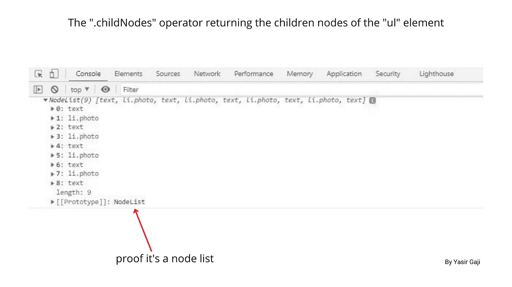
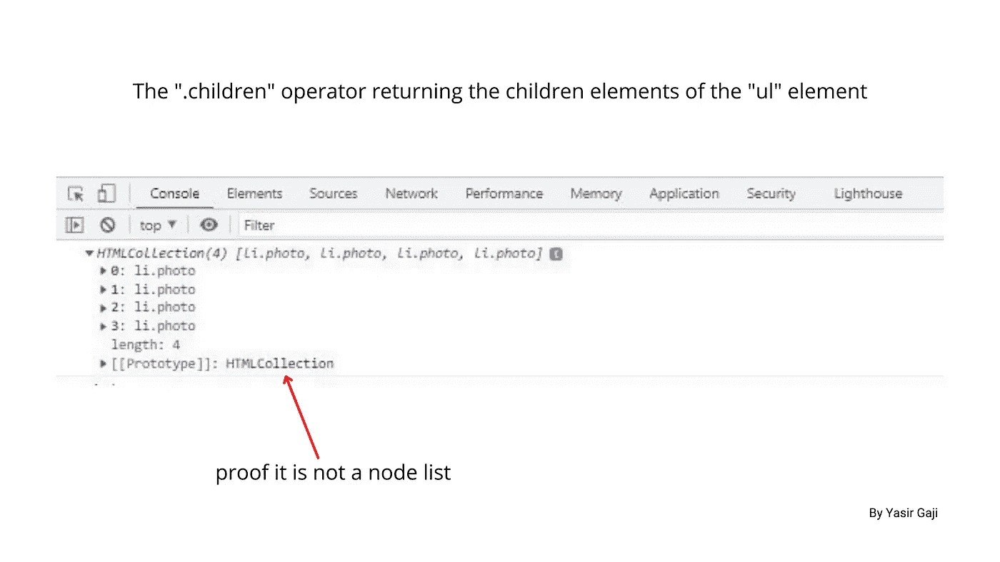
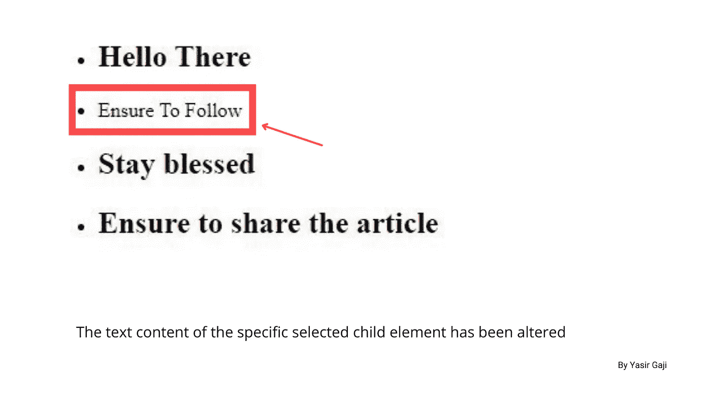
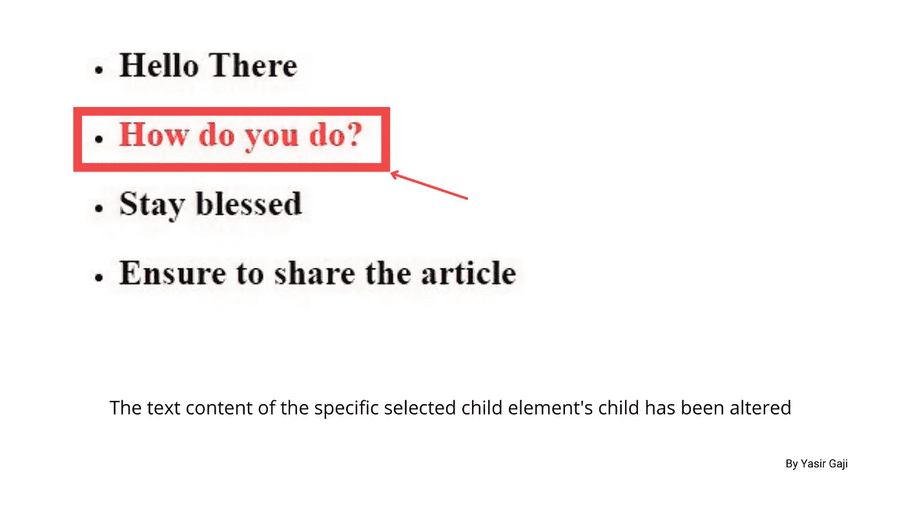
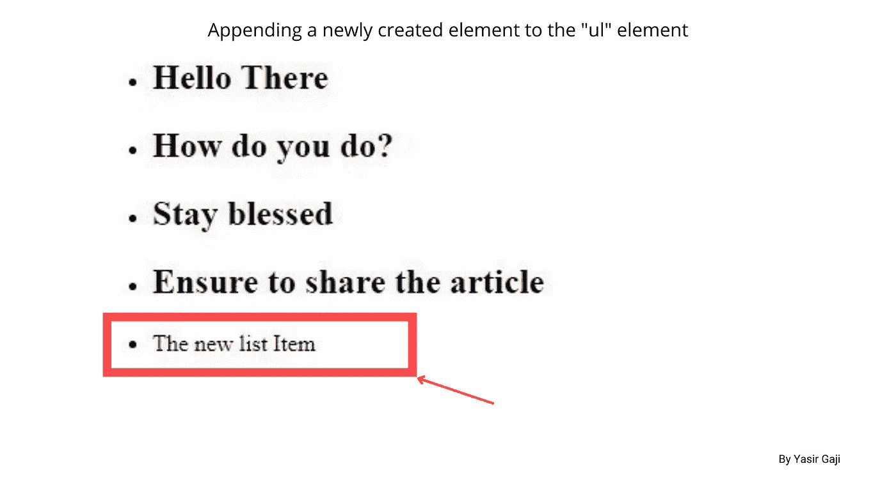
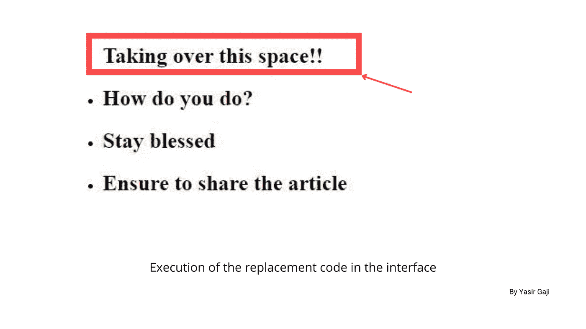

# “唐”的“堂”(Beta)。

> 原文：<https://medium.com/geekculture/don-of-the-dom-beta-749ab7ab563f?source=collection_archive---------25----------------------->

在关于成为 dom 的 don 的 [***alpha 文章***](/geekculture/being-the-don-of-the-dom-dod-a94f6eb9f6c3) 中，我尽了最大努力让您经历 dom 的介绍阶段，在这个阶段，我们研究了 dom，介绍了 javascript dom 选择器，包括单个和多个选择器，并学习了如何将 Html 集合转换为数组的 don 技巧。

Image representation of DOD (BETA) with Don Pablo imitation By [**Yasir Gaji**](https://yasirgaji.com)

在本文中，我们将更深入地探讨成为 dom 的 don 的艺术，我们将学习**遍历 dom，从 dom 创建元素，**以及如何像 don 一样使用这个 [***Html 集合***](https://gist.github.com/YasirGaji/0a6b33fc54fcd5efbe35efd5564c2324) 在 dom 中**激发和雇佣元素。**

# 穿越大教堂

知道了所有的 dom 选择器之后，让我们开始遍历 dom，这基本上是在 dom 中上下导航/移动，我们将处理单个节点/元素的父节点和子节点。

## 初审

我们将查看附加到各个节点/元素的不同属性，这些属性与父元素和子元素/节点选择有关，如果我们要从提供的 [***HTML 集合***](https://gist.github.com/YasirGaji/0a6b33fc54fcd5efbe35efd5564c2324) 中选择子节点/元素，我们可以使用`.childNode`方法操作符，如本例所示；

How to select children nodes of an Html collection by [**Yasir Gaji**](https://yasirgaji.com)

现在，这几行代码将返回控制台中 ***ul*** 元素的子节点。

The children nodes of the ul element returned in the console By [**Yasir Gaji**](https://yasirgaji.com)

注意，子节点不仅仅由 ***li*** 元素组成，它还有文本节点，如果您是 javascript 新手，您可能会感到奇怪，在 Html 文件*中的 ***li*** 元素之间没有文本 作为**唐，**我们应该用`.children`方法代替`.childNode`方法，所以如果我们有；*

*How to select children elements of an Html collection by [**Yasir Gaji**](https://yasirgaji.com)*

*这将只有子元素，而不是控制台中返回的子节点。*

**

*The children elements of the ul element returned in the console by [**Yasir Gaji**](https://yasirgaji.com)*

*由此得出结论，在遍历 dom 时，`.children`方法比`.childNode`方法更可取，但这两种方法都是有效的，我们可以以多种方式操纵它们，还可以将附加方法附加到它们上，例如使用 `.childNode` *方法时，使用`.nodeName`获得选定节点的 [*节点名*](https://www.w3schools.com/jsref/prop_node_nodename.asp) 或`.nodeType`获得选定节点的 [*节点类型*](https://www.w3schools.com/jsref/prop_node_nodetype.asp) *。***

## *二审*

*例如，如果我们想要选择/定位和操作 Html 集合中父元素的第二个子元素，我们可以对节点/元素子元素进行特定的或有针对性的选择并操作它们；*

*How to select specific children elements of an element by [**Yasir Gaji**](https://yasirgaji.com)*

*这将改变所选特定子元素的文本内容*

**

*The text content of the selected child element has been changed in the interface by [**Yasir Gaji**](https://yasirgaji.com)*

*使用这种方法，我们可以为子元素或子元素的子元素/节点分配属性；*

*A representation of the manipulation of a child element’s child by [**Yasir Gaji**](https://yasirgaji.com)*

*这将改变界面中目标元素的颜色，如下图所示；*

**

*The text color of the selected child element’s child has been changed in the interface by [**Yasir Gaji**](https://yasirgaji.com)*

*我们可以分配更多类似动态的 ***id*** 或 ***className、*** 我们也可以使用其他方法选择子元素的子元素，如`.firstChild`、`.firstElementChild`、`.lastChild`和`.lastElementChild`。使用这些方法`.parentNode`、`.parentElement`和`.parentElement.parentElement`，在子节点/子节点上执行的任务也可以在父节点/元素上完成。正如我们可以选择 ***子*** 和 ***父*** 元素/节点一样，我们也可以使用`.nextSibling`、`.nextElementSibling`、`.previousSibling`和`.previousElementSibling`等方法选择 ***兄弟元素*** 。*

*这就结束了对 dom 的遍历，我会让你成为指导者，让你弄清楚如何使用我上面列出的 ***父*** 和 ***兄弟*** 方法。*

# *创建元素*

*作为 dom 的 don，我们可以完全从头开始构造 dom 元素，给它们赋予属性，并插入到 dom 中进行操作，这就提到了创建一个额外的*元素并插入到提供的 [***Html 集合***](https://gist.github.com/YasirGaji/0a6b33fc54fcd5efbe35efd5564c2324)***；*****

**creating a new “li” element and appending it to the “ul” element by [**Yasir Gaji**](https://yasirgaji.com)**

**这几行代码将在界面和 Html 集合中输出一个新的 ***li*** 元素。**

****

**Image representation if the newly created “li” in the interface by [**Yasir Gaji**](https://yasirgaji.com)**

**与这个表示相比，我们可以创建更多的元素，并更动态地分配它们，但我会让你自己作为 don 来解决这个问题。**

# **雇用和解雇要素**

**移除和替换 dom 中的元素/节点，操纵 dom 中的类和属性，是雇佣和解雇元素/节点的方法。**

## **雇用**

**让我们从提供的 [***Html 集合中雇佣元素***](https://gist.github.com/YasirGaji/0a6b33fc54fcd5efbe35efd5564c2324) 好吗，为此我们将使用`.replaceChild()`方法，该方法接受两个参数，替换和要替换的元素；**

**Replacing an element with a new one by [**Yasir Gaji**](https://yasirgaji.com)**

**这组代码将执行替换图像表示中的第一个子元素的内容的任务**

****

**Element replacement in the interface by[**Yasir Gaji**](https://yasirgaji.com)**

## **开火**

**从 dom 中触发元素只是使用
`.remove()`方法删除它们，如下图所示；**

**Code representation of removing an element by [**Yasir Gaji**](https://yasirgaji.com)**

**这两行代码将取出所提供的 Html 集合中无序列表的第二个索引中的 ***李*** elememt，试一试，看看它的效果如何。我们也可以通过孩子使用`.removeChild()` 的方法来移除；**

**code representation of removing an element using the .removeChild() method in JS by [**Yasir Gaji**](https://yasirgaji.com)**

**这三行代码将取出 Html 集合第 4 个索引中的 ***李*** 元素。**

# **结论**

**这些**遍历 dom、从 dom 创建元素、**和**在 dom 中激发和雇佣元素的方法**是 javascript 中 dom 操作的核心基础，可以直接或动态地在项目中实现。一定要提问以获得澄清。**

## **注释和参考**

**`.childNode`和`.children`方法是从零开始索引的。
这里有一个 [***节点类型的独占列表***](https://www.w3schools.com/jsref/prop_node_nodetype.asp) 。
为了计算存在的子元素总数，我们可以使用`.childElementCount`方法。**