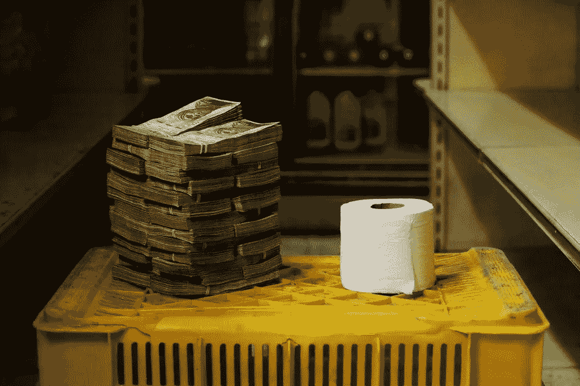

# 除非你先明白钱是怎么运作的，否则不要买比特币

> 原文：<https://medium.com/geekculture/dont-buy-bitcoin-unless-you-understand-how-money-works-first-e8445febcd81?source=collection_archive---------15----------------------->

金钱的 11 条规则

Photo from BBC.com

当我和朋友谈论比特币时，我意识到两件事:

1.他们不明白钱是如何运作的

2.他们不信任一个看起来投机且有风险的新系统

很公平。我也不知道…直到我知道了。不信任新事物是完全正常的…