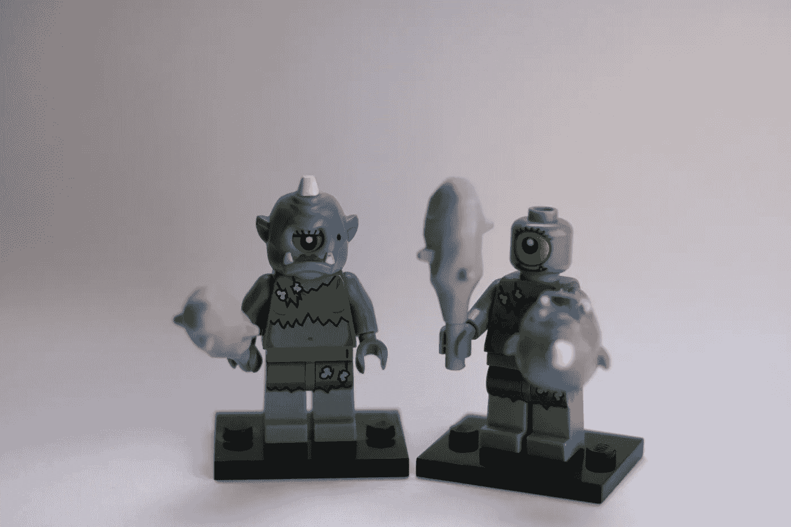

# 不要喂巨魔:使用 Python 分享推文而不参与

> 原文：<https://medium.com/geekculture/dont-feed-the-trolls-using-python-to-share-tweets-without-engaging-e3cad36e1d70?source=collection_archive---------26----------------------->

## 停止与网上的流氓打交道，同时让别人听到你的观点。

Photo by [Grianghraf](https://unsplash.com/@grianghraf?utm_source=unsplash&utm_medium=referral&utm_content=creditCopyText) on [Unsplash](https://unsplash.com/s/photos/troll?utm_source=unsplash&utm_medium=referral&utm_content=creditCopyText)

Twitter 是我们公共话语中一个不可思议的创新。然而，重要的是要理解 Twitter(和其他社交媒体公司)依赖于参与度，因此放大两极分化是好的…