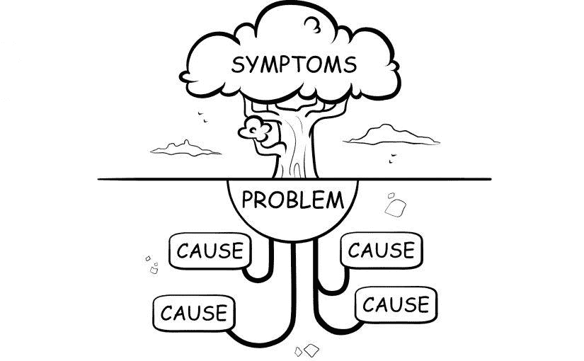
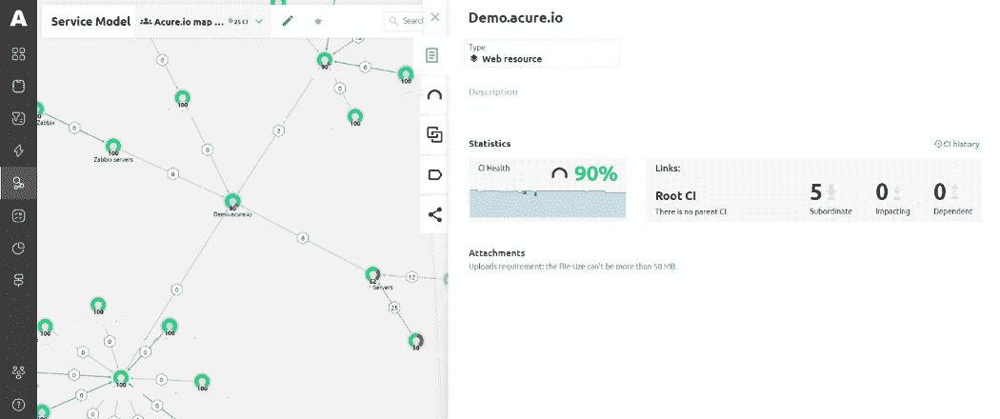
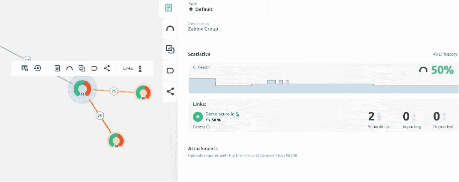

# 不要忘记根源:数据监控中的根本原因分析

> 原文：<https://medium.com/geekculture/dont-forget-about-roots-root-cause-analysis-in-data-monitoring-9de10f05d1fc?source=collection_archive---------5----------------------->

大家好，我是瑞克。在上一篇文章中，我谈到了 AlOps 系统中的自动发现和自动操作功能如何帮助 IT 专家将日常任务委派给机器，从而腾出时间来完成只有人脑才能完成的工作。但即使在这种情况下，AI 也不能打折扣。如果我们正在处理复杂的大数据分析，机器将无法为我们思考，但它们将能够显著简化这种分析，减少思考所需的时间。今天，我想谈谈在监控中所必需的称为**根本原因分析**的方法，并基于 Acure 示例展示它是如何工作的。因此，来看看我在监控自动化世界中的冒险故事的续集吧。

## **什么是根本原因分析，为什么它如此重要？**

我已经把 IT 系统比作一个活的有机体。像任何生物一样，它也会生病。但是为了治愈疾病，仅仅消除症状是不够的。重要的是找出这种疾病的原因，并消除它。为此，我们需要进行根本原因分析。

我在网上看到了下面这张图片，在我看来，它清楚地表明了为了克服问题，了解问题的原因是多么重要。

用树来比喻是非常准确的。根本原因分析是一种识别隐藏原因的方法，它允许您确定特定问题发生的原因。因此，RCA 是问题和原因之间依赖关系的树状层次结构。

根本原因分析回答了三个问题:

*   有什么问题？
*   原因是什么？
*   以后应该怎么预防？

寻找这些问题的答案将我们引向一连串的三个简单步骤:**定义-分析-解决**。

RCA 不仅有助于检测问题，而且有助于了解问题的原因，以防止问题在未来发生。

值得注意的是，许多在分析中使用这种方法的人错误地认为只有一个根本问题，尽管在现实中，一切都可能复杂得多。因此，记住被分析对象的联系是非常重要的。

当然，在其他使用 RCA 的领域，一切都可以更简单，但绝对不是在数据监控方面。

## **RCA 在数据监控方面怎么样？**

在监控数据时，如果您不知道事件发生的原因，我们会处理几乎不可能解决的事件。但是事件通知通常不包含关于根本原因的足够信息。IT 基础设施越复杂，就越难找到根本问题。即使 IT 专家自己发现了原因，也可能只是其中之一。

为了使搜索和预防问题的过程更加简化，专业人员尽快了解原始原因是什么是很重要的。只有在以下情况下，您才能做到这一点:

*   整个基础架构作为一个整体的可视化表示
*   对其对象的关系和依赖性的清楚理解

现在，我将向你展示我是如何在 Acure 中找到这些内容的。

## **不仅能治愈症状**

让我提醒您，在全面了解整个 IT 系统之前，我使用配置项及其连接建立了数据流和资源服务模型。这些过程我就不再深究了，这里有详细描述。在所有这些操作过程中，我看到了一个树形的可视化拓扑，显示了 IT 基础设施的健康状况以及一个元素对另一个元素的影响。

在每个配置项的卡片上，您可以看到它的运行状况，以及与其他元素的依赖关系。每个对象的健康状况是根据影响对象的健康状况以及与之关联的监视事件来计算的。以下用作衡量标准:

1.  连接的重量——用于评估“等效”效应；
2.  一个关键因素——健康的直接遗传，适合关键节点。

为了理解计算是如何发生的，Acure 的人在文档中给出了一个简单的例子，为了清楚起见，我也想分享一下:

> 例如，群集包含 5 个对象。第一个对象是主设备，如果它出现故障，不管其他对象发生什么情况，集群都会被破坏。其余的对象是附加的“节点”。所有五个物体的重量都等于 1，但关键因素是主物体。根据该模型，如果主服务器发生故障或降级，集群的状态不会比主服务器的状态好。如果其中一个节点出现故障，集群运行状况将达到 80%。因此，该模型允许快速评估整个 IT 环境的状态。

因此，在拓扑结构发生任何变化后，系统的健康状况会立即重新计算，并用适当的颜色给整个树着色。如果根配置项的运行状况开始变红，您将详细了解哪些因素对该对象的负面影响最大，并通过分支最终找到影响整个系统运行状况的元素。轻松点。

恭喜你！您刚刚学习了根本原因分析。