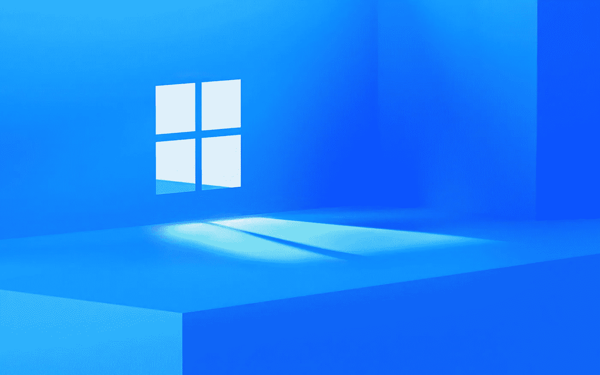

# 从 Windows 10 升级后不喜欢 Windows 11？那就快点。

> 原文：<https://medium.com/geekculture/dont-like-windows-11-after-upgrading-from-windows-10-then-hurry-up-4484ee071fc9?source=collection_archive---------19----------------------->

## Windows 11 传入

## 微软将向消费者提供一个相当短的回滚窗口(抱歉)……但是……为什么？

Windows 11 will be a free upgrade to all eligible Windows 10 users — at some point next year — but it turns out that there’s something they need to be aware of before making the jump. (Image: Microsoft)

关于微软下一代操作系统 Windows 11 的新信息不断从不同的来源出现，其中一些相当…