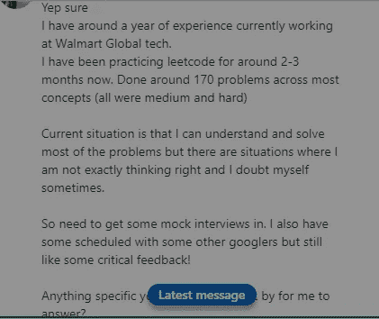
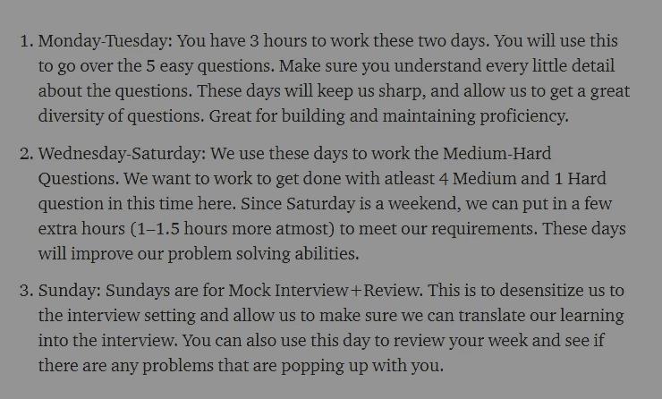
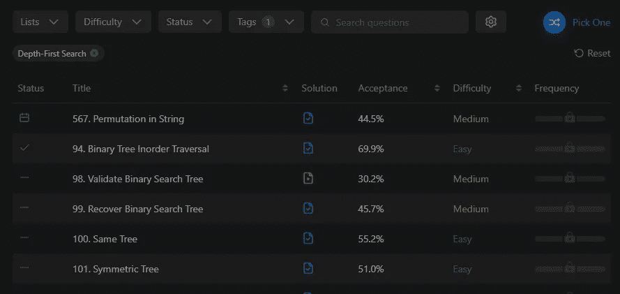
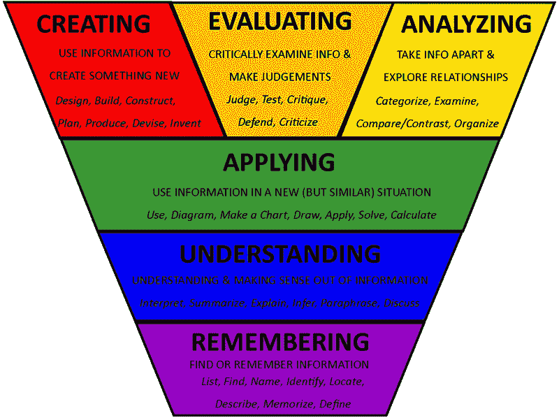
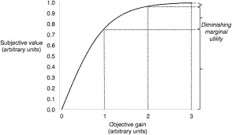
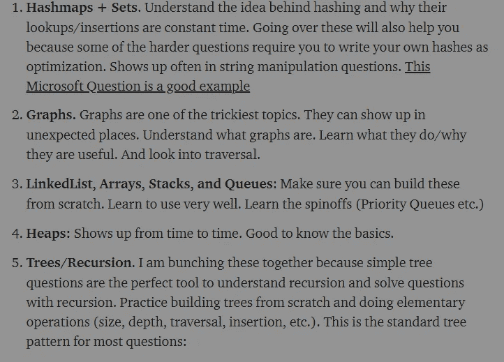
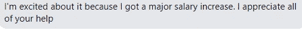

# 当使用 Leetcode 进行 FAANG/MAANG 编码面试时，不要犯这个错误

> 原文：<https://medium.com/geekculture/dont-make-this-mistake-when-using-leetcode-for-your-faang-maang-coding-interviews-6f48fbf18491?source=collection_archive---------6----------------------->

## 许多人都会犯这个错误，这可能会阻碍你的发展。适用于所有级别

我有很多学生向我寻求辅导。这些人经常经历磨难，订阅多种服务(AlgoExpert、Leetcode Premium 等)。)但是他们无法让自己的准备更上一层楼。在与他们交谈时，很明显他们正在犯一些阻碍他们表现的关键错误。就拿这个学生为例，不久前他联系了我。我们把这个学生命名为索玛吧。

Soma had prepped on his own, and gotten to a reasonable level. However, he was stuck at his level

Soma 是联系过我的高层人士之一。他能在规定时间内完成大多数中等题。然而，他就是无法超越这一点。正如你所看到的，他在 2-3 个月内解决了 170 个问题，这可不是开玩笑的。这比我让我的学生做的要多得多。即使是他们中最勤奋的人，我也只建议他们每周最多回答 10 个问题。下面是我在一篇文章中推荐的一个样本计划。

Notice how we mix in a variety of questions with different difficulties to maximize returns.

[你应该在这里阅读全文](/geekculture/why-you-need-easy-questions-to-ace-your-faang-interviews-ba0b6fc144ef)以更详细地了解我们为什么以这种方式布局。这将有助于你制定自己的计划。但应该清楚的是，索玛绝对是一个致力于通过面试并变得更好的人。

当我开始和索玛一起工作时，我发现了是什么阻碍了他。这是许多人都会犯的错误。这是我从初级和更高级的 Leetcode 问题解决者那里注意到的。在这篇文章中，我将分享错误是，它来自哪里，以及我们如何修复它。最后，你将离通过编码面试、获得金融/航空/其他技术工作更近一步。

# 错误

既然我不喜欢浪费时间，我就直接进入正题。错误在于:**通过特定话题过滤你的问题。**这个功能有一个正确的使用方法，大多数人的使用方法是错误的。

This is a screenshot from Leetcode. Someone who struggles with DFS might filter for only DFS problems.

这个错误来自于网上所有不好/不完整的建议。当有人遇到特定数据结构/算法/类型的问题时，通常给出的建议是关注该子集。动态编程很难？做一些 DP 题 3 周。图/递归很纠结？使用 Leetcode/Hackerrank 过滤器来关注它们。这似乎是有道理的。然而，如果你只是这样做，**你也不会好到哪里去**。为了理解为什么我们要学习学习

Lets’s get a little nerdy. Remembering to Applying are called lower-order learning and the rest are higher-order learning

不是所有的学习都是平等的。在最低的层次(最弱的一种学习),我们有记忆，这只是记忆。在图的上下文中，这就像记住路线图上的广度优先搜索的时间复杂度为 O(K+V ),而不知道为什么。理解是理解图形背后的理论，而应用实际上是能够使用它来解决类似单词阶梯的问题(不同于传统地图的上下文)。什么算更高层次的学习？ ***看到图是存储关系和为社交媒体创建图神经网络的伟大数据结构如何？***

就拿索玛来说吧。他也很难理解图表(从来没有遇到过轻松理解图表的人 lmao)。他看了几个视频。然后，他开始在 Leetcode 上只做图形题。经过一些练习，他能够解决那些简单的问题。也开始解决中等问题。但是当他回到常规练习时，他注意到即使他已经学习并理解了图形，他仍然不一致。他在图表方面的表现甚至有所下滑，甚至比他只做图表题时还要糟糕。他忘记了他所学的一切吗？

A picture says a thousand words, but in our case, we only need one

回想一下学习的层次。通过只过滤图表问题，他剥夺了他的大脑建立联系的机会。因为他已经知道这个问题在某种程度上与图表有关，所以当他陷入困境时，他的头脑能够通过思考图表并试图将它们放入来解决这个问题。**他甚至在开始**之前就已经得到了一个巨大的暗示。

很多概念都是如此。想想滚动散列的概念。一旦我告诉你一个特殊的问题实现了一个滚动散列，那么你想出一个解决方案就容易多了。

# 那么你应该怎么做呢？

既然你被说服了，我们必须谈谈你应该怎么做。别担心，这就是我来这里的目的。这是一个非常简单的调整，但它会有巨大的回报。我们来看看为什么。

The law of Diminishing Returns hits hard

专门致力于你所奋斗的事情的方法有它的好处。如前所述，它将帮助你完成较低层次的学习。具体的例子/问题将帮助你理解和应用甚至应用问题。然而，在这一点之后，它的收益递减。所以我们想放弃这种方法，回到常规训练中去

This is atleast how much you should know about data structures to get the most out of coding problems

上图摘自我的文章[你应对 FAANG 面试的计划](/geekculture/your-plan-for-acing-faang-interviews-20a35fa6be1c)。在这篇节选中，我谈到了在你真正从 Leetcode 实践中受益之前你需要的基本知识。如果你回想一下你的学习水平，这些建议会让你在申请阶段有所收获。

一旦你到了这一步，你就想回到随机练习的阶段(在你努力的领域可能会有 1-2 个额外的问题)。当你纠结于一个问题(任何类型)时，你想要批判性地分析它的解决方案。**你想分解它，查看你的观察/假设，阅读问题，在那里你偏离了解决方案和备选方案**。在我的文章中可以找到更详细的操作方法:[我的学生用来最大化 Leetcode 问题并赢得 FAANG 面试的 4 步法](/geekculture/the-4-step-method-my-students-use-to-maximize-leetcode-problems-and-ace-their-faang-interviews-2d5e0a6b1538)

One of the many success stories. Trust the process and things will work for you

这种分析将帮助你进入更高层次的思考(你正在评估你的解决方案，并分析它偏离了正确的解决方案)。这可能看起来是一个微不足道的变化，但是相信我，它有很大的不同。会拖慢你能做多少 Leetcode 题(因为你花了更多的时间和精力在这个分析上)。但是这种**质量胜于数量**的方法将会有巨大的回报。

如果你喜欢这篇文章，看看我的其他内容。我定期在 Medium、YouTube、Twitter 和 Substack 上发帖(所有链接都在下面)。我专注于人工智能、机器学习、技术和软件开发。如果你正在准备编码面试，看看:[编码面试变得简单](https://codinginterviewsmadesimple.substack.com/)，我的每周时事通讯。您可以以每天不到 0.5 美元的价格获得高级版本。高级版将解锁每周编码问题的高质量解决方案、特殊讨论帖子和一个伟大的社区。它帮助了很多人做准备。

为了帮助我写更好的文章和了解你[填写这份调查(匿名)](https://forms.gle/7MfQmKhEhyBTMDUD7)。最多花 3 分钟，让我提高工作质量。

如果你也有任何有趣的工作/项目/想法给我，请随时联系我。总是很乐意听你说完。

以下是我的 Venmo 和 Paypal 对我工作的金钱支持。任何数额都值得赞赏，并有很大帮助。捐赠解锁独家内容，如论文分析、特殊代码、咨询和特定辅导:

https://account.venmo.com/u/FNU-Devansh

贝宝:[paypal.me/ISeeThings](https://www.paypal.com/paypalme/ISeeThings)

# 向我伸出手

如果你想讨论家教，发短信给我。查看免费的罗宾汉推荐链接。我们都得到一个免费的股票(你不用放任何钱)，对你没有任何风险。不使用它只是在浪费钱。

查看我在 Medium 上的其他文章。:【https://rb.gy/zn1aiu 

我的 YouTube:【https://rb.gy/88iwdd 

在 LinkedIn 上联系我。我们来连线:[https://rb.gy/m5ok2y](https://rb.gy/f7ltuj)

我的 insta gram:[https://rb.gy/gmvuy9](https://rb.gy/gmvuy9)

我的推特:[https://twitter.com/Machine01776819](https://twitter.com/Machine01776819)

如果你正在准备编码/技术面试:[https://codinginterviewsmadesimple.substack.com/](https://codinginterviewsmadesimple.substack.com/)

获得罗宾汉的免费股票:[https://join.robinhood.com/fnud75](https://www.youtube.com/redirect?redir_token=QUFFLUhqa0xDdC1jTW9nSU91WXlCSFhEVkJ0emJvN1FaUXxBQ3Jtc0ttWkRObUdfem1DZzIyZElfcXVZNGlVNE1xSUc4aVhSVkxBVGtHMWpmei1lWWVKNzlDUXVJR24ydHBtWG1PSXNaMlBMWDQycnlIVXNMYjJZWjdXcHNZQWNnaFBnQUhCV2dNVERQajFLTTVNMV9NVnA3UQ%3D%3D&q=https%3A%2F%2Fjoin.robinhood.com%2Ffnud75&v=WAYRtSj0ces&event=video_description)