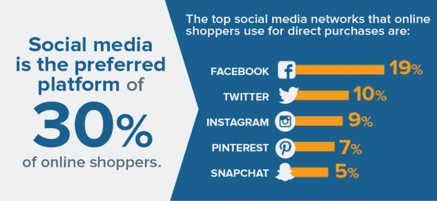

# 不要错过！你需要知道的 9 个基本的电子商务开发服务

> 原文：<https://medium.com/geekculture/dont-miss-out-9-essential-ecommerce-development-services-you-need-to-know-about-dc836ec15422?source=collection_archive---------17----------------------->

电子商务行业继续增长。网上购物提供了方便、省事的方式来获得你所需要的任何东西，而不需要开车在镇上转悠或在商店里排长队。

如果你是一个在线商人，你知道拥有一个运作良好的电子商务商店对你的成功至关重要。毕竟，任何电子商务企业的目标都是在线销售产品和服务。

面对如此多可供客户选择的网站，电子商务网站需要开发良好、功能强大的网站，通过高效交付的产品和服务提供出色的客户体验。

如果你想创建一个新的电子商务网站或提高现有网站的效率，这里有一些你需要了解的基本电子商务开发服务。

开始了。

# 最重要的电子商务开发服务

有一些基本的**电子商务开发服务**和平台，企业在开发其在线业务时需要考虑。这些服务可以帮助公司创建一个有效的在线商店，在线营销他们的产品和服务，并管理客户数据。

*   **设计理念**

发展电子商务业务，有很多不同的服务，你可能需要。然而，其中最重要的是网页设计。你的商店必须有一个专业和吸引人的设计，才能在今天竞争激烈的网上市场中取得成功。

否则，潜在客户会直接点击远离你的竞争对手。一个好的网页设计师可以帮助你创造一个独特的、视觉上吸引人的设计，使你的商店易于浏览，吸引购物者。

他们还可以帮助确保您的商店针对搜索引擎进行了优化，以便潜在客户在搜索您的产品或服务时可以轻松找到您。

*   **网页开发**

对于电子商务开发服务，web 开发是必不可少的。毕竟，你的网站是你在线存在的基础。一个设计良好的网站可以帮助吸引访问者，建立信任，促进销售。

与此同时，设计糟糕的网站可能会适得其反。与一家声誉良好的网站开发公司合作对于确保你的网站达到标准是至关重要的。

最好的网站开发公司会有一个经验丰富的设计师和开发人员团队，他们会创建一个定制的网站来满足你的特定需求。此外，他们应该提供持续的支持和维护，以保持您的网站平稳运行。

通过投资高质量的网络开发服务，你将能够建立一个看起来很棒并且功能完美的网上商店。你可以[雇佣电子商务开发人员](https://www.valuecoders.com/hire-developers/hire-ecommerce-developers?utm_source=eCommerce+developer&utm_medium=Anu_B11&utm_id=Medium)为你的企业创建一个高效的网站。

*   **内容管理**

大多数电子商务企业需要内容管理。内容管理确保您的产品描述、博客帖子和其他形式的内容准确、最新，并与您的品牌声音保持一致。

内容管理可以帮助您针对搜索引擎优化网站，并创建吸引目标受众的有针对性的内容。因此，内容管理是你可以投资的最重要的电子商务开发服务之一。

如果做得正确，它可以帮助你吸引更多的访问者到你的网站，并将更多的访问者转化为客户。

*   **软件解决方案**

要运行一个成功的电子商务业务，你需要有合适的软件解决方案。这意味着拥有一个管理库存、处理订单和跟踪运输的系统。

如果没有这些工具，将很难跟踪您的库存水平，处理付款，并确保订单按时发货。幸运的是，有一些软件解决方案可以帮助您完成‌these 任务。

除了库存管理和订单处理软件，你可能还想考虑使用一个运输跟踪系统。您可以跟踪您的货件，并确保它们按时送达。

使用正确的软件解决方案，您可以简化您的电子商务业务，并更有效地运行它。

*   **购物车**

购物车是最重要的电子商务开发服务。它允许顾客从你的网上商店选择和购买产品。一个好的购物车将是用户友好的，易于导航。它还应该使顾客能够快速结账和付款。

一个好的购物车将提供客户支持和技术援助。一个好的购物车将提供各种支付选项，包括信用卡、PayPal 和其他在线支付处理器。

最后，一辆好的购物车会提供退款或满意度保证。这将确保客户对他们的购买感到满意，并确保他们将来会再次光临您的在线商店。你可以联系一流的电子商务开发公司，利用购物车服务为您的电子商务业务。

*   **支付网关**

支付网关是任何电子商务开发服务的重要组成部分。它允许顾客使用信用卡或借记卡在线支付商品和服务。如果没有支付网关，顾客就无法在你的网站上购物。

有许多支付网关提供商，每个提供商都提供各种功能和优势。为您的电子商务开发服务选择支付网关时，必须考虑您的具体需求和要求。

您应该寻求易用性、安全性、防欺诈性以及对多种货币的支持。一旦您找到了满足您需求的支付网关，您就可以在您的网站上快速轻松地处理支付。

*   **App 开发**

如果你在寻找电子商务开发服务，应用程序开发应该是你的首要任务。在当今的数字世界，越来越多的消费者转向智能手机和平板电脑进行购买。

这种趋势很可能会继续下去，这使得企业在移动设备上拥有强大的影响力变得至关重要。应用程序可以让客户方便地浏览和购买您的产品，并提供对客户行为的宝贵见解。

应用程序可以通过向客户提供个性化内容和独家交易，帮助您与客户建立更牢固的关系。简而言之，应用程序开发是可用的基本电子商务开发服务之一，它应该是你的在线战略的重要组成部分。

*   **UX 测试**

在不断变化的电子商务环境中，有一点是永恒不变的:提供卓越用户体验的重要性。UX 测试确保您的电子商务网站易于使用，并提供平稳的客户旅程。

通过测试不同的设计元素和用户流，您可以确定需要改进的地方并做出改变，从而提高转化率并减少购物车废弃。

UX 测试可以帮助发现潜在的可用性问题，这些问题可能会给你的客户带来挫折或困惑。通过不断努力提高你的电子商务网站的 UX，你可以确保你的客户不断回来。

*   **社交网络整合**

社交媒体平台已经成为互联网上最受欢迎的网站之一，每天有数十亿用户登录。它为寻求在线销售的企业提供了巨大的机会。

将电子商务与社交媒体相结合，可以让企业接触到大量的潜在客户。社交网络整合将使公司能够在其社交媒体页面上发布其产品和服务的链接。

[source](https://financesonline.com/40-essential-ecommerce-statistics-2019-analysis-of-trends-data-and-market-share/)

这样做可以让顾客不用离开他们的社交媒体源就能轻松找到并购买商品。

企业可以利用社交网络整合开展有针对性的广告活动，确保最有可能对他们感兴趣的人看到他们的产品。

社交网络整合对于认真对待网上销售的企业来说是一项必不可少的发展服务。

# 总结一下！

电子商务开发服务对于任何寻求在线销售的企业来说都是必不可少的。其中包括支付网关集成、应用程序开发、UX 测试和社交网络集成。

这些服务中的每一项都提供了独特的优势，可以帮助企业提高转化率，减少弃车，并与客户建立更牢固的关系。

当选择电子商务开发服务时，请记住上面讨论的基本特征。您还可以联系印度的[电子商务开发公司](https://www.valuecoders.com/industries/retail-ecommerce-software-development?utm_source=eCommerce+developer&utm_medium=Anu_B11&utm_id=Medium)，利用顶级的电子商务网络开发服务。