# 不要错过 Tableau Server/Online 上的这些功能

> 原文：<https://medium.com/geekculture/dont-miss-out-on-these-features-on-tableau-server-online-8b8814ec52b7?source=collection_archive---------25----------------------->

## 那可以节省你很多时间！

今天，我们将经历一些我们在 tableau server 或 tableau online 上错过的很酷的功能。

## 1.血统

做影响分析真是太棒了。现在考虑这样一种情况，您正在对仪表板数据源进行更改，您需要了解数据来自哪里。这是血统帮助你追踪它的一种情况。

如何导航？在服务器上打开工作簿->导航到沿袭选项卡

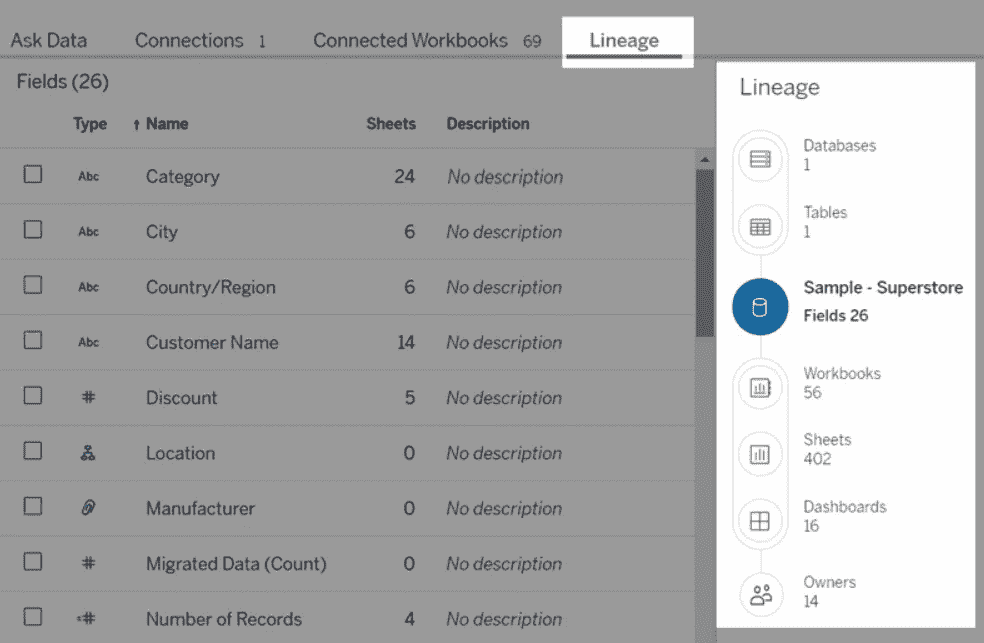

您还可以确定使用该数据源的其他工作簿、工作表、仪表板和所有者。那有什么帮助？那么，如果您在数据源中进行更改，并且这会影响所有的仪表板，该怎么办呢？你需要通知那些业主。

## 2.签署

你知道如何订阅每天发送到你邮箱的时事通讯吗？这个和那个相似。Tableau 允许您订阅直接发送到您在 tableau server/online 中使用的电子邮件的工作簿。这样就省去了每次手动登录检查的力气。

**如何设置？** 你会在顶栏找到订阅选项

点击它可以看到菜单。
您可以添加多个用户和组
在此视图和整个工作簿之间选择
您希望接收的格式—图像、PDF &图像和 PDF
添加主题。这将帮助您轻松找到您的订阅。与此同时，有一个描述是有用的。

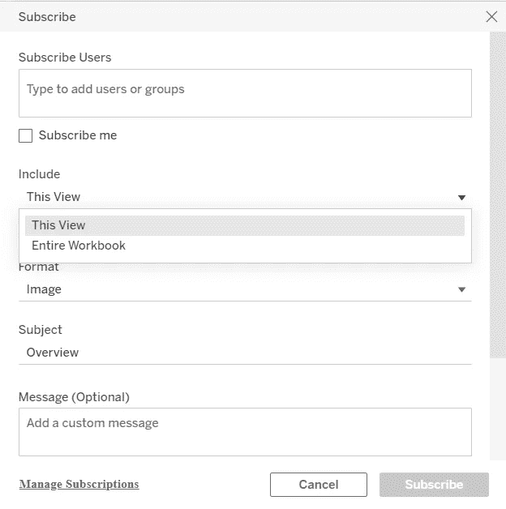

## 3.视角

根据 Tableau，自定义视图是应用了您的选择和过滤器的视图的保存版本。由于视图是交互式的，自定义视图允许您保存筛选、排序或选择，而无需对基础视图进行更改。
这意味着，如果你只对你所在的地区和区域感兴趣，那么就用这些过滤器设置一个视图，这样就可以避免你每次都这样做。

**如何创建视图？** 选择您想要的过滤值，然后点击视图。保存您的视图。如果团队中的其他成员可以使用同一个视图，那么就“让其他人可见”，这样就可以重用它。如果您只关心您的过滤器值，请将其设置为“设为我的默认值”。这会节省你很多时间。

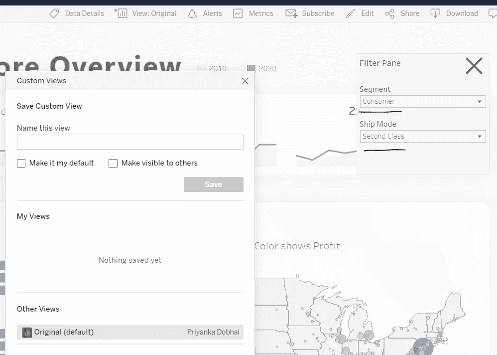

## 4.警报

这是我最喜欢的😄
当数据达到您业务的重要阈值时，数据驱动型警报会自动向您指定的关键人员发送电子邮件通知。

让我们来看一个情况—我想知道一个订单是否没有在 5 天内发货。但是我很忙，有时会忘记检查仪表板。这就是数据提醒为我做的事情。我设置了一个警报，当这种情况发生时会通知我。

**如何创建警报？** 点击预警

如果您没有选择轴，您会看到这一点

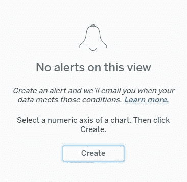

现在选择一个轴(警报只能应用在一个轴上),然后单击“创建”

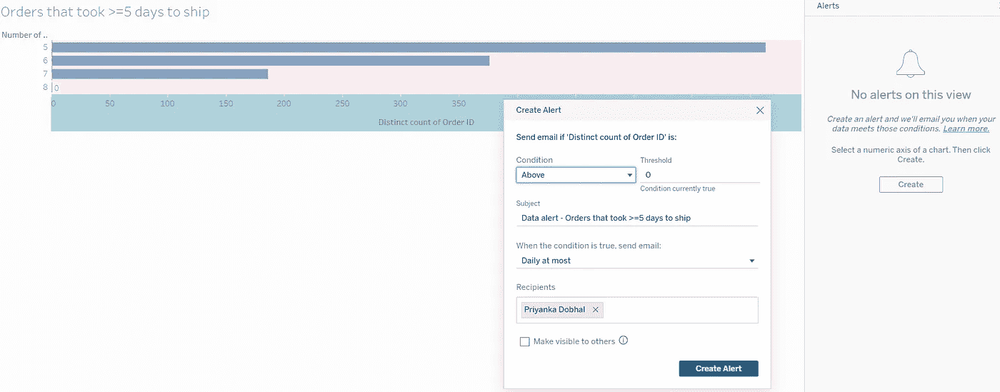

您将看到一个粉红色的突出显示部分，它是根据您选择的条件显示的。您可以根据自己的需求设置频率。这实际上是一个更广泛的话题，我计划在另一篇文章中讨论。

## 5.评论

这可能是服务器/在线上最被低估的功能。回到一种情况——您在钻取仪表板时注意到一些奇怪的事情。你可能要做的是告诉开发人员，在应用这些过滤器后，你会看到这个奇怪的视图。但是如果有更简单的方法呢？有！注释可以让您与用户共享您的精确注释。
我想把这个分享给开发者。

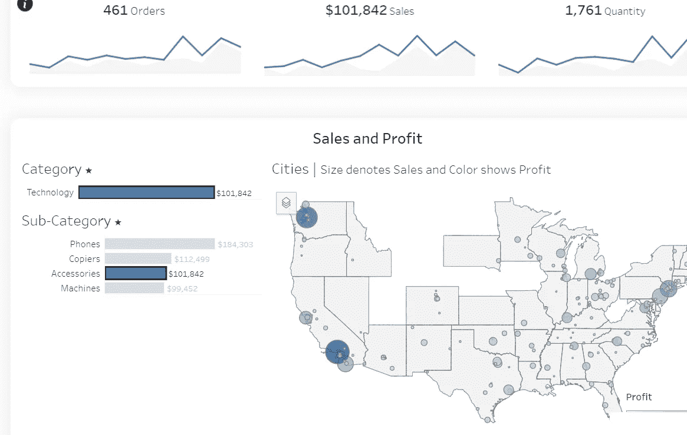

所以点击工具栏上的评论

你可以加一个说明，提到需要看到这个的人。同时附上快照-

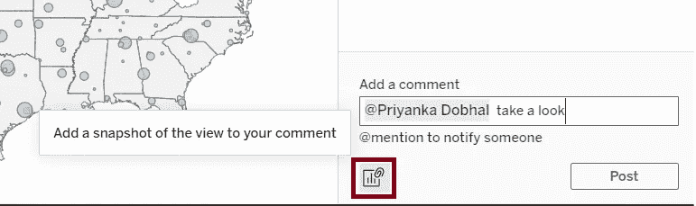

当你点击 view 时，你会看到评论者应用了所有过滤器和动作的视图。

## 6.韵律学

根据 Tableau，度量是一种 Tableau 内容，用于跟踪聚合度量的值，如销售总额。因为指标经常刷新，并且以一种简单易懂的格式显示它们的当前值，所以它们对于监控数据非常有用。
现在，如果我想只跟踪电话销售，我可以点击电话销售，然后点击指标打开这个窗口

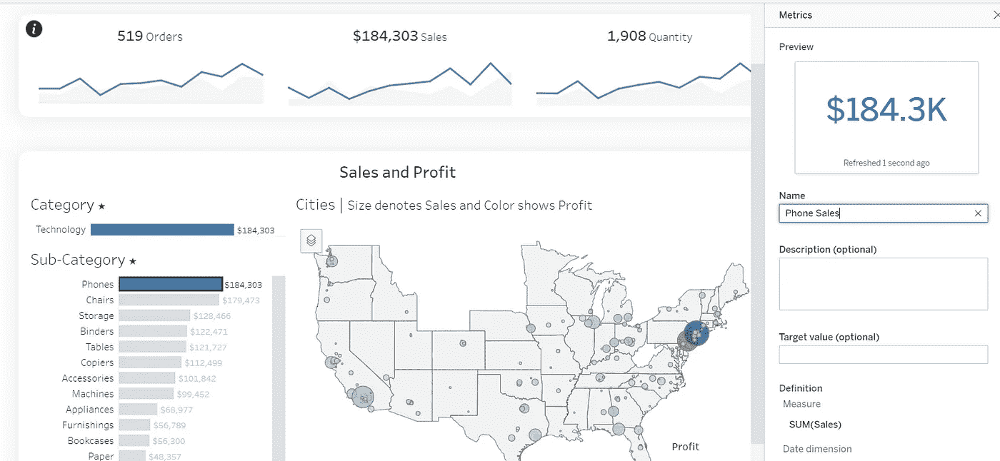

现在，指标将单独显示，也可以在手机上轻松查看

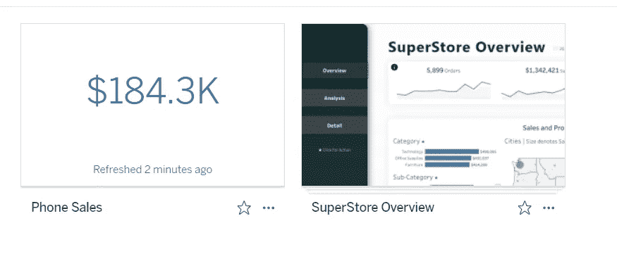

## 7.归还

最近有人问我如何清除所有选定的过滤器值。在 tableau 中有这样做的技巧，但是你真的需要这样做吗？没有。
服务器和在线有一个恢复按钮，可让您恢复到原始视图。

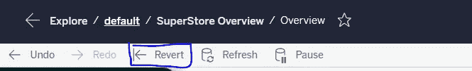

如果您选择了不同的视图，则这些值将恢复为该视图中的默认值。

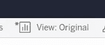

## 8.修订历史

这是跟踪您的所有仪表板版本的一个非常好的方法。

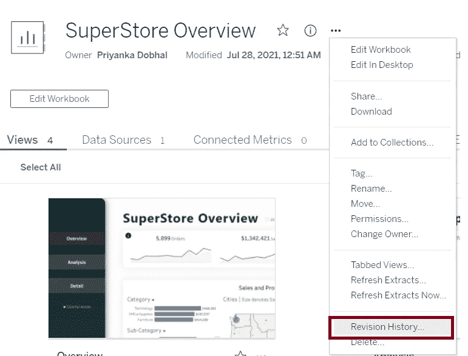

如果您需要回到服务器上的任何旧版本，您可以在这里找到它们

这就是我们这篇文章的结尾。我希望你能找到有用的东西。我相信我还有很多东西要学，所以如果你有任何关于服务器/在线的其他选项/功能，请在评论中分享。

感谢你阅读我的博文！:)
玩得开心，注意安全！:)