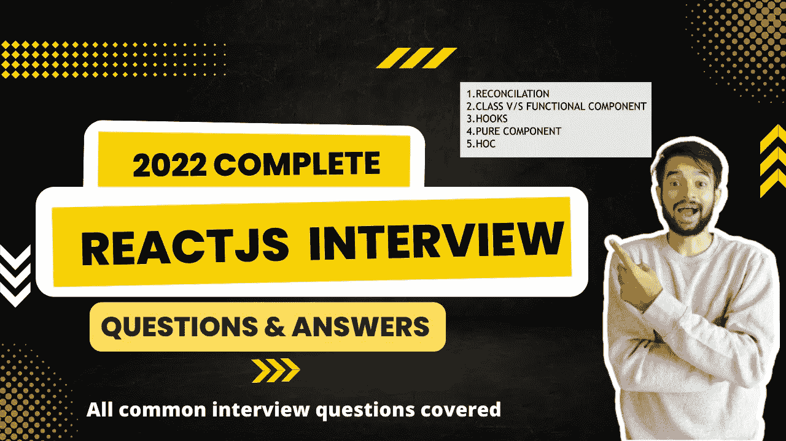

# 不要跳过| 5 大面试主题和详细的解决方案

> 原文：<https://medium.com/geekculture/dont-skip-top-5-reactjs-interview-topics-and-detailed-solution-ff4011afb27a?source=collection_archive---------1----------------------->

根据我采访数百名候选人的经验，许多 ReactJS 开发人员仍然不知道为采访准备什么样的主题。他们都是优秀的开发人员，如果你要求他们建立漂亮的网站或移动应用程序，他们将能够在短时间内完成。但它们在概念上不会很强。因此，我决定列出 ReactJS 开发人员面试中所有最常见的面试问题，并提供一些示例片段。

如果你无聊到不想看，你可以在这里看我在 Youtube 上的视频。如果你还没有订阅我的频道，请订阅并在评论区告诉我你对我的视频的看法。你也可以继续阅读下面的文章。



Complete ReactJS interview topics discussed

> *准备 ReactJS 开发者面试的核心话题*

1.  和解
2.  V/S 类功能组件
3.  钩住
4.  纯成分
5.  希腊奥委会（Hellenic Olympic Committee)

> 和解

根据 react 的官方[文档](https://reactjs.org/docs/reconciliation.html),“React 提供了一个声明性的 API，所以你不必担心每次更新时会有什么变化。这使得编写应用程序更加容易，但是在 React 中如何实现这一点可能并不明显。这篇文章解释了我们在 React 的“区分”算法中所做的选择，以便组件更新是可预测的，同时对高性能应用程序来说足够快。”

**简单来说，React 维护了一个名为虚拟 DOM 的真实 DOM 副本。每当 UI 发生变化时，就会创建虚拟 DOM 的另一个副本，并将其与原始虚拟 DOM 进行比较，而变化会反映在真实 DOM 上。**

> V/S 类功能组件

这个问题在面试中已经失去了作为决定因素的意义。但是问这个问题只是为了了解你使用 ReactJS 有多长时间。你是否知道类和功能组件？

阅读 [GeeksForGeeks](https://www.geeksforgeeks.org/differences-between-functional-components-and-class-components-in-react/) 的这篇美文，了解更多。

> 钩住

钩子是 React 16.8 中的新增功能。它们允许您使用状态和其他 React 特性，而无需编写类。简而言之，它将使功能组件有状态，并提供重新呈现的能力。

在钩子上有两种主要的问题

1.  **关于各种不同类型挂钩的问题:**面试官会要求你举例说明不同的挂钩，如 useMemo、useLayoutEffect、useCallback 等。一般来说，那些你在日常生活中不会用到但从绩效角度来看非常重要的问题会在面试中被问到。
2.  构建定制挂钩:面试官可能会给你一个场景，让你为这个场景构建一个定制挂钩。实现一个计数器挂钩，具有递增、递减、重置功能，还可以返回当前的计数器值。下面是相同的完整代码，解释你可以在这里看我的 [Youtube 视频。](https://www.youtube.com/watch?v=o22KRrxab18)

```
import { useState } from 'react';import './App.css';const useCounter = (initialValue) => {const [count, setCount] = useState(initialValue);const increment = () => setCount(count + 1);const decrement = () => setCount(count - 1);const reset = () => setCount(initialValue);return {count, increment, decrement, reset}}function App() {{/* Use counter example code */}const {count, increment, decrement, reset} = useCounter(0)return (<div className="App">{/* Use counter example code */}<h1>{count}</h1><button onClick={increment}>increment</button><button onClick={decrement}>decrement</button><button onClick={reset}>reset</button></div>);}export default App;
```

> 纯成分

只要传递给它的状态、属性没有改变，这些组件就不会重新呈现。您可以使用它们来避免重新渲染。

让我们看下面一个简单的工作片段。关于解释，你可以在这里看我的 [Youtube 视频。](https://www.youtube.com/watch?v=o22KRrxab18)

**App.js**

```
import { useEffect, useState } from 'react';import './App.css';import Parent from './Parent';function App() {// Pure component sectionconst [id, setId] =  useState(1);const [salary, setSalary] =  useState(1000);const [age, setAge] =  useState(30);useEffect(() => {setInterval(() => {console.log('Inside setInterval');setId(id + 1);}, 1000);})return (<div className="App">{/* Pure component example */}<Parent id={id} salary={salary} age={age}/></div>);}export default App;
```

**Parent.js**

```
import React from 'react'import PureComponent from './PureComponent'export default function Parent({id, salary, age}) {console.log('Inside parent component');return (<div><h1>Id is: {id}</h1><PureComponent salary={salary} age={age}/></div>)}
```

**purecomponent . js**

```
import React from 'react'function PureComponent({salary, age}) {console.log('Inside Pure Component ');return (<div><h1>Inside Pure component</h1><h2>salary: {salary}</h2><h2>age:{age}</h2></div>)}export default React.memo(PureComponent);
```

> 高阶组件

HOC 是将组件作为输入并返回大部分组件作为输出的组件。

让我们看下面一个简单的工作片段。关于解释，你可以在这里看我的 Youtube 视频。

**App.js**

```
import './App.css';import Container from './Container';import Hello from './Hello';function App() {// HOCconst SampleComponent = Container(Hello);return (<div className="App"><SampleComponent /></div>);}export default App;
```

**Container.js**

```
const Container = (Component) => {return () => (<div><h1>Inside HOC</h1><Component /></div>)}export default Container;
```

**Hello.js**

```
import React from 'react'export default function Hello() {return (<div>Welcome to Uncommon geeks</div>)}
```

感谢您在下一篇文章中阅读 catch you。如果你还没有在媒体上关注我，那么请关注我，你可以在链接的[这里](https://www.linkedin.com/in/vasanth-bhat-4180909b/)关注我。不要忘记订阅我的 Youtube 频道。

如果你想亲自和我讨论模拟面试，面试或简历审核的技巧和诀窍，你可以在这里预约:

[https://topmate.io/vasanth_bhat](https://topmate.io/vasanth_bhat)

如果你正在准备前端开发者面试，请观看我的以下系列:

如果你想学习内置方法的 JavaScript 自定义实现，那就看看我下面的系列吧:

# 同一作者的更多文章:

1.  我在 JIO 信实公司的面试经历。
2.  [发出带有标题的 Get 请求，以在 React Native 中呈现图像](https://javascript.plainenglish.io/react-native-making-get-request-to-display-the-image-f75d4338c5e2)
3.  [JavaScript array . push()是深度拷贝还是浅度拷贝？](https://javascript.plainenglish.io/array-push-in-javascript-is-it-deep-or-shallow-copy-90cd195ec5b7)
4.  [如何在 JavaScript 中展平数组的数组](https://mevasanth.medium.com/flatten-array-of-array-in-javascript-microsoft-interview-question-345c71ff9ccd)

在这里阅读作者[的所有文章](https://mevasanth.medium.com/)。