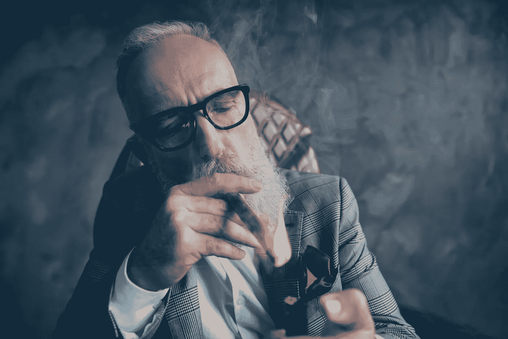

# 如果你没有这 5 个基本素质，不要浪费时间投资

> 原文：<https://medium.com/geekculture/dont-waste-your-time-investing-if-you-don-t-have-these-5-essential-qualities-6842c58634d8?source=collection_archive---------23----------------------->

## 我会给年轻时的自己一个投资建议。

人们渴望大秘密来赚钱。生活中的现实是大多数事情都很简单。

例如，如果你想减肥，没有秘密的锻炼计划或饮食。你摄入的卡路里必须少于你消耗的。

这同样适用于财富。如果你想赚钱，你必须花的比你赚的少，并将差额投资于长期升值的资产。

无论你想增加还是保留你的财富，你都必须保持坚定的品质。那些会培养你的性格，性格最终会决定你的命运。

因此，如果你对投资很认真，这里有五个你必须培养的基本素质。

# 学习动机

你在学校没学到多少关于钱的知识。无论你学到什么，在你学习的时候都是过时的。教育制度旨在让你对现实完全无知。

因此，如果你想让你的钱增值，你必须忘掉他们教给你的一点东西，从第一步开始探索金融。

你需要成为一个有强烈求知欲的贪婪的读者。最棒的是，没有必要去昂贵的学校注册。你可以在网上免费学习任何东西。

没有人把它比作*，*

> ****“最好的老师在互联网上。****
> 
> *最好的书店在网上。*
> 
> ****最好的同行都在互联网上。****
> 
> ****学习的工具丰富。****
> 
> ****稀缺的是求知欲。****

# *学习复利的魔力*

*你也不需要几百万来开始投资。换句话说，没钱不是不投资的借口。如果你相信数学，有一个简单、无痛苦的赚钱方法。*

*叫做**复利。***

*曾经有人问阿尔伯特·爱因斯坦人类最伟大的发明是什么，他回答: ***“复利。”复利简单地说就是及早储蓄，让投资在一个长时期内复利。在我看来，这是你能得到的最接近金融魔术的东西了。****

*例如，如果你在过去七年里每月投资 100 美元在比特币上，你现在已经赚了 50 多万美元。*

*因此，学会欣赏不对称风险的价值、指数增长和复利的力量。这是增加财富的最佳诀窍。*

# *跟随聪明的钱*

*“智能资金”一词通常指管理着数十亿美元客户资金的华尔街银行和对冲基金。事实上，大约有 20 只基金控制着全球 80%的交易。他们管理着数万亿美元的资产，雇佣着最优秀的员工。这些基金由精明的投资者控制，如**沃伦·巴菲特、雷伊·达里奥、约翰·保尔森、**、T4、等等。*

*如果你认为市场对你不利，那你就对了！*

*这些内部人士通常在派对结束时退出，而愚蠢的资金继续涌入。当趋势向相反方向发展时，反之亦然。*

*因此，如果你想取得优异的成绩，你必须学会忽视主流的财务建议。或者，正如 ***约翰·邓普顿*** 所说，*

> ****“除非你做一些与大多数人不同的事情，否则不可能产生卓越的业绩。”****

# *忽略短期波动*

*不要犯错误；崩溃总是痛苦的。 ***正如罗马历史学家李维*** 所说:*

> ****“没有什么比损失金钱更令人痛心。”****

*然而，你需要高波动性来获得价格升值。表现最好的资产通常是最不稳定的。*

*最好的方法是忽略情绪，永远不要被短期价格波动分散注意力，逢低买入。如果你仍然想要低波动性，你可以把你的现金放在负收益的储蓄账户里。*

# *有长远打算*

*正如 ***沃伦·巴菲特*** 曾经说过:*

> *如果你不愿意在 10 年内持有这只股票，那就别想在 10 分钟内持有它。*

*对于投资，你必须有长远的眼光。如果你买了一项投资，以为你会一夜暴富，你将会非常失望。*

*因此，这里有一个简单的策略可以应用:*

1.  *购买优质资产*
2.  *保持*
3.  *重复步骤一和步骤二。*

*投资需要对你的资产和时间有信心。举例来说，如果你 20 年前在标准普尔 500 指数上投资 10，000 美元，现在你已经有 273，000 美元了。*

*所以投资前要三思。如果你没有足够的耐心，那是因为你学得还不够。看到这个故事的第一点。*

*总之，如果你还没有将这些品质运用到你的日常理财中，我建议你不要急于投资。相反，要不断学习，直到掌握基础知识。*

*你的财富取决于此。*