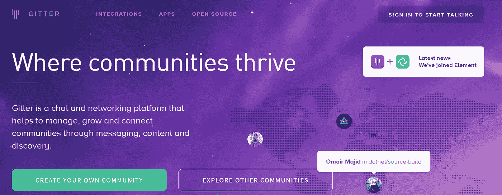
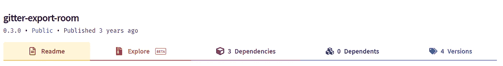
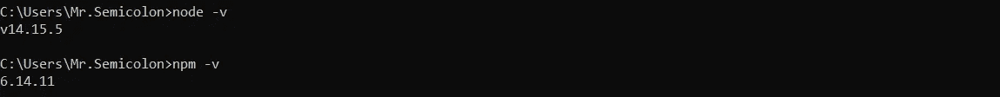
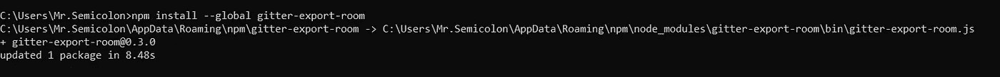
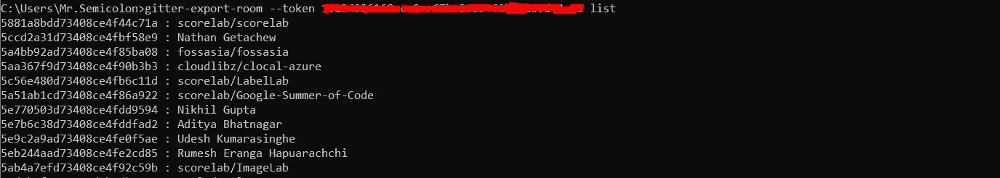
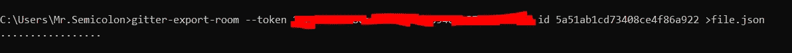
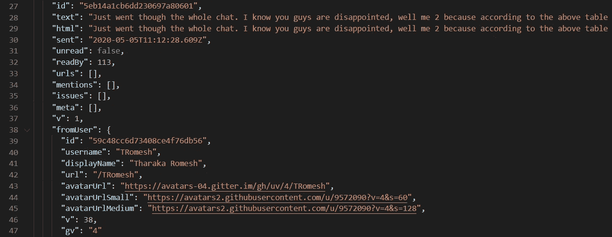

# 将 Gitter Room 下载到 JSON 文件中

> 原文：<https://medium.com/geekculture/download-gitter-room-to-a-json-file-ee69417a6b49?source=collection_archive---------24----------------------->

## 为您的数据科学项目下载 Gitter room 消息的分步指南。

Gitter Home Page: [https://gitter.im/](https://gitter.im/)

> 我最近在 Kaggle 上看到了 [freeCodeCamp Gitter Chat，2015–2017](https://www.kaggle.com/freecodecamp/all-posts-public-main-chatroom)，这让我很好奇如何下载一个给定的 Gitter Chat 作为任何数据科学项目的 JSON。

据网站介绍，Gitter 是一个面向 GitLab 和 GitHub 库的开发者和用户的开源即时消息和聊天室系统。使用聊天室，这些开发人员讨论他们的问题和解决方案已经很多年了。例如，上述数据集包含超过 500 万条消息。因此，如果你是一个数据科学极客，渴望数据，这种方法可以让你在几分钟内将任何 Gitter 聊天室下载到 JSON。

经过一些研究，我发现的唯一方法是使用 [gitter-export-room](https://www.npmjs.com/package/gitter-export-room) npm 包导出 Gitter room 消息的 JSON 档案，但是文档并不十分直接，我花了一些时间来理解流程。因此，从这篇文章中，我的目标是使事情变得简单。

[gitter-export-room](https://www.npmjs.com/package/gitter-export-room) NPM package

## 步骤 1:(如果你已经安装了 Node.js，请跳过这一步。)

NPM 是 JavaScript 编程语言的包管理器。你可以从 https://nodejs.org/en/download/下载最新的。一旦你安装了 NPM，我们可以通过`npm -v`命令来验证安装。

Verify the installation

## 步骤 2:全局安装 gitter-export-room 包

运行`npm install --global gitter-export-room`以全局安装软件包。

Install the gitter-export-room package globally

## 步骤 3:通过 Gitter API 获取个人访问令牌

登录 [Gitter Developer](https://developer.gitter.im/apps) 并复制个人访问令牌

Copy the personal access token

## 第四步:列出你的房间

回到终端，运行`gitter-export-room --token <your_token> list`命令，列出你的 Gitter rooms。

> 注意:为了下载 JSON 聊天，我们需要先加入 Gitter room。

List down Gitter rooms

## 步骤 5:通过房间 ID 下载数据

现在我们已经列出了房间 ID，我们可以通过房间 ID 将数据下载到 JSON 中。为此我们使用`gitter-export-room --token <your_token> id <room_id> >file.json`命令，它会在你当前的目录下创建`file.json`。

Download the data by room ID

JSON data

# 最后一个请求

在这里，我的主要意图是使用这些公共数据来训练我的聊天机器人项目的机器学习模型，我不想侵犯私人数据。我对这个世界的最后要求是善用这些数据，不要侵犯他人的隐私。

> 所有这些都要归功于 gitter-export-room NPM 包的创造者 Christopher Hiller。