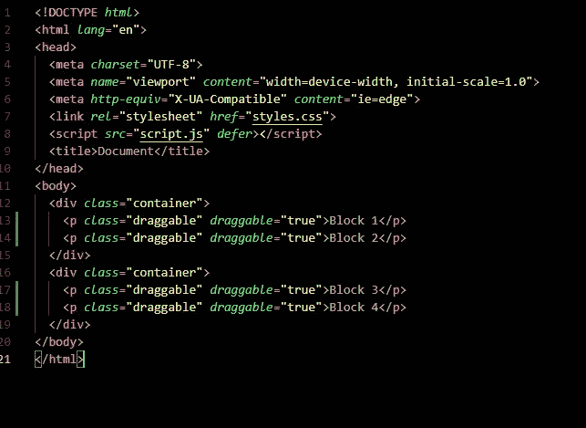
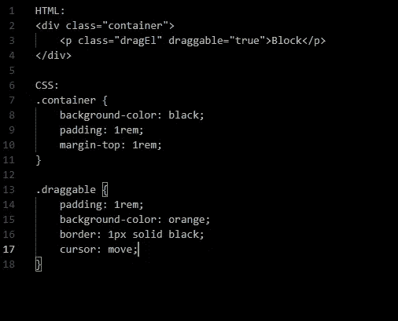
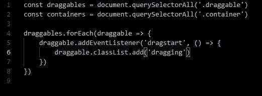
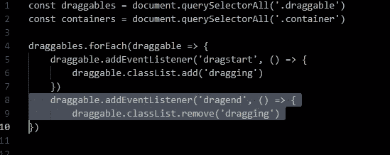
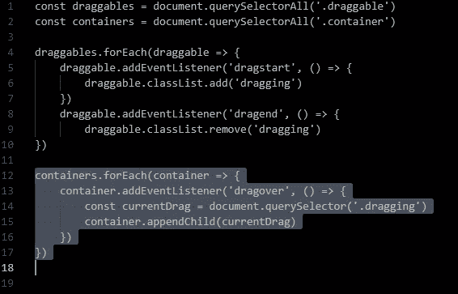
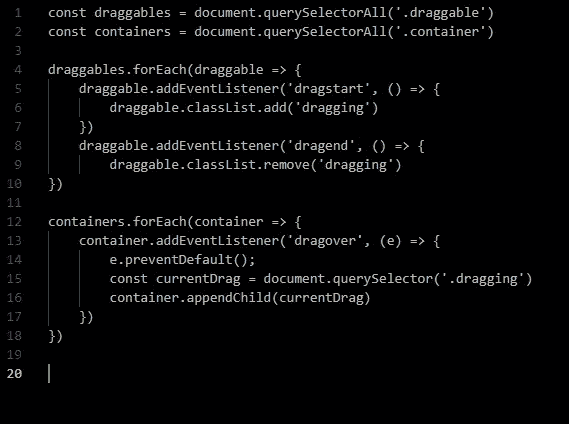

# 焦虑的编码者引导拖放

> 原文：<https://medium.com/geekculture/drag-and-drop-guide-by-an-anxious-coder-21c6607a8dfe?source=collection_archive---------66----------------------->

所以你想拖放？好吧，让我告诉你如何用这个简单的指南，能够编码最少的让你的元素从一个点到另一个点。

我已经从一个焦虑的人走了很长一段路，现在我是一个焦虑的程序员，写一个指南来帮助其他人学习新的东西，或者甚至复习他们已经知道的东西。拖放绝对是那些不太难学的东西之一，但是如果没有一个像样的解释，任何刚开始的人都可能会迷路。

好吧，我会尽可能用最简单的方式来解释它，以帮助你理解拖放的力量。该开始上课了，希望第一步顺利…

## 第一步

当然，我们需要确保所有必要的 HTML 设置都包含到样式表和 JavaScript 的链接。此外，我们将在主体中创建两个带有 class="container "的 div 标记。

您可以选择使用 p、img、span 或 div 标记来填充任何一个新的 div 容器，作为拖动该元素的起点。然而，最重要的是，你要确保对新元素进行分类，并添加一个名为 draggable 的属性，并使其等于“true”。这将允许我们的函数识别元素是可拖动的。

我将使用一些带有“draggable”类的 p 标签，并确保它的 draggable 属性为 true:

如果你觉得能够更好地看到和想象一些东西，你可以在另一个容器中添加填充物，或者让它空着。虽然我要添加一些 CSS。

## 第二步

下一步是填充一点我们的样式表，这样我们就可以使用一些更有形的东西来拖放和查看我们的容器。你总是可以拖动一个图像或者用 CSS 样式的某种文本，以便更好地抓取它。例如:

设置一些图片中描绘的风格应该给一些橙色的矩形框拖动周围的容器看起来像黑盒。同样使用 cursor: move，它会将光标修改为四向光标，以指示当悬停在元素上时可以拖动该元素。

## 第三步

现在开始用 JavaScript 编写我们的代码。我们首先为 draggables 和 containers 获取元素，并为它们分配一些变量。现在我们需要设置拖放工作所需的所有事件侦听器。我们将从所有的 draggables 开始，因为我们将使用的第一个事件侦听器是事件“dragstart”。我们还想确保循环通过我们的 draggables:

Don’t forget to console.log to make sure it is working. You should be seeing logs of the element being picked up and dragged.

您可以看到，我还向 draggable 元素添加了一个类，它是在开始拖动时添加的。类还可以用于添加任何样式，以更好地指示元素已被抓取和拖动。这个类稍后也会进来。

## 第四步

之后的步骤是创建一个侦听器来结束拖动。如果您测试了一些 CSS 在拖动时添加一些样式，您会看到一旦您放开元素，它将保持样式，因为它现在有了新的类。当拖动结束时，您必须创建一个新的侦听器来删除它，如下所示:

这样设置，一旦拖动结束，该类将被移除，样式将不再应用。

## 第五步

我们希望最终能够移动元素，并能够在容器中切换它们。使用为容器创建的变量，遍历它们并添加 event listener“dragover”。

同样，对于被拖动的元素，确定我们是在第二个容器中还是第一个要被放下的容器中。要做到这一点，它需要忽略所有其他的 draggables，并专注于当前正在拖动的元素，这很容易做到，因为我们有一个专门识别该元素的类。它应该是这样的:

You can also console.log dragover which will constantly log as long as you are over and element. It will stop logging once you go out of an element.

现在你可以添加被拖动的元素，瞧！终于！搞定了。

事情是这样的，如果你测试拖放，你会看到一个:

Photo by [Sarah Kilian](https://unsplash.com/@rojekilian?utm_source=medium&utm_medium=referral) on [Unsplash](https://unsplash.com?utm_source=medium&utm_medium=referral)

默认情况下，不允许将一个元素拖放到另一个元素中。要禁用它，请将 e for event(或您希望它表示的任何事件)添加到参数中，并添加 e.preventDefault()。

终于！现在我们完成了最少的拖放操作。现在是关键时刻了！希望这行得通——我是说这完全行得通！

成功！这将只能将元素拖放到一个容器中，将其附加到订单的末尾。你可以做更多的事情来允许你自己明确地选择你想要放在中间的元素。

希望这是有意义的，我设法实际上帮助你学习一个新的有趣的编码特性。我现在要出去了，因为我现在很担心别人会怎么看这篇博文，我必须恢复。