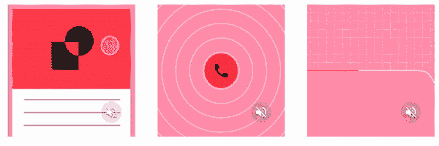
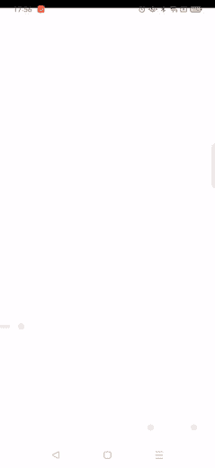
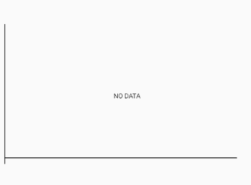

# 在 Android 中用动画绘制路径

> 原文：<https://medium.com/geekculture/draw-path-with-animation-in-android-21934e29a10d?source=collection_archive---------4----------------------->



几天前，我需要画一张图，画出从起点到终点的路径，这让我开始思考如何实现这个目标。



找了很久之后，我找到了这个图书馆。

[](https://github.com/swapnil1104/CurveGraphView) [## GitHub-swap nil 1104/CurveGraphView:一个高度可定制和高性能的定制视图，用于呈现…

### 一个高度可定制和高性能的自定义视图来呈现曲线图形。在一个图形中添加多个折线图…

github.com](https://github.com/swapnil1104/CurveGraphView) 

[https://github.com/swapnil1104/CurveGraphView](https://github.com/swapnil1104/CurveGraphView)

如何使用此库:

**第一步**:在 Gradle 文件中添加库

```
dependencies {
    implementation 'com.github.swapnil1104:CurveGraphView:{current_lib_ver}'
}
```

**第二步:**定义配置

**第三步**:创建点地图

**步骤 4** :使用点创建图形数据

**第五步**:在曲线图视图中添加图形数据

但是这个库的限制是当你想要创建一个**贝塞尔曲线的时候，你不能控制中点。比如你想在哪个方向以什么角度弯曲你的曲线。**

当你打开 CurveViewGraph 类时，你会看到下面的代码。

这告诉我们中点在 x 的起点和 y 的终点。

所以现在第二个选项是自定义视图。让我们开始在画布上创建一个路径，然后添加动画。

**步骤 1** :创建自定义视图类扩展视图类。

**第二步:**定义油漆

```
private val linePaint = Paint(*ANTI_ALIAS_FLAG*).*apply* **{** *style* = Paint.Style.*STROKE
    strokeWidth* = 14f
    *color* = Color.parseColor("#E02E2E")
**}**
```

**第三步:**我把我的视图宽度分成 10 个部分来得到坐标。然后计算 x 轴和 y 轴。

这样我就创造了路径。

**步骤 4** :提供我们正在绘制的画布的宽度和高度。

使用`**onSizeChanged**`方法计算大小，并调用 init()创建路径。

**第五步:**在画布上绘制路径

```
override fun onDraw(canvas: Canvas) {
    super.onDraw(canvas)
    canvas.drawPath(path, linePaint)
}
```

**步骤 6** :在布局 XML 文件中定义该视图。

运行应用程序，你会看到一个没有动画的图形。

**第七步**:添加动画，获取路径长度

```
val measure = PathMeasure(path, false)
length = measure.*length*
```

**第八步**:创建路径效果

```
private fun createPathEffect(pathLength: Float, phase: Float, offset: Float): PathEffect? {
    return DashPathEffect(
            *floatArrayOf*(pathLength, pathLength),
            (phase * pathLength).*coerceAtLeast*(offset)
    )
}
```

DashPathEffect 分阶段创建路径。间隔数组必须包含偶数个条目。phase 是 intervals 数组中的偏移量。

params:intervals-ON 和 OFF 距离的数组
phase-偏移到 intervals 数组中

**第 9 步**:设定相位

```
fun setPhase(phase: Float) {
    Logger.d("CurveGraphDrawable", "setPhase called with:$phase")
    linePaint.*pathEffect* = createPathEffect(length, phase, 0.0f)
    invalidate() *//will call onDraw* }
```

第十步:使用物体动画制作工具制作动画

```
val animator = ObjectAnimator.ofFloat(this, "phase", 1.0f, 0.0f)
animator.*duration* = 3000
animator.start()
```

你可以点击查看完整的自定义类代码[。](https://gist.github.com/karishmaagr/27ca192a163dad37d40622542a9b549e)

现在运行应用程序，你会看到一个带动画的图表。你可以根据自己的需要进行实验。

# 结论

主要动机是了解动画如何在道路上工作。即使当你使用任何开源库来创建一个图形时，也要从内部检查它做了什么，你可能不需要添加整个库，只需要一小块代码就可以了。

希望这篇文章对你有帮助。做实验，和我分享你实现了什么。

如果你有任何反馈，请给我回信，地址是*karishma.agr1996@gmail.com。*非常感谢您的鼓掌帮助他人找到这篇文章😃。

