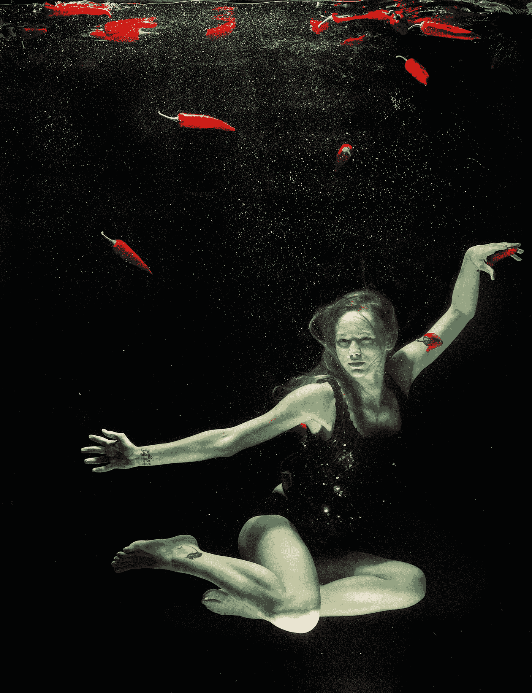

# 《梦想与创造力:梦想如何激发和提升你的艺术追求》

> 原文：<https://medium.com/geekculture/dreams-and-creativity-how-dreams-can-inspire-and-enhance-your-artistic-pursuits-d0779db2ae93?source=collection_archive---------5----------------------->

长期以来，梦一直是艺术家和创意者灵感和创造力的源泉。从古代文明到现代，梦在艺术、文学和音乐作品的创作中扮演着重要的角色。但是到底是什么让梦成为如此强大的灵感来源呢？

Photo by Engin Akyurt on Pexels

有一种理论认为，梦提供了一扇通往潜意识的独特窗口，并能让人们接触到大脑中富有创造力和想象力的部分。在梦里，现实的界限模糊了，不可能变成了可能。这允许创造新的想法和观点，而这些在现实生活中是不可能的。

梦也可以作为处理和理解我们的思想、感情和经历的一种方式。当我们睡觉时，我们的大脑在某些涉及记忆巩固和情绪调节的区域更加活跃。这种活动可能会反映在我们梦的内容中，为我们提供了在安全和可控的环境中克服困难情绪和经历的机会。

一些研究甚至表明，参与“清醒梦”，或控制我们的梦的内容和方向的能力，可以提高创造力和解决问题的技能。清醒梦允许我们探索和操纵梦的世界，让我们有机会练习和发展我们的创造技能。

除了这些好处，梦也可以作为我们艺术追求的灵感和想法的来源。许多艺术家和创意人员报告说，他们在梦里找到了灵感，并把梦作为他们艺术作品的起点。梦可以提供一个独特的个人视角，可以增加我们艺术创作的深度和原创性。

因此，当我们探索梦和创造力之间的关系时，很明显，梦可以成为我们艺术追求的灵感和想法的强大来源。它们为无意识思维提供了一个独特的窗口，并提供了进入大脑创造性和想象力部分的途径。梦也可以作为处理和理解我们的思想、感情和经历的一种方式，帮助我们克服困难的情绪，为我们的艺术创作找到灵感和想法。

但是，我们怎样才能挖掘梦想的力量，并利用它们来增强我们的创造力呢？以下是一些开始的提示:

1.  记梦日记:挖掘梦的创造潜力的一个方法是记梦日记。每天早上，写下你记得的任何梦或梦的片段。随着时间的推移，你可能会注意到梦中的模式或主题，它们可以作为你艺术追求的灵感。
2.  练习清醒梦:如前所述，清醒梦，或控制你的梦的内容和方向的能力，可以增强创造力和解决问题的技能。为了学习如何做清醒梦，试着在睡觉前设定一个目标，意识到你的梦并积极参与其中。
3.  以梦为起点:如果你心中有一个特定的创意项目，试着以梦为起点。问问自己前一天晚上梦见了什么，看看是否有什么想法或主题可以融入到你的项目中。
4.  反思你的梦:每天花些时间反思你的梦以及它们可能意味着什么。你的梦里有哪些情绪或主题？它们与你清醒时的生活和创造性追求有什么关系？反思你的梦可以为你的艺术项目提供洞察力和灵感。

当我们探索梦和创造力之间的关系时，很明显，梦可以成为我们艺术追求的灵感和想法的强大来源。所以，让我们拥抱梦想的世界，看看它们在我们的创作之旅中把我们带向何方。可能性是无限的，唯一的限制是我们自己的想象力。