# 通过 Python 预测药物-靶标相互作用

> 原文：<https://medium.com/geekculture/drug-target-interaction-prediction-through-python-4af9e76fc90?source=collection_archive---------27----------------------->

在这篇文章中，我展示了使用 SVD(奇异值分解)和矩阵分解来预测药物-靶标相互作用的 Python 代码片段，这在推荐系统中被大量使用。这个实现的核心逻辑是基于[罗等人的论文](https://www.nature.com/articles/s41467-017-00680-8)。

[药物中心](https://drugcentral.org/about)提供药物信息资源。我们可以从文献综述、药物标签和外部数据源下载已知的药物-靶标相互作用。截至 2021 年 6 月 18 日，[药物中心](https://drugcentral.org/download)共有 2529 种药物、2870 个靶点和 17390 个药物-靶点相互作用。

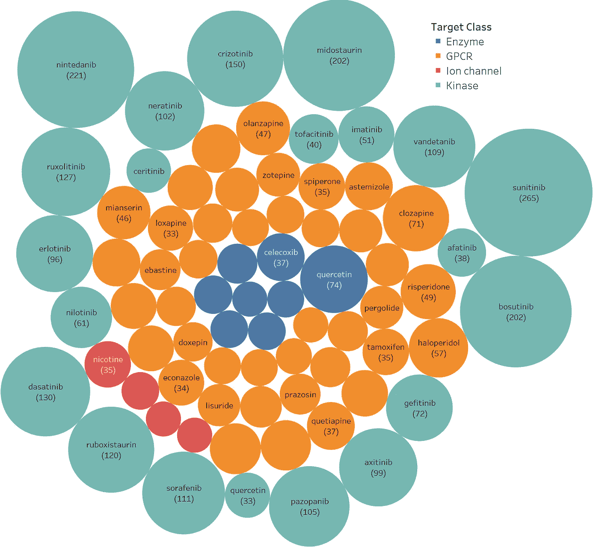

Drug-Target interaction

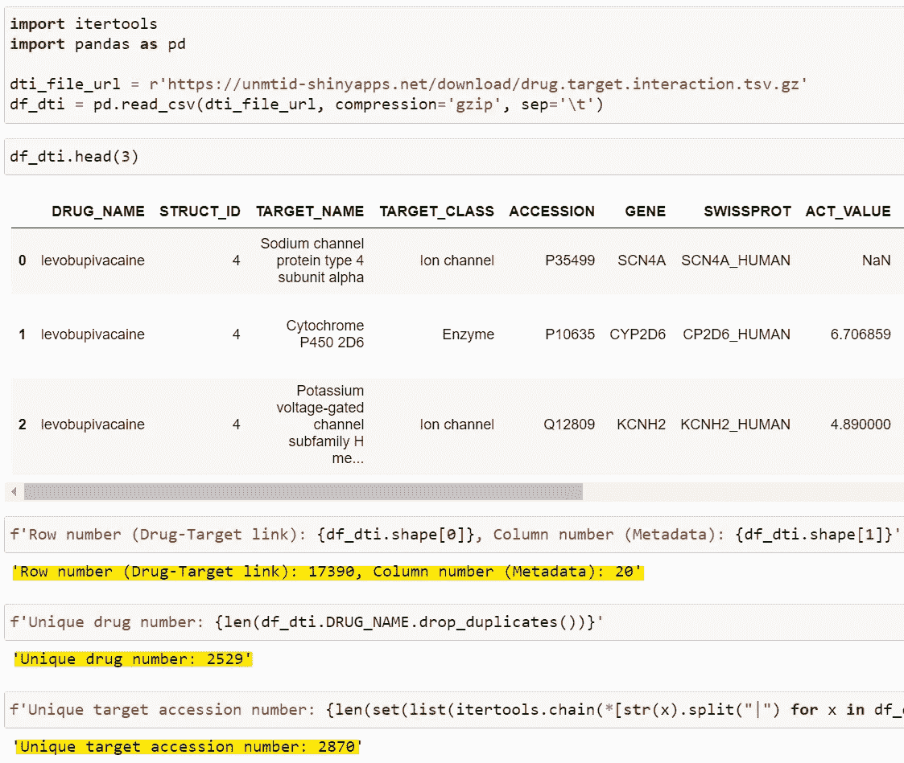

Drug-target interaction file loading, summary of drug and target.

为了发现新的药物-靶标相互作用候选物，如果我们可以发现相似的药物或靶标特征(例如，化学结构、副作用、疾病关联)并假设药物作用机制对相似的药物或靶标类型有效，已知的药物-靶标相互作用可以是一个很好的起点。

药物-靶标相互作用的矩阵大小为 7，258，230 (=2529 种药物× 2870 种靶标)，目前已知的相互作用为 17390，仅占药物-靶标空间的 0.0024%。[罗等](https://www.nature.com/articles/s41467-017-00680-8)介绍了一种用于药物-靶标相互作用预测的网络集成方法，并开发了 [DTINet](https://github.com/luoyunan/DTINet) 。

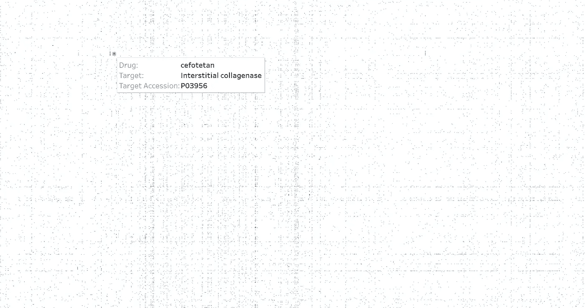

[Drug-Target sparse matrix chart.](https://public.tableau.com/views/DrugCentral_DrugTargetInteraction/Dashboard?:language=en-US&:display_count=n&:origin=viz_share_link) Each blue dot(17390) is a drug-target interaction. Yellow highlighted dot shows one drug-target interaction (cefotetan-P03956)

DTINet 由以下五个步骤组成。让我们实现每一步。

*   步骤 1:收集药物和目标(蛋白质)信息
*   步骤 2:使用 Jaccard 距离生成相似性矩阵
*   步骤 3:使用奇异值分解降低相似矩阵维数
*   步骤 4:矩阵完成搜索新的药物-目标相互作用
*   步骤 5:评估预测的药物-靶标相互作用

> **步骤 1:收集药物和目标(蛋白质)信息**

[DTINet](https://github.com/luoyunan/DTINet/tree/master/data) 共享来自各种数据源的原始数据。

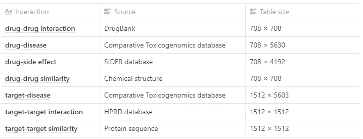

[Drug/Target information](https://www.notion.so/Drug-Target-interaction-prediction-through-Python-caa453aef2894b5e9bb271ed12943540)

通过许多药物信息提供商(如 DrugCentral、ChEMBL、OpenTarget)的 API 服务，我们可以下载一个实时数据。但是这增加了代码的复杂性，所以我使用 DTINet 数据来理解整个过程。在下一篇文章中，我将把 API 服务应用到这个过程中。

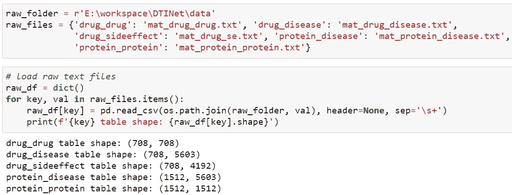

> **步骤 2:使用 Jaccard 距离生成相似性矩阵**

步骤 2 计算每个特征的相似性距离。例如，药物-疾病表由 1 或 0 值组成。值 1 是药物和疾病之间的真实关联。

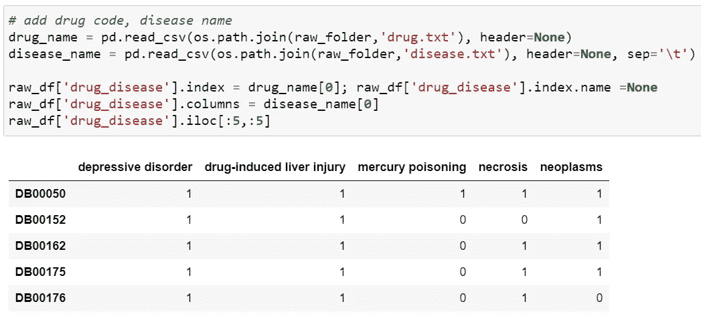

我们可以使用 Jaccard 相似性系数来计算相似性距离。药物-疾病关联越相似，产生的 Jaccard 系数越高。

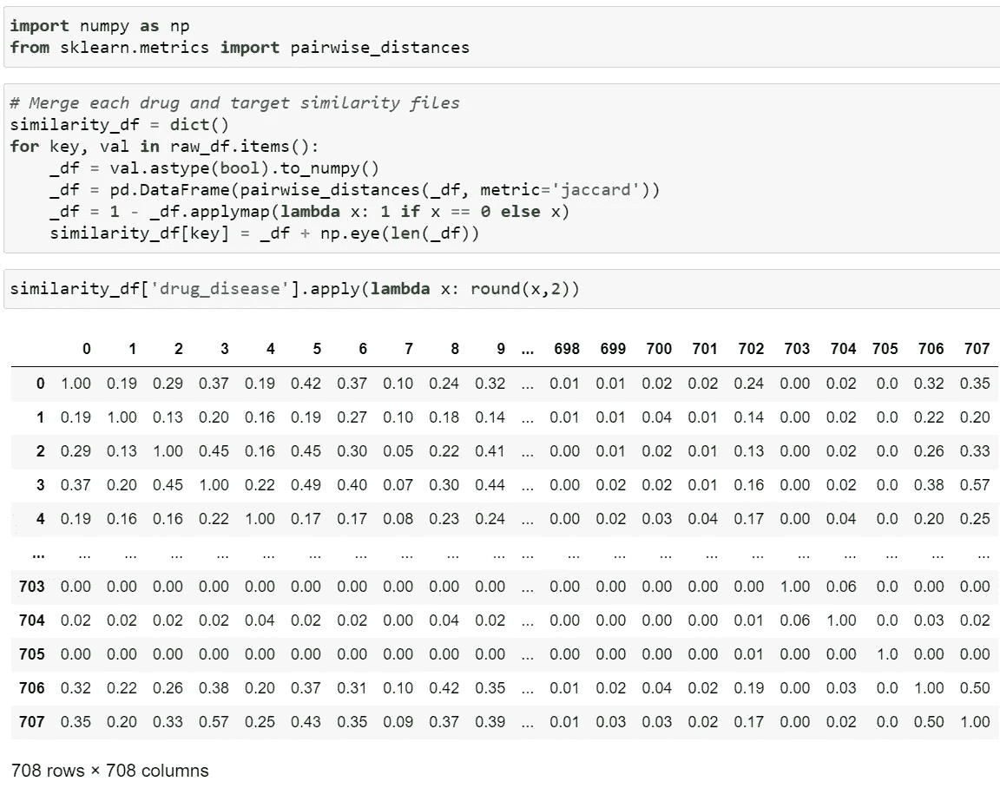

Jaccard similarity coefficient of drugs for diseases

> **步骤 3:使用奇异值分解降低相似矩阵维数**

一旦计算出所有的相似性矩阵，它就将分离的矩阵分别连接到药物和目标矩阵。药物有四个相似度矩阵，行数和列数为 708×2832(行:药物，列:药物相互作用+疾病+副作用+药物相似度)。在连接之前，需要对值进行规范化。

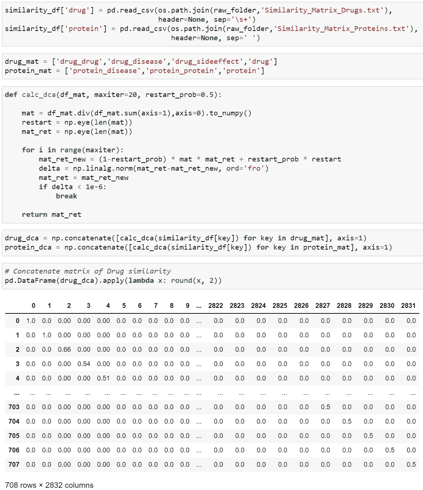

Concatenate matrix of Drug similarity

药物相似度维数为 2832，目标相似度维数为 4536。使用 SVD 算法，降低到 100 维。

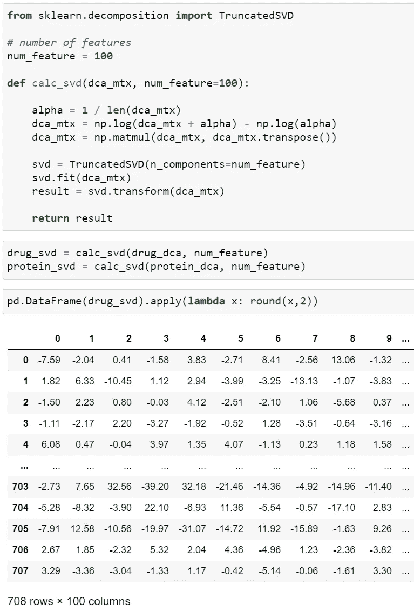

Truncated drug similarity table using SVD

> **步骤 4:矩阵完成以搜索新的药物-靶标相互作用**

通过步骤 1 到步骤 3，我们生成了已知药物-靶标相互作用表(R: 708×1512)、药物相似度表(P: 708×100)和靶标相似度表(Q: 1512×100)。利用这些矩阵，我们可以采用推荐系统中常用的矩阵分解算法。

DTINet 使用了于等人开发的归纳矩阵完成 (IMC)，因为 IMC 提供了 Matlab 或者 C++/Python 或者 Matlab 的包装器，所以我应用了纯 Python 脚本编写的[矩阵分解计算](https://towardsdatascience.com/recommendation-system-matrix-factorization-d61978660b4b)。

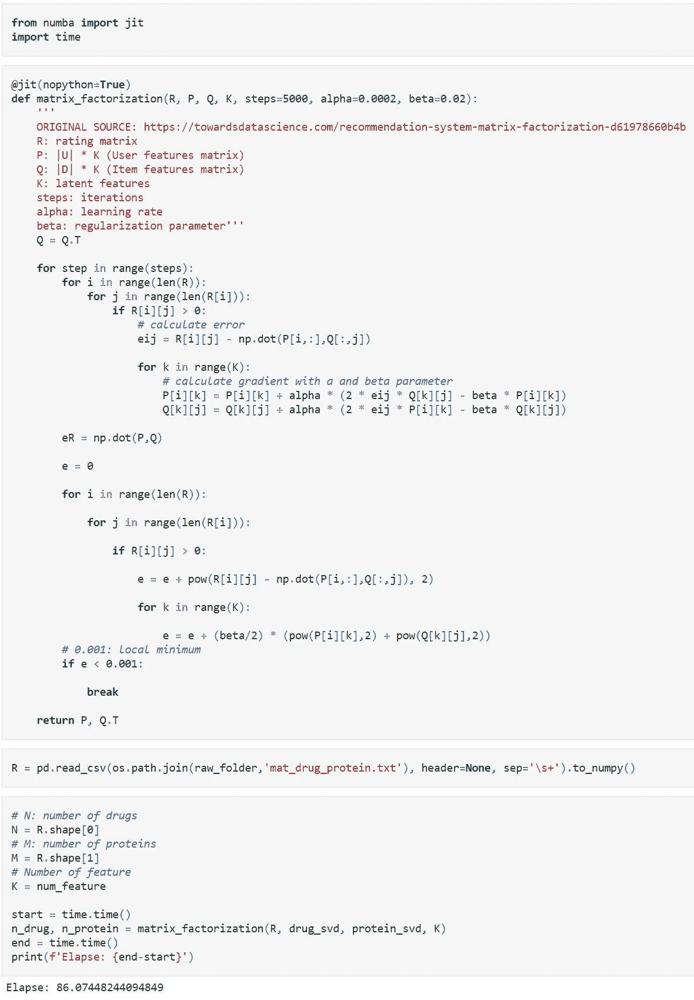

Matrix factorization calculation

> **步骤 5:评估预测的药物-靶标相互作用**

最后，我们将通过矩阵分解计算的药物靶标矩阵与已知的药物靶标矩阵进行比较。有许多估计方法(如中华民国，RMSE)。我使用 Sci-kit learn 中的 roc_auc_score 函数来计算 roc 曲线下的面积(ROC AUC)。

分数差是因为机器学习算法和训练场景差。此外，它是一个非常稀疏的矩阵，所以梯度算法的性能在我看来很低。

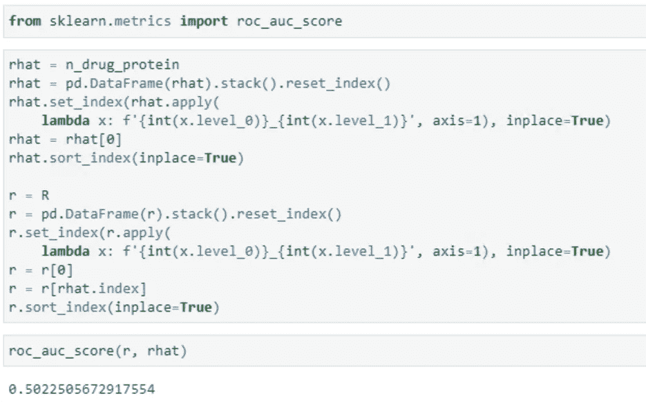

ROC AUC score

在本文中，我将重点介绍使用 Python 实现药物-靶标交互模型。[刘等](https://pubmed.ncbi.nlm.nih.gov/33912218/)采用了图卷积网络()。我将为下一篇文章准备一个演示。

源代码写在 [Google Colab](https://colab.research.google.com/drive/1drR0JvLIBtL1BIqw5CXPl5hQHdPSblhK?usp=sharing) 和[drug central 数据的稀疏图](https://public.tableau.com/app/profile/byeungchun.kwon/viz/DrugCentral_DrugTargetInteraction/Dashboard)在 Tableau 公共网站。

 [## 谷歌联合实验室

### 药物-靶标相互作用预测

colab.research.google.com](https://colab.research.google.com/drive/1drR0JvLIBtL1BIqw5CXPl5hQHdPSblhK?usp=sharing) 

**Tableau Dashboard—**[https://public . Tableau . com/app/profile/byeungchun . kwon/viz/drug central _ DrugTargetInteraction/Dashboard](https://public.tableau.com/app/profile/byeungchun.kwon/viz/DrugCentral_DrugTargetInteraction/Dashboard)