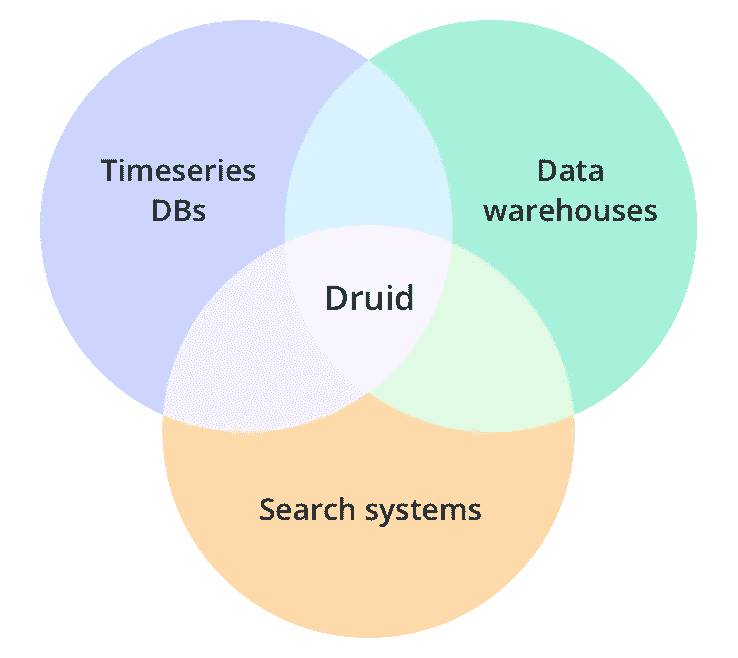
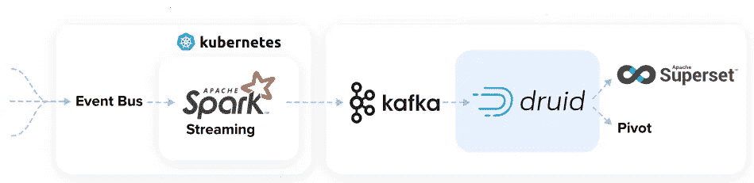
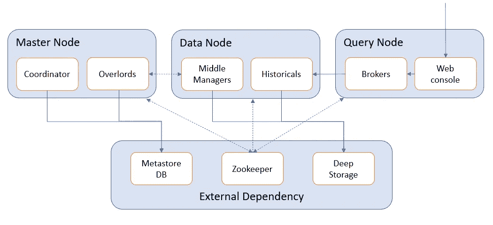
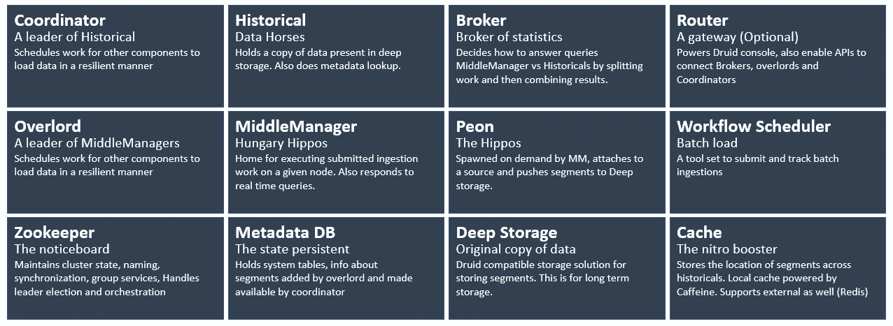
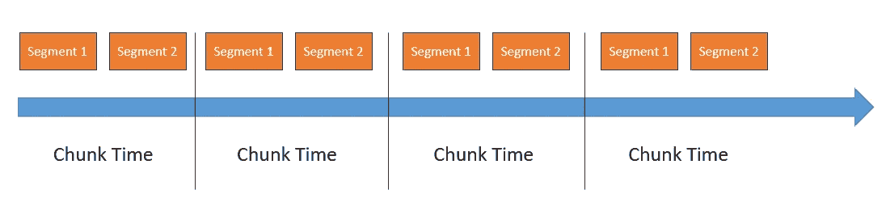
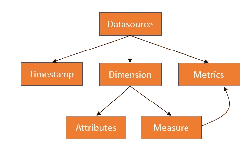
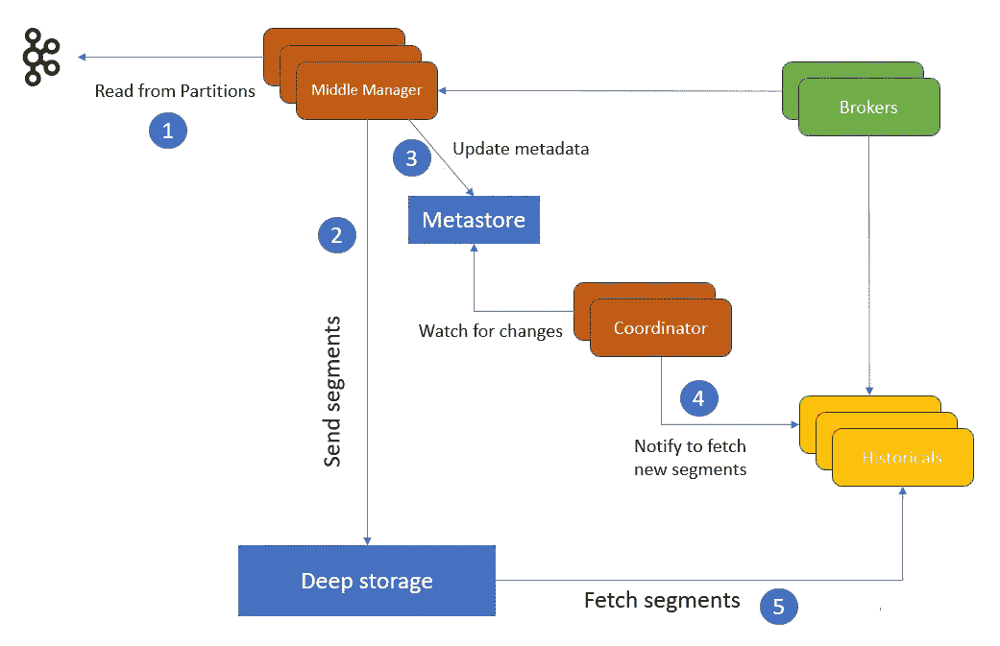
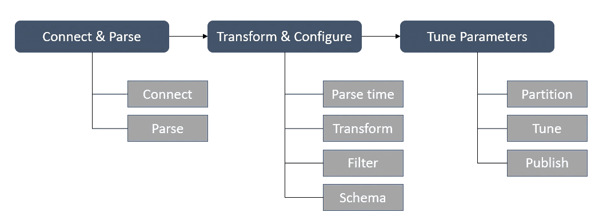

# 德鲁伊——简介

> 原文：<https://medium.com/geekculture/druid-an-introduction-441c4af03107?source=collection_archive---------1----------------------->



实时分析数据库

# 德鲁伊是什么？

Druid 是一个开源、高性能、实时的分析数据库，为大量并发用户提供任何规模的分析应用。



# 德鲁伊的特征

*   开放源码
*   高摄取率
*   TB 级数据集上的低查询延迟(亚秒级查询)
*   支持高维度和高基数数据
*   面向列
*   分布式数据存储
*   自我修复和自我平衡
*   支持实时和批处理
*   云原生
*   支持查询索引
*   基于时间的数据分割、压缩数据
*   自动摘要，延迟具体化
*   近似算法
*   支持文本搜索

# 节点类型



## 主网点

*   协调器—管理集群上的数据可用性
*   超级用户—控制数据摄取工作负载的分配

## 数据节点

*   中层经理—接收和查询实时数据(可能有多个员工)
*   历史-对一般查询的响应

## 查询节点

*   代理—处理来自外部客户端的查询。
*   路由器——将请求路由到代理、协调者和霸主
*   查询控制台(由 Jetty 提供支持)
*   API 服务

由于每种节点类型执行的工作性质不同，它们有不同的内存和 CPU 需求，因此对这些节点类型使用不同的实例类型是一个好主意。可供选择的一组好选项是(r5、m5、i3 和 c5 系列实例)。

## 外部系统依赖性

*   Zookeeper —管理集群状态
*   元数据存储— MySQL 或 Postgres
*   深度存储— S3、HDFS 或 NFS



## 在 EC2 上尝试德鲁伊

```
# launch an t2.xlarge EC2 based on ubuntu 22.04 image

sudo apt update -y
sudo apt install openjdk-8-jdk -y
# download binary
wget https://dlcdn.apache.org/druid/24.0.0/apache-druid-24.0.0-bin.tar.gz
# untar
tar -xzf apache-druid-24.0.0-bin.tar.gz
cd apache-druid-24.0.0
export JAVA_HOME=/usr/lib/jvm/java-8-openjdk-amd64
export DRUID_HOME=/home/ubuntu/apache-druid-24.0.0
PATH=$JAVA_HOME/bin:$DRUID_HOME/bin:$PATH

# start druid
./bin/start-micro-quickstart
```

## 在 K8s 上安装德鲁伊

```
helm dependency update helm/druid
helm install druid helm/druid --namespace demo --create-namespace
helm status druid -n demo
```

或使用运算符

```
kubectl create namespace druid-operator
git clone [https://github.com/druid-io/druid-operator.git](https://github.com/druid-io/druid-operator.git)
cd druid-operator/
helm -n druid-operator install cluster-druid-operator ./chart
```

> **pydruid** 是一个 python 包，它公开了一个简单的 API 来创建、执行和分析 druid 查询
> *pip install pydruid【async，pandas，cli，sqlalchemy】*

# 数据存储格式



## 段

*   版本化的不可变文件
*   按时间划分
*   大小范围 300MB 到 700MB
*   使用直接内存映射加快访问速度

这些数据段被预取到集群中。数据节点中段的位置是`var/druid/segments/<datasource>`。如果我们认为它没有被使用，我们可以组合、替换甚至删除片段。为了首先删除片段，我们使用`~/markUnused` API 来标记片段，然后使用`kill`任务类型通过`~/druid/indexer/v1/task` API 来删除。

在节点故障期间，数据段被加载到新的数据节点。这个过程叫做**平衡**。

## 最佳化

*   转换为分栏格式
*   使用位图索引进行索引
*   压缩
*   字符串列 id 存储最小化的字典编码
*   位图索引的位图压缩
*   所有列的类型感知压缩

## 德鲁伊数据模型



*   数据源—类似于表
*   主时间戳—强制
*   维度—(属性和度量)，字典编码，位图
*   指标—预先计算的聚合

# 摄取



将原始输入数据转换成片段称为摄取。它包括两个过程索引和移交。索引创建新的段，切换发布由历史记录服务的段。我们通过 UI 或称为*摄取规范*的 JSON 规范来定义摄取期间发生的事情。这个规范可以通过 rest 提交给霸王服务。

**摄入类型**

## 批处理文件摄取

*   本地批量摄入
*   Hadoop 批量接收

## 溪流摄入

*   Kafka 索引服务(流拉)
*   流推送



## 连接和解析

*   连接-连接到数据源
*   解析-输入数据格式

注意:如果我们正在读取其他格式的数据，如 ORC，我们需要启用文件类型的扩展名。扩展名列表可在`common-runtime.properties`文件中修改。要更改的字段是`druid.extensions.LoadList`。

## 转换和配置

*   解析时间—(格式和默认值)
*   转换—可以在加载数据之前添加转换
*   过滤器—选择性选择要包含的行
*   配置架构

## 调整参数

*   划分
*   调整
*   出版

摄入规范大致分为三个部分:

> dataschema —数据源、时间戳、维度、粒度
> ioConfig —关于如何从源读取数据的配置
> tunningConfig —关于如何构造段的配置

还可以使用 [DruidOperator](https://airflow.apache.org/docs/apache-airflow-providers-apache-druid/stable/operators.html) 通过 Apache Airflow 从外部触发数据摄取。

# 可观察性

Druid 公开了各种组件的度量标准。

[完整列表请参考本页。](https://druid.apache.org/docs/latest/operations/metrics.html)

我们可以利用[德鲁伊输出器](https://github.com/opstree/druid-exporter)和[库贝-普罗米修斯堆栈](https://github.com/prometheus-community/helm-charts/tree/main/charts/kube-prometheus-stack)来追踪德鲁伊的度量。

```
helm repo add prometheus-community https://prometheus-community.github.io/helm-charts
helm repo update
helm -n monitoring install kube-prometheus-stack prometheus-community/kube-prometheus-stack

helm upgrade druid-exporter ./helm/ --install --namespace druid \
--set druidURL="DRUIDURL" \
--set druidExporterPort="8080" \
--set logLevel="info" --set logFormat="text" \
--set serviceMonitor.enabled=true --set serviceMonitor.namespace="monitoring"

# common.runtime.properties
druid.emitter=http
druid.emitter.logging.logLevel=debug
druid.emitter.http.recipientBaseUrl=http://druid-exporter-prometheus-druid-exporter.monitoring.svc.cluster.local:8080/druid
druid.monitoring.monitors=["org.apache.druid.java.util.metrics.SysMonitor", "org.apache.druid.java.util.metrics.JvmMonitor"]
```

# 德鲁伊用例

*   广告数据分析(数字营销)
*   用户行为分析
*   实时 APM
*   高速 OLAP
*   物联网和设备指标

## 已经在使用德鲁伊的公司


一些公司选择了 Snowpipe 作为德鲁伊的替代品..