# #DS 02。熊猫，数据框和情节

> 原文：<https://medium.com/geekculture/ds-02-pandas-dataframes-and-plot-cb7751760e6d?source=collection_archive---------61----------------------->

在我的上一个 medium 故事中，我讲述了我是如何发现数据科学世界的，在接下来的帖子中，我将描述我对它的了解。

=>Gihub 资源库<=

*我正在集中精力学习 python 成为一门简单但强大的语言，事实上，我相信 python 是编程世界的“入门”。在寻找数据科学中关于 python 的学习资料时，我发现了 Spyder 和 Jupyter，它们是用于数据分析的非常棒的工具。此外，这些工具将帮助我展示我的项目的进展。*

*首先我将讲述这个项目。我从网上的某个地方得到了一个 excel 文件(该文件将放在 GitHub 存储库中)，这个文件包含了分散在巴西的一些商场的销售数据。有了这些数据，我想回答一些问题，比如:
-哪个商场的销售额更多
-所有商场的总销售额是多少
-所有商场的销售额的平均值是多少
-验证某个日期间隔内的一些数据
-绘制一些数据*

*首先，我必须导入 pandas 库并让 python 读取。xlsl 文件:*

*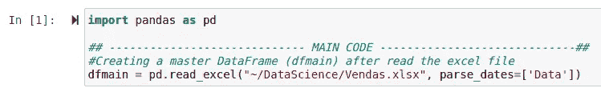*

*读取 excel 文件并创建数据框架“dfmain”后，我们可以打印以查看结果:*

*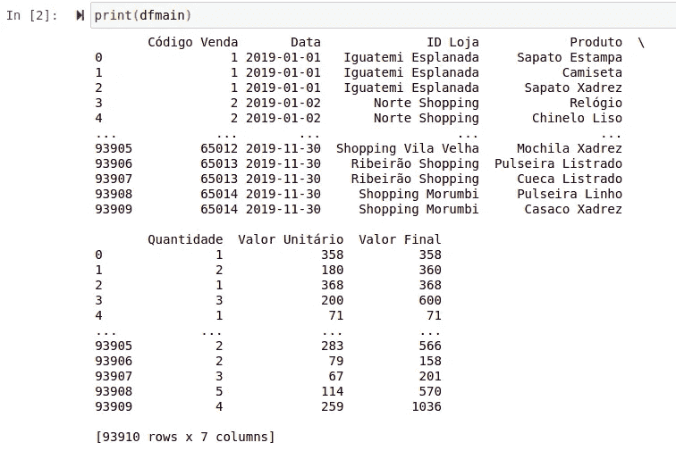*

*我们还可以使用命令“display”来设置输出的样式(看起来更酷，我将使用 display 而不是 print):*

**

*在下面的代码中，我将日期列从 string 转换为 pandas 认为是“date”的格式。之后，创建了一个新的数据框架，只显示 ID mall 和每个 mall 的所有销售额的总值，按降序排列。*

*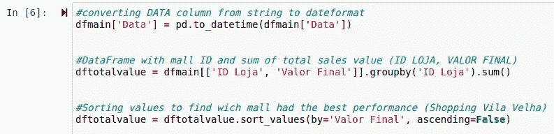*

*结果如下:*

*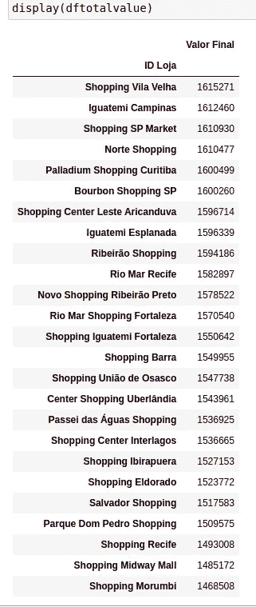*

*The table shows us that the mall with more sales value was ‘Shopping Vila Velha’ and the worst was ‘Shopping Morumbi’*

*接下来，我想知道所有商场的所有销售额的总和，然后我得到一个方法，可以对一个或多个列求和，并对“Valor Final”列求和。之后，我在 DataFrame 上创建了另一列，以百分比格式显示值。*

***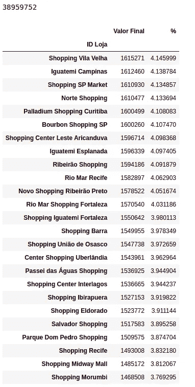*

*为了回答关于销售平均值的问题，我使用了相同的代码，但使用了“mean()”方法:*

*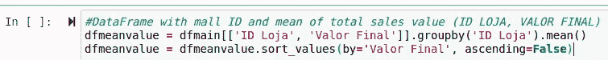**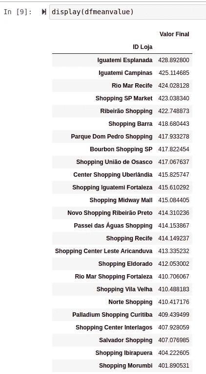*

*在下一节中，我决定编写一个脚本，只需更改['ID Loja'] == 'Selected Mall '，就可以提取每个商城的数据*

*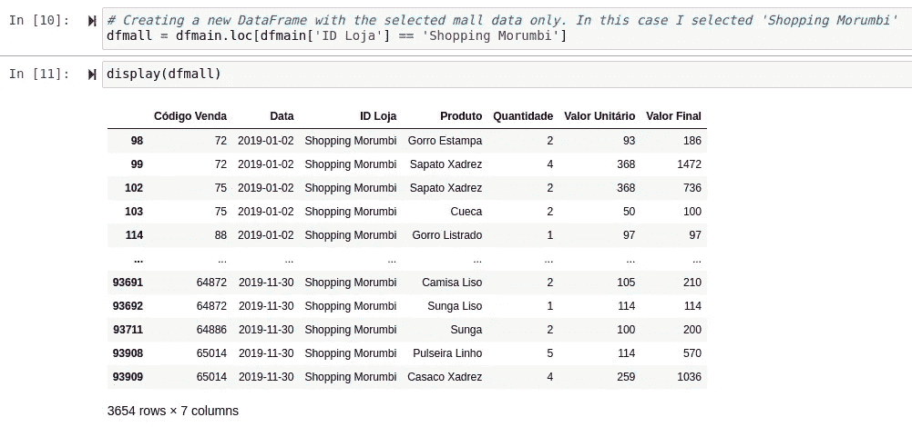*

*为了知道每件产品卖出了多少，我从(dfmall)创建了另一个数据框架。*

*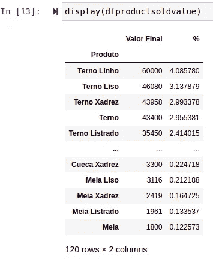*

*This table shows that the product with more value sales was ‘Terno Linho’ with a total value of ‘R$ 60.000,00’ representing 4,08% of all product sales from this mall.*

*如果我们想要分析一个特定的日期周期，我们可以创建一个过滤器来确定日期周期，然后更精确地提取数据。通过下面的代码，我发现哪种产品在一月份销售得更多，但是日期可以在任何时间段更改，例如:从“2019-02-18”到“2019-07-23”*

*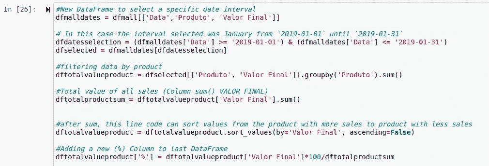*

*因此，我们有:*

*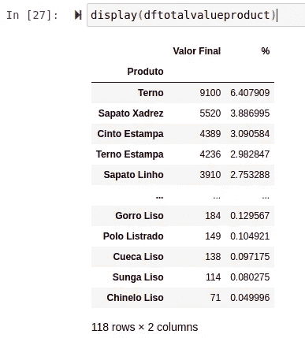*

*The table above shows us that in January, the item that was more sold was “Terno” with 6,4% of all sales. And the item with fewer sales was “Chinelo Liso” with 0,04%*

*要查看每月的总销售额，我们可以使用命令“重采样(参数)”，并选择 M(月)作为“数据”(日期)列中的参数。因此，我们将使用选定的数据创建另一个数据框架:*

*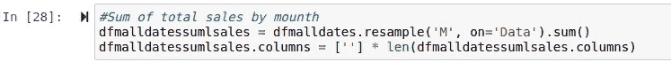*

*In this case, I removed the index “Valor Total” because I have encountered some errors when I’m trying to plot =/*

*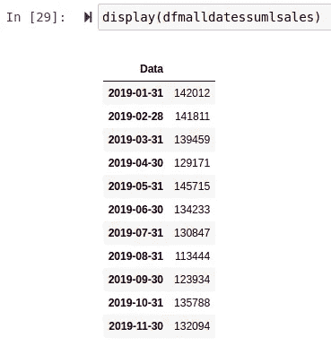*

*This table shows the total value of all sales for each month*

*最后是剧情时间。为了绘图，我们必须导入另一个 python 库:*

*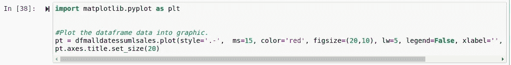*

*Full line code: “pt = dfmalldatessumlsales.plot(style=’.-’, ms=15, color=’red’, figsize=(20,10), lw=5, legend=False, xlabel=’’, title = ‘Total Sales’)”*

*因此，我们有一个图像来表示每个月所有销售额的数据:*

*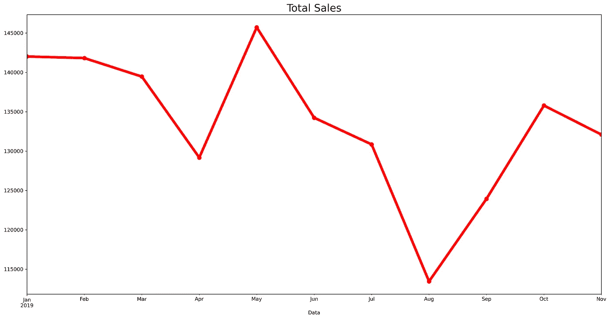*

*With this image, we can observe that the month with more value sales was May and the month with fewer sales was August.*

*我们可以用同样的方法来绘制销售的平均值:*

*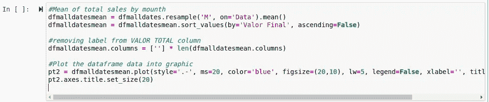**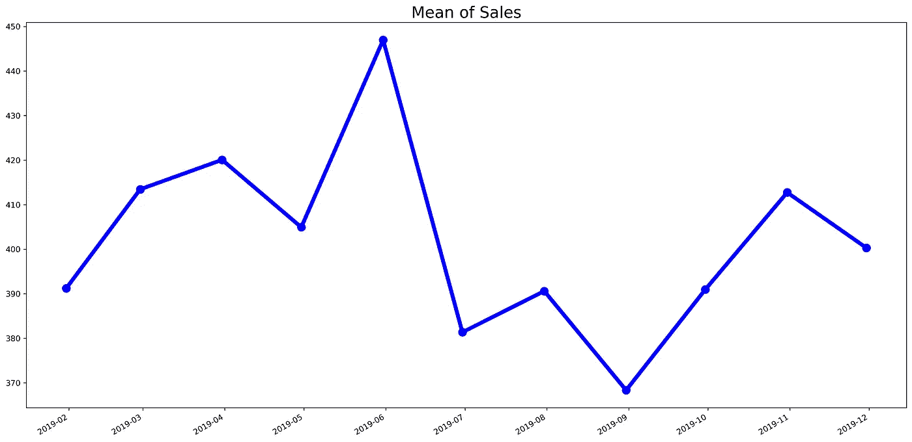*

*Mean of sales per month*

*嗯，“就是这个”。*

*一个人学习有时会很难，但这是可能的。
现在，回答前面的问题:
问:哪个商场的销售额更高？
答:购物维拉韦拉 1.615.271 元人民币*

*问:所有商场的总销售额是多少？答:38 . 959 . 752 . 00 雷亚尔*

*问:所有来自商场的销售意味着什么？
答:1 558 390.08 雷亚尔*

*问:核实整个日期区间的一些数据
答:2019-01-01 至 2019-01-31 年 1 月，shopping Morumbi 出售给“Terno”的总价值为 9.100，00 雷亚尔。*

*问:绘制一些数据
答:*

**

*=>Gihub 资源库<=
[***https://github.com/saulotp/ds02***](https://github.com/saulotp/ds02)*

*联系我:
-saulodetp@gmail.com
-Ig:saulodetp
-Linkedin:saulodetp*