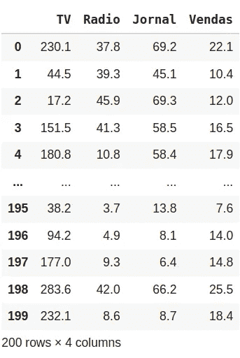
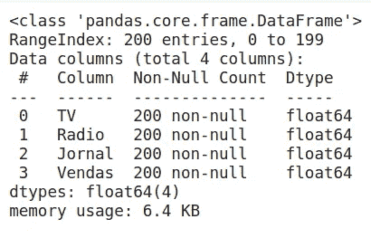
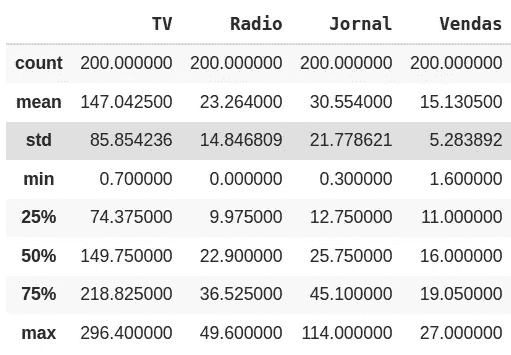
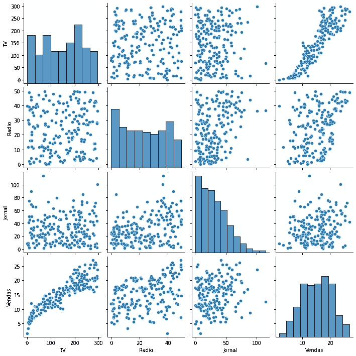
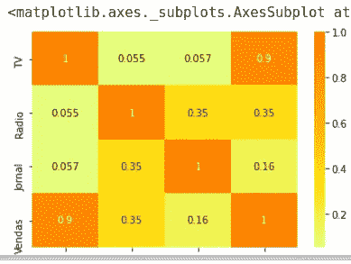
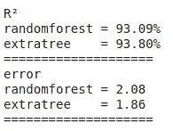
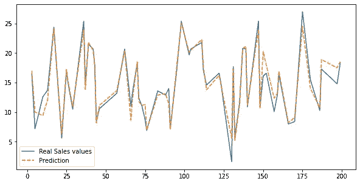
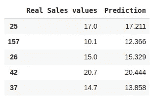
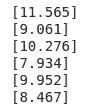

# 简单机器学习项目

> 原文：<https://medium.com/geekculture/ds-04-machine-learning-project-441a9d62e935?source=collection_archive---------25----------------------->


> github
> [https://github . com/sau lotp/project _ how-can-we-increase-revenue](https://github.com/saulotp/project_how-can-we-increase-revenue)

Project_name:我们如何增加收入？

目标:在这个项目中，一家约定的初创企业联系我们，请求我们帮助他们如何增加公司收入。我们这些数据科学爱好者接受了这一挑战，因为我们看到了增长知识和测试数据分析技能的大好机会。

什么 _ 我们 _ 有:该公司发送给我们一个单一的数据库包含一些数据的方式，该公司投资的资本和有多少是在销售形式回报。

# 逐步地

首先，我们必须导入 python 库，它将帮助我们以数据帧的形式打开文件。

```
import pandas as pd
```

现在，我们可以打开 CSV 文件来查看数据的结构:

```
main_df = pd.read_csv('/content/drive/MyDrive/DataScience/Projetos/How can we increase our revenue?/advertising.csv')main_df
```



我们的数据帧有 200 行和 4 列。让我们看看是否有一些空数据

```
main_df.info()
```



我们有 200 行，其中有 200 个非空值。所有数据帧的数据类型都是浮点型的。

使用 describe()命令，我们可以看到一些关于平均值、字段计数、最小/最大值等信息。

```
main_df.describe()
```



现在我们可以绘制一些数据，以获得更好的可视化效果。为此，我们可以导入库 seaborn。
PS。库‘警告’是为了阻止 seaborn 阴谋的警告，它不要求进行分析。

```
import seaborn as sns
import warnings
warnings.simplefilter(action='ignore', category=FutureWarning)sns.pairplot(main_df)
```



这张图表向我们展示了有关电视和销售的有趣数据。这些数据之间可能存在关联，因为我们可以看到，随着电视投资的增加，销售额也在增加。关于其他数据，似乎没有一个模式。让我们绘制另一种类型的图表，试图提取更多的信息。

```
sns.heatmap(main_df.corr(), cmap='Wistia', annot=True)
```



上图是一张热图，越靠近第一名，相关的数据就越多。再一次，电视和销售看起来有某种关联。

有了这些数据，我们就可以解决显示更好的电视投资可以增加公司收入的问题。但是让我们玩一玩机器学习，看看我们能做些什么。

首先，我们将选择算法将用于训练的数据。

```
#importing train library
from sklearn.model_selection import train_test_split#selecting columns to be trained
x = main_df.drop('Vendas', axis=1)
y = main_df['Vendas']#spliting the train data in 'data to train' and 'data to test'
#'test size' mean that the algorithm will be trained with 70% of all #data, and will use 30% for test. But why we can't train our #algorithm with 100% of data and create an ultimate powerfull AI? #Doing this, we only will make our AI do CTRL+C / CTRL+V, the #algorithm will be very in copy past and not in predict values.x_train, x_test, y_train, y_test = train_test_split(x,y, test_size=0.30)
```

在这种情况下，我们想要预测销售额的数值，那么我们需要一个回归算法。我们有 3 个变量来计算我们的销售价值，我们将使用决策树算法。(如果我们有两个相关的值，例如 TV-Sales，我们可以使用简单的线性回归，但是对于多个变量，决策树更有意义。

```
## importing algorithms librarys that will be used
## We will use 2 kinds of decision tree and see wich will bring us a ## better result (random forest and extratree)from sklearn.ensemble import RandomForestRegressor, ExtraTreesRegressorrandomforest = RandomForestRegressor()
extratree = ExtraTreesRegressor()## algorithm training
randomforest.fit(x_train, y_train)
extratree.fit(x_train, y_train)
```

经过训练后，我们可以衡量我们的算法有多精确。

```
from sklearn import metrics
test_random = randomforest.predict(x_test)
test_extra = extratree.predict(x_test)r2_random = metrics.r2_score(y_test, test_random)
r2_extra = metrics.r2_score(y_test, test_extra)print('R²')
print(f'randomforest = {r2_random:.2%}')
print(f'extratree    = {r2_extra:.2%}')
print('='*20)erro_random = metrics.mean_squared_error(y_test, test_random)
erro_extratree = metrics.mean_squared_error(y_test, test_extra)print('error')
print(f'randomforest = {erro_random:.2f}')
print(f'extratree    = {erro_extratree:.2f}')
print('='*20)
```



extratree 算法具有较高的准确率，准确率为 93.80%，误差为 1.86%。然后我们将使用 extratree 进行预测。

绘制算法性能图。

```
import matplotlib.pyplot as plt
comparative_table = pd.DataFrame()
comparative_table['Real Sales values'] = y_test
comparative_table['Prediction'] = test_extra## plot 
plt.figure(figsize=(10,5))
sns.lineplot(data=comparative_table)
```



如果我们想比较预测数据和真实数据，我们可以打印数据图表。

```
display(comparative_table.head())
```



```
## for measure wich variable has more importance in our algorithm we can use the command 'feature_importances_'print(extratree.feature_importances_)
```


我们的栏目有:1 电视
2 电台
3 报纸
目前，我们知道电视对销售结果更重要。广播和报纸几乎是一样的，但看起来对报纸的投资会给销售公司带来更多的价值。如果我们做一个预测，模拟在电视和报纸上的更多投资，而广播的价值很低，会发生什么？

为了预测价值，我们必须使用命令' used algorithm+predict([[values]]'，在这种情况下，代码将是:
extra tree . predict([[' TV _ value '，' radio_value '，' Newpaper_value']))让我们来玩投资数字，我们有 100%的机会在电视、广播和报纸中进行分割，让我们看看我们能做些什么。

```
print(extratree.predict([['80','10', '10']]))
print(extratree.predict([['50','10', '40']]))
print(extratree.predict([['50','25', '25']]))
print(extratree.predict([['20','30', '50']]))
print(extratree.predict([['40','30', '30']]))
print(extratree.predict([['10','80', '10']]))
```



有了这些数据，我们可以得出结论，要增加公司收入，只要在电视上注入更多的重要性，销售额就会增加。

在这种情况下，我们不寻找统计数据，对此我很抱歉，但请记住，我只是一名试图学习一些数据科学知识的学生。我希望这篇文章对你有帮助，我还有很多要学的。但是如果你对我们如何增加对这个案例的分析有一些建议，请随时与我交谈。

*   [saulodetp@gmail.com](mailto:saulodetp@gmail.com)

> github
> [https://github . com/sau lotp/project _ how-can-we-increase-revenue](https://github.com/saulotp/project_how-can-we-increase-revenue)