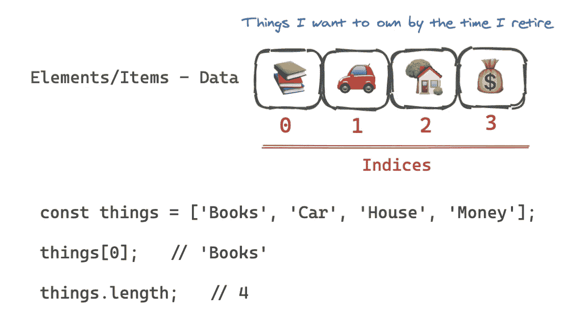

# 带 JS 的 DS—数组

> 原文：<https://medium.com/geekculture/ds-with-js-arrays-11e9e5e4db6a?source=collection_archive---------17----------------------->



[Arrays](https://developer.mozilla.org/en-US/docs/Web/JavaScript/Reference/Global_Objects/Array) — JavaScript (Made with [Excalidraw](https://excalidraw.com/))

数组或列表是按顺序组织的。它们存储在**连续的**内存中。如果您需要存储一些数据并对其进行迭代，数组是最佳选择，尤其是如果您知道*索引*的话。

# 静态和动态阵列

**静态数组**大小固定。我们需要在声明数组时指定数组中元素的数量。

如果我们想要声明一个包含 7 个商品的杂货数组，那么将在内存中分配 7 个连续的地址。如果我们后来意识到*我们需要再添加一个*项目，我们将不得不拥有动态数组。

**动态数组**允许我们在新的位置复制并重建一个有更多内存的数组(*如果当前内存不能容纳新的项目*)。如果我们想要将第 8 项添加到杂货列表中，则将 7 项的整个列表复制到一个新位置，分配 14 个内存块(*通常是当前大小*的两倍)，并将第 8 项添加到新位置。

## JS 中的动态数组

在 JavaScript 中，列表或数组是动态的。随着数组大小的增加，它们会自动分配内存。

***动态数组可以有*** `***O(N)***` ***的复杂度！***

```
const things = ['Books', 'Car', 'Home', 'Money'];things.push('Boat');    // 5
things.push('Goat');    // 6
```

它将推动数组末尾的`'Boat'`和`'Goat'`。但是如果为这个数组分配的内存没有第 5 项的空间，它会分配有更多空间的新内存(通常是现有内存的两倍)，并遍历数组为每个项分配内存。在这些场景中，复杂性将不是`O(1)`，而是`O(N)`。

但是这是一个次要的细节，我们可能不必担心内存分配或者将数组复制到新位置的可能性。

追加— `O(1)` *

*可以是`O(N)`

我们可以假设 push 命令(对于动态数组)在时间上是`O(1)` **常数**，*但是偶尔*我们会遇到时间上是**线性**的情况。

```
console.log(things);    // ['Books', 'Dog', 'Home', 'Money']
```

# JS 中的数组实现

在这一节中，让我们用 JavaScript 实现数组。实现是为了查看复杂性。

但是在我们开始操作之前，我建议复习一下 JavaScript 中最基本的数组操作。

[](https://darshnarekha09.medium.com/arrays-basic-operations-javascript-558c155489ab) [## 数组基本操作— JavaScript

### JavaScript 中最基本的数组操作列表。试着自己实现它们——有助于复习……

darshnarekha09.medium.com](https://darshnarekha09.medium.com/arrays-basic-operations-javascript-558c155489ab) 

我们将使用下面的样板代码来实现数组。你可以**尝试**执行`lookup()`或`get()`、`push()`、`pop()`、`delete()`的操作。

Implement Array Using JavaScript — Try It!

我们将使用一个**对象**来实现 JavaScript 中的数组——毕竟 JavaScript 中的数组是一个对象。

> JavaScript `**Array**`类是一个用于构造数组的全局对象；它们是高级的、类似列表的对象。
> 
> [数组— JavaScript | MDN](https://developer.mozilla.org/en-US/docs/Web/JavaScript/Reference/Global_Objects/Array)

对于每个元素，我们将添加一个格式为`index: value`的对象，并在`length`上保留一个*选项卡*。我们可以使用`index`键访问该项目。

要删除一个元素，我们需要将已删除元素后的元素上移一个索引。

Implementation of Array using JavaScript

# 字符串和数组

字符串是一组字符。通常情况下，字符串上的面试问题可以作为数组处理。

Check if the given word is a palindrome or not — Turn the string into an array.

> 拆分字符串，执行运算，然后返回字符串。

# 结论

在为您的程序选择数组之前，请注意以下几点。

✅快速查找

✅快速推送/弹出

✅命令道

❌缓慢插入

❌慢速删除

❌固定大小(如果使用静态数组)

选择正确的数据结构很重要，我们应该知道什么时候使用什么。我希望这篇文章能让你对数组有所了解。

# **延伸阅读**

[使用 JavaScript 的数据结构](/geekculture/data-structure-with-javascript-2d3791598453)

[带 JS 的 DS—哈希表](/geekculture/ds-with-js-hash-tables-f8fec13ad12a)