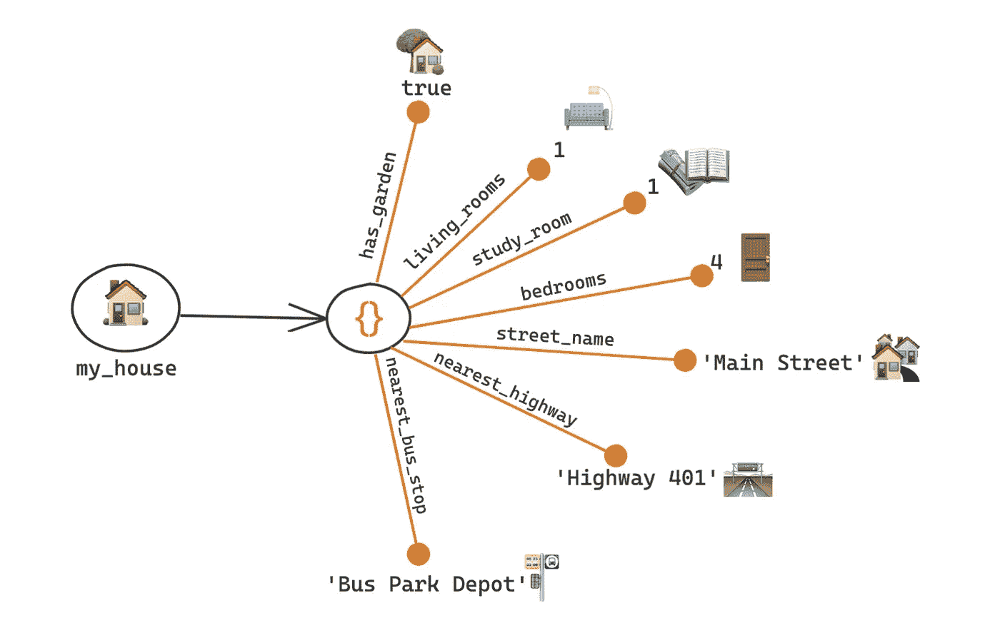
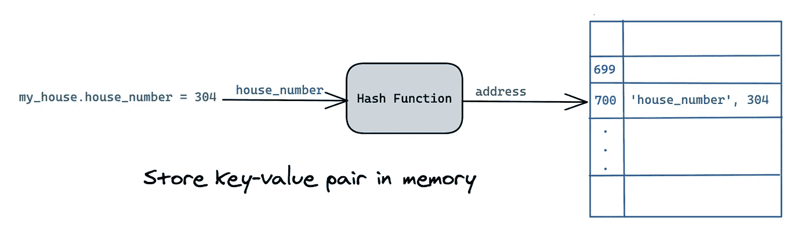
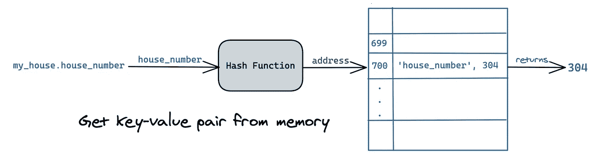
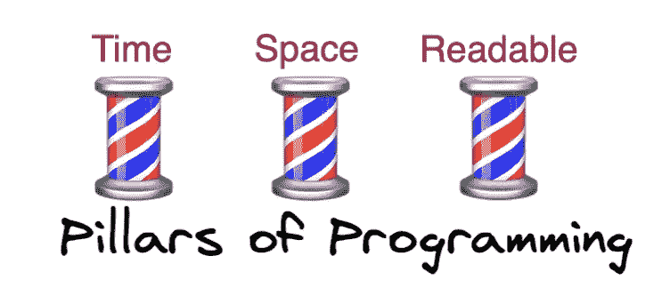
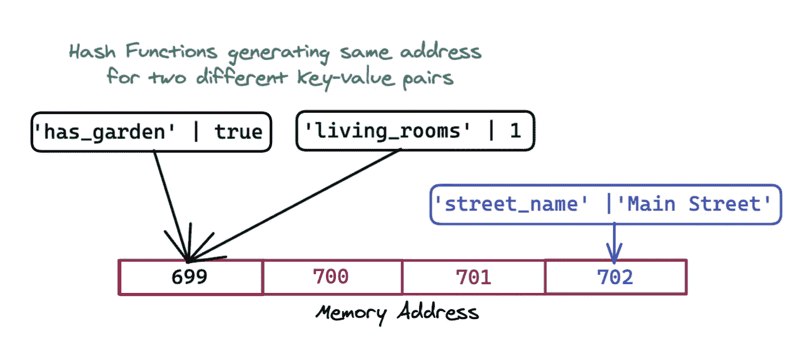
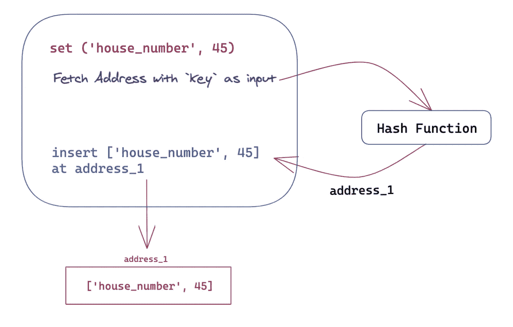
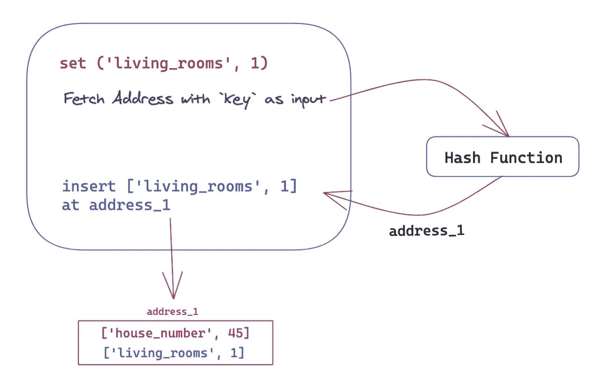
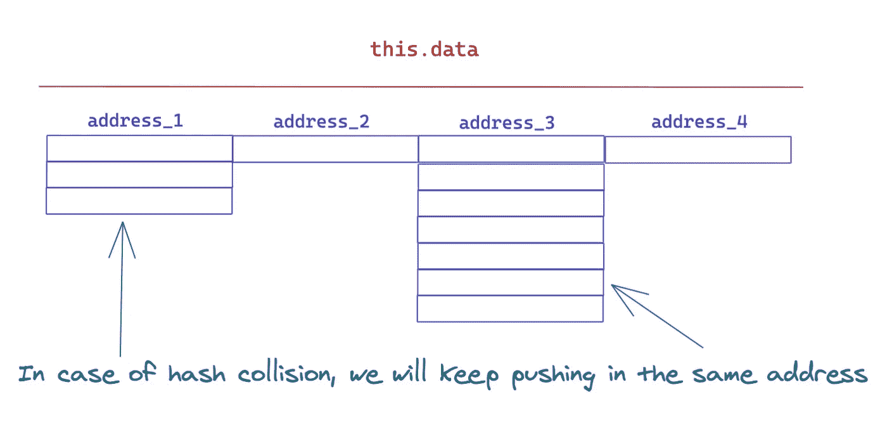
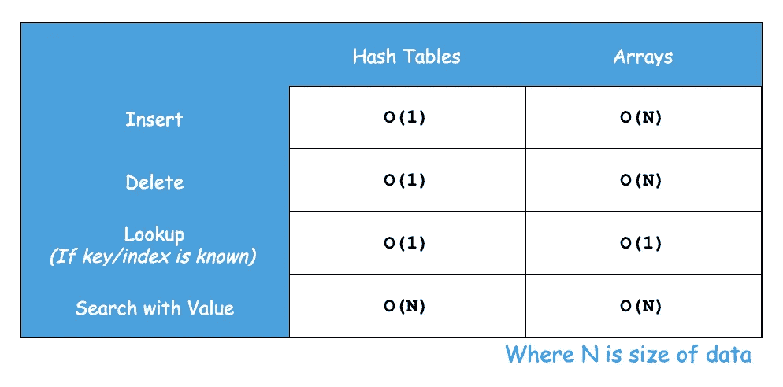

# 带有 JS 的 DS—散列表

> 原文：<https://medium.com/geekculture/ds-with-js-hash-tables-f8fec13ad12a?source=collection_archive---------9----------------------->

哈希表在不同的编程语言中有不同的名称，并且略有不同。它们被称为:

1.  Java 中的地图
2.  Ruby 中的哈希
3.  Python 中的字典
4.  JavaScript 中的[对象](https://developer.mozilla.org/en-US/docs/Web/JavaScript/Reference/Global_Objects/Object)

每种语言都有一个内置的哈希表，就像[数组](/geekculture/ds-with-js-arrays-11e9e5e4db6a)一样。哈希表在计算机科学中非常重要并且非常有用。我们经常在数据库或缓存中看到它们。

# JavaScript 中的哈希表(对象)

哈希表或[对象](https://developer.mozilla.org/en-US/docs/Glossary/Object)是 JavaScript 中的一种[结构化数据类型](https://developer.mozilla.org/en-US/docs/Web/JavaScript/Data_structures)。

> 它用于存储各种**键控**集合和更复杂的实体。— [对象| JavaScript | MDN](https://developer.mozilla.org/en-US/docs/Web/JavaScript/Reference/Global_Objects/Object)

假设你找到了梦想中的房子，它有很多属性。我们将如何使用对象来表示它？



Properties of My House (Made with [Excalidraw](https://excalidraw.com/))

```
const my_house = {
    has_garden: true,
    living_rooms: 1,
    study_rooms: 1,
    bedrooms: 4,
    street_name: 'Main Street',
    nearest_highway: 'Highway 401',
    nearest_bus_stop: 'Bus Park Depot',
};// Time complexity = O(1)
my_house.living_rooms;      // 1// Time complexity = O(1)
my_house.street_name;       // 'Main Street'// Time complexity = O(1)
my_house.house_number = 304;
```

在对象`my_house`中，让我们取一个属性`house_number`。

`my_house.house_number = 304;`

这里`house_number`是**键**，`304`是**值**。

> 使用哈希表，我们存储 ***键值对*** *。*

JavaScript 中散列表的其他变体有 [Map](https://developer.mozilla.org/en-US/docs/Web/JavaScript/Reference/Global_Objects/Map) 、 [Set](https://developer.mozilla.org/en-US/docs/Web/JavaScript/Reference/Global_Objects/Set) 、 [WeakMap](https://developer.mozilla.org/en-US/docs/Web/JavaScript/Reference/Global_Objects/WeakMap) 和 [WeakSet](https://developer.mozilla.org/en-US/docs/Web/JavaScript/Reference/Global_Objects/WeakSet) 。

注意操作`get`和`set`的时间复杂度是`O(1)`。为什么会这样？

# 散列函数

操作`get`和`set`的时间复杂度是`O(1)`，这是因为我们在内存中存储对象的方式。



Hash Function generates an index (address) with the key as input. Both key and value are stored.

一个名为 hash function 的黑盒获取密钥并返回一个存储密钥值的地址或索引。

> 哈希表使用[哈希函数](https://en.wikipedia.org/wiki/Hash_function)计算*索引*，也称为*哈希码*，进入*桶*或*槽*的数组，从中可以找到所需的值。在查找过程中，对键进行哈希运算，得到的哈希表示相应值的存储位置。— [哈希表—维基百科](https://en.wikipedia.org/wiki/Hash_table)

随着*索引*就位，操作`get`和`set`需要恒定的时间。



The hash function re-generates the address for the key and returns the value.

哈希函数为每个输入生成一个*固定长度的值。散列函数的例子有 MD5、SHA-1、SHA-256 等等。*

## 哈希函数的关键方面

对于哈希函数，请记住以下几点:

1.  对于给定的输入，输出保持不变，即哈希函数是确定的。
2.  哈希函数分别处理大写和小写。“Hello”和“hello”将生成两个不同的哈希。
3.  有了输出，我们就不能回到输入。从`key`到地址的转换是单向的。

生成的地址是无序的，因此与数组不同，键-值对以随机顺序存储— **无序**。

## 哈希函数的时间复杂度

> 哈希函数不会减慢速度吗？把每个`key`转换成地址不应该很费时间吗？

让我们再考虑一下`my_house.house_number = 304;`。这里，`house_number`将作为散列函数的输入，比如说 [MD5](https://www.md5hashgenerator.com/) ，并产生一些字符串，比如`8516ddd8bd901f568cefeadabac2de3`。这个输出被转换成一个索引空间或地址空间，在这里我们存储键和值。

这种情况发生得非常快，每种语言都有自己的哈希函数实现。并且这些实现具有大 O 时间复杂度`O(1)`。

# 哈希冲突

到目前为止，在谈论散列函数时，我们没有谈到编程的主要支柱之一— **空间**。



Pillars of Programming: Time complexity, Space complexity, and Readability

是的，对于每个`key`,我们生成一个地址并将键值对存储在内存中。但是太空呢？我们知道记忆不是无限的。它是有限的。如果生成的地址不可用怎么办？

由于散列函数考虑了空间，所以不可能在存储器之外生成地址。但这又引出了另一个问题。

哈希表最大的问题是不止一个`key`获得同一个**地址导致 [**哈希冲突**](https://www.cs.usfca.edu/~galles/visualization/OpenHash.html) 。**



Hash Functions generating the same address for two different key-value pairs.

在这些场景中，当我们有足够的数据但内存有限时，所有的操作都是`O(N/k)`，其中`N`是对象中键值对的数量，`k`是哈希表的大小。由于`k`是一个常数，我们可以删除它，从而增加查找`O(N)`的时间复杂度。

它们是不可避免的，并且有不同的解决方式。解决哈希冲突最常见的方法之一是[用链表](https://en.wikipedia.org/wiki/Hash_table#Separate_chaining)分开链接。

现在由于哈希冲突，哈希表中的查找可能是`O(N)`，其中`N`是对象的大小。

# JS 中哈希表的实现

在这一节中，让我们用 JavaScript 实现哈希表(对象)。这个实现是为了查看我们对哈希表所做的不同操作的复杂性。

## 哈希表中不同操作的时间复杂度

我们可以对哈希表执行不同的操作，最常见的如下。

1.  插入— `O(1)`
2.  查找— `O(1)`
3.  删除(因为它是一个无序列表，所以不需要像在数组中那样移动条目)——`O(1)`

*空间复杂度***对于哈希表:* `*O(N)*` *，其中* `*N*` *是键的个数。**

*下面是我们将用于在 JavaScript 中实现哈希表的样板代码。*

*Try It Out: Implement Hash Table in JavaScript.*

*注意这个小小的散列函数——它是一个非常基本的函数，可以满足我们的一点点学习。*

*我们将使用一个数组来实现我们的哈希表。这样做的原因是为了实现一个简单的哈希冲突解决方案，其中数组的大小将显示有限的内存。*

*`this.data`将保存一个键和值对的数组。对于简单的插入，过程如下*

**

*Insert ‘house_number’ with value 45 in the object*

*对于哈希冲突，即当哈希函数生成相同的地址时，我们将在该地址中推送键-值对。*

**

*Hash Collision: Same address for new key — push in the same address.*

*按照这个解决方案，我们必须遍历两层数组来获取密钥对值。在最坏的情况下，我们将循环一个二维数组。*

**

*Visual Representation of `this. data`*

*现在让我们看看完整的代码。*

*Hash Table Implementation in JavaScript*

# *哈希表和数组*

**

*Don’t get all impressed by Hash Tables — Consider the importance of Space and Order of data too!*

*散列表看起来*像*在数组之上的黑客。我们使用可读性更好的`key`，而不是像`0`、`1`、`2`等那样使用`index`。*

*哈希表中没有顺序，而数据在数组中是有序的。*

# *结论*

*在为您的程序选择哈希表或 JavaScript 对象之前，请注意以下几点。*

*✅快速查找(需要良好的冲突解决方案)*

*✅快速插入*

*✅柔性键*

*❌无序*

*❌慢键迭代*

*哈希表通常用于**降低时间复杂度**，以**作为空间复杂度**的折衷`O(N)`。*

*我希望这篇文章能给你在程序中选择对象时所需要的洞察力。*

# *参考资料和进一步阅读*

1.  *[对象— JavaScript | MDN](https://developer.mozilla.org/en-US/docs/Web/JavaScript/Reference/Global_Objects/Object)*
2.  *[哈希表:哈希冲突可视化](https://www.cs.usfca.edu/~galles/visualization/OpenHash.html)*

## *哈希函数的时间复杂度*

1.  *[为什么在评估哈希函数时，哈希查找的成本为 O(1)可能会比这花费更多的时间？](https://stackoverflow.com/questions/30804567/why-is-the-cost-of-a-hash-lookup-o1-when-evaluating-the-hash-function-might-ta)*
2.  *[哈希表的时间复杂度](https://stackoverflow.com/questions/3949217/time-complexity-of-hash-table)*
3.  *[哈希运算的复杂性](https://stackoverflow.com/questions/6873039/complexity-of-hashing)*
4.  *[(什么时候)哈希表查找是 O(1)？](https://cs.stackexchange.com/questions/249/when-is-hash-table-lookup-o1)*

**本博客是 JavaScript* *系列* [*数据结构的一部分。*](/geekculture/data-structure-with-javascript-2d3791598453)*

*[](/geekculture/data-structure-with-javascript-2d3791598453) [## JavaScript 数据结构

### 我们将数据放入数据结构并检索它们——就像我们将食物放入冰箱一样。

medium.com](/geekculture/data-structure-with-javascript-2d3791598453)*