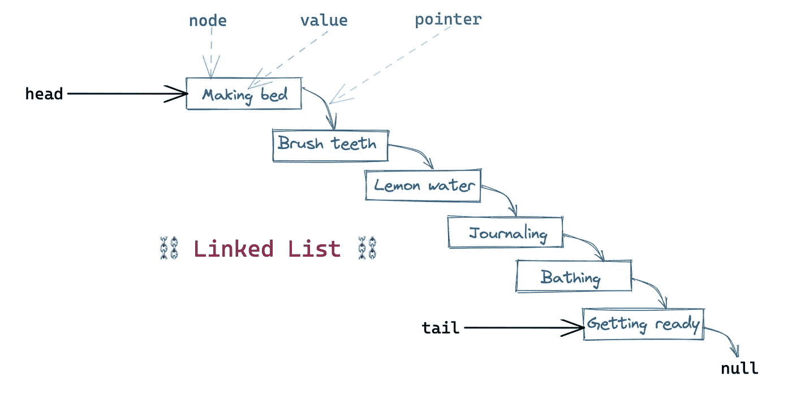
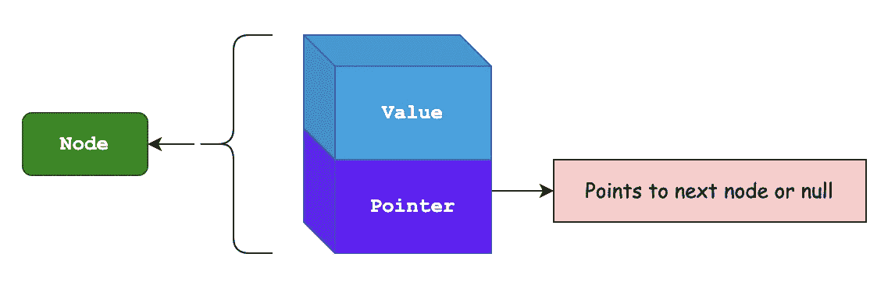
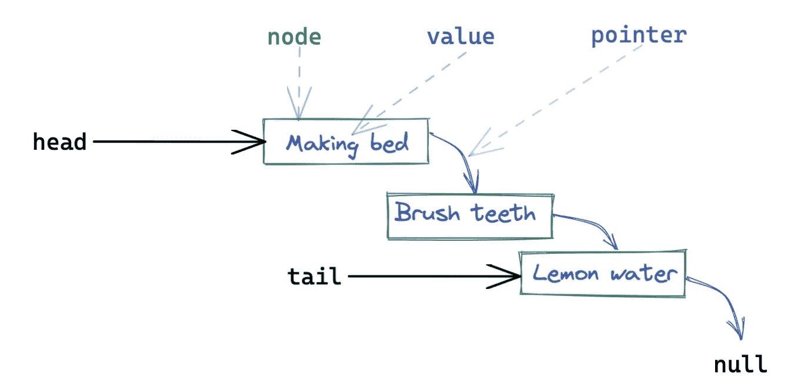
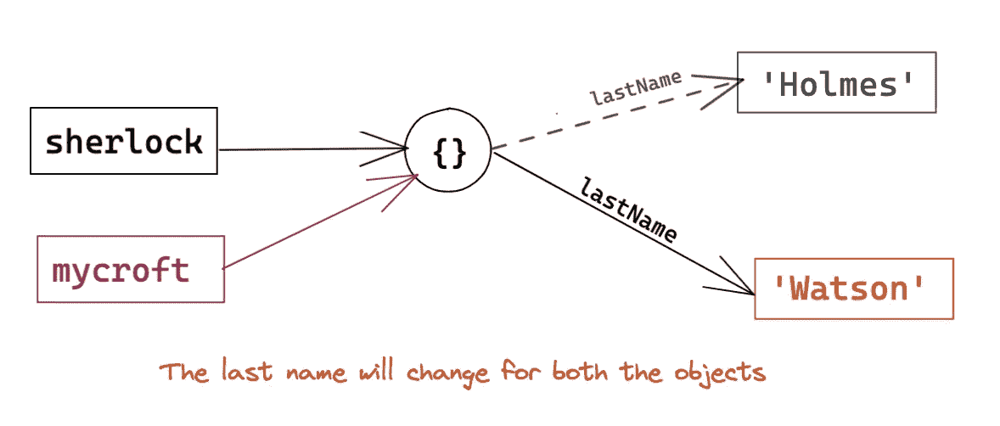
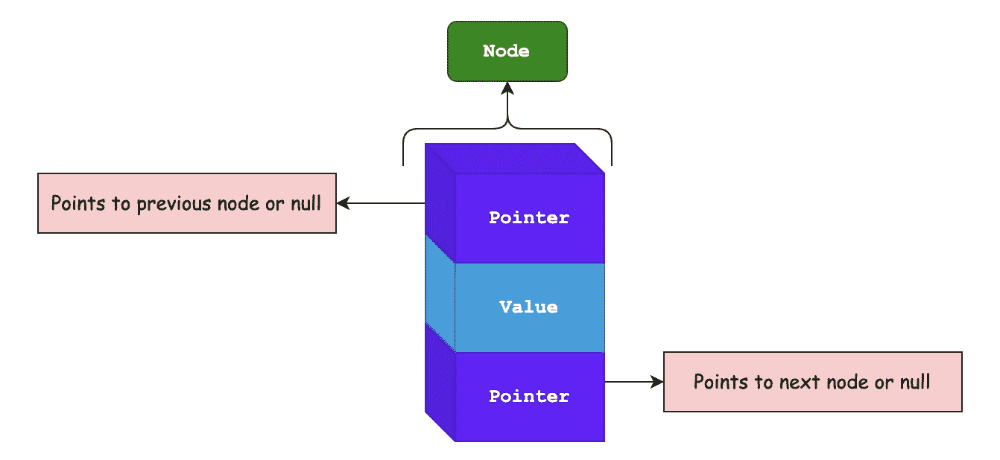

# 带有 JS 的 DS——链表

> 原文：<https://medium.com/geekculture/ds-with-js-linked-lists-1062e386ae26?source=collection_archive---------25----------------------->

链表顾名思义就是*链接*。链表可用于实现计算机上的文件系统、浏览器历史或解决哈希冲突。

在这个博客中，我们将讨论**单链表**和**双链表**。我们将从单向链表开始，然后扩展到理解双向链表。



Linking My Morning Routine — Made in [Excalidraw](https://excalidraw.com/)

# 单向链表

链表由节点组成。每个节点有两个元素，一个是我们想要存储的值，另一个是指向`next`节点或`null`的指针。



A Node in Singly Linked List

链表中的第一个节点称为`**head**`，而最后一个节点称为`**tail**`。所有的链表都以一个`null`结束。因此，指向`null`的节点成为链表的尾部。



Singly Linked List — Anatomy

让我们考虑一个正常的早晨惯例。

`const routine = ['make bed', 'brush teeth', 'lemon water'];`

链表将如下所示。

`linked list: 'make bed' --> 'brush teeth' --> 'lemon water'`

每个箭头称为一个**指针**。

# 指针

它是对内存中另一个位置、另一个对象或另一个节点的引用。

## JavaScript 中的指针

JavaScript 中没有**没有** `pointer`只有[按引用传递和按值传递](https://www.geeksforgeeks.org/pass-by-value-and-pass-by-reference-in-javascript/#)。

> 在按引用传递中，通过直接将变量的引用/地址作为参数传递来调用函数。所以改变函数内部的值也会改变原始值。在 JavaScript 中**数组和对象**遵循通过引用传递属性。

考虑下面的对象。

```
let sherlock = { lastName: 'Holmes' };
let mycroft = sherlock;
```

这里我们创建了一个指向对象`{ lastName: 'Holmes' }`的“引用”`mycroft`。在内存中，只存储一个这样的对象。



Objects in JavaScript | Pass by Reference

```
sherlock.lastName;  // 'Holmes' 
mycroft.lastName;   // 'Holmes' // Change in value for sherlock will reflect in referenced objectssherlock.lastName = 'Watson'; // Since mycroft is referenced, value changes for it as well.mycroft.lastName;   // 'Watson'// Also 
sherlock === mycroft;    // true
```

这是一个强大的概念，它将帮助我们在 JavaScript 中实现单向和双向链表。

如果**没有对该对象的引用**，它将被 [JavaScript 垃圾收集器](https://developer.mozilla.org/en-US/docs/Web/JavaScript/Memory_Management)移除。

# JavaScript 中的单链表实现

有了链表中节点的基本概念，让我们来探索可以在单链表上执行的操作。

让我们用基本操作`prepend`、`append`、`insert`和`remove`来检查单链表的实现。

[](https://darshnarekha09.medium.com/singly-linked-lists-javascript-d6d315b956f4) [## 单链表— JavaScript

### 用 JavaScript 实现单链表的基本操作和实现。

darshnarekha09.medium.com](https://darshnarekha09.medium.com/singly-linked-lists-javascript-d6d315b956f4) 

# 双向链表

让我们把单链表的知识扩展到双向链表。

在双向链表中，一个节点链接到`**previous**` **节点**和`**next**` **节点**。双向链表允许我们向后遍历链表**。**

> 单向链表和双向链表的唯一区别是后者多了一个指向前一个节点的指针。



A node in Doubly Linked List

拥有这两个指针允许我们从`head`或`tail`开始遍历列表，这可以使搜索稍微快一点，尽管时间复杂度将保持不变，即`O(N)`，其中`N`是双向链表中节点的长度。

## JavaScript 中双向链表的实现

让我们用基本操作`prepend`、`append`、`insert`和`remove`来检查双向链表的实现。

[](https://darshnarekha09.medium.com/doubly-linked-lists-javascript-b13cc21ca59d) [## 双向链表— JavaScript

### 用 JavaScript 实现双向链表的基本操作和实现。

darshnarekha09.medium.com](https://darshnarekha09.medium.com/doubly-linked-lists-javascript-b13cc21ca59d) 

# 单向链表和双向链表

双向链表好的一面是它可以从前面和后面的*两侧迭代或遍历。正因为如此，你不一定要从头开始搜索。*

缺点是实现起来有点复杂，因为额外的属性需要更多的内存。操作的数量增加了，因为我们需要再更新一个属性。

# 为什么是链表？

为了解决这个问题，让我们将它与数组和哈希表进行比较，以理解为什么我们可能需要链表。

*先决条件:* [*数组*](/geekculture/ds-with-js-arrays-11e9e5e4db6a) *和* [*哈希表*](/geekculture/ds-with-js-hash-tables-f8fec13ad12a) *。*

## 链表和数组

考虑一个数组`const routine = ['make bed', 'brush teeth', 'lemon water'];`的例子。现在，如果我们想在早上做第一件事`drink water`，我们需要移动数组`routine`中的所有项目。

*但是对于链表来说，这个移位是* ***而不是*** *必需的。这使得链表中的插入比数组更有效。*

链接列表没有在插入或删除项目后必须重新计算的数字键(*索引*)。如果你从一个数组中插入或删除一个项，你遍历到这个项，插入或删除它，后面的项的索引必须被调整。在链表中，我们只需要遍历节点，不需要进一步重新计算。

数组是连续的，数组项是紧挨着分配的。大多数计算机都有缓存系统，使得从顺序存储器中读取比读取分散的地址更快。链表的节点分散在内存中(*就像哈希表一样！*)。

对于数组中的大量项目，我们将有过多的开销成本来复制内存中的数组，并在达到创建大型数组的限制时加倍空间，而在链表中，我们可以快速插入和删除，特别是在开始(单链表)和删除(双链表)时，因为我们引用了这些节点。

选择链表而不是数组的主要原因是**简单性和根据需要伸缩的能力**。尽管链表可能会因为指针和管理它们的引用而有点混乱。但是它们是轻量级的、独立的和灵活的。

## 链表和哈希表

哈希表的存储方式类似，它们分散在整个内存中。链表优于散列表的一个优点是它们是有序的。

# 结论

链表在一些编程语言(如 JavaScript)中不是内置的，因为它们是底层数据结构。它在其他数据结构中被大量使用，如哈希表、堆栈和队列。您不会每天都使用链表，但是它们对于构建您自己的逻辑的和有意义的数据结构来说是完美的。

和学校、学院或者大学里的学习题目是一样的。你会学到很多东西，你会问自己是否真的需要所有的东西。现在你可能不会，但在未来，你会有一个核心基础，帮助你解决其他事情。

因此，请注意您的代码中的以下要求。

✅快速插入

✅快速删除

✅命令道

✅灵活尺寸

❌慢速查找

❌更多的记忆

除了上面提到的，如果我们没有内存限制，并且我们想要向前和向后搜索元素的良好操作，我们可以使用双向链表。

# 参考资料和进一步阅读

1.  [使用 JavaScript 的数据结构](/geekculture/data-structure-with-javascript-2d3791598453)
2.  [带 JS 的 DS—数组](/geekculture/ds-with-js-arrays-11e9e5e4db6a)
3.  [带 JS 的 DS—哈希表](/geekculture/ds-with-js-hash-tables-f8fec13ad12a)
4.  [链表的可视化表示| VisuAlgo](https://visualgo.net/en/list?slide=1)
5.  [按引用传递和按值传递| GeeksForGeeks](https://www.geeksforgeeks.org/pass-by-value-and-pass-by-reference-in-javascript/#)
6.  [内存管理— JavaScript | MDN](https://developer.mozilla.org/en-US/docs/Web/JavaScript/Memory_Management)
7.  [JavaScript 如何工作:内存管理+如何处理 4 种常见的内存泄漏](https://blog.sessionstack.com/how-javascript-works-memory-management-how-to-handle-4-common-memory-leaks-3f28b94cfbec)