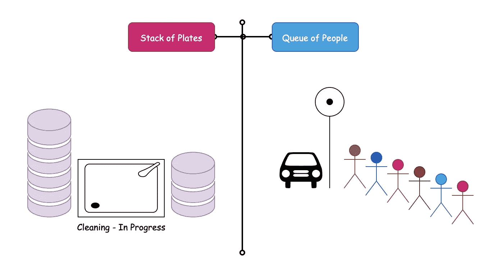
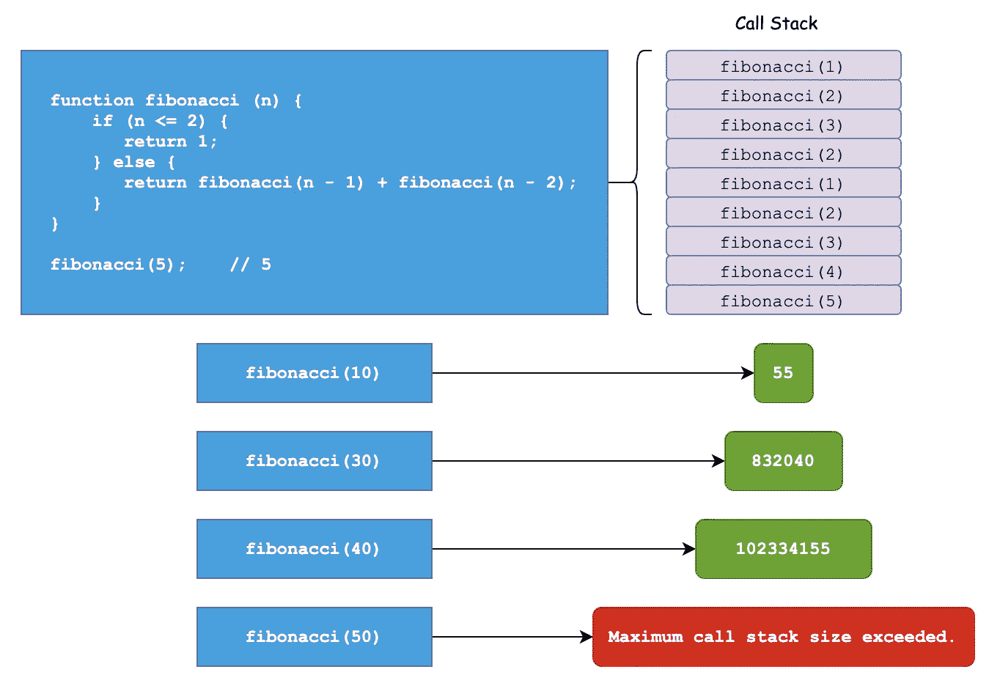
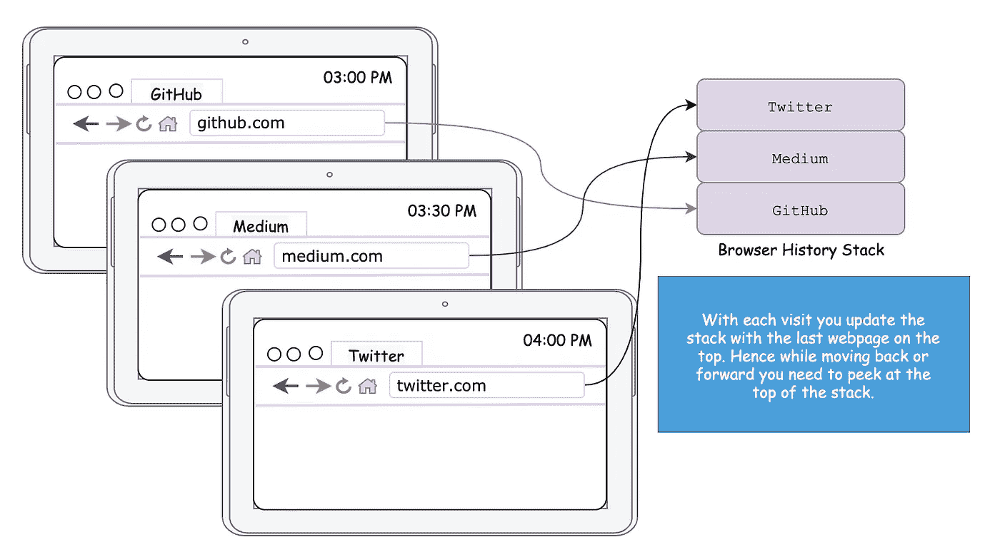
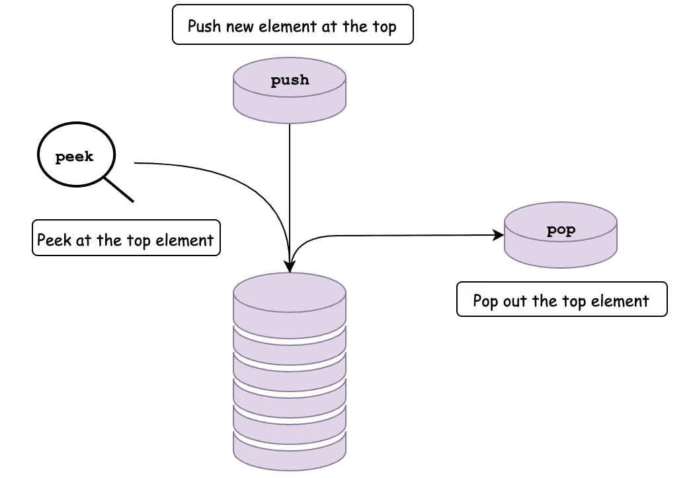
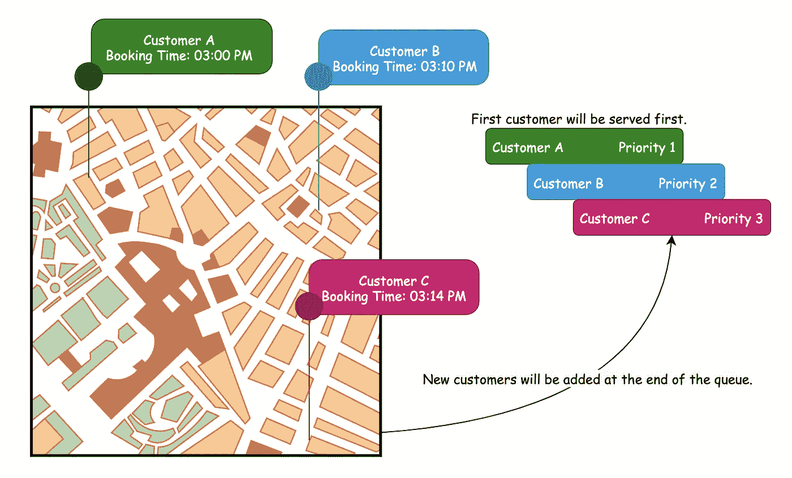
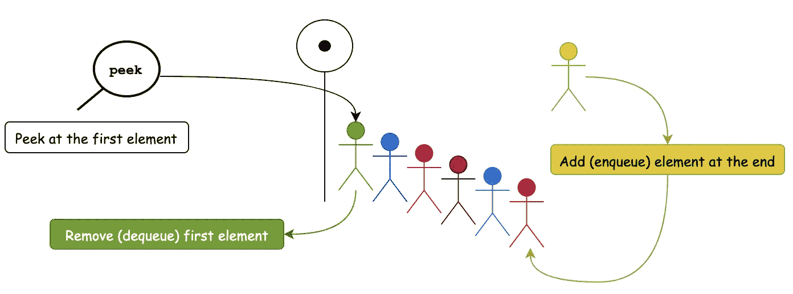

# 带 JS 的 DS—堆栈和队列

> 原文：<https://medium.com/geekculture/ds-with-js-stacks-queues-10ceb9830efb?source=collection_archive---------11----------------------->



Stacks and Queues — DS with JS (Made with [draw.io](https://app.diagrams.net/))

想象你在一个聚会上，排队领食物。你前面的人将要从盘子堆的最底部拿走一个盘子。看到这种情况，你试图阻止他，因为他要推翻所有的盘子！但是你迟到了，盘子已经散落在地板上了。你耐心地等着新盘子叠放回去。一旦盘子放回原处，当你正准备去拿盘子时，一个人从队伍的末尾跳出来，站在你的前面，拿着盘子继续往前走！我们可以肯定一件事——你的日子有点不好过。

栈和队列是最简单的数据结构。它们有一些操作，但是它们的使用是无处不在的——在编程和现实生活中都是如此。在我们知道这些数据结构的用途后，我们将用 JavaScript 实现它们。我们将使用[和其他数据结构](/geekculture/data-structure-with-javascript-2d3791598453)来看看它们的 JavaScript 实现。

# 大量

将堆叠视为垂直堆叠在彼此顶部的板，我们只能访问**顶部的**板。我们无法从底部接近任何东西。从堆栈中访问数据就是获取第一个盘子，然后是第二个盘子，然后是第三个，我们继续下去，直到遍历完所有的盘子。

这叫做**后进先出**——后进先出。我们也可以把它描述为**FILO**——先入后出。

## 堆栈的使用案例

栈在特定于语言的引擎中非常重要。您可能听说过当您编写糟糕的代码时会出现堆栈溢出。



Fibonacci Series with Recursion — Stack Overflow in JavaScript

大多数编程语言都是按照堆栈架构来建模的，当在编程语言中调用函数时，它们通常遵循**后进先出**的模型。函数中的函数中的函数被调用，然后我们开始弹出这些函数，直到我们到达最开始。

我们使用堆栈的另一个有用的方式是作为浏览器历史。



Browser History | Stack of visited pages

我们通过保存一堆访问过的网页来从一个网站到另一个网站来回移动。最后访问的网页将位于堆栈的顶部。当我们点击后退按钮或前进按钮时，我们可以利用堆栈的顶部。

或者你正在写一段文字，你想撤销一些东西，所以你可以点击撤销选项来返回或前进重做。这个想法来自于栈。我们将工作的前一个状态按照最后一个状态先出现的顺序存储在内存中。

## 堆栈中的操作

当我们讨论栈的用例时，我们关注栈的顶部*和*。操作也被限制在栈顶。我们可以*看*，*推*，*弹出*栈顶的一个项目。这些操作中的每一个都将具有*常数*时间复杂度。



Operations in Stack — Peek, Push, and Pop

1.  **弹出**(堆栈顶部的项目)——`O(1)`
2.  **按下**(堆栈顶部的项目)——`O(1)`
3.  **偷看**(查看顶部)——`O(1)`

我们通常不希望使用栈来查找，栈中查找的 Big-O 是`O(N)`，其中`N`是栈的长度。

# 用 JavaScript 实现堆栈

JavaScript 中没有栈。因为我们知道对它们执行的操作，所以我们可以使用其他数据结构来实现它们。

但是我们用什么数据结构呢？考虑到我们有[数组](/geekculture/ds-with-js-arrays-11e9e5e4db6a)和[链表](/geekculture/ds-with-js-linked-lists-1062e386ae26)，你会选择哪一个来实现堆栈？

**你认为栈在这里选择哪种数据结构比较好？**

在栈的情况下，*数组和链表都可以很好地工作。*

一件重要的事情是，数组允许缓存局部性，这使它们在访问内存中的项目时在技术上更快，因为它们彼此紧挨着，而不是分散在内存中的链表。此外，链表有额外的内存与之关联，因为我们必须保存这些指针。

但另一方面，链表有更多的动态内存。我们可以不断地向列表中添加内容，而数组中既有静态数组，也有动态数组，都有一定的内存。一旦它即将达到极限，它将不得不加倍它的内存，并在内存的某个地方为它创造新的空间。

这些是在数组和链表之间进行选择时的权衡。但是它们都将为栈和队列上的操作提供恒定的时间复杂度。让我们看看实际情况。

## 在 JavaScript 中使用链表实现堆栈

我们知道[链表](/geekculture/ds-with-js-linked-lists-1062e386ae26)包含节点——每个节点都有一个值`this.value`和一个对下一个节点`this.next`的引用。我们引用了链表的开头`this.top`和链表的结尾`this.bottom`。

对于每个操作，我们将利用链表操作 push 使用`prepend`, pop 使用索引`0`处的`remove`。

1.  Peek:返回`this.top`指向的`node`的值。
2.  Push:创建新的`node`并将其添加到链表的顶部。
3.  Pop:移除链表中的第一个元素。

Implementing Stack using Linked List In JavaScript — Try it!

## 在 JavaScript 中使用数组实现堆栈

为了使用数组实现堆栈，我们可以利用数组的`push`和`pop`操作。我们将在数组的末尾推进并弹出最后一项，以将数组用作堆栈。

Implementing a Stack using Array in JavaScript — Try it!

# 行列

想象一下在自助餐厅或公共汽车站排队的情形。队列中第一个**的人先走，然后是第二个，依此类推。最后一个人走在最后。**

这叫做**先进先出**——先进先出。我们也可以把它说成是最后一个进来，最后一个出去。

## 队列的用例



First Come First Service | Form a Line!

我们可以使用队列

*   购票等候名单申请
*   为餐馆应用程序预订座位
*   就像优步，我们在那里预订乘车服务
*   打印机—首先打印第一个请求

在所有这些用例中，将首先处理第一个请求。所有新的请求都将排在队列的末尾。

## 队列中的操作

我们可以看到，在这个队列中，我们希望*查看*和*弹出*第一个*项目。但是我们想把这个项目推到队列的末尾。这些操作将具有恒定的时间复杂度。*



Operations in Queue — Peek, Enqueue, and Dequeue

1.  **入队**(推送队列末尾的项目)——`O(1)`
2.  **出列**(弹出队列中的第一项)——`O(1)`
3.  **Peek** (第一项)——`O(1)`

我们通常仍然不在队列中进行查找，队列中查找的 Big-O 将是`O(N)`，其中`N`是队列的长度。

# 用 JavaScript 实现队列

让我们再次考虑我们有[数组](/geekculture/ds-with-js-arrays-11e9e5e4db6a)和[链表](/geekculture/ds-with-js-linked-lists-1062e386ae26)，因为我们没有直接在 JavaScript **中实现的队列，您认为哪种数据结构是队列**的更好选择？

对于队列，我们需要入队和出队的第一项。如果我们使用链表，那么添加和删除第一项的时间复杂度将是`O(1)`。让我们考虑下面的链表`A --> B --> C`。

```
Head                    Tail
 A    ----   B    ----   C
```

如果我们想删除`A`或在开始处添加，我们改变头和下一个节点的指针。

而在数组中，我们将不得不移动数组中剩余的项目，这是`O(N)`操作。

```
0  1  2       Remove A       0  1 
A  B  C   -----------------  B  C
```

因此，在队列的情况下，链表似乎是首选。让我们执行它。

## 在 JavaScript 中使用链表实现队列

对于每个元素，我们创建一个新的`node`并有两个引用`this.first`和`this.last`作为链表的开始和结束的引用。

1.  Peek:返回`this.first`指向的`node`的值。
2.  Enqueue:创建新的`node`，并将其添加到链表的末尾。
3.  出列:删除链表中的第一个元素。

# 为什么和何时—堆栈或队列

与队列中堆栈中的数组不同，这里没有随机访问操作。所有操作都专门处理数据结构顶部/第一项的元素。我们使用数组或链表来构建堆栈和队列，尽管与数组和链表不同，我们可以对它们执行的方法和操作很少。

有时，建立在低级数据结构(如链表和数组)之上的高级数据结构有助于限制我们可以对它们进行的操作。这实际上是计算机科学的一个好处，在数据结构中拥有这种有限的能力是一个优势，因为我们可以控制用户只执行有效的操作。如果我们给一个人世界上所有的工具，他们操作起来会比我们只给他们两三个工具困难得多，这样他们就知道他们到底需要做什么。

因此，下一次寻找堆栈或队列时，请务必查看以下清单。

✅快速存取(*栈顶或队列第一*)

✅快速窥视(*栈顶或队列第一*)

✅命令(*栈顶或队列尾*)

❌慢速查找

# 参考资料和进一步阅读

1.  [使用 JavaScript 的数据结构](/geekculture/data-structure-with-javascript-2d3791598453)
2.  [带 JS 的 DS—数组](/geekculture/ds-with-js-arrays-11e9e5e4db6a)
3.  [带 JS 的 DS—链表](/geekculture/ds-with-js-linked-lists-1062e386ae26)