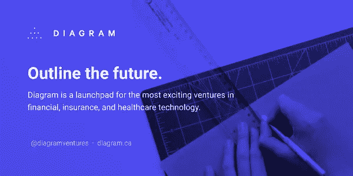

# 韩国金融服务业的转折点到来了吗？一个关于(自我)分裂的故事

> 原文：<https://medium.com/geekculture/dunamu-inc-s-4d86c618450e?source=collection_archive---------16----------------------->

Photo by [Ross Findon](https://unsplash.com/@rossf?utm_source=unsplash&utm_medium=referral&utm_content=creditCopyText) on [Unsplash](https://unsplash.com/s/photos/disruptive-innovation?utm_source=unsplash&utm_medium=referral&utm_content=creditCopyText)

## 由于 Dunamu Inc .参与“友利金融集团”收购，聊天室出现骚动

10 月 20 日，上周三晚上，我的 [KakaoTalk](https://www.kakaocorp.com/page/service/service/KakaoTalk?lang=en) 的几个聊天室突然变得忙碌起来。原因是有消息称，加密货币交易所“Upbit”的运营商 [Dunamu Inc.](https://dunamu.com/views/01_main.html) (Dunamu)参与了韩国存款保险公司(KDIC)对[友利金融集团](https://www.woorifg.com/eng/main/index.do)(友利 FG)股权出售的竞标。

Dunamu 运营着韩国最大的加密货币交易所“Upbit”和股票应用程序“Securities Plus”，其座右铭是“将金融和技术结合起来，为任何人创造一个更容易、更有效地投资的金融环境”。随着今年加密货币交易数量的激增，Upbit 超过了领先公司 Bithumb，巩固了其在韩国压倒性的第一名的地位。得益于这样的增长，Dunamu 的财务表现令人惊叹，今年上半年，Dunamu 的营业利润超过了 Naver 和 Kakao 的营业利润之和。许多专家预测，未来杜纳姆将在美国股市上市。

尽管增长如此迅猛，但对我和我的业内朋友来说，一家专注于加密货币领域服务的初创公司加入到收购国内五大金融控股公司之一友利 FG 的战斗中来，仍然是一个新的冲击。

当然，这些类型的事件不是偶然突然发生的。

Big Fish vs. Small Fish

首先，被大公司视为“游戏”的初创公司扮演“猎人”的角色已经变得很自然。独角兽创业公司正在实施战略 M&A，通过收购其他创业公司或大公司的子公司或事业部，以通过大规模投资获得的强大财务实力为基础，成长为 Exitcon 和 Decacon。看看最近的国内案例，Viva Republica 收购移动服务' [Tada](https://tadatada.com/) '，Viva Republica 是第三家互联网专用银行的持牌人，也是' [Toss](https://toss.im/en) '的运营商， [Yanolja](https://www.yanolja.com/) 收购电子商务和预订平台' Interpark ",以及韩国第一家 prop-tech 初创公司 [Zigbang](https://zigbang.com/) 收购传统 IT 服务提供商三星 SDS 的家庭物联网部门。

从 Dunamu 的角度来看，有必要通过战略投资、M&A 和业务扩张来增加企业价值，而不是留下预计今年上半年将积累近 2 万亿韩元的现金等价物。由于 Woori FG 长期以来一直在推动寡头垄断股东私有化的过程中积极寻求向工业和外国资本打开 M&A 的大门，这笔交易可以成为两个实体之间战略合作伙伴关系的里程碑，以促进 Dunamu 的投资组合增长。当然，在短期内，Dunamu 为其加密货币交易所客户获得稳定的银行账户供应来源是一种明确的手段。

自 2019 年重新启动以来，友利金融集团一直在积极收购包括安邦保险中国杨桐资产管理公司在内的许多公司。因此，它不仅可以帮助完成友利 FG 的有意义的私有化，而且杜纳姆可以成为一个很好的合作伙伴，以试验新的密码为基础的行业，如 DeFi 和 NFT。

## 缓慢但渐进的放松管制，以及全面的创新扩散

Regulating the Internet
By Nate Beeler, The Columbus Dispatch

传统上，人们认为金融行业是支撑实体经济的“基础设施”。所以，出于系统稳定和消费者保护等原因，也确实出现了全方向的规定，之后也出现了一些影子规定。然而，随着创新的' [TechFin](https://www.finextra.com/blogposting/14499/fintech-vs-techfin) '创业公司以及 Naver 和 Kakao 等大型科技公司的相继出现，监管机构也在促进金融行业的竞争和创新，以提高金融服务的水平，并最终提高消费者的便利性。在这一理念下，互联网银行授权、金融监管沙盒和‘我的数据’业务牌照等重大监管措施相继出台。

[Kakao Bank](https://www.kakaobank.com/) 和 [K-Bank](https://www.kbanknow.com/) ，这两家在 Toss Bank 之前获得许可的韩国纯互联网银行，自成立以来的四年中，已经将资产增加到 40 万亿韩元。未来，纯互联网银行将通过基于其多个“平台”公司获得大规模资金，寻求积极的并购和业务扩张。

两年前开始的金融监管沙盒为 100 多家基于区块链、大数据和人工智能等技术提供创新服务的初创公司创造了机会，风险资本家向这些初创公司投资了约 6000 亿韩元。

截至去年 9 月，约有 70 家公司获得了“我的数据”业务的最终批准。“我的数据”业务旨在让作为数据所有者的“个人”控制自己的信息，这将为超个性化服务打开大门。凭借对客户及其数据、最先进的技术能力的高度关注，大 techs 和 TechFin 公司将显示出超越传统金融服务提供商的强大竞争优势，从而进一步投资于创新。

当然，大型金融机构已经在数字化转型和采用人工智能技术等新技术方面投入了大量资源。

[新韩金融集团](http://www.shinhangroup.com/en/index.jsp)(新韩金融集团)被认为是金融领域数字化转型努力中最积极的一家，它成立了一个 TODP(完全开放数字平台)推广团队，以寻找涵盖金融和非金融领域的内容，并在今年早些时候通过在 20 个业务集团内创建“数字创新实验室”来加速其数字化转型。新韩 FG 的领导层也渴望利用区块链和人工智能等新技术进行创新，因此新韩 FG 参与了各种活动，如建立一个总部位于区块链的政策贷款平台，或建立[新韩 AI](https://www.shinhanai.com/?language=eng) ，一家基于人工智能的投资咨询公司。此外，去年 4 月成立了总价值 3000 亿韩元的“One Shinhan Connect 新技术投资协会基金#1 ”,用于投资有前途的初创公司和有前景的独角兽公司，以加强集团的数字能力。

[KB 金融集团](https://www.kbfg.com/Eng/index.jsp) (KB FG)在 2018 年举行了“KB 数字化转型宣言仪式”，提出了到 2025 年向数字化相关项目投资 2 万亿韩元，培养 4000 名数字化人才的目标。特别是，KB FG 最大的子公司 [KB Kookmin Bank](https://omoney.kbstar.com/quics?page=oeng&QSL=F#loading) 在去年年底对其组织结构进行了重组，从“功能性”孤岛转变为以客户为中心的“平台”。此外，一个独立的“技术小组”已经成立，以监督如云和人工智能等新技术的采用。“科技集团”的成立被视为一种强烈的意愿，旨在通过在新平台上运行的银行系统新技术方面的积极实验，与大型科技公司和科技公司竞争。KB Kookmin Bank 对人工智能的采用是由“技术组”下的“人工智能中心”推动的——人工智能中心已经取得了一定的成就，包括“KB-ALBERT”的开发，这是一种基于 BERT 的语言模型，用于金融专用的韩语模型。

## “持续创新”——诱惑在位者的陷阱

Prof. Clayton Christensen (1952~2020) by John Lamparski/Getty Images

问题在于，传统大型金融机构所追求的变革在速度和深度上都不够，更重要的是，它们通常朝着“持续创新”的方向设定，而不是“颠覆性创新”的方向。

去年 1 月去世的克莱顿·克里斯滕森教授将创新分为‘持续创新’和‘颠覆性创新’。持续创新是一系列活动，旨在提高现有产品的性能，使其符合主要市场主流客户的期望。另一方面，破坏性创新的过程瞄准了现有企业经常忽视的客户群，并执行策略，通过以低价提供方便和适当的功能来确保在该客户群中的立足点。这个新进入者后来扩展到主流客户，同时保持其优势，当大多数主流客户开始大规模使用新进入者的产品或服务时，就会发生“颠覆”。

Image by Viva Republica/Toss

“折腾”可能是“颠覆性创新”的最好例子之一。在策划 Toss 最早的服务‘简单汇款服务’的过程中，从数不清的几个月前往韩国各个地区观察人们使用金融服务的痛点和需求中，诞生了 100 多个想法。这个项目被称为“幽灵协议”，“简单汇款服务”是 100 个想法中的第 6 个。

由于与 Active X 和认证证书系统相关的法规，这项简单的汇款服务在推出后的一年内也没有问世。但由于“韩流”使得外国人对简单支付的需求激增，随之而来的是对认证证书系统的放松管制，Toss 开始增长。

从那时起，Toss 团队投入了全部精力来扩大这个小小的机会窗口，并进入了各种金融服务领域，同时继续专注于为客户提供“便利”。最后，Toss 于 2021 年 6 月获得了第三张互联网银行牌照，并于 10 月推出了银行服务。

Image from Toronto Star

另一方面，拥有庞大客户群和组织的大型现有企业很难自由分配所需的资本和人力，以在拥有新消费者的小型初创市场建立强大的地位。

为新消费者创造新事物的尝试通常会转化为为现有消费者提供产品和服务，并帮助运营这些产品和服务的组织。这个过程与多个利益相关者交织在一起，他们有着不同的、相互冲突的利益。错过正确的决策时机是每天都会发生的事情。

最终，对“持续技术”的投资被认为是对“颠覆性创新”投资的替代——因为它不会伤害每个人的思想和利益。我希望你不要误解我的意图。我从来没有说主流企业组织充满了拒绝创新的人，或者他们没有为创新投入足够的资源和能力。相反，对现有忠诚客户、现有盈利业务和服务以及现有投资者的热情和奉献，矛盾地成为真正颠覆性创新的枷锁。

毕竟，在大型现有企业的背景下，实现“颠覆性创新”的唯一途径是建立一个独立的实体，拥有适当的成本结构和资源，不受现有企业的影响，并以快速和重复的方式为独立实体提供面向消费者的极端实验环境。

## 大型在位企业颠覆性创新案例:加拿大电力公司+图图风险投资公司

Diagram Ventures (Image from T-Net)

我想介绍一下 [Diagram Ventures](https://diagram.ca/) 作为一个来自大型现有组织的成功自我颠覆平台的例子。(注:以下信息基于我的初步研究)

Diagram Ventures 是由加拿大第七大金融集团[加拿大电力公司](https://www.powercorporation.com/en/)设立的“风险发射台”或“混合风险基金”。加拿大电力公司是一家控股公司，从事各种金融服务业务，如人寿保险、养老金和资产管理。具有代表性的子公司是加拿大第二大寿险公司加拿大人寿。

2016 年，加拿大电力公司(Power Corporation of Canada)与该集团的投资子公司 Sagard Holdings 成立了一家风险投资公司，作为 LP。给予这家风险投资公司 Diagram Ventures 的任务是“创建将扰乱加拿大电力公司主要业务——保险、金融服务和医疗保健——的初创公司”。

Diagram Ventures 的运营模式在典型的风险投资中是看不到的。它不像传统的风险投资那样，等待外部有创业想法的人来接近，而是通过合作伙伴和 Diagram Ventures 的生态系统网络来创造创新想法。我们付出了巨大的努力，通过一个定期收集、审查和过滤破坏性想法的过程。对于通过这一过程选出的创意，会动员一个小型内部团队和资源来构建创意原型(有时会达到种子轮的水平)，进行外部验证，然后合作伙伴寻找符合创业创意的“创始人”。尽管创始人将这种创业想法和原型视为己有，但 Diagram Ventures 会为他/她提供尽可能多的资源——基础设施、知识和经验、网络——来支持他/她的成功启动和发展。然后是全面的融资和扩张过程。Diagram Ventures 不仅在其本土市场加拿大实施所有这些流程，还在整个北美实施这些流程，因此可以在更广泛的市场中寻找和测试这些中断。

Diagram Ventures 是一种模式，它在现有业务的边界之外为“颠覆性创新”创造种子，消除初创公司的启动和增长风险，并采取各种退出策略，包括 IPO 和现任 M&A。

在过去的五年中，Diagram Ventures 已经创建了 14 个投资组合公司，其中两个已经退出，一个已经上市，为增加其母公司加拿大电力公司的价值做出了贡献。

## 是整个韩国产业再次“自我瓦解”的时候了

Image by Ed Jones/AFP via Getty Images

回想起来，韩国上世纪七八十年代是挑战全球市场的“颠覆性创新”时期。但目前，大多数韩国企业集团和大公司都陷入了“持续创新”的陷阱，仍然在向效率迈进。

然而，韩国快速增长的创业生态系统以及制造业和金融业等主要行业拥有丰富的优秀人力资源和巨大的金融资源。我希望韩国经济以“自我颠覆”激发新的活力，并将创新精神传播到全世界。现在还不算太晚。