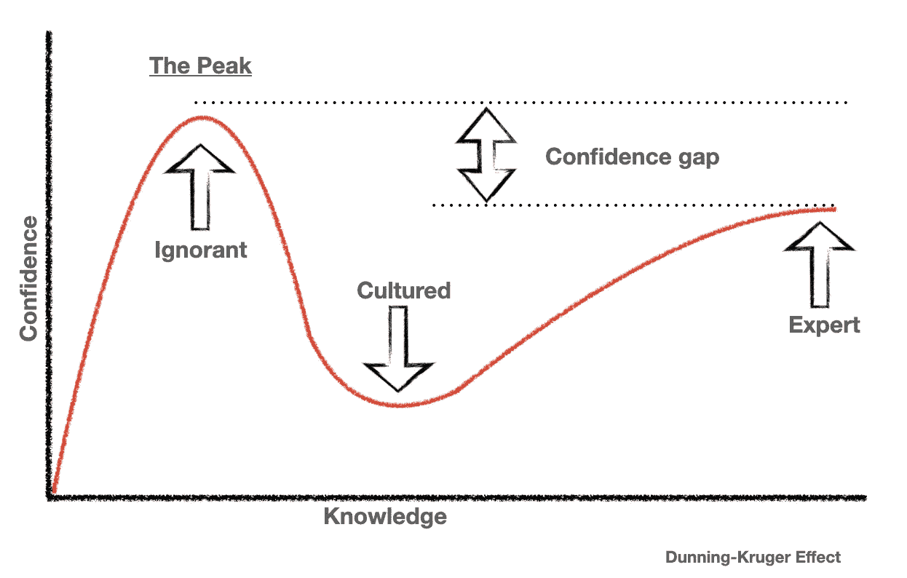

# 邓宁-克鲁格效应与软件工程师之旅

> 原文：<https://medium.com/geekculture/dunning-kruger-effect-and-journey-of-a-software-engineer-a35f2ff18f1a?source=collection_archive---------3----------------------->

让我们从一个简单的定义开始

**邓宁-克鲁格** **效应**是一种现象，知识贫乏的**人往往高估自己的能力，正是因为他们忽略了掌握这些知识需要多少知识**。

现在让我们想象一下…

这和软件工程有什么关系？嗯，在软件工程中，你可以大致区分出三种人，他们有超强的学习能力并且学得很快；那些对所有事情都有答案并认为他们知道所有事情的人和那些实际上知道很多但总是有条件地用一个" **if** "和一个" **maybe** "来回答的人。这些只是我们都会经历的不同阶段。让我们看看它是如何真正发挥出来的。

**编码(动词)/编码(名词)**

当我们兴奋地学习编码时，我们通常都从这里和这里开始。我们想要解决一个令人着迷的问题，会读一些烹饪书，看一些视频(看 Youtube)，浏览网页寻找片段(stack overflow/github/任何人分享的东西)并拼凑一些东西来解决问题。解决一个问题(在几个小时或几天内)会给我们带来一种巨大的紧迫感和满足感，让我们一次又一次地做更多的事情。

这是学习编写软件的第一步，通常由 REPL 帮助完成(读取-评估-打印循环)。

*行为特征*

*   能够快速构建概念证明
*   能够处理不清楚的需求，因为他们乐于重复多次
*   热衷于解决不同的问题，而不是改进同一问题的解决方案
*   非常自信他们能快速解决任何问题

**发展中(动词)/开发者(名词)**

我们很快就达到了这样一个阶段，当我们知道我们可以一起编码和破解东西来使它工作。我们偶尔会遇到一些人和机会，这些人和机会教会我们如何用更结构化的方式(有时是企业方式)编写软件。我们听说过编码标准，这是我们以前从未注意过的。现在我们被告知这是必要的，因为有更有经验的人这样告诉我们。这是我们开始软件开发之旅的时候。我们基于一些黄金标准、一些行业最佳实践和一些组织偏见来开发它。给我们的软件工程福音书是有限的，尤其是我们的直接技术领导参考的福音书，因此我们试图阅读它们，并开始向与我们一起工作的编码员(初级)引用它们。

*行为特征*

*   当被要求建立一个概念验证时，由于他们的偏见，他们会比黑客花费更长的时间
*   会倾向于过度设计解决方案或设计不足的解决方案
*   如果需求不是很明确的话，会很麻烦
*   会热衷于反复研究同一个问题空间，以提高他们的系统知识

**工程(动词)/工程师(名词)**

当我们为不同的问题开发解决方案，并在行动中看到解决方案时，我们也开始看到我们使用的方法中的缺陷。我们开始看到所谓的最佳实践并不完全是最好的。我们困惑，我们交谈，我们阅读，我们阅读更多。这时，我们开始发现所谓的最佳实践是在一个“**有界环境**中创建的，它们对我们不起作用的原因是因为我们的问题不太一样。现在，我们以敏锐的眼光看待行业的变化。我们听到人们在争论的不同方面。这就是我们开始怀疑我们所学的所有知识的时候，我们开始问“**为什么**”。我们开始探索一切我们认为我们知道的东西来重新调整我们的理解。我们尝试新想法。我们创建实践(不是最佳实践),并测量这些实践的影响，以了解它们的有效性。这时，我们意识到工程不仅仅是开发解决方案，而是" T6 "用更少的资源建造更多的东西" T7 "，而且工程是对系统有" T8 "的机械同情" T9 "。

*行为特征*

*   当确信问题值得解决时，能够像编码人员/黑客一样快速构建概念验证
*   将会寻找复杂的问题来测试他们的知识和技能
*   当面对新的需求时，他们会希望从不同的角度分析它，以评估解决它的不同方法，甚至调整需求

**邓宁-克鲁格峰**

> 注意:如果你觉得这个高峰不存在，也许你现在就在上面，最好和你的同事和导师确认一下

为什么我们把邓宁-克鲁格无知的顶峰称为“**顶峰**”？嗯，因为在学习的过程中只有一个高峰，并不是什么值得骄傲的事情。另一方面，我们可以期望它尽可能低，并确保它有一个陡峭的下降。

我发现一个非常高的峰值(有些人甚至称之为**平台**)的情况是技术人员在同一个环境停留太久。一个环境可以是相同的组织、相同的产品或相同的行业。对此没有一个解释，但是理解为什么会发生是很重要的。让我们以“同一个组织”为例来探讨这个问题。为了让组织处于学习状态(请不要把它理解为成功)，有时创新和颠覆性思维并不被提倡，因为随之而来的是高昂的成本。如果企业不愿意在创新上投资，人们就没有一个天然的平台去探索和学习。这意味着人们可以选择使用他们的个人时间或者坚持被告知的事情。你可以想象后者会导致什么。类似的学习限制也适用于人们转移项目时，但在相同的产品空间或甚至行业内，尽管这种限制的可能性低于停留在单一的不那么多样化的组织中。

当作为一名技术专家寻找机会时，总是问自己，你会学到什么，企业需要创新吗，组织中有工程师吗，或者它是由站在顶峰的人管理的？

**结局**

在不同的行业和不同的技术团队中工作过之后，我发现这些阶段非常一致(当然也适用于我)。当有人在博客中分享邓宁-克鲁格图表时，我有了“**啊哈**”。它帮助我更加意识到自己的偏见，并超越它们。在我看来，一个人避免高峰的方法是养成问自己为什么的习惯。

最后(为了好玩)…如果有人说他们正处于“**职业生涯的巅峰** **”那么，他们真的可能正处于巅峰。**