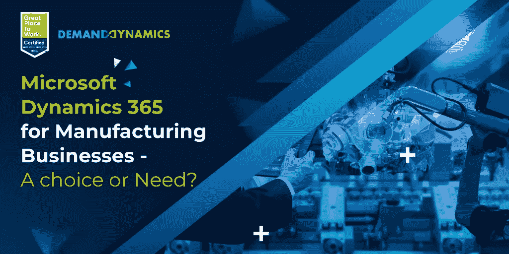

# 面向制造企业的 Microsoft Dynamics 365 选择还是需要？

> 原文：<https://medium.com/geekculture/dymicrosoft-dynamics-365-for-manufacturing-businesses-a-choice-or-need-e8fdf00dca46?source=collection_archive---------15----------------------->

制造业和其他行业一样，同样容易受到数字化转型的影响。行业环境中的竞争以及处理复杂操作(如运输、库存管理和成本控制)的挑战变得越来越具有挑战性，给制造商在贸易领域的竞争带来了巨大压力。

人工智能、预测智能、大数据分析和机器学习等新技术进步已被引入市场，以帮助企业取得更好的结果。这些技术的成果有助于组织对市场、客户群和运营效率的全面了解。然而，制造商拥有强大的 ERP 系统以利用新技术及其衍生产品是很重要的。

# **面向金融和供应链管理的 Microsoft Dynamics 365**

[微软动态 365 ERP](https://demanddynamics.com/microsoft-dynamics-365-erp-implementation-guide/) 一直是市场的最爱，因为它能够将业务运营端到端地连接到一个统一的平台。借助各种工具和基于云的综合应用套件，Dynamics 365 提供了组织和流程透明度的整体视图。它打破了组织中的孤岛，帮助制造商获得更好的运营可见性，并与客户良好互动。

凭借云存储和物联网传感器等功能，不同的系统以及耗时且重复的手动流程现已成为过去。凭借增强的分析、嵌入式智能和现代报告，D365 财务和运营可帮助制造商满足客户需求、提高服务效率和产品质量，并优化库存要求。

## **根据您的需求量身定制的数字化转型**

Dynamics 365 财务和运营-现在分为 D365 财务和 D365 供应链管理-是可以根据您的特定业务需求定制的解决方案。这一点很重要，因为在供应链行业中，ERP 永远不会是“一刀切”的，因为不同公司的业务目标差异很大。此外，Dynamics 365 是一个基于人工智能的云平台，可以与微软生态系统中的其他应用程序无缝集成，以提高效率，如 Power BI 和 Power Apps 以及第三方应用程序。

 [## Dynamics 365 for Manufacturing 如何改变您的业务需求

### 当今的数字世界正变得越来越复杂。新机器，更多的劳动力，复杂的供应…

demanddynamics.com](https://demanddynamics.com/how-dynamics-365-for-manufacturing-can-transform-your-business/) 

# **微软动态 365 如何惠及厂商？**

## **优化供应链运营**

供应链流程包括从库存控制、批次跟踪和生产计划到个性化服务交付和报告。制造商经常面临管理与销售、供应商、订单履行、产品性能和客户服务相关的复杂数据的难题。Dynamics 365 提供了一个统一的平台，帮助制造商随时随地查看、跟踪和访问实时信息。人工智能和机器学习结合了商业和供应链数据。他们还可以引入天气预报，帮助企业快速适应变化，抢先应对相关挑战，规划预算，并创建准确的时间表。

## **清晰可见**

Dynamics 365 将销售流程与物流、生产和仓库管理相结合，实现了 360 度供应链可视性。它加强了与供应商的合作，并有效地管理库存。在不同地点拥有分支机构和站点的公司可以利用以下优势:

●收集关于物流、生产和仓库管理的数据，并使用预测分析预测问题。

●自动化采购到支付流程，降低采购成本，实现物流现代化，并获得端到端运营的可见性。

## **增强的客户体验**

客户需求不断变化，竞争压力越来越大。为了蓬勃发展，公司必须通过一流的服务标准、强大的客户纽带和主动的服务补救来满足并超越期望。拥有一个用于所有业务和客户相关数据的单一系统，客户服务代理可以快速响应有关订单状态和交付的查询，并建立客户忠诚度和信任度。例如，[Dynamics 365 for manufacturing](https://demanddynamics.com/microsoft-dynamics-marketing-implementation-partners/)提供预测分析和智能报告，可以根据客户以前的购买和活动定制和个性化客户服务。

## **系统资产管理**

[**Dynamics 365 帮助制造商**](https://www.erpsoftwareblog.com/2022/08/how-dynamics-365-is-transforming-the-manufacturing-industry/) 实时跟踪和管理他们的资产。他们可以远程监控性能、使用情况和机器生命周期信息，并在供应链的每个阶段建立相互关联的工作流程。此外，库存控制应用程序可提供准确的设备计数，发现损坏的组件，并实现更好的生产计划和库存控制。

## **改进创新**

创新有助于缩短生产流程，增加正常运行时间。Dynamics 365 提供了有助于降低成本和加快销售的商业见解。制造商可以实时分析产品、客户和性能数据，并改进他们的问题解决策略。凭借直观的数据，他们可以分析成本并简化流程，从而加强整个组织的协作。

## **提高员工生产力**

Dynamics 365 提供工具来提高智能机器学习、协作和分析能力，以帮助员工提供个性化的客户体验。此外，D365 将内部报告、库存监控、质量控制和设备维护等流程数字化，以获得更好的结果和更高的利润。

●借助经过良好分析的数据和相互关联的流程，员工可以获得充足的信息并高效协作。

●自动化流程节省时间，消除冗余操作，减少人工劳动，加速生产。

●员工将全面了解客户资产和工作订单历史，与客户建立更深的联系，更好地满足他们的需求。

●员工可以适应现代制造解决方案，轻松监控问题，并使用虚拟工具远程解决问题。

 [## Microsoft Dynamics 365 -您需要知道的一切

### 您是否正在寻找新的销售线索，管理客户数据库以吸引潜在客户，并支持…

demanddynamics.com](https://demanddynamics.com/microsoft-dynamics-365/) 

## **结论:**

对于敏捷和数据驱动的未来，利用 Dynamics 365 的功能来彻底检查其系统的制造企业将保持领先地位。最佳实施伙伴有助于产生最佳结果。DemandDynamics 是微软金牌合作伙伴，在 Dynamics 365 方面有着深厚的 [**经验。该团队由训练有素的专家组成，他们设计一流的定制 ERP 解决方案。DemandDynamics 以按使用付费的方式提供按需服务而闻名；您只需为您使用的服务付费。**](https://demanddynamics.com/dynamics-365-implementation-partners/)