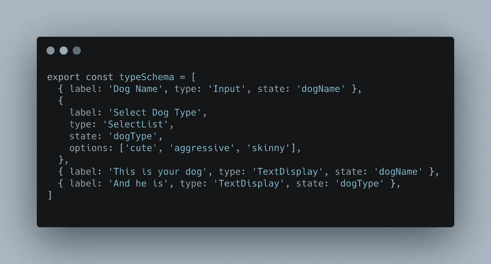
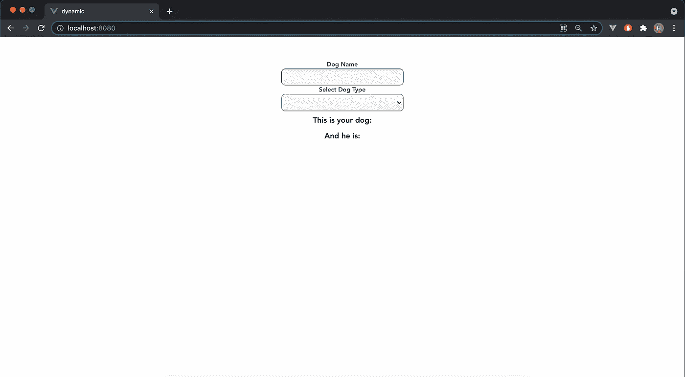
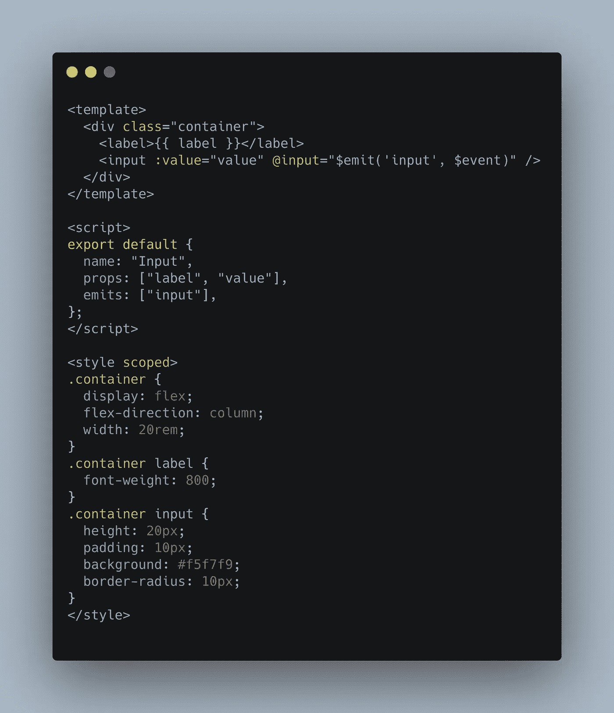
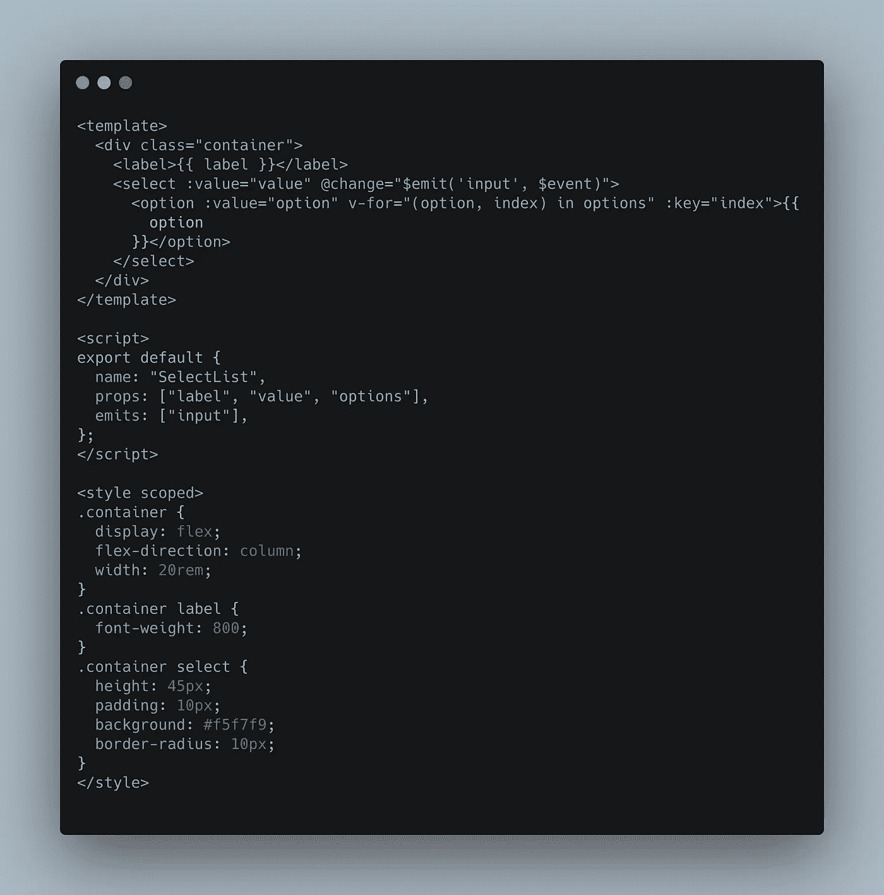
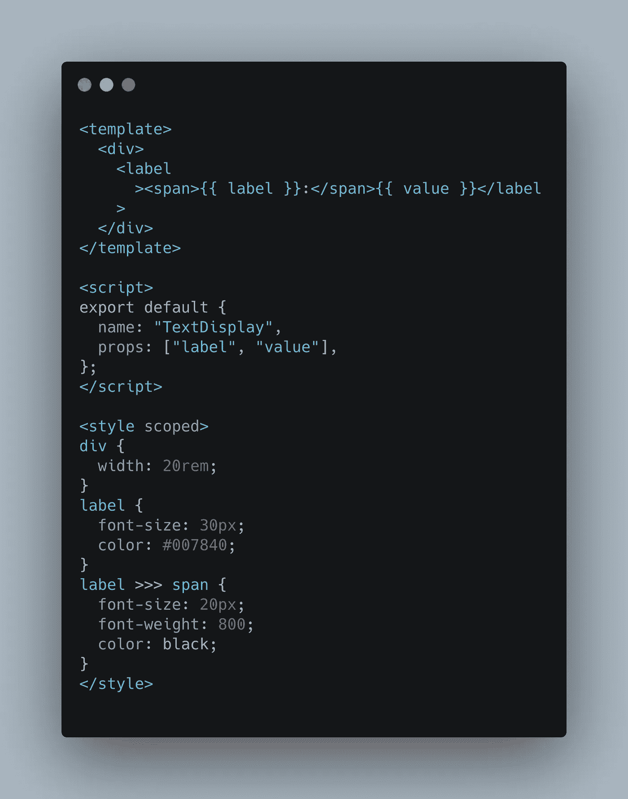
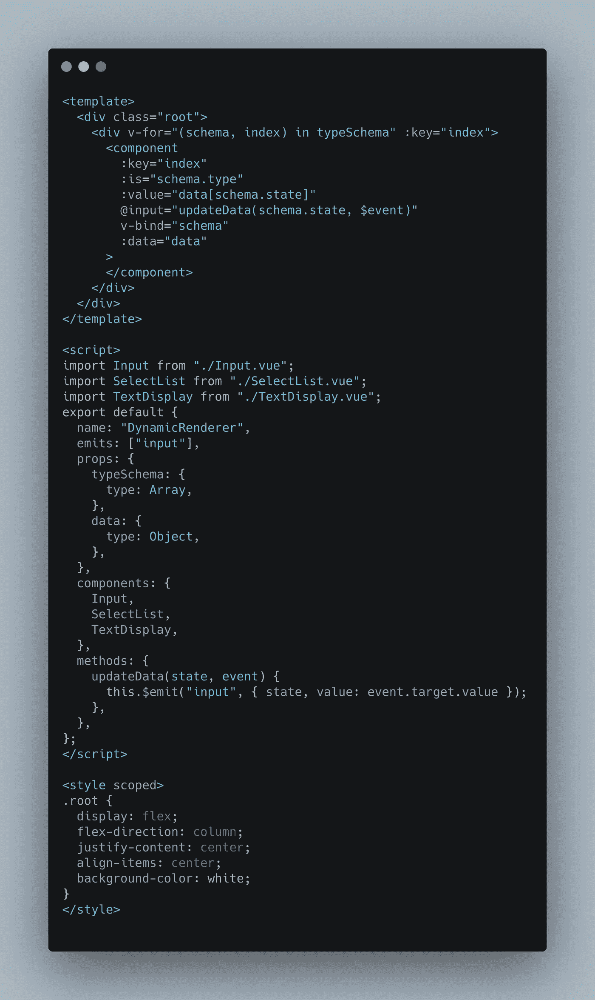
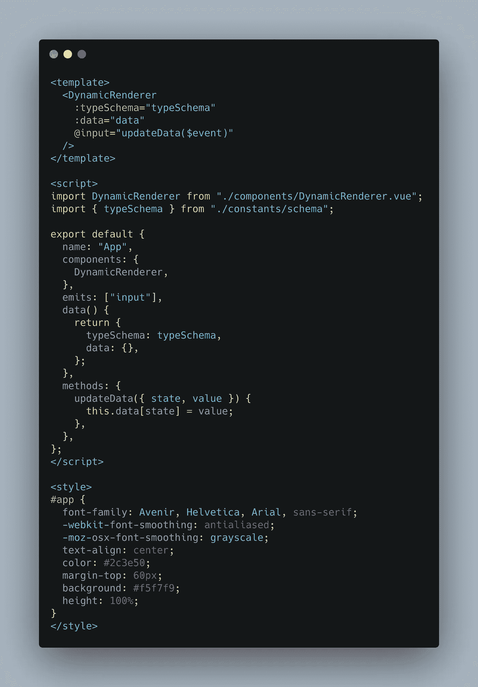
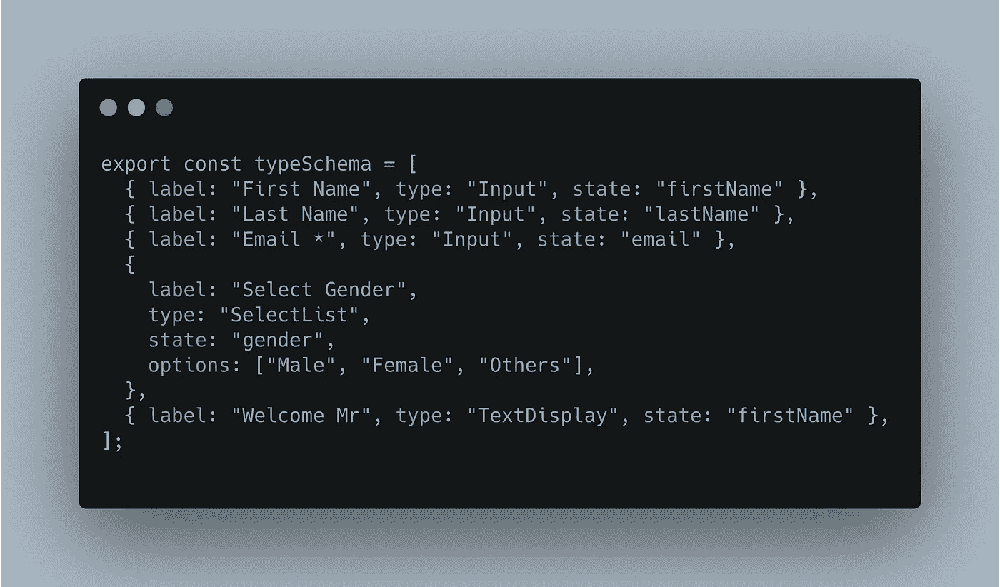
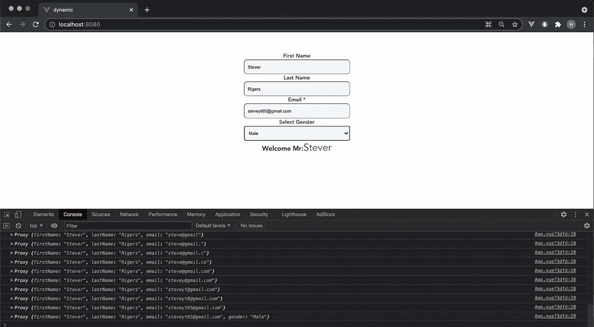

# Vue 3 中的动态组件。

> 原文：<https://medium.com/geekculture/dynamic-components-in-vue-3-7504d5ffcb6c?source=collection_archive---------3----------------------->

## 从 JSON 创建动态组件。


Vue 无疑是最受喜爱的前端 javascript 框架之一。我们将在 Vue 中创建一个动态可重用组件，它完全由一个 JSON 对象呈现。JSON 对象可以保存在前端，也可以通过 rest api 从后端接收。



上面的代码是一个 JSON 对象的例子。我们一会儿将揭开这个结构的神秘面纱，但在此之前，让我们看看下图，这是这个 JSON 的渲染 html。



Final Rendered HTML

JSON 的每一个属性都在下面解释。我们可以向对象添加更多的属性，并在代码中进行必要的更改，以创建更多的动态组件。这里我只创建了几个，用于演示目的。

```
1.label   - Label that is displayed ,
2.type    - Type of component rendered like input, select..
3.state   - which data property is created for this component to store the data.
4.options - This is the options array for select component specific to <select />
```

现在让我们直接进入代码。👨‍💻

我们正在创建三个不同的组件输入、选择和文本显示

1.  输入. vue



Input.vue component

在这个组件中，标签和值作为 props 被传递，而`'@input'`我们发出`$event`，这意味着当你在输入框中输入一些东西时，数据将作为一个事件被传递给父组件

2.SelectList.vue



SelectList.vue component

选择组件的主要区别是我们多了一个道具`options`来显示不同的选项，而不是`'@input'`，我们使用了`'@change'`。

3.TextDisplay.vue



TextDisplay.vue component

该组件仅用于显示数据，因此不会发出`$event`信号，因为我们没有改变任何状态。

现在我们将创建一个 DynamicRenderer 组件，它将从 JSON 中的值`type`中选择所需的组件。现在你会注意到`type`中的值是组件名。



DynamicRenderer component

在这个 DynamicRenderer 中，Vue 提供的主要灵活性是`<component></component>`，它是一个动态组件，可以接受任何组件并动态呈现它们(我们也可以用 **v-if** 有条件地呈现)。您可以看到`:is="schema.type"`，其中`schme.type`是来自 JSON 的组件类型。如果一个`input`事件被触发，那么我们将发出一个带有`state`(它是`data`属性的键)和`event.target.value`(它是从子组件发出的值事件)的`input`事件。

最后，我们可以使用这个`<DynamicRenderer/>`组件来呈现动态表单。

我们已经在 App.vue 中使用过了，如下图。



App.vue -> DynamicRenderer is used

在这里，您可以看到组件`<DynamicRenderer/>`获取了`typeSchema`和一个`data`属性，而`'@input'`将调用一个方法 updateData，该方法将使用键`state`和值`value`来更新`data`属性。如果您使用 Vue 2，则将`this.data[state] = value`更改为`this.$set(this.data,state,value)`。

现在让我通过改变模式向您展示这个组件的强大功能。



Changed json

下面是渲染后的 HTML，其中的`data`属性得到了巩固。



Rendered HTM with data in the console

> 这里是本文解释的所有代码的 github 存储库。

[](https://github.com/hariwin7/dynamic-vue-components) [## Hari win 7/动态 vue 组件

### 在 GitHub 上创建一个帐户，为 hariwin7/dynamic-vue 组件开发做出贡献。

github.com](https://github.com/hariwin7/dynamic-vue-components) 

如果你喜欢这些内容，请在这里@medium 和 linkdin 关注我

[](https://www.linkedin.com/in/hariprasad-k-b-58878512b/) [## Hariprasad K.B -全栈开发者- TranZact | LinkedIn

### 查看 Hariprasad K.B 在全球最大的职业社区 LinkedIn 上的个人资料。Hariprasad 有 3 份工作列在…

www.linkedin.com](https://www.linkedin.com/in/hariprasad-k-b-58878512b/) 

你可以订阅我的电子邮件列表