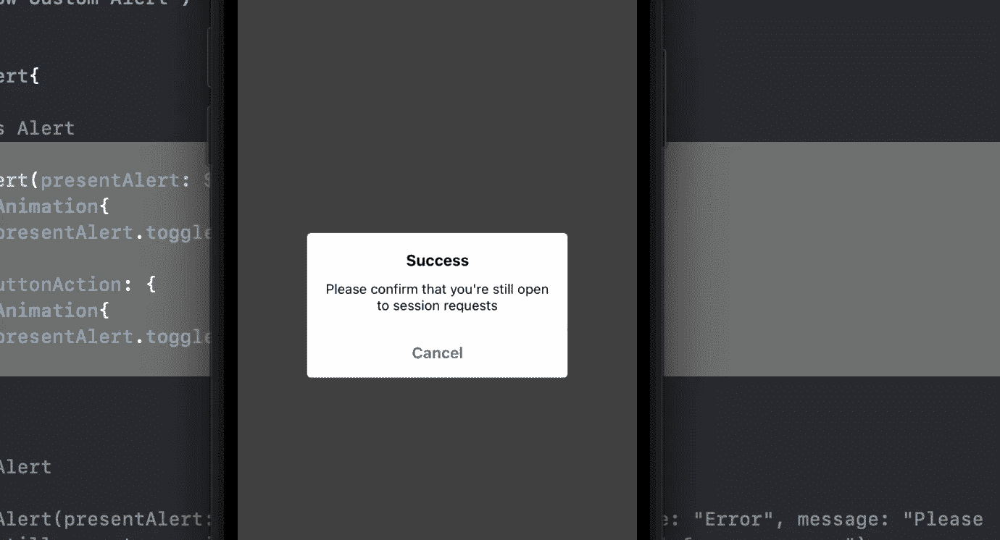
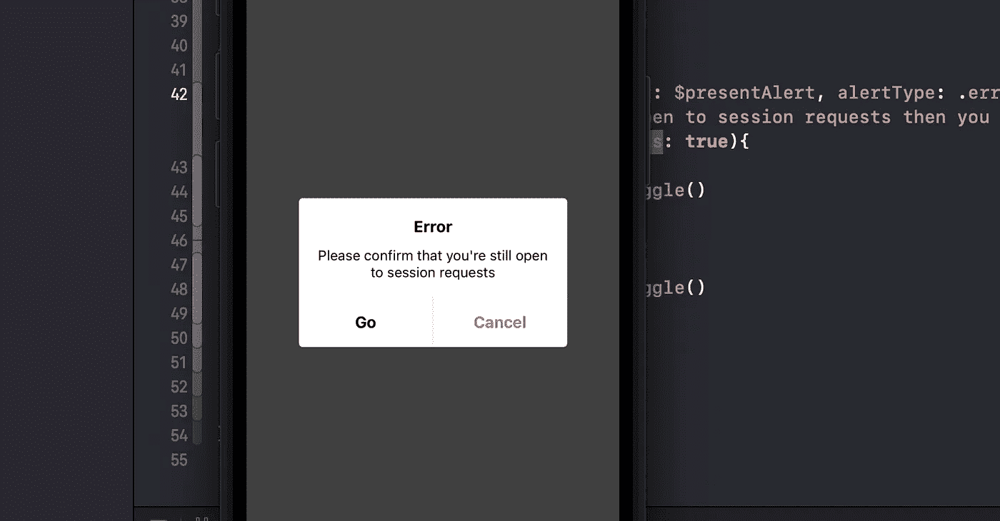
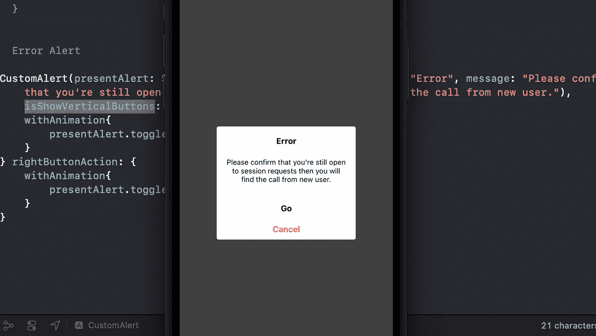
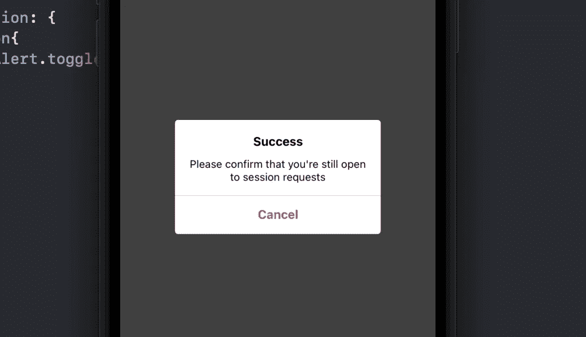

# SwiftUI 中的动态自定义警报

> 原文：<https://medium.com/geekculture/dynamic-custom-alert-in-swiftui-4154a0d4204d?source=collection_archive---------1----------------------->

在这篇博客中，你将学习如何在 SwiftUI 中创建**动态定制提醒**。在 **XCode** 中创建新的 SwiftUI 项目，并跟随我。别担心，你可以从那个博客的底部得到**源代码**的链接。

# 警报类型

创建名为 **AlertType** 的**枚举**。在这个**枚举**中，我们将创建自定义警报的类型。我们只是创造了两种类型。

1.  **成功**:显示成功告警的情况
2.  **错误**:显示错误警告的情况。它需要两个参数**标题**和**消息**。我们将传递这些参数，然后 alert 会将它们显示在警报视图中。

## 标题

之后在**枚举**中创建一个函数 **title()** ，该函数将在**字符串**中返回 alert **title** 。在那个函数内部，我们使用了 **self** 并处理了其中的所有情况。每个案例都可以有自己的**标题**。

## 消息

之后，在**枚举中创建一个函数 **message()** ，**将在**字符串**中返回警告**消息**。在那个函数内部，我们使用了 **self** 并处理了其中的所有情况。每个案例也可以有自己的**消息**。

像这样创建函数 **leftActionText** 和 **rightActionText** 。这些也将返回**字符串**中的按钮文本。

## 高度

在这之后，最后一个功能是获取警报视图的**高度**。 **height** 函数获取 **isShowVerticalButtons** 参数，当我们需要显示垂直警告按钮时，我们将增加警告的高度。

下面你可以看到**alert type**enum 代码。

# 自定义警报

之后，创建 **CustomAlert** 视图。 **CustomAlert** 视图正在获取一些参数。

**presentAlert** 是一个 **@Binding** 属性，用于显示或隐藏 **CustomAlert** 。我们可以通过使用这个属性来处理 **CustomAlert** 的存在。

**警报类型**是警报的类型。现在我们给出的是默认类型**。成功**。当我们在调用时不给 **CustomAlert** 任何类型，那么**。将显示成功**警报。

**isshoverticalbuttons**用于垂直或水平显示警告按钮。

**left button action**closure 用于处理左警示按钮的动作，而 **rightButtonAction** 用于右警示按钮的动作。

在下面的代码中，你可以看到这些参数。之后你可以看到，我们正在使用 **ZStack** 并且在里面我们正在使用**颜色**用给定的颜色覆盖**背景**。使用**将覆盖整个屏幕。**视图修改器。

之后，我们使用 VStack 并给出静态宽度，对于动态高度，我们将使用**alert type****height**函数。我们也给 VStack 和 cornorRadius 添加了白色背景，如下图所示。

在那个 **VStack** 中，我们首先创建**标题**，对于**标题**文本，我们将使用**alert type****title**函数。在标题之后，我们正在创建消息文本，对于消息文本，我们正在使用**警报类型**的**消息**功能。在消息之后，我们使用简单的除法器。

> 您可以看到我们如何通过使用**警报类型**来使我们的警报**动态化**。

除法器之后，现在我们正在创建警报动作按钮。如果**是显示垂直按钮**是**假**那么水平按钮应该显示。为此，我们需要使用 **HStack** 和 inside **HStack** 通过使用这些按钮内部的分隔线来创建两个按钮。对于左按钮，按钮动作将是 **leftButtonAction** ，对于右按钮，按钮动作将是**right button action**closure，您可以看到下面的代码。

> 我们使用左按钮和分隔线，因为有时我们只需要一个按钮，那时我们将为左按钮传递空字符串，左按钮将自动隐藏。

这就是 CustomAlert 视图的内容。现在我们需要在**内容视图**中显示这个视图。

# 内容视图

现在在 **ContentView** 中，创建一个 **@State** 属性 **presentAlert** ，它将用于处理 **CustomAlert** 视图的存在。之后使用 **ZStack** 然后创建一个简单的按钮来切换属性 **presentAlert** 。之后，通过使用 **presentAlert** 使用 if 条件，并使用其中的 **CustomAlert** 视图。**content view**的 presentAlert** 将**绑定**与 **CustomAlert** 视图的 **presentAlert** 可以看到下面的代码，同时调用两个闭包 **leftButtonAction** 和 **rightButtonAction** 。在这些闭包里，我们用动画**切换了用**关闭视图的 presentAlert。**

> **带动画**会放默认**。出现**自定义报警**时，easeInOut** 动画。

之后运行代码并点击按钮，你会看到你的 **CustomAlert** 视图，带有**水平**按钮和**。成功**类型。**。成功**类型是默认类型，在 **CustomAlert** 中给出。

如果你想显示垂直按钮并改变**警告类型**，那么请看下面的代码。

这里我们传递的是 alertType **。错误**并将(**标题**和**消息)**参数传递给该类型。如果我们想显示**垂直**按钮，那么传递 **isShowVerticalButtons** 参数中的真值。

运行代码，可以看到垂直按钮和 **AlertType** **。错误**。

> 如果你想只显示 **CustomAlert** 的一个按钮，那么在 **leftButtonText** 中传递**空文本**并运行代码，然后你可以看到，你将得到一个按钮的警告。

希望你理解并喜欢这个博客。你可以通过下面的链接看到来自 **Github** 的源代码。

# 完整源代码

 [## GitHub-muhammadabbas 001/custom alert:这是 SwiftUI CustomAlert。你可以了解如何…

### 这是 SwiftUI 自定义警报。您可以了解如何在 SwiftUI 中动态创建警报视图。- GitHub …

github.com](https://github.com/muhammadabbas001/CustomAlert) 

## 订阅模式

 [## 米（meter 的缩写））阿巴斯正在创建 IOS 内容| Patreon

### 立即成为 M.Abbas 的赞助人:获得世界上最大会员的独家内容和体验…

www.patreon.com](https://www.patreon.com/abbasgujjar)