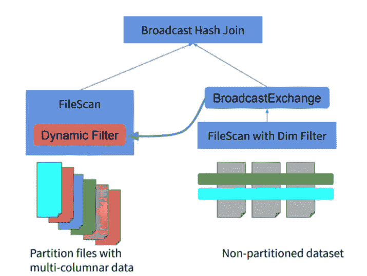

# 动态分区剪枝

> 原文：<https://medium.com/geekculture/dynamic-partition-pruning-baf3270694b4?source=collection_archive---------7----------------------->


Photo by [Rae Wallis](https://unsplash.com/@raewallis?utm_source=unsplash&utm_medium=referral&utm_content=creditCopyText) on [Unsplash](https://unsplash.com/s/photos/sieve?utm_source=unsplash&utm_medium=referral&utm_content=creditCopyText)

Spark 3 中的查询性能优化

分区修剪是 Spark 和 Presto 等大多数查询引擎使用的数据跳过技术之一。这些引擎决定只读取处理所需的分区，并消除所有其他分区的处理。这种修剪是通过过滤器/谓词下推实现的。但是这发生在查询分析时。Spark 3 引入了动态分区修剪，它在运行时完成这项工作。该特性在分区表上工作，将连接的一端转换为广播的“动态过滤器”，用于跳过连接另一端的不相关分区。

*注意:在等价连接中，如果其中一个连接表较小，Spark 本身会选择 BHJ(假设结果大小在阈值内存范围内)。*

> 动态分区修剪=谓词下推+广播散列连接

分区修剪中包含的步骤可以总结如下:

1.  查询和筛选较小的(维度)表。**哈希表是作为过滤查询的一部分构建的。**
2.  Spark 使用这个查询的结果(和哈希表)来创建一个**广播变量**
3.  然后，**会将过滤器广播给每个执行器**
4.  在运行时，Spark 的物理计划被改变，因此**动态过滤器被应用于更大的(事实)表。**这个动态过滤器是作为一个**内部子查询**创建的，它是从应用于较小表的过滤器构建的。

> spark . SQL . optimizer . dynamicpartitionpruning . enabled = true

因此，在每个执行器上，只有选定的过滤器而不是所有的分区被取出。是否使用 DPP 可以在查询计划中看到。我们需要寻找关键字 **PartotionFilters** 和**dynamicpruningexpression**。



Image — from data bricks doc

例如，对于以下查询:

```
SELECT f.col1, d.col2 FROM fact f 
JOIN dimension d ON f.join_col = d.join_col
WHERE d.partition_col < some_val
```

动态过滤器子查询在概念上类似于…

```
SELECT f.col1 FROM fact  
WHERE f.partition_col IN (
SELECT d.partition_col FROM dimension 
WHERE dimension.partition_col < some_val
)
```

注意:DPP 有以下限制:

1.  需要清理的表必须用任何一个连接键列进行分区。
2.  它仅适用于等同联接(带有“=”条件的联接)。
3.  DPP 不会应用于相关的子查询

DPP 对于遵循星型架构模型的查询非常有用。