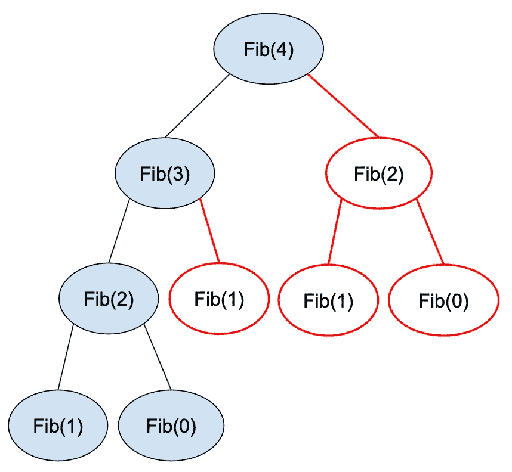

# 动态规划

> 原文：<https://medium.com/geekculture/dynamic-programming-af7666ff7241?source=collection_archive---------11----------------------->

动态编程是一种优化算法的技术，最终会多次解决同一件事；

这是关于**记住部分结果。**

有两种方法:自顶向下的“**记忆**和自底向上的“**制表**”。

# 记忆化

递归的问题是你可能**最终进行相同的调用**(相同的参数)并做相同的…