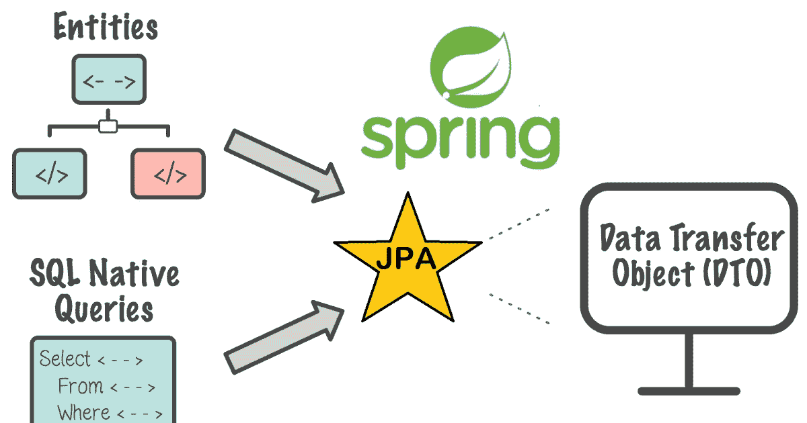
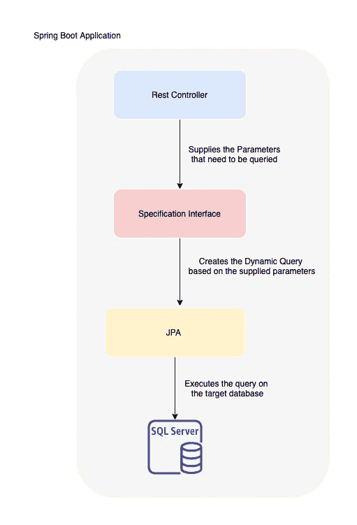

# 让动态查询变得简单

> 原文：<https://medium.com/geekculture/dynamic-querying-made-easy-e34d1f1c23ab?source=collection_archive---------15----------------------->

Spring Boot 使用 CrudRepository 或 JPARepository 接口使查询变得非常容易。几乎所有的基本用例，包括基于列值获取结果，都可以使用上述接口来满足。

但是让我们考虑下面的场景。*如果我们直到收到用户端的请求才知道要过滤哪一列，该怎么办？*2
。*当我们处理过滤用例时，这将是特别需要的，用户可能会应用某些过滤器，而不是应用少数过滤器。*
3。*基于这些参数，我们必须动态填充查询中的某些参数，并忽略其他参数。*

# 解决办法

我们可以简单地在扩展 CrudRepository/JPARepository 的接口中为各个列生成查询。但是这不是一种正确的方式，我们通过接受少数几个列并拒绝其他列来为所有用例编写查询会非常耗时。

# 实解；)

好了，现在来看看真正的解决方案，它将优雅地处理这个问题。我们可以使用**规范** *接口*来实现我们的目标，好的一面是，它非常简单，非常通用。



Basic JPA architecture



Specification Flow

在我们深入实现之前，我们将对规范接口中的内容进行简单描述

1.  ***to predicate(<method params>):***这是生成谓词(查询条件)的方法，需要对其执行查询。
2.  **criteria query<？> :** 将针对实体运行以获取结果的查询
3.  ***表达式< T > :*** 这是一个提供各种方法对实体列执行操作的接口。
4.  ***criteria builder:***这个类用于根据需要提供给查询的谓词、表达式等生成查询。

# **实施**

下面的代码块说明了我们如何将各种操作应用到标准构建器中。Key 和 operation 都可以作为参数传递给实现规范的类。我将把细节留给实现者。我实现了一个包含以下内容的包装类

1.  *Key:* 需要查询的列
2.  *值:*列需要映射的内容
3.  *操作符:*需要对目标列执行的操作。

在初始化规范实现者时，这个包装器将作为参数传递。

```
@Override
public Predicate toPredicate(Root<T> root, CriteriaQuery<?> query, CriteriaBuilder criteriaBuilder) {
    String operation = wrapper.getOperation();
    String key = wrapper.getKey();
   if (key != null) {
        switch (operation) {
            case ">":
                applyGreaterThan(key, criteriaBuilder);
                break;
            case "<":
                applyLessThan(key, criteriaBuilder);
                break;
            case ">=":
                applyGreaterThanOrEqualTo(key, criteriaBuilder);
                break;
            case "<=":
                applyLessThanOrEqualTo(key, criteriaBuilder);
                break;
            case "<>":
                predicate = criteriaBuilder.isNotNull(key);
                break;
            case "~":
                predicate = criteriaBuilder.isNull(key);
                break;
            case "=":
                applyEqualTo(key, criteriaBuilder);
                break;
            case "in":
                applyIn(key);
                break;
            default:
                break;
        }
    }
    return predicate;
}
```

正如你所看到的，有各种各样的方法被调用。下面提到其中一种方法。在该方法中，实现了精确匹配和相似匹配。

```
private void applyEqualTo(Expression<T> key, CriteriaBuilder criteriaBuilder) {
    if (key.getJavaType() == String.class) {
        predicate = criteriaBuilder.like(
                ( Expression<String> ) key, "%" + wrapper.getValue() + "%");
    } else {
        predicate = criteriaBuilder.equal(key, wrapper.getValue());
    }
}
```

下一步是用我们的搜索参数设置包装器并创建规范。

```
Wrapper firstCondition = new Wrapper("*column_name"*, "=", value);
wrapper secondCondition= new Wrapper("*column_name"*, "<", value);
SpecificationImplementor<T> spec1 = new SpecificationImplementor<>(firstCondition);
SpecificationImplementor<T> spec2 = new SpecificationImplementor<>(secondCondition);
Specification<T> finalSpecification= Specification.*where*(spec1)
        .and(spec2);
```

从上面提到的片段中可以看出，我们可以实现 n 个条件，并最终将它们合并成一个规范。初始化 SpecificationImplementor 对象时，会发生以下情况。

1.  将调用 toPredicate 方法，我们已经覆盖了该方法以适应我们的逻辑。
2.  基于传递的操作符，特定的条件将被添加到谓词中。
3.  添加了谓词的规范对象将返回给调用者。

除了上面提到的片段，我们还可以添加更多的条件，并创建 OR 条件或任何其他条件。

现在所需要的就是使用这个动态构造的规范在目标实体上调用查询。为此，我们需要扩展 JPASpecificationExecutor 接口。

```
public interface TargetRepository extends CrudRepository<TargetEntity, Long>, JpaSpecificationExecutor<TargetEntity>
```

一旦我们实现了它，我们就可以直接传递我们构造的规范

```
List<TargetEntity> targetEntity = TargetRepository.findAll(finalSpecification)
```

如您所见，我们没有在存储库接口中编写任何查询，每个查询都是使用规范构建的。

这使得解决方案更加通用，并且可以使用相同的规范实现者来适应 n 个查询，而只需最少的/不需要代码更改。

## 越多越开心！

上面提到的只是一个简单的用例。我们可以基于这个实现更多的查询，并且也支持分页结果。因此，从现在开始，无论传递多少查询参数进行查询，我们都可以简单地使用相同的代码来获得结果。快乐问人！！。