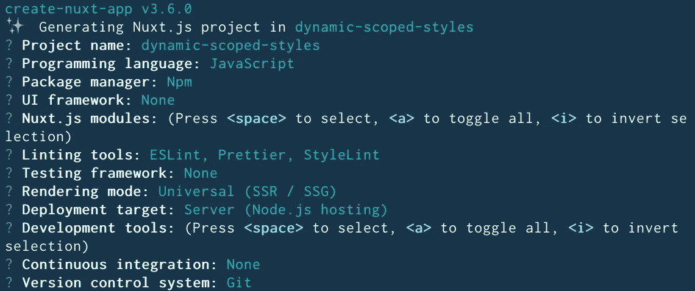
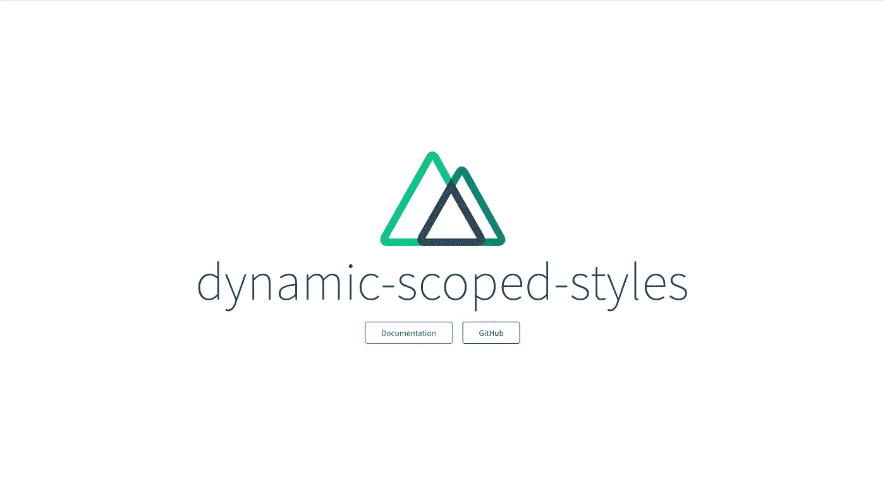
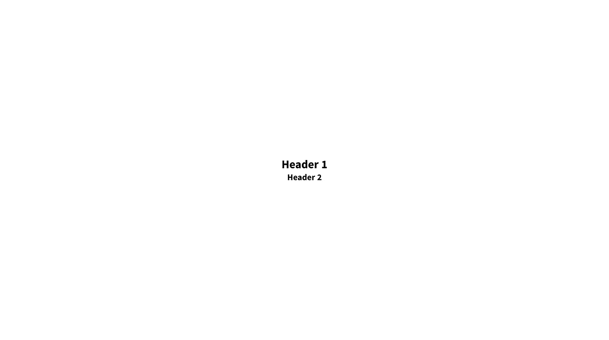
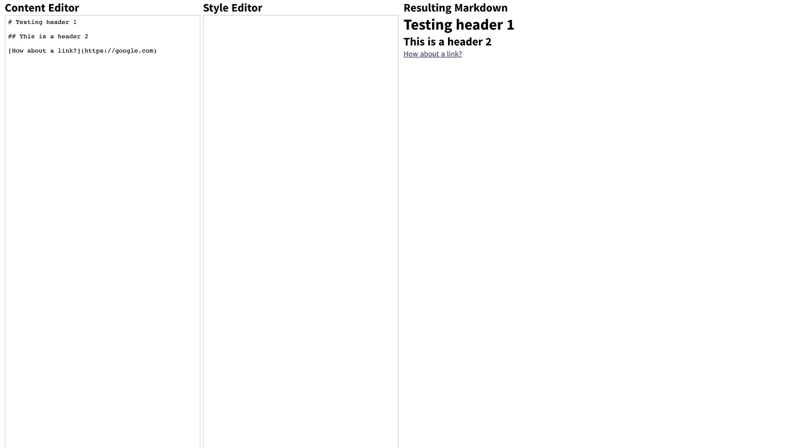
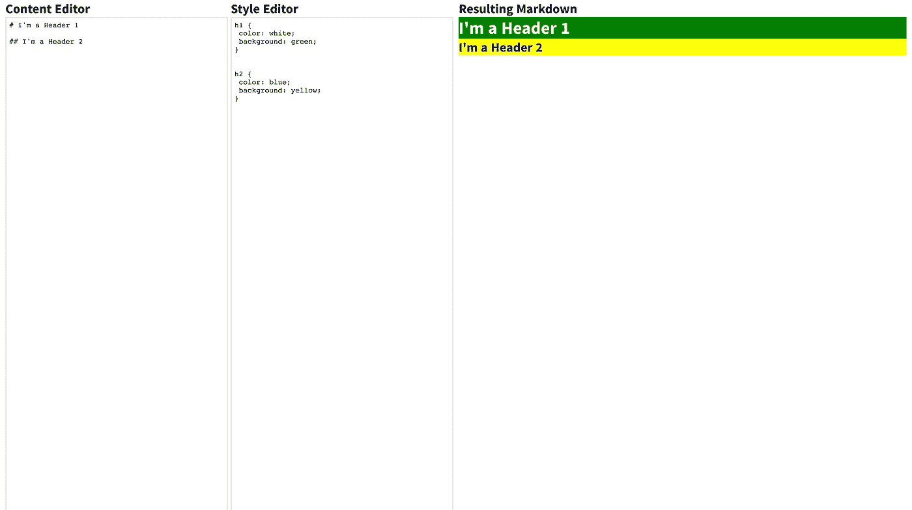

# Vue 中的动态范围 CSS

> 原文：<https://medium.com/geekculture/dynamic-scoped-css-in-vue-7f8c5f4a32ba?source=collection_archive---------33----------------------->


Dynamic scoped css in Vue

**⭐️注:**本教程的原版可以在我的网站[这里](https://www.spencermarx.com/posts/dynamic-scoped-css-in-vue)找到。
⭐️⭐️ **补充说明** : 你是初级开发者吗？如果是，那就来看看我的公司 [Aclarify](https://aclarify.com/) ！我们提供带薪学徒计划，帮助你学习训练营和大学没有教你的基本软件工程元素。你将和我们一起工作 3 个月，从事真正的有报酬的项目，为你在软件行业的全职工作做准备。

如果你曾经使用过 Vue 单文件组件(sfc ),你可能会同意我的观点，它们太棒了。将 HTML、Javascript(或 Typescript)和 CSS 都放在一个地方使得构建和组织组件变得如此容易。

在下面的沙箱中，看一下这些 SFC 组件之一的基本示例:

Basic Vue SFC

怎么样？这么干净有条理！如果我打开了一个关于`HelloWorld.vue`组件的 bug，**，如果我们使用普通的 Javascript/Typescript、Vue 和 CSS，我可能只需要在一个地方**(`HelloWorld.vue`文件)中查找，而不是至少两个。我只想说，我是你的粉丝🚀

# 使用 Vue 单个文件组件的作用域样式

SFCs 的一个我最喜欢的特性是能够将`<style>`标签中定义的样式限定在组件内的 html 模板中。这意味着，如果我想在不影响 DOM 中其他`<h3>`元素的情况下对组件中的`<h3>`元素进行独特的样式设计，我可以做到这一点，而不用担心 [CSS 特异性](https://developer.mozilla.org/en-US/docs/Web/CSS/Specificity)。通过在 SFC 中的`<style>`标签上设置`scoped`属性，我可以简单地编写…

```
h3 {
  color: red;
}
```

…并且确信这种风格只会影响这个组件中包含的`<h3>`元素，并且只影响这个组件。

作用域样式的好处不仅仅适用于一般的“html”标签，也适用于所提供的任何类型的 CSS。这在编写 UI 库时特别有用，因为你可以确信你不会有任何冲突的样式规则。看看上面相同沙箱中的作用域样式组件:

Scoped Styles in Vue SFCs

很酷吧？我认为单文件 Vue 组件和作用域样式允许开发人员处理绝大多数 UI 样式需求。然而，仍然存在一些场景，这些令人敬畏的特性有所欠缺，最终无法帮助我们。

# Vue 的作用域样式的问题是

使用 Vue SFCs 的开发人员界面是静态的。这意味着**我无法在 SFC** 的 `**<style>**` **标签部分动态生成 CSS。就像我说的，大多数时候，这没什么大不了的。通常只需在`<style>`标签中定义所有 CSS，并在运行时使用 Javascript/Typescript 动态地将类分配给模板就足够了(例如，当用户单击按钮时向元素添加一个类)。**

然而，如果您需要在运行时动态定义整个样式表呢？也许你需要让用户完全控制你的应用程序中的一部分屏幕，或者你需要让一个页面的风格完全由每个客户端配置……使用 Vue SFCs 提供给我们的`<style>`标签这是不可能的。

那么，我们如何在运行时动态地设计应用程序的一部分呢？

# 解决方案

动态范围样式可以通过将问题分成两部分来实现:

1.我们如何在运行时加载动态 CSS？

2.**作用域** —我们如何确保我们加载的 CSS 只适用于给定的组件及其后代？

## 动态 CSS

通常你会发现大多数网站和网络应用在运行时使用样式表链接来加载 CSS。然而，偶尔也可能会在 DOM 上遇到`<style>`元素。**使用像 Vue 这样的前端框架，凭借其以编程方式生成元素的能力，我们可以获取一个字符串，并将其作为文本内容注入到** `**<style>**` **标签**中。这意味着我们可以在✅运行时从数据库、用户输入或其他地方以字符串的形式加载 CSS

## 范围样式

什么是“作用域样式？”在 Vue 的上下文中，作用域样式是"*CSS[应用于]当前组件的元素。"很好，所以我们只需要确保我们注入到标签中的 CSS 只影响组件中的元素。我们可以通过利用 CSS 特异性来实现这一点，方法是在我们编写的任何规则前添加一个唯一的选择器。为了保证选择器是真正惟一的，我们可以使用一个通用惟一标识符(即一个 [UUID](https://en.wikipedia.org/wiki/Universally_unique_identifier) )字母数字字符串作为组件根的选择器。像这样:*

```
// The UUID corresponds to the wrapper id of our component
#509b1685-cc80-47c3-8099-fd2dd9e6b35c h3 {
  color: red;
}
```

有了这个，我们应该可以放心地将样式动态添加到页面上，而不用担心它们会影响组件✅之外的 DOM 上的其他元素

# 示例问题上下文

对于本教程的剩余部分，我们将假设我们有以下要求:

## 解决方案要求:

1.使用 Vue，我们必须创建一个组件，它接受配置好的降价，并将所述降价转换成 html。

2.Markdown 组件应该接受动态范围样式的`string`类型属性，并将这些样式应用于组件呈现的最终 html。

3.文本区域字段应该将动态范围样式`string`传递给 Markdown 组件，允许对 markdown html 进行即时范围样式更新。

# 实施

很好，现在我们已经列出了我们的需求，并且理解了实现动态范围样式的一般方法，让我们写一些代码。

## 步骤 1:设置项目

让我们从快速启动一个 Nuxt 项目开始。

```
$ npx create-nuxt-app dynamic-scoped-styles
```

请随意配置您的项目不同于我的。我有以下选择:



Nuxt setup configs

然后`cd`进入你的新 Nuxt 项目。

```
$ cd dynamic-scoped-styles
```

现在让我们测试我们的模板项目，以确保它的工作。运行…

```
$ npm run dev
```

希望 Nuxt 编译完成后，您会看到以下内容:



Initial project view

## 步骤 2:添加降价组件

既然我们已经建立了我们的项目，让我们把我们的降价组件放在一起。

首先让我们创建一个名为`Markdown.js`的新文件。

```
$ touch components/Markdown.js
```

然后安装我们的 markdown 编译器。

```
$ npm install marked
```

太好了！是时候写出我们降价部分的开头了。

*注意:在此之前，我想强调一下，我们并没有使用单个文件组件作为降价组件。由于我们稍后需要动态生成一个* `*<style>*` *元素，我们将利用 Vue 实例的* `*render()*` *函数属性提供给我们的 Vue 的* `*createElement()*` *方法。*

好了，现在来看代码！我们将使用名为`content`的`string`类型`prop`来设置我们的降价组件。这个 prop 将接受来自父`pages/index.vue`页面组件的字符串，然后使用我们刚才下载的`marked`编译器将字符串转换为`html`，并将所述 html 注入到一个`<div>`元素中。

下面是最终结果:

```
// components/Markdown.jsimport Vue from 'vue'
import marked from 'marked'export default Vue.extend({
  name: 'Markdown',
  props: {
    content: {
      type: String,
      required: true,
    },
  },
  computed: {
    markdownHtml() {
      return marked(this.content)
    },
  },
  render(createElement) {
    return createElement('div', {
      domProps: {
        innerHTML: this.markdownHtml,
      },
    })
  },
})
```

## 步骤 3:将我们的 Markdown 组件添加到主“pages/index.vue”组件中

既然我们已经准备好开始我们的 Markdown 组件，让我们让它显示在浏览器中。

打开您的`pages/index.vue`，清除默认模板`html`以及除`.container`之外的所有样式，然后添加新的降价组件。

```
<!-- pages/index.vue --><template>
  <div class="container">
    <div>
      <Markdown :content="content" />
    </div>
  </div>
</template><script>
import Markdown from '~/components/Markdown.js'
export default {
  components: {
    Markdown,
  },
  data() {
    return {
      content: `# Header 1\n\n## Header 2`,
    }
  },
}
</script><style>
.container {
  margin: 0 auto;
  min-height: 100vh;
  display: flex;
  justify-content: center;
  align-items: center;
  text-align: center;
}
</style>
```

您会注意到，现在，我添加了一个名为`content`的`data()`属性，它作为`content`属性被传递给我们的`<Markdown/>`组件。我们最终会删除它，但现在让我们测试一切，以确保它的工作！

确保您的服务器正在运行，并导航到您的浏览器…您应该会看到以下内容:



Initial markdown component view

## 步骤 4:向主`'pages/index.vue'`组件添加文本区域，用于控制 markdown 内容和 css

让我们开始让事情变得更有活力。是时候添加基于用户的降价内容了。

将您的`pages/index.vue`更新为:

```
<!-- pages/index.vue --><template>
  <div class="container">
    <form class="texteditor">
      <section>
        <h2>Content Editor</h2>
        <textarea
          id="markdown-text"
          v-model="content"
          name="markdown-content"
          cols="30"
          rows="10"
        ></textarea>
      </section>
      <section>
        <h2>Style Editor</h2>
        <textarea
          id="markdown-text"
          v-model="style"
          name="markdown-content"
          cols="30"
          rows="10"
        ></textarea>
      </section>
    </form>
    <div class="markdown-section">
      <h2>Resulting Markdown</h2>
      <Markdown :content="content" :raw-css="css" />
    </div>
  </div>
</template><script>
import Markdown from '~/components/Markdown.js'
export default {
  components: {
    Markdown,
  },
  data() {
    return {
      content: '',
      css: '',
    }
  },
}
</script><style>
.container {
  margin: 0 auto;
  min-height: 100vh;
  display: grid;
  grid-template-columns: 1fr 1fr;
  column-gap: 10px;
}.container:only-child {
  padding: 0 10px;
}.texteditor {
  display: grid;
  grid-template-columns: 1fr 1fr;
  column-gap: 5px;
}.texteditor textarea {
  height: 100%;
  width: 100%;
  border: 2px solid rgba(230, 230, 230, 1);
  padding: 5px;
  outline: none;
}
</style>
```

好吧，这是怎么回事？

**⭐️创造了新元素:** `**<form>**` **和** `**<textarea>**` **元素**

我们添加了一个带有两个`<textarea>`元素的`<form>`来捕捉用户输入。

**⭐️创造了新的** `**data()**` **道具:**`**content**`**`**css**`**

**`<form>`中的`<textarea>`元素使用了两个 v-model (Vue 对双绑定数据的简写)属性:`content`，这是之前在`data()`中静态设置的，以及`css`，这是一个新的字符串属性，我们将使用它将样式传递到 Markdown 组件中。**

****⭐️更新款式****

**我们更新了样式并添加了几个新规则来实现几组嵌套列。**

**太好了，测试时间到了！打开浏览器，在“内容编辑器”中添加一些 markdown。您应该看到最右边的“Resulting Markdown”部分根据您的输入更新了编译后的 html。**

****

**Initial textareas view**

**厉害！干得漂亮🤜🤛是时候装配我们的动态范围 CSS 了！**

## **步骤 5:向我们的 Markdown 组件添加动态范围的 css**

**首先，我们需要再安装一个包来生成唯一的 id。我们将使用一个叫做`uuid`的通用包。**

```
$ npm install uuid
```

**酷，现在跳回`components/Markdown.js`并更新文件，看起来像这样:**

```
// components/Markdown.jsimport Vue from 'vue'
import marked from 'marked'
import { v4 as uuid } from 'uuid'export default Vue.extend({
  name: 'Markdown',
  props: {
    content: {
      type: String,
      required: true,
    },
    rawCss: {
      type: String,
      required: true,
    },
  },
  data() {
    return { wrapperId: uuid() }
  },
  computed: {
    markdownHtml() {
      return marked(this.content)
    },
    compiledCss() {
      if (this.rawCss && this.rawCss.length > 0) {
        const prefixedCss = this.prefixCss(this.rawCss)
        return prefixedCss
      }
      return ''
    },
  },
  methods: {
    prefixCss(css) {
      let id = `#${this.wrapperId}`
      let char
      let nextChar
      let isAt
      let isIn
      const classLen = id.length// makes sure the id will not concatenate the selector
      id += ' '// removes comments
      css = css.replace(/\/\*(?:(?!\*\/)[\s\S])*\*\/|[\r\n\t]+/g, '')// makes sure nextChar will not target a space
      css = css.replace(/}(\s*)@/g, '}@')
      css = css.replace(/}(\s*)}/g, '}}')for (let i = 0; i < css.length - 2; i++) {
        char = css[i]
        nextChar = css[i + 1]if (char === '@' && nextChar !== 'f') isAt = true
        if (!isAt && char === '{') isIn = true
        if (isIn && char === '}') isIn = falseif (
          !isIn &&
          nextChar !== '@' &&
          nextChar !== '}' &&
          (char === '}' ||
            char === ',' ||
            ((char === '{' || char === ';') && isAt))
        ) {
          css = css.slice(0, i + 1) + id + css.slice(i + 1)
          i += classLen
          isAt = false
        }
      }// prefix the first select if it is not `[@media](http://twitter.com/media)` and if it is not yet prefixed
      if (css.indexOf(id) !== 0 && css.indexOf('@') !== 0) css = id + css
      return css
    },
  },
  render(createElement) {
    const styleElement = createElement('style', {
      domProps: {
        innerHTML: this.compiledCss,
      },
    })const markdownElement = createElement('div', {
      attrs: { id: this.wrapperId },
      domProps: {
        innerHTML: this.markdownHtml,
      },
    })return createElement('div', {}, [markdownElement, styleElement])
  },
})
```

**好了，深呼吸，🧘‍♀️🧘‍♂️，更新都很简单。我们来分解一下。**

****⭐️创造了新道具:** `***rawCss***`**

**我们需要从来自父组件的`<textarea>`中获取 CSS。于是我们设置了一个`string`类型的新道具叫做`rawCss`。**

****⭐️创造了一个新的** `**data()**` **道具:** `**wrapperId**`**

**我们添加了一个名为`wrapperId`的新`data()`道具，它使用`uuid`库来生成一个通用的唯一 id。**

****⭐️创造了一种新方法:** `**prefixCss()**`**

**这确实是大多数“作用域 css”奇迹发生的地方。`prefixCSS()`方法接受 css 字符串，并用包装器`<div>`的惟一`wrapperId`为其中的每条规则添加前缀，这给了我们“作用域 css”的特异性。**

****⭐️创建了一个新的计算道具:` *compiledCss* `****

**为了使用新的`rawCss`属性对用户输入的变化做出反应，我们添加了一个名为`compiledCss`的计算属性。在这里，我们将利用`prefixCss()`方法和我们独特的`wrapperId`。**

****⭐️更新了** `**render()**` **功能****

**上面的修改已经准备好了，我们只需要在我们原来的 markdown html 旁边创建一个`<style>`元素，带有前缀 css 和分配给根包装器`<div>`元素的唯一的`wrapperId`。**

**没那么糟吧？好的，再走一小步，我们就可以开始了！😎**

## **步骤 5:更新``pages*/index*.*vue*``以将 CSS 传递给 Markdown 组件**

**回到您的`pages/index.vue`组件，并确保将您的`css`道具(在`*data*()`中)传递到您更新的降价组件。**

```
<!-- pages/index.vue --><template>
  <div class="container">
    <form class="texteditor">
      <section>
        <h2>Content Editor</h2>
        <textarea
          id="markdown-text"
          v-model="content"
          name="markdown-content"
          cols="30"
          rows="10"
        ></textarea>
      </section>
      <section>
        <h2>Style Editor</h2>
        <textarea
          id="markdown-text"
          v-model="css"
          name="markdown-content"
          cols="30"
          rows="10"
        ></textarea>
      </section>
    </form>
    <div class="markdown-section">
      <h2>Resulting Markdown</h2>
      <Markdown :content="content" :raw-css="css" />
    </div>
  </div>
</template><script>
import Markdown from '~/components/Markdown.js'
export default {
  components: {
    Markdown,
  },
  data() {
    return {
      content: '',
      css: '',
    }
  },
}
</script><style>
.container {
  margin: 0 auto;
  min-height: 100vh;
  display: grid;
  grid-template-columns: 1fr 1fr;
  column-gap: 10px;
}.container:only-child {
  padding: 0 10px;
}.texteditor {
  display: grid;
  grid-template-columns: 1fr 1fr;
  column-gap: 5px;
}.texteditor textarea {
  height: 100%;
  width: 100%;
  border: 2px solid rgba(230, 230, 230, 1);
  padding: 5px;
  outline: none;
}
</style>
```

**现在回到你的浏览器吧！尝试在最左边的“内容编辑器”列中输入一些 markdown，并在中间的“样式编辑器”中输入一些针对您的 markdown 的有效 CSS，您应该会看到“结果 Markdown”列更新了您应用的内容和样式。**

***注意:样式不会影响我们“结果减价”之外的任何元素，因此我们的动态 CSS 是“限定范围的！”* 🥳**

****

**Dynamic scoped styles in vue final view**

**干得好！我希望你在这里学到了一些东西！**

## **感谢阅读！**

**感谢您的阅读，请不要犹豫，通过电子邮件或上述 github repo 联系我！🙏**

**Time to celebrate!**

## **最终代码**

**点击查看完整代码[！如果您有任何建议或问题，请随时在回购上提出问题！](https://github.com/spencermarx/tutorial-dynamic-scoped-css-in-vue)**