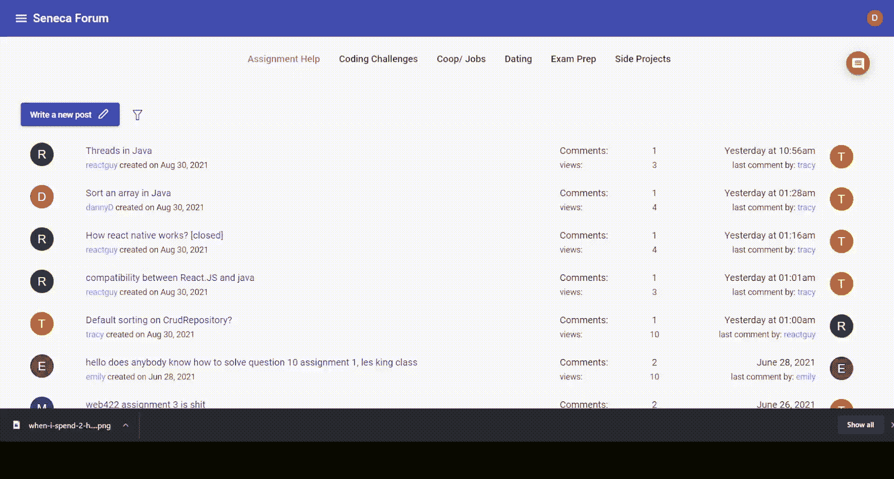

# 基于用户输入的动态搜索/过滤查询

> 原文：<https://medium.com/geekculture/dynamic-search-filter-query-based-on-user-inputs-with-hibernate-mysql-spring-boot-85e842dcf8d?source=collection_archive---------3----------------------->

编程之前，我不懂在网上编码模因…


…直到我有机会和一个喜欢优化代码的人一起工作。

我们项目的一个特点是基于多个输入做一个复杂的过滤，他把这个任务交给了我。



所以基本上，用户可以根据标签、创建时间进行过滤，也可以根据最新/最早的帖子/评论进行排序。有最新评论的帖子总是显示在最前面。

我用 Collections 和 Stream 只用了一天就完成了。在测试了所有场景之后，它运行得很好，我自信地提出了一个拉请求，并认为我会睡个好觉。

然而，他在午夜给我发了一条消息，说他拒绝接受我的拉请求，因为我的代码不可伸缩，性能也不好。

“尽量用 JPA 和 Hibernate 代替核心 Java，性能更好。他说:“你可以在弗拉德·米哈尔恰和 T2·索本·让桑的博客文章中读到更多。”。

因为不是从学校学的，一开始很不适应，也很怀疑。更重要的是，如果我改用他的解决方案，我需要删除我的整行代码。

> 我的重要经验是:在开始编码之前，一定要讨论解决方案

那天晚上我没睡好。看了那两个冬眠大师的帖子，我想也许我的队友是对的，我应该按照他的方向走。

这项任务有两个主要步骤:

1.  编写复杂的 SQL 查询来按排序顺序生成结果。
2.  基于用户的输入动态地进行查询(不管输入或排序类型是什么，我只需要一个函数来执行这个任务)。

**编写复杂的 SQL 查询来生成排序后的结果。**

这一步最棘手的是让有评论的帖子先出现，并显示他们最新的评论者。没有任何评论的帖子，即使是最近创建的，也不会被优先考虑。

我利用我在连接、别名表、条件语句方面的知识来生成如下查询:

```
SELECT 
  * 
FROM 
  posts p 
  LEFT JOIN (
    SELECT 
      c.post_id AS belongPost, 
      MAX(created_on) AS COMMENT 
    FROM 
      comments c 
    GROUP BY 
      belongPost
  ) AS TEMP ON TEMP.belongPost = p.post_id 
WHERE 
  p.topic_id = 'Assignment_Help' 
  AND p.status = 'ACCEPTED' 
  AND p.post_tags LIKE "%%" 
  AND p.created_on >= 2020 - 12 - 31 
  AND p.created_on <= 2021 - 08 - 30 
ORDER BY 
  IF(TEMP.COMMENT IS NULL, 1, 0), 
  TEMP.COMMENT desc, 
  p.created_on desc;
```

如此庞大的查询！！！

**根据用户的输入进行动态查询**

***低性能方法:*** 如果我不使用动态查询，我需要创建 04 个其他查询来完成这项任务(升序 sortByPost，降序 sortByPosts，升序 sortByComments 和降序 sortByComments)。

***更好的解决方案:*** 使用动态查询

我创建了另一个 CustomPostRepository，并且我的 PostRepository 扩展了 CustomPostRepository。

```
@Repository
public interface PostRepository extends JpaRepository<Post,Integer>,CustomPostRepository{     
 // Other functions
}
```

在 CustomPostRepository 中，我将函数的签名放在这里:

```
public interface CustomPostRepository { List<Post> filterPostsBasedOnKeywords(
            String topicID, 
            String tags, 
            String start, 
            String end, 
            String sortBy, 
            String order, 
            Pageable pageable);
}
```

我将 CustomPostRepository 设计成一个包含所有动态功能/查询的接口；所以我用 PostRepository 把它分开了。并且因为 PostRepository 扩展了 custompostportrepository，所以我可以通过注入的 PostRepository 实例访问 custompostportrepository 的方法。这个设计遵循了我从[Java reviewed](https://javarevisited.blogspot.com/#axzz759A3LTNj)那里学来的立体开/闭原理。

最后，我创建了实现 CustomPostRepositoryImpl 接口的 custompostrepostorypl 类。神奇的事情发生了:

这个想法是根据用户的输入(按升序/降序、帖子/评论排序)使用 StringBuilder 创建一个动态字符串。然后，

```
Query q = entityManager.createNativeQuery(sb.toString(),Post.class);
```

会将该字符串转换为原生查询，而 q . get result list()；帮助获取结果列表。

最后，它可以工作，并且比我的旧 Java 核心解决方案快一点(我想如果我的数据库中有数千条记录，差异会更明显)。

顺便说一句，感谢我的队友对代码和对我的严格要求。

源代码:【https://github.com/trangntt-016/seneca-forum-backend 

**如果你喜欢这篇文章，请鼓掌**👏**并分享出来，让别人也能找到！**😄。