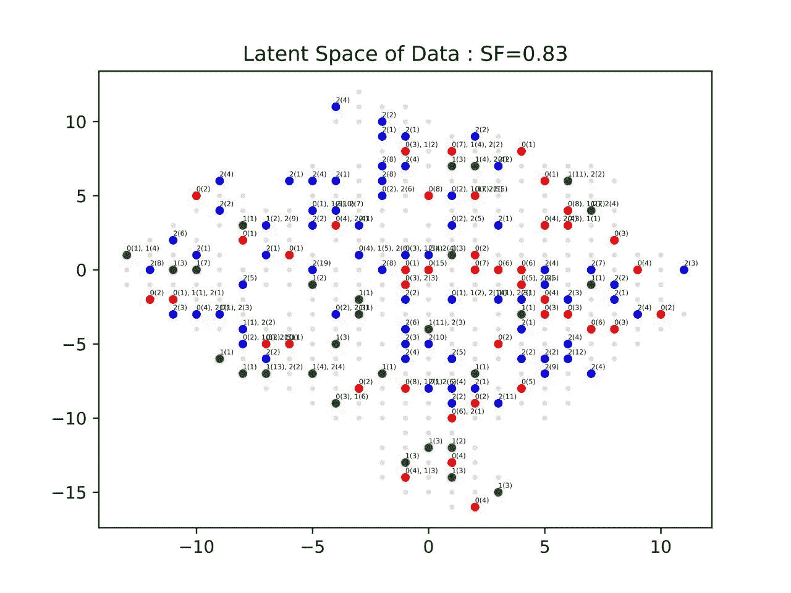
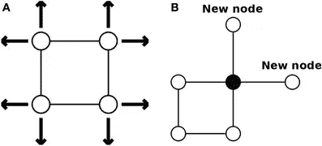
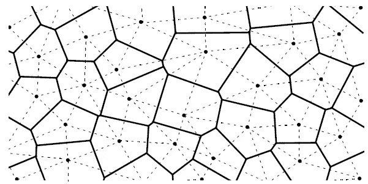
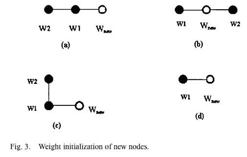

# 动态自组织地图(GSOM)

> 原文：<https://medium.com/geekculture/dynamic-self-organizing-maps-gsom-60a785fbe39d?source=collection_archive---------13----------------------->

## 机器学习

## 不断增长的自组织地图——简介

Fig.1\. GSOM Map: Photo by Author generated for an Experiment

作为计算机科学与工程专业的最后一年本科生，我目前正在参与一个与视频监控相关的项目，我经常遇到 SOM 和 GSOM，因为我们正在与“无监督”学习密切合作。使用 GSOM 很有意思，因为它在保持拓扑结构的同时支持降维。下面的文章更多的是对 GSOM 论文的总结。

# SOM 及其局限性

我们用来研究和利用的数据由复杂的模式组成，并且通常是高维的。一般来说，主要的问题不是找出模式，而是从许多现有的模式中找出 ***有用的模式*** 。对于这种由复杂的未知结构组成的数据集，聚类变得至关重要。无监督的降维和聚类/模式识别方法更有益，因为无监督是一种非定向技术，并且能够很好地处理不同的数据类型。

自组织映射(SOM)已被用作将高维数据映射成二维(或三维)特征图的工具[1]。由于 SOM 可以保持数据的拓扑结构，因此特征图可以用来观察和解释数据的结构。SOM 还可以用于从高维输入空间到简单的二维或三维输出空间的降维。

# SOM 设计的目标行为是相似的输入应该激发较近的神经元，而不同的(变化的)输入应该激发较远的神经元[1]。

SOM 主要由**三层**组成；输入层、竞争层和输出层。

1.  **输入层—** 接受多维输入向量。
2.  **竞争层—** 来自输入层的多个加权输入由竞争层中的每个神经元获得。竞争层中的每个神经元也与其他神经元相关联，形成其“邻居”。竞争层通常实现为一维或二维。在接收到给定的输入时，一些神经元将被激发，导致对邻近神经元的减速(惩罚)或加速(促进)效应。

3.**输出层—** 我们希望解释竞争层中节点之间的互连的方式。

SOM 算法可以分解为:

> 启动(随机)
> 
> 竞争(横向抑制连接和选择获胜者节点)
> 
> 合作(确定一个社区)
> 
> 自适应(累积权重并更新获胜者及其邻居节点)
> 
> 平滑(随着迭代的增加，减小**邻域半径**或引入可选的平滑阶段)

但是 ***SOM 不是动态的*** 并且本质上要求具有预定的网络结构。这是一个限制，可以通过动态地允许 SOM 网络增长和构造自己来解决。此外，预先确定 SOM 的结构的必要性可能导致过早形成簇而不是被组织成适当的簇的情况。解决这些问题需要动态增长的自组织地图(GSOM)。

# 成长自组织地图

GSOM 是自组织映射的扩展，可以动态增长。GSOM 算法可以在 ***三个*** 阶段研究，决定 GSOM 的重要参数很少。

# 重要参数

**展开因子**:用于控制 GSOM 节点/节点图的展开。它取 0 到 1 之间的值。扩展因子不依赖于数据的维度。

**增长阈值:**启动节点生成的阈值。当误差(**输入向量和权重向量之间的差**)大于增长阈值时，强制生成新的节点。如果 GT 较高，将导致 GSOM 分布较少，而当 GT 较低时，将导致 GSOM 分布较好。

# GSOM 算法

# 1.初始阶段

在这个特定阶段，算法用随机数初始化起始节点的权重向量。一般来说，GSOM 算法从 4 个节点开始，这 4 个节点提供了在它们想要的方向上生长的自主权，因为它们都是边界节点。

数值变量 **H_err** 在初始化时被初始化为“0”。 ***展开因子*** (SF)必须在此阶段指定。并且该算法还倾向于根据指定的要求计算给定数据集的 ***增长阈值*** (GT)。GT 将作为启动节点生成的阈值。

Fig.2\. Initial GSOM(A)

> **初始化阶段总结:**
> 
> -用 0 和 1 之间的随机数初始化起始节点(通常为 4 个)的权重向量。
> 
> -确定扩散系数(SF)
> 
> -使用公式 **GT = -D x ln(SF)** 计算具有 **(D)** 维度和已定义的扩展因子 **(SF)** 的数据集的增长阈值 **(GT)**

# 2.生长阶段

我们现在在这一阶段向网络提供输入。最初，类似于 SOM ( ***)竞争阶段*** )算法，GSOM 也基于欧几里德距离将最接近输入向量的权重向量确定为获胜者(或**【BMU】**-最佳匹配单元)。GSOM 可以被认为是输入空间的 2D 表示，其中输入空间被权重向量(W_i)划分为 Voronoi 区域(V_i ),并且每个 Voronoi 区域由一个神经元(I)表示。

Fig.3\. Voronoi Diagram — Photo by Charles Francis in Quora

> Voronoi 图是将一个平面划分成靠近一组给定对象中的每一个的区域。在最简单的情况下，这些物体只是平面上有限多的点。对于每一粒种子，都有一个相应的区域，由平面上离该种子比离其他任何一粒种子都近的所有点组成。”[3].

***SOM 的合作和适应*** 阶段之后，权重更新仅发生在 BMU 和获胜者的邻域。在 GSOM，与 SOM 相比，起始邻域被选择得更小。

当该节点的总误差(特定节点的权重向量和输入权重向量之间的**差)**小于增长阈值(GT)时；即，如果， **H_err < GT** ，则该算法不允许增长新的节点。但当节点的总误差 ***大于增长阈值***(GT)时；即 **H_err > GT**

*   ***在边界节点*** 中生成新节点。并且在所有空闲的相邻位置上生成新节点，因为计算出新节点的最佳精确位置的计算成本更高。

> “一个**边界节点**至少有一个紧邻位置没有节点”[1]。在定义每个节点最多可以有 4 个直接邻居的 GSOM 中，边界节点是指可以增加 3 个邻居或者可以在剩余的三个方向上移动的节点。

*   在生成新节点后，更新权重是必要的。有**四种**可能的方式(见图 4。)

Fig.4\. Weight updating in GSOM new nodes by Damminda et al.

1.  当在其一侧时，新节点以连续的方式具有两个旧节点(图 4(a))

= > if W2 > W1 = >**W _ new**= W1-(W2—W1)

= >如果 W1 > W2 = >**W _ new**= W1+(W1-W2)

2.当新节点被放置在两个旧节点之间时(图 4(b))

=> **W_new = (W1+W2)/2**

3.当新节点只有一个作为旧节点的*直接*邻居时(图 4(c))

= > if W2 > W1 = >**W _ new**= W1-(W2-W1)

= >如果 W1 > W2 = >**W _ new**= W1+(W1-W2)

4.当节点因老化后被移除而被隔离时，生成的新节点只有一个相邻的旧节点

= >**W _ new =**(R1+R2)/2；r_1，r_2 唯一一个相邻节点的权向量的范围的下限值和上限值。

> **成长阶段总结:**
> 
> -基于输入向量与神经元的最接近度来选择优胜节点/神经元。
> 
> 特定输入的获胜者向量和输入向量之间的差被累积为该神经元的误差值(I)。
> 
> -如果由特定权重向量贡献的误差对累积误差贡献很大，则将决定生成新的神经元，因为较高的误差贡献指的是胜出的神经元不是输入向量的最佳代表。
> 
> -将创建新节点，从边界节点开始增长。对于新节点，权重增加。

# 3.平滑阶段

当创建的新节点越来越少时，增长阶段停止，平滑阶段开始。在这个平滑阶段，该算法降低了学习率并固定了一个小的起始邻域。

> D **平滑阶段和生长阶段的差异**
> 
> -仅考虑直接连接的节点的权重自适应
> 
> -不添加新节点。

# 为什么 GSOM 这么有优势？

*   GSOM 是一种无监督的方法，可用于对一组先验未知的数据进行聚类。
*   GSOM 是一种可视化技术，可为数据分析师提供更多洞察，从而从 2D 地图的更复杂数据中发现模式。
*   GSOM 也擅长降维。它能够将高维数据映射到二维数据。
*   允许动态增长。因为不需要预先确定网络的结构，所以还可以防止过早形成簇，而不是组织成适当的簇。

# 参考

[1] T. Kohonen，自组织地图。德国柏林:SpringerVerlag，1995。

[2]“用于知识发现的控制增长的动态自组织图”，Damminda Alahakoon，Saman K. Halgamuge，IEEE 成员，和 Bala Srinivasan，2000 年 5 月。

[3] A. Okabe，B. Boots 和 K. Sugihara，Voronoi 图的空间镶嵌、概念和应用。纽约:威利出版社，1992 年

> *注意:感谢您读到这里，如果您在理解上遇到任何挑战或我的解释中有错误，我们可以一起讨论。我之前的博客关于* [*SOM*](/datadriveninvestor/how-does-self-organizing-algorithm-works-f0664af9bf04) *讨论了更多的数学(或者更确切地说是面向考试)方法，但这里更多的是对 GSOM 的解释。*