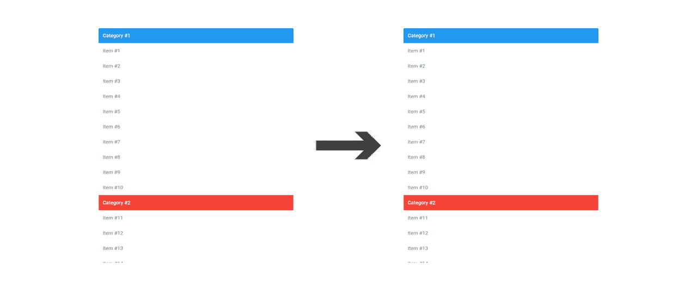
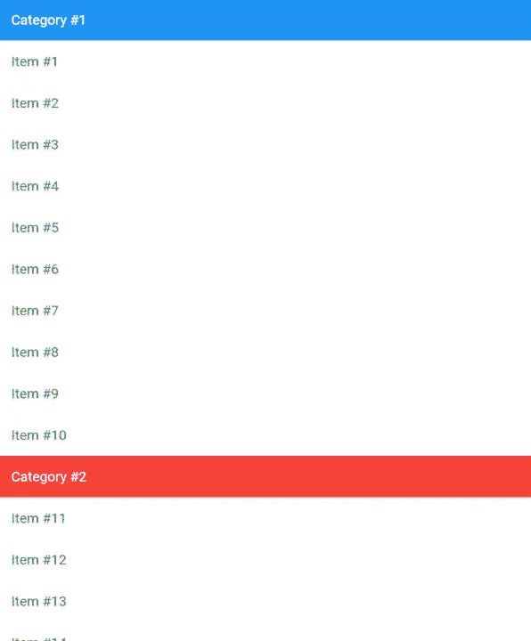

# 动态固定列表头

> 原文：<https://medium.com/geekculture/dynamically-pinned-list-headers-ee5aa23f1db4?source=collection_archive---------2----------------------->

## 颤动的包裹聚光灯



Flutter 提供了一个强大的解决方案，以`[Slivers](https://docs.flutter.dev/development/ui/advanced/slivers)`的形式实现高级滚动。正如在 Flutter 文档中提到的，`Sliver`是可滚动区域的一部分，您可以定义它以一种特殊的方式运行。这允许我们组合多个可滚动的小部件(`ListView`、`GridView`等)。)合并到一个可滚动的小部件中，在那里它们一起滚动，如下面的视频所示。

它还允许我们实现高级功能，如展开/折叠`AppBar`，如下所示。

然而,`Slivers`库还有一些需要改进的地方。例如，你注意到第一个视频中的*标题*被固定了 22 秒吗？它们就像下面的演示一样相互叠加。



当列表滚动时，没有简单的方法来动态固定标题，用下面的标题替换当前固定的标题。我开始创建一个解决方案来处理这个问题，但是后来我发现 Flutter 社区的另一个成员已经解决了这个问题！😃因此，我不再写一篇关于我如何实现该解决方案的文章，而是重点介绍来自 Pieter Vanloon 的令人惊叹的`[sliver_tools](https://pub.dev/packages/sliver_tools)`包！让我们来看看如何使用它。

这个包提供了许多小部件，有助于扩展 Flutter 的高级可滚动 UI 功能。我们将使用其中的两个:`MultiSliver`和`SliverPinnedHeader`。

首先，让我们创建一个扩展`MultiSliver`的`Section`小部件。我们将接受参数来定义标题颜色、标题、标题颜色以及显示在它下面的项目列表。然后我们将把一个`SliverPinnedHeader`和`SliverList`作为子节点传递给我们的`super`构造函数。

```
class Section extends MultiSliver {
  Section({
    Key? key,
    required String title,
    Color headerColor = Colors.white,
    Color titleColor = Colors.black,
    required List<Widget> items,
  }) : super(
         key: key,
         pushPinnedChildren: true,
         children: [
           SliverPinnedHeader(
             child: ColoredBox(
               color: headerColor,
               child: ListTile(
                 textColor: titleColor,
                 title: Text(title),
               ),
           ),
           SliverList(
             delegate: SliverChildListDelegate.fixed(items),
           ),
         ],
       );
}
```

这里需要注意的重要一点是`pushPinnedChildren`参数。将此设置为`true`提供了我们想要的行为。如果是`false`，标题的行为将与 Flutter 的`Slivers`完全相同。

现在，让我们在`CustomScrollView`中使用我们的`Section`小部件。

```
CustomScrollView(
  slivers: [
    Section(
      title: 'Category #1',
      headerColor: Colors.blue,
      items: List.generate(10, (index) => ListTile(
        title: Text('Item #${index + 1}'),
      )),
    ),
    Section(
      title: 'Category #2',
      headerColor: Colors.red,
      items: List.generate(10, (index) => ListTile(
        title: Text('Item #${index + 11}'),
      )),
    ),
    ...
  ],
),
```

为了简洁起见，我只展示了两个部分的代码，但是您可以根据需要创建任意多个部分。让我们看看它看起来怎么样。


那就好多了！如您所见，当我们滚动浏览各个部分时，固定的标题被平滑地替换。有趣的是，试着用折叠的`SliverAppBar`代替`SliverPinnedHeader`，看看你能想出什么！

一如既往的感谢您的阅读！如果你觉得这篇文章很有帮助，请鼓掌并关注我和 Flutter 的工作。也欢迎提问和评论。