# 基于 C++的自平衡机器人动力学建模与仿真

> 原文：<https://medium.com/geekculture/dynamics-modelling-and-simulation-of-self-balancing-robot-in-c-d32a3b835bbf?source=collection_archive---------6----------------------->

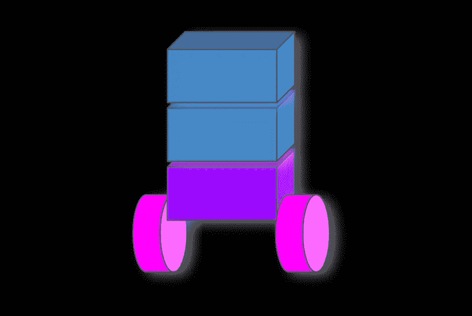

(by author)

下面的文章展示了开发机器人和控制系统的动态模型的通用方法。本文将关注一个简单的自平衡机器人( [Segway](https://en.wikipedia.org/wiki/Segway) )，由二阶运动方程([拉格朗日力学](https://en.wikipedia.org/wiki/Lagrangian_mechanics)描述。

我将一步一步地向您展示如何实现这样的解决方案，但是，我不打算将重点放在运动物理现象和数学关系上(这里用于控制系统目的)。运动方程通过应用数值方法求解(Rutte Kuta fort order——我在以前的一篇文章中详细讨论过——[这里](/geekculture/numerical-computation-in-c-part-2-33dcdbe6c726))。我用 C++进行了整个模拟，但是我用 Python (SymPy 库)计算的符号方程的解。你可以在我的 [GitHub](https://github.com/markusbuchholz/modelling_Self-balancing_Robot_in_Cpp) 上找到以下项目的文件。

此外，了解如何建立机器人或其他动态系统的物理模型，我相信知道如何解决微分方程是很重要的。在这个项目中，你会发现解决这类方程的简单方法。请仔细学习，这样它会让你在未来解决类似或更复杂的挑战。

这里你可以看到机器人在工作。

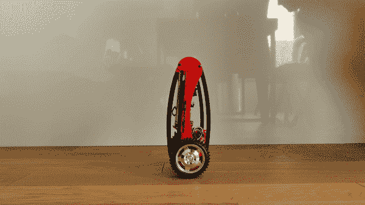

medium.com (by [Dominik Nowak](/@dominiknowak_87058))

已经使用头文件(用于绘图库)绘制了模拟，头文件必须包含在与您的 cpp 相同的文件夹中(您可以从我的存储库中克隆所有文件)。
你的程序可以编译如下:

```
//compile
g++ my_prog.cpp -o my_prog -I/usr/include/python3.8 -lpython3.8// //run
./my_prog//folder tree
├── my_prog
├── my_prog.cpp
├── matplotlibcpp.h
```

动态模型可推导如下(查看[系统科学&控制工程期刊文章](https://www.tandfonline.com/doi/pdf/10.1080/21642583.2017.1413436))。

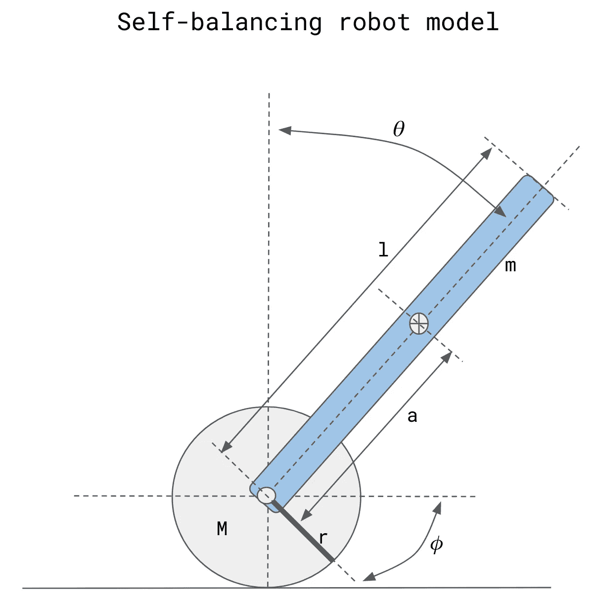

self-balancing robot model (by author)

为了描述所描绘的机器人的模型，我们使用拉格朗日方程，

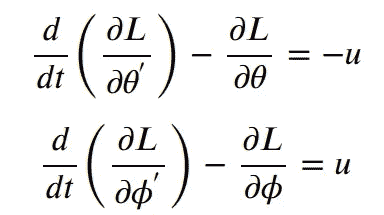

其中 **L** 为拉格朗日量(系统中动能 **K** 和势能 **U** 之和)。

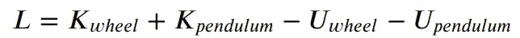

根据上图，我们可以推导出一组动力学方程(拉格朗日方程)，

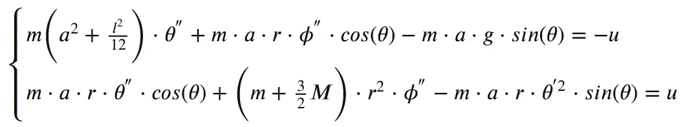

其中 **u** 是安装在机器人车轮上的电机扭矩。

为了求解这些方程，我们可以将它们转换成如下表示的矩阵，

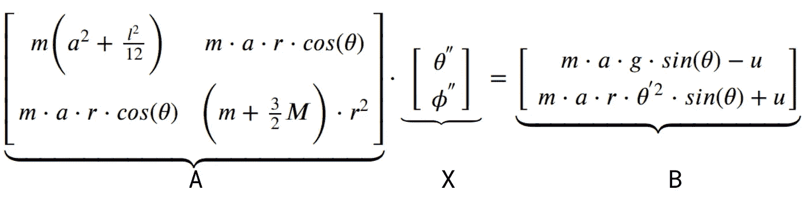

利用这个公式，

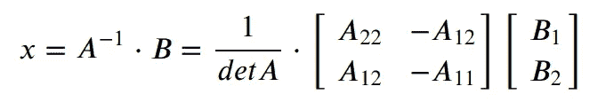

我们得到一组**微分方程**(用 C++实现的详细解见 Jupyter 笔记本) :

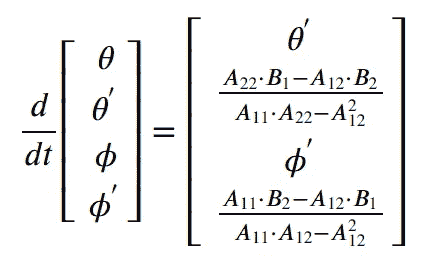

在哪里，

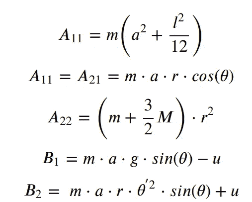

稍后，平衡机器人的电机扭矩计算如下(这是一个 [PD 控制器](https://en.wikipedia.org/wiki/PID_controller)，其系数在开发过程中进行了调整)。

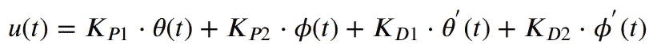

请注意，计算加速度的微分方程包括控制信号 **u** (扭矩)——上面的定义，其是在动态系统的当前状态的相同时间戳中计算的。

在下一节中，我将描述一些模拟，您可以自己运行这些模拟。既然要计算动态模型，就必须正确选择 **u(t)** 信号中的系数。鼓励调整不同的系数并模拟机器人的初始位置。

对于摆锤的初始位置等于 30 度，我们可以画出摆锤(蓝色)和轮子(橙色)的位置，KD2 = 1000。

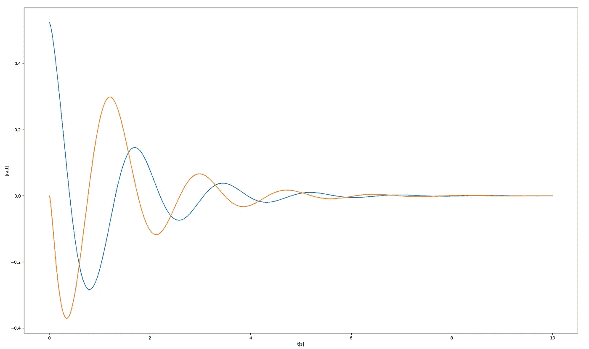

pendulum and wheel positions

对于摆锤的初始位置等于 30 度，我们可以绘制摆锤(蓝色)和轮子(橙色)的角速度，KD2 = 2000。

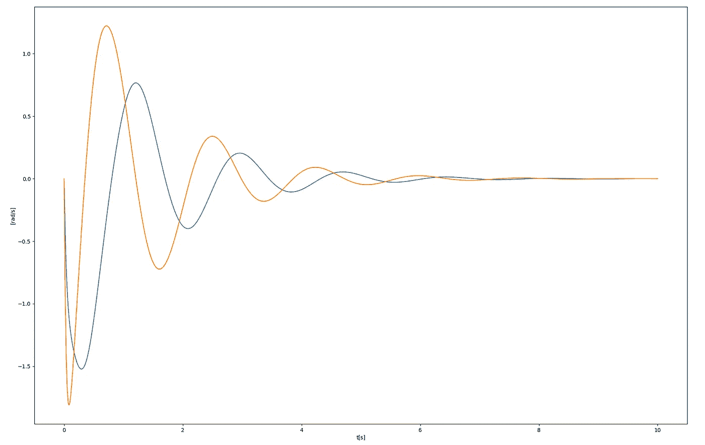

pendulum and wheel angular speeds

类似地，对于摆锤的相同初始位置等于 30 度，我们可以模拟并绘制摆锤(蓝色)和滚轮(橙色)的位置，但是微分增益 KD2 = 500。如你所见，稳定机器人需要更长的时间。

角度位置，

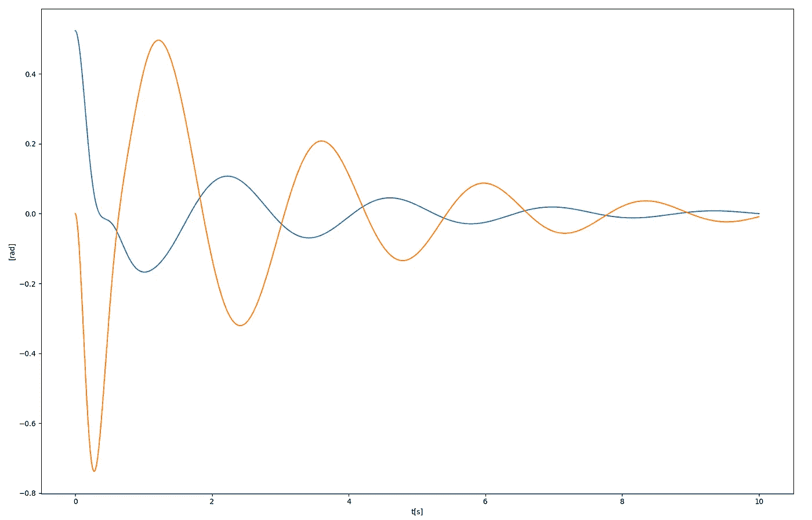

pendulum and wheel positions

角速度，

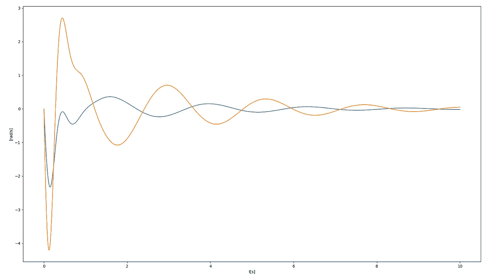

pendulum and wheel angular speeds

感谢您的阅读。