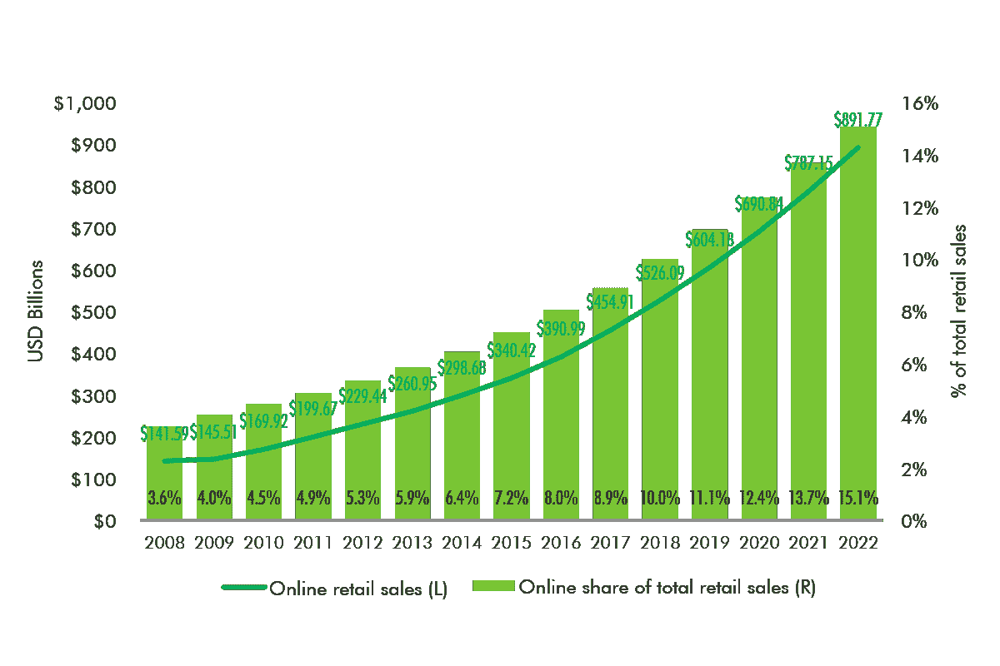
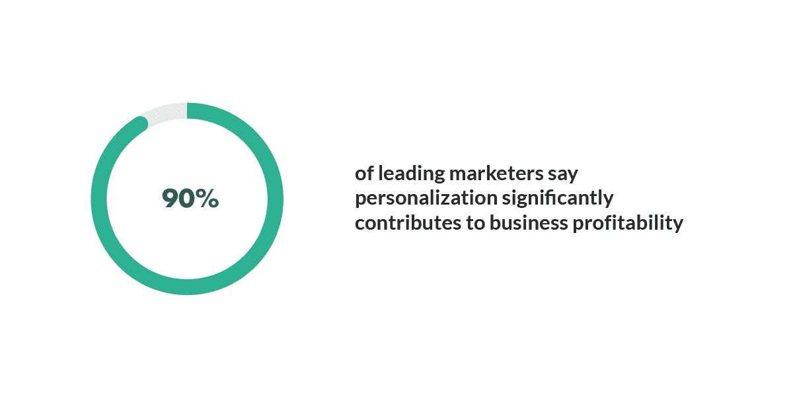

# 电子商务个性化:如何提高客户效率

> 原文：<https://medium.com/geekculture/e-commerce-personalization-how-to-enhance-customer-efficiency-2137dbaef97a?source=collection_archive---------13----------------------->

[来源](https://blog.contactpigeon.com/ecommerce-personalization-guide/)

电子商务越来越受欢迎已经不是什么秘密了。事实上，最近的一份[报告](https://www.cbre.us/real-estate-services/real-estate-industries/omnichannel/the-definitive-guide-to-omnichannel-real-estate/by-the-numbers/how-high-will-e-commerce-sales-go)发现，到 2022 年，网上零售额有望达到**8910 亿美元。**

[来源](https://www.cbre.us/real-estate-services/real-estate-industries/omnichannel/the-definitive-guide-to-omnichannel-real-estate/by-the-numbers/how-high-will-e-commerce-sales-go)

随着这一数字的不断增加，企业关注个性化客户体验变得越来越重要。

而且，谁不想提高自己网站的客户效率呢？当然，每个企业主都努力为他们的客户提供最好的服务。

个性化用户体验是实现这一目标的最佳方式之一。通过为购物者量身定制网站，你可以为他们创造一个更高效、更令人满意的在线购物过程。

个性化的在线购物体验可以增加参与度和转化率，并最终推动零售商的销售增长，这些零售商努力向客户提供量身定制的产品推荐和有针对性的内容。

在这篇博客中，我们将分析如何个性化你的电子商务商店，以提高客户效率。我们将涵盖从创建有针对性的产品推荐到使用客户数据来改善您的结账流程的所有内容。

# 电子商务中个性化的好处

**1。通过提高转化率增加销售额**

获得销售的关键是了解你的客户。当你能够给顾客他们想要的东西，他们想要的时间，以及他们喜欢的方式，你可以肯定你的销售会增加。

一种方法是使用个性化的销售技巧；基于客户的行为或购买模式，提供与其兴趣相关的额外产品。

这让他们觉得自己很特别，这反过来会鼓励他们更多的访问或购买。而且不止于此；关注每一个顾客也能让你洞察到为什么一个特定的产品在以前的场合会失败或成功。

[来源](https://www.scnsoft.com/ecommerce/ecommerce-personalization)

有了这样的数据，有针对性的营销变得更加容易，在未来的活动中带来更高的收入数字，以及更高兴的买家，他们会因为受到良好的对待而再次购买。

通过这种方式，电子商务个性化通过提高转换率在促进你的销售中发挥着至关重要的作用。你也可以 [**雇佣开发人员**](https://www.valuecoders.com/hire-developers?utm_source=hire_dev&utm_medium=Guest_Blog&utm_campaign=medium_Geek&utm_id=NKY) 来创建一个高效的 web 开发解决方案，给你的客户一个愉快的体验。

**2。更多的人会被吸引到网站**

我们总是认为我们的网站应该向每个人展示一切。我们展示的东西越多，人们就会越感兴趣。

但是，一旦我们把所有的东西都放在我们的网站上，让任何人访问，我们就错过了一些本可以促成一两笔交易的东西。专注于发现每个用户可能需要的是电子商务个性化发挥作用的地方。

这有助于你关注那些真正能从你的产品/服务中受益的访问者。换句话说，它确保只有那些最需要你的产品的客户才能看到它们。

根据用户的兴趣定位用户有助于企业通过网站增加销售额。这一过程不仅节省时间，而且比通常的针对新受众的一刀切方法需要更少的努力。

此外，电子商务个性化不仅增加了你的网站流量，也增加了转化率。

**3。更好的客户体验**

电子商务个性化对您客户的满意度有直接影响。这确保了他们得到他们想要的，而不是一个一刀切的策略，可能不会吸引所有人。

[来源](https://www.smartinsights.com/ecommerce/web-personalisation/types-ecommerce-personalisation/)

例如，如果你在网上销售礼品和纪念品，提供定制选项可以使你的商店收入增加近 20%。

想象一下，当顾客知道他们的礼物只属于他们时，他们会有多满意。那才是真正的价值！此外，客户忠诚度和个性化产品之间有着直接的关联。

有了定向优惠，用户会觉得自己受到了尊重，同时也看到了比其他人更适合自己需求的东西。

毫无疑问，个性化的互动创造了一个让消费者感到被欣赏的氛围。因此，电子商务个性化也有助于您增加客户体验。

**4。收入和 AOV 的增加**

电子商务个性化可以**增加高达 20%的收入**，并对转换率产生积极影响。

通过使你的营销努力与你所在行业的人们的需求相一致，你可以缩小你的客户群，以匹配那些特别吸引他们的产品和服务。

这最终将使平均订单价值提高约 30%，并增加收入。当顾客参与进来时，他们更有可能回来。电子商务个性化促进参与，增加对你的企业的忠诚度。

这样做的好处是，如果潜在的长期客户感到受到重视，他们会继续回来。此外，随着时间的推移，参与会增加忠诚度，忠诚的客户通常愿意在他们的产品或服务上花费更多，并与他人分享。

**5。客户维系**

作为一个在线企业主，你的一个重要目标是吸引客户并让他们回头客。个性化的电子邮件、定制的搜索结果和优化的产品列表都有助于提高客户忠诚度，这意味着重复购买和口碑推荐。

如果你想让你的顾客回来，他们需要感觉到他们被重视。任何实现这一目标的小小努力都可能大有裨益。

Forrester Research 的一项研究表明，当公司每周发送一封电子邮件时，打开率会增加 21%，但当公司每周发送七封或更多邮件时(尤其是如果这些邮件是个性化的)，打开率会飙升 112%。

数字本身就说明了问题:个性化的营销举措会带来更高的转化率和品牌忠诚度。通过这种方式，你可以理解电子商务个性化是提高客户保留率的当务之急。

# 如何使电子商务个性化有效

有几种不同类型的电子商务个性化，企业可以使用，以更好地服务于他们的客户。

1.  **使用客户明细**

第一种是利用顾客过去购买的详细资料，以便为将来的购买提出建议。你可以通过查看顾客过去购买的商品，然后向他们推荐类似或相关的商品。

电子商务企业也可以使用客户数据来创建有针对性的广告和促销活动。例如，如果企业知道客户对某类产品感兴趣，他们可能会给客户发送该产品的销售广告。

此外，你还可以 [**雇佣印度的电子商务开发人员**](https://www.valuecoders.com/hire-developers/hire-ecommerce-developers?utm_source=hire_eCom&utm_medium=Guest_Blog&utm_campaign=medium_Geek&utm_id=NKY) 来个性化你的电子商务网站，以获得最大利益。

**2。行为触发的电子邮件**

另一种类型的个性化，电子商务企业可以用来作为行为触发的电子邮件。这些电子邮件是根据消费者在网站上的行为发送给他们的。

例如，如果客户将一件商品添加到他们的购物车中，但没有购买它，电子商务公司可能会向他们发送电子邮件，提醒他们该产品，并提供折扣，如果他们在一定时间内购买它。

行为触发的电子邮件也可以用来提高客户忠诚度。例如，如果客户在一定时间内没有登录网站，企业可能会向他们发送电子邮件，鼓励他们再次访问。

**3。产品推荐**

产品推荐包括根据顾客过去的购买或浏览历史，推荐他们可能感兴趣的商品。员工可以手动完成，也可以使用分析数据模式的算法自动完成。

通常，如果顾客从网上商店购买一件商品，他们被推荐的下一件商品并不总是与刚刚购买的商品相同。

例如，如果你在亚马逊上买了一双鞋，你可能会得到类似的建议，如袜子或拖鞋。

此外，除了购买历史之外，还会考虑其他因素，如客户的浏览历史和人口统计数据。

产品推荐的用户通常会意识到，他们正在根据自己的偏好和习惯获得个性化的报价。

**4。个性化 CTA**

行动号召(CTA)是一种鼓励访问者采取特定行动的元素，例如购买产品或订阅时事通讯。

个性化的 CTA 可能比一般的更有效，因为它更有可能吸引个人游客。

此外，个性化 CTA 有许多方法，但一些最常用的方法是:

*   **使用客户的名字**

这是一个简单而有效的方法，可以让 CTA 感觉更加个性化。您可以使用客户的名字或其首字母。

*   **提供个性化推荐**

如果您有显示客户可能对哪些产品感兴趣的数据，您可以使用这些信息来创建个性化的 CTA。

*   **使用客户的位置**

如果访问者来自您所在国家或地区以外的国家或地区，您可以根据他们的位置显示不同的 CTA。例如，如果他们来自另一个国家，而你的网上商店是国际运输，你可以给他们一个 CTA 来查看国际运输价格。

*   **使用以前购买的商品**

如果客户以前在您的商店购买过产品，您可以向他们展示他们可能感兴趣的类似商品的 CTA。

**5。客户档案**

客户特征分析是收集客户数据以了解他们的需求和偏好的过程。这些信息可用于创建有针对性的营销活动，以及个性化网站和应用程序的用户体验。

[来源](https://www.superoffice.com/blog/personalization/)

收集客户数据的方式有很多，比如通过调查、反馈表格或社交媒体帖子。一些公司还从第三方来源购买客户数据。一旦收集了数据，您就可以对其进行分析，以确定趋势和模式。

此外，客户简档是电子商务中的常见做法，大多数客户都愿意分享一些个人信息，以便获得定制的推荐和优惠。

# 结果

个性化内容是吸引客户和增加销售的最有效的方法之一。通过使用关于他们偏好和习惯的数据，企业可以创建更有可能鼓励购买的有针对性的营销活动和个性化体验。

你越了解你的客户是怎么想的，是什么促使他们采取行动，你就越有能力创造一个卓越的营销策略。

按照正确的顺序排列产品可以帮助购物者快速找到他们需要的东西，同时也给主页一个令人兴奋的布局。此外，通过提供完整的产品描述和其他评论，努力使您的网站对用户友好并与客户互动。

此外，您还可以联系一家 [**电子商务发展公司**](https://www.valuecoders.com/ecommerce-development-services-company?utm_source=eCom_Dev_Com&utm_medium=Guest_Blog&utm_campaign=medium_Geek&utm_id=NKY) ，帮助您根据客户需求定制个性化的电子商务商店。

仅此而已！