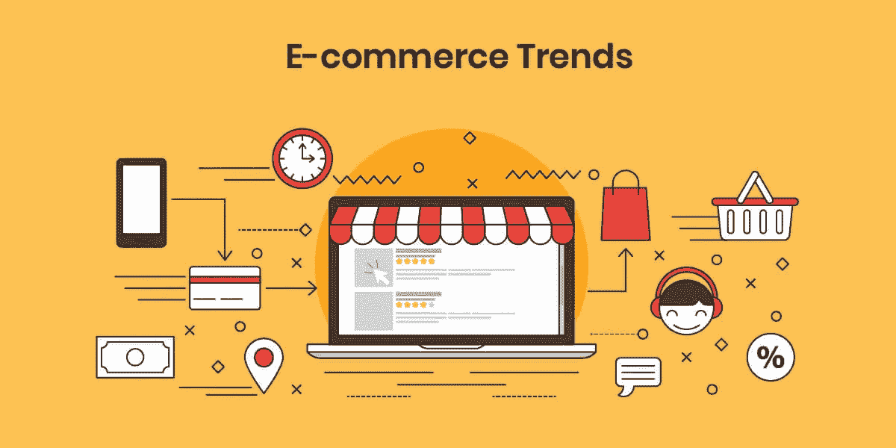

# 2021 年值得关注的电子商务趋势

> 原文：<https://medium.com/geekculture/e-commerce-trends-to-watch-out-for-in-2021-9ebbc1925bbc?source=collection_archive---------39----------------------->

不用说，2020 年并没有完全按照计划进行。疫情在各个层面影响着我们，无论是我们与客户互动的方式，还是我们研究用户体验的方式。新冠肺炎加速了我们已经看到的趋势——在一年内实现了十年的电子商务增长。国内消费者极大地改变了他们的购物行为，数以百万计的企业被迫加大对现有电子商务渠道的投资，或者首次上网。

需求在不断变化，根据 BCG 消费者情绪的研究，预计到 2021 年，电子商务销售额将达到惊人的五万亿美元)。品牌现在必须快速适应，如果他们要生存和区分自己的竞争对手。

作为前端应用程序开发人员，您在帮助商家在这个不断变化的时代取得成功和繁荣方面处于独特的地位。在这篇文章中，我们来看看电子商务的最大趋势，并请领先的 Shopify 和客户体验专家预测未来 12 个月最重要的电子商务战略和发展方法。当你在当前或下一个应用程序或在线商店工作时，记住它们，你将为零售商在 2021 年的需求做更好的准备。

# 1|改善您的网上购物体验

Shopify Plus agency We Make Websites 的联合创始人亚历克斯·奥伯恩(Alex O'Byrne)认为，由于疫情，网站已经成为许多品牌的主要购物渠道，而不是商店访问的次要或替代方法。

> “多年来，新冠肺炎一直在推动电子商务的采用。这意味着我们作为一个行业，需要比 2020 年初做好更好的准备来应对，”O'Byrne 解释道。“电子商务竞争极其激烈。最好的技术将暂时吸引更高的转换率，直到它们变得广泛，其他东西成为优势。”

亚历克斯·奥伯恩

因此，O'Byrne 建议，电子商务公司需要提供比大型电子商务巨头更多的东西来区分自己，并建议专注于今年的下一步:

使用 Klevu、Algolia 和 Searchspring 等服务进行强大的搜索和过滤。

Angelus 和 search，包括 Google 和 search 这样的搜索引擎，Google 和 Google Search 这样的搜索引擎，Algclus，Google 和 Google 这样的搜索引擎。理想情况下，在所有接触点(页面、搜索、购物车/结账、营销电子邮件)，尽可能谨慎。

丰富的购物信息。例如，改进的规模准则、即时聊天和试验/放大现实。

由于改进的开发方法和 headless 的引入，几乎瞬间的站点加载速度。

由于国内订单量的增加，简化了退货和换货流程。

对于实体店，无限通道概念、店内提货和简化库存管理。

能够满足更高的容量是至关重要的。当竞争对手对第二天交付充满信心时，“我们的发货因 COVID 而延迟”不起作用。

消费者信心增强。对行为的非金钱奖励(例如碳中和交付、登记投票、慈善捐赠)。

在所有这些领域，Shopify 生态系统拥有丰富的服务，允许您改进您提供的服务或应用程序，而不需要大量的时间和资源。在这篇文章中，我们仔细看看其中的一些。

# 2|进行快速客户调查

Biglight 的快速客户调查信息图在五个工作日内提供信息。

体验设计机构 Big light 的联合创始人史蒂夫·博尔赫斯(Steve Borges)认为，希望跟上不断变化的客户需求、行为和偏好的零售商越来越多地使用快速客户调查来加速创新。

> “零售商在一个变化是唯一不变的环境中经营，”他指出。“这意味着客户体验创新比以往任何时候都更加重要。但品牌也需要适应并强烈关注客户需求，这意味着在从概念到设计的整个过程中嵌入客户研究。”

博尔赫斯还表示，快速客户研究有助于塑造和验证从重大颠覆性想法到适应和优化的一切，不会减缓创新，但会给零售商带来他们快速适应所需的清晰性和确定性。

即使是作为智能设计研究的一部分的草图概念，也可以告诉我们在这种新的现实中什么可能有效，什么可能无效，以后可能会出现什么问题，什么调整和优化可能会提高性能或消除客户体验中的摩擦。

“今年，我们看到一些全球品牌将快速客户研究置于体验创新的核心。另一种选择——在没有客户证据的情况下工作——是一种更加不确定的方法，如果我们目前都需要什么，那就更加确定了。”

# 3|在线带来店内体验

Shopify Plus partner Disco 的创始人兼首席执行官 Gavin Ballard 预测，由于新冠肺炎，零售商将找到更多创造性的方法来结合面对面和数字购物体验，而客户将更愿意接受搜索、比较和购买产品的新方法。

Ballard 看到了增强和虚拟现实(AR/VR)以及客户在线服务方面的特别进展。

# 增强现实和虚拟现实

电子商务趋势:手机拍摄床的照片，并在床单社会中使用 AR

床单协会的床建设者利用 AR 让顾客尝试不同的颜色和风格。使用智能手机的摄像头，他们可以看到不同的组合在床上会是什么样子。

AR/VR 体验与在现实生活中看到产品不太一样，但 Ballard 表示，它们可以帮助客户获得做出购买决定所需的信息。

Shopify Plus 零售商 The Sheet Society 通过其支持 AR 的 Bed Builder 接受了这一点，该产品允许客户在将床上用品放入购物车之前，想象它们在真实房间中的样子。这让客户对决策充满信心(增加了转化率)，同时降低了板材协会承担退货成本的风险。

# 虚拟服务

面对面销售的好处之一是能够与店内的潜在顾客建立直接的个人联系。许多零售商正试图通过在线服务提供这种服务，如 1:1 实时聊天。然而，最近几个月，巴拉德看到一些公司走得更远。

例如，设计家具零售商 Brosa 已经转向通过视频电话提供参观和建议的完整展厅体验。甚至汽车经销商——通常依靠面对面销售发展的企业——也开始适应提供更全面、更吸引人的在线体验。

# 4|注意无头脑交易

Shopify agency The Taproom 的创始人 Kelly Vaughn 认为，今年我们将看到越来越多的零售商选择无头架构，这种架构将电子商务后端与面向客户的端分离开来，让零售商可以从头开始构建任何内容管理系统的新店面。

“随着零售商转向无头解决方案，他们可以继续使用 Shopify 来完成交易和管理产品管理，”Vaughn 解释道。“这在大中型企业中变得越来越普遍，它们希望从整体上对自己的网站有更多的控制。”

Vaughn 指出，开发人员喜欢 headless 方法，因为他们可以利用 React 和 Vue.js 等 JavaScript 库的现代技术堆栈，甚至可以通过将店面转变为渐进式 web 应用程序来实现显著的性能提升。短舱和幕府前端等服务完全为您处理 API 层，因此您可以专注于构建独特的高性能商店体验。

然而，无头功能也有它的缺点。沃恩警告说，零售商将不再使用 Shopify 的主题编辑工具，并将不得不学习 Contentful、Prismic 或 Builder 等新内容管理系统的内部工作方式。如果他们没有与 headless storefront 集成的 API，他们也将无法使用某些 Shopify 应用程序。最后，这种方法还需要更多耗时的开发人员资源来构建和维护店面。

# 2021 年额外努力帮助你的客户和用户。

到 2021 年，零售商将不再能够决定消费者如何购物以及在哪里购物，否则就有被落在后面的风险。无论使用何种渠道和支付方式，品牌都必须比以往任何时候都更好地适应并与客户沟通。

开发人员需要为这种变化做好准备，这样他们就可以为客户和应用程序用户做出更多努力，以满足快速变化的需求。了解本文中描述的电子商务趋势可以帮助他们重新思考如何向客户销售产品，并为他们创造更好的体验。尽可能快地制作您的网站和应用程序，为您的项目选择最佳的技术堆栈，并准备好利用新的市场。如果你正在寻找一个电子商务开发者，在印度有许多应用程序开发公司帮助你创建电子商务应用程序。