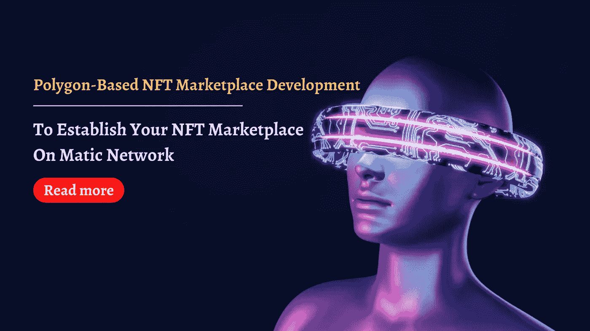

# 基于多边形的 NFT 市场开发——在 Matic 网络上建立您的 NFT 市场

> 原文：<https://medium.com/geekculture/e-dpolygon-based-nft-marketplace-development-to-establish-your-nft-marketplace-on-matic-network-97061b44f09f?source=collection_archive---------14----------------------->

## 你好，看这里……..！

你有办法提高你的商业收入吗？不用再等了！这是你的时间。你想每月赚十亿美元吗？这个博客应该有助于使你的 NFT 市场业务取得成功。

## 多边形 NFT 市场开发

[**Polygon NFT 市场开发**](https://www.cryptocurrencyscript.com/nft-marketplace-development?utm_source=mediumgeek&utm_medium=guestblog&utm_campaign=RS) 服务通过将高级安全性与可扩展性相结合，提供了一个增强的 NFT 市场。NFT 市场的增长通过与以太坊和主权网络的合作，Matic 网络提供了速度的最佳版本。

> 你还在等什么？在创建基于多边形的 NFT 市场平台时，自己研究一下谁能提供最佳解决方案来在 Matic 网络上构建您的 NFT 市场。通过提供高级 NFT 搜索过滤器来识别您的 Matic NFT 市场上不可替换的令牌，我们的团队提供了无缝的用户体验。

## 马蒂奇 NFT 市场的特点

Matic 在 NFT 市场解决方案中提供了吸引人的功能。其中一些是专门为你列出来的。

**支持以太坊兼容**

技术标准正在发展，目标是提供一个支持以太坊区块链网络的 NFT 市场。

**极度安全**

Matic 网络中的验证检查确保所有用户交易都得到安全处理。

**增强用户体验**

界面被设计成视觉上吸引人的，以便抓住用户的注意力。

**跨链兼容**

为连接到外部系统进行通信提供大规模互操作解决方案。

**易用性**

Matic 网络简化了协议，使 NFT 市场易于使用。

**公共侧链**

支持多种协议，这些 matic 侧链本质上是公共的，这意味着它是完全无权限的。

**高吞吐量**

在内部测试网的帮助下，单个侧链可以达到 10，000 TPS。

**可扩展**

共识算法通过在 Matic 侧链上实现快速交易为用户提供了可扩展性。

模块化

Matic 网络中的模块化通过允许更快的升级提供了更多的支持。

## 多边形概述

Polygon (Matic)是一种以太坊协议，旨在以太坊网络之上提供可伸缩性、安全性和快速事务处理。为了提高网络速度，它采用了等离子侧链和证据的网络协议。NFT 市场上的 Matic 网络旨在创建先进的区块链安全性。

除此之外，Matic 将以太坊和主权区块链结合起来，创建了一个成熟的多链系统。NFT 市场上这款 Matic 的主要目标是在保持安全性的同时，消除高昂的汽油费和缓慢的车速。

## 为什么要在 Matic 上建立 NFT 市场？

创建一个 NFT 市场 Matic 网络提供了许多优势时，在 NFT 市场交易 NFT。通过在这个区块链网络上提供无障碍交易，Matic 网络继续提高 NFT 市场的速度。使用 Matic 上的这个 NFT 市场，任何用户都可以下注自己的资产，以赚取越来越多的奖励。

> 由于大量不可替代的代币转移，NFT 市场正经历缓慢的交易量稳定。这个问题通过一致性算法在 Matic 网络上得到完全解决。
> 
> 用户参与度高于其他区块链网络，因为 Matic 承诺在这个 Matic NFT 市场上提供令人惊叹的用户体验。

## 在多边形网络上建立 NFT 市场的商业利益

*   在 Matic 网络上创建 NFT 市场避免了其他 NFT 市场遇到的一些陷阱，
*   交易费用，如汽油税，非常低。
*   每秒的交易率很高。
*   作为感谢，该公司为 NFT 用户提供了股份奖励。
*   在 Matic 区块链上，以每秒 65，000 笔交易的速度处理数百万笔交易。
*   这一网络发布的巨大成功导致招募新的开发人员在 polygon 网络之上构建 dApps。

## 如何在 Matic 上开发 NFT 市场？

*   创建 NFT 市场使用 Matic 比你想象的要容易。根据 Matic 的说法，以下步骤概述了如何在强大的区块链网络之上建立 NFT 市场。
*   在启动你自己的 NFT 市场之前，考虑你对 NFT 市场的兴趣，比如房地产的非功能性交易、艺术的非功能性交易、音乐的非功能性交易、收藏品的非功能性交易、游戏的非功能性交易等等。
*   一家 NFT 市场开发公司收集了您的需求，并为执行 NFT 市场开发的几个阶段创建了一个预先计划，例如 NFT 市场的前端和后端开发、测试和部署。
*   最初，开发人员专注于创建一个有吸引力且用户友好的 NFT 市场，以展示 NFT 收藏品，如艺术品、游戏、数字资产等。
*   当且仅当智能合同承诺交付预定义的功能时，NFT 开发商设计良好的 NFT 市场才能提供良好的用户参与度。
*   在 NFT 市场，高级智能合约执行自动执行协议，以建立受欢迎的 NFT 项目，如 OpenSea、Rarible 等。
*   我们的开发人员专注于交付高级智能合约代码，完美地执行执行过程。
*   一旦开发了 NFT 市场的前端和后端，就必须完成适当的测试阶段，以确保代码没有错误。
*   在测试阶段之后，根据他们首选的区块链集成部署 NFT 市场。
*   我们的 NFT 开发商也在考虑将 NFT 市场与 DeFi 整合。请与我们的团队分享您的商业理念。

# 在 Matic 上开发白牌 NFT 市场

我们在 Matic 区块链服务上的白标 NFT 市场开发为创建具有独特商业理念和目标的 NFT 市场提供了最佳的商业解决方案。

> 在领先的 NFT 市场开发服务公司，您可以获得一个即时解决方案，在 Matic 区块链上推出一个逼真的 NFT 市场，以吸引更多用户加入 NFT 生态系统。我们在 Matic 上的 NFT 市场开发解决方案提供了一个即时的解决方案，可以成功地在 NFT 地区推广您的业务。

## **NFT 市场发展服务如何帮助您？—马蒂奇 NFT 市场发展公司**

你想在多边形网络上创建一个 NFT 市场吗？我在这里建议领先的 [**基于多边形的 NFT 市场开发服务**](https://www.cryptocurrencyscript.com/nft-marketplace-development) 提供商，如 zodeak。

你可能会问为什么选择 zodeak。有选择佐德克的理由吗？

是的，根据我敏锐的研究，zodeak 是一家著名的 [**NFT 市场开发公司**](https://www.cryptocurrencyscript.com/nft-marketplace-development) ，专门在 Matic 网络上创建白色标签的 NFT 市场。我们有一个技术娴熟的团队，正在创造一个可靠的 NFT 市场，整合了马蒂奇区块链的功能。

> 他们有经验丰富的开发人员来确保我们提供世界一流的安全性，并将安全性视为关键的成功因素。在 Matic 网络上建立您的 NFT 市场时，会添加更好的视觉效果。