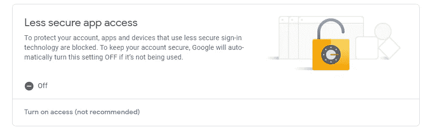
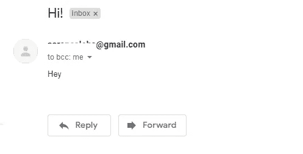

# 通过 Python 发邮件！

> 原文：<https://medium.com/geekculture/e-mails-through-python-6fec8e865b7a?source=collection_archive---------19----------------------->

使用 Python 发送电子邮件。是的，你没看错。

本文将围绕如何使用 SMTP 和电子邮件库使用 Python 通过 Gmail 发送电子邮件展开。这种方法非常简单易懂。所以，事不宜迟，让我们开始吧！

在您开始编写代码之前，您需要对您打算在这个小演示中使用的 Gmail 帐户进行某些安全更改。你需要做的就是进入“管理你的谷歌账户”,然后进入安全设置。一旦你到了那里，你需要做的就是打开“不太安全的应用程序访问”。



Turn this on.

现在，我们可以开始编写代码了。

为此，您只需要两个库:来自电子邮件库的 SMTP 和 MIMEText。

SMTP 或“简单邮件传输协议”,主要处理服务器之间电子邮件的发送和路由。Python 慷慨地为我们提供了一个内置的 smtplib 模块，通过这个模块我们可以创建一个 SMTP 客户端会话对象，用来发送邮件。

电子邮件库中的 MIMEText 将用于构建电子邮件，即正文和主题。

代码如下所示。

```
import smtplib
from email.mime.text import MIMETexts = smtplib.SMTP('smtp.gmail.com', 587)  #creates objects.starttls()s.login('sender_email@gmail.com', 'password')message = MIMEText('Hey')  #Body of the email
message['Subject'] = 'Hi!'  #Subject of the email
list = ['receiver_address_1@gmail.com', 'receiver_address_2[@gmail.com](mailto:hemamatalia@gmail.com)']  #the list of all the destinationsfor i in list:
    s.sendmail('sender_email@gmail.com', i, message.as_string())s.quit()
```

您甚至可以将文件读入一个字符串，并将其作为邮件正文保存到邮件中。

为了简单起见，我用这个给自己发了一封邮件，运行程序后得到的输出是这样的。



The received mail.

这一小段代码可能是您武器库中的一个不错的小武器。您可以使用它直接通过电子邮件发送您的输出。你甚至可以把它当作一个提醒系统，用它直接向你的收件箱发送提醒。这是一段非常通用的代码，可以让你的程序更上一层楼。

我希望你喜欢这篇短文，请继续关注未来的项目。