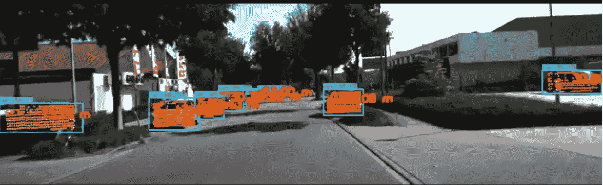

# 自动驾驶汽车的早期传感器融合和目标检测

> 原文：<https://medium.com/geekculture/early-sensor-fusion-and-object-detection-for-self-driving-cars-27e9176e8ff4?source=collection_archive---------5----------------------->

## *了解汽车如何实时评估与另一辆车的距离。*

Early Sensor-Fusion Results: LiDAR and Cameras — Image by author

[在之前的一篇文章](/geekculture/early-sensor-fusion-for-self-driving-cars-de7443365882)中，我向您介绍了将 3D 点云投影到 2D 图像上的过程。

在本文中，我们将通过使用深度学习模型执行对象检测来更进一步。在…