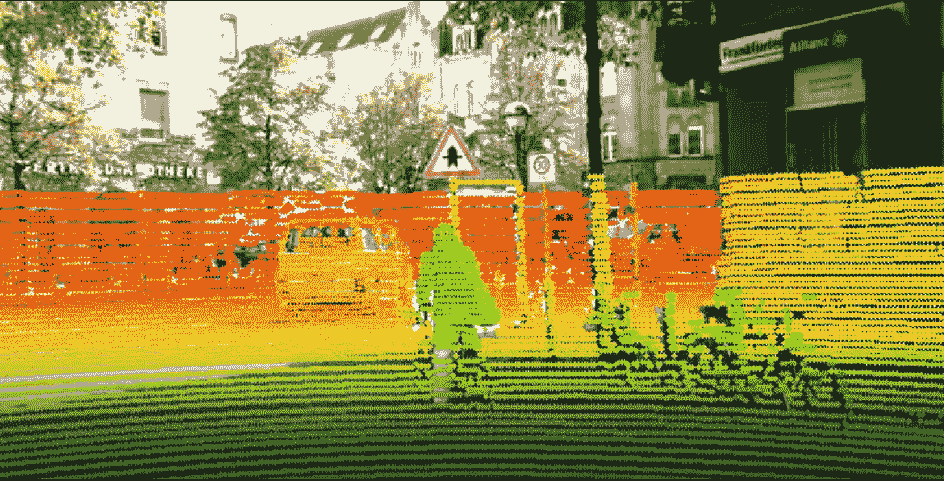

# 自主车辆的早期传感器融合

> 原文：<https://medium.com/geekculture/early-sensor-fusion-for-self-driving-cars-de7443365882?source=collection_archive---------1----------------------->

## 自主车辆感知系统介绍

Result of Sensor Fusion — Image by the author

A 自主车辆需要自己观察和感知周围环境，以便在需要时做出适当的决定。

为了感知他们的环境，自动驾驶汽车在传感器的帮助下收集不同类型的数据，如相机…