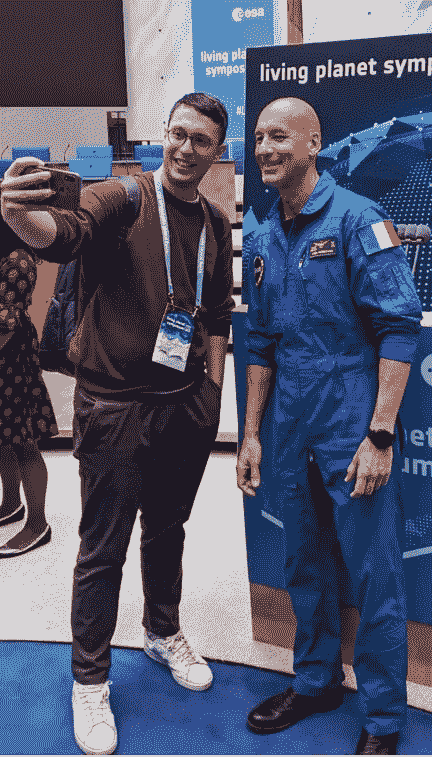
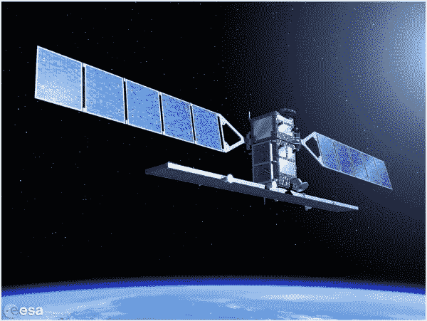
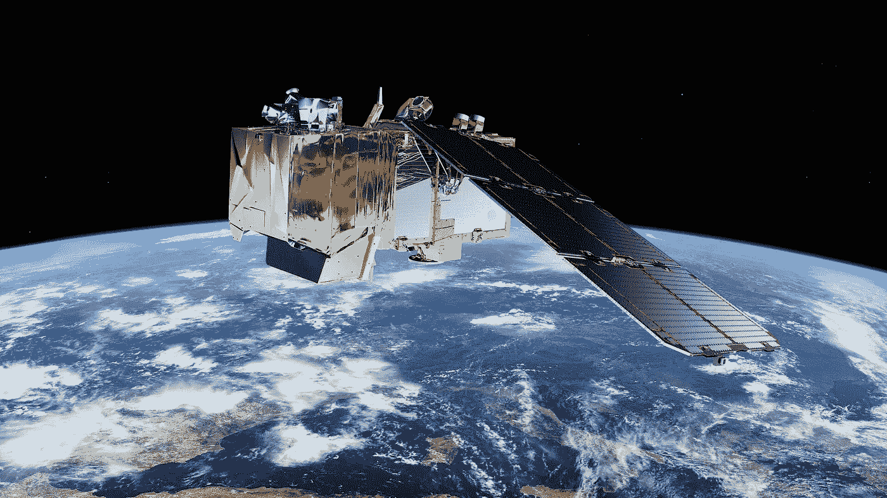
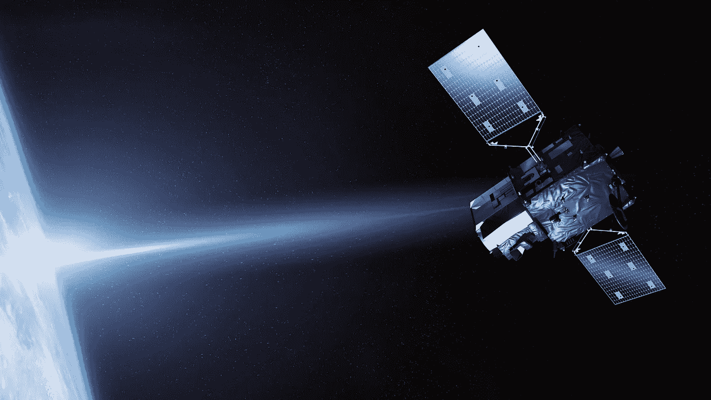
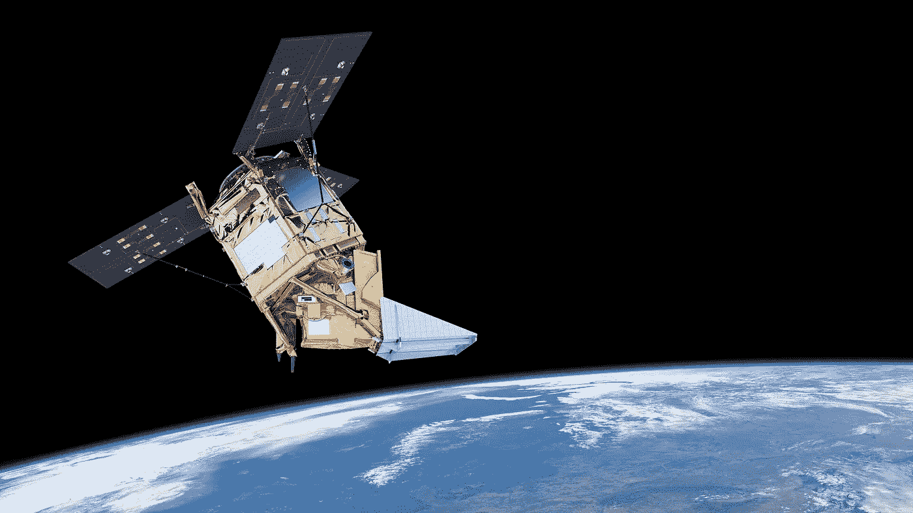
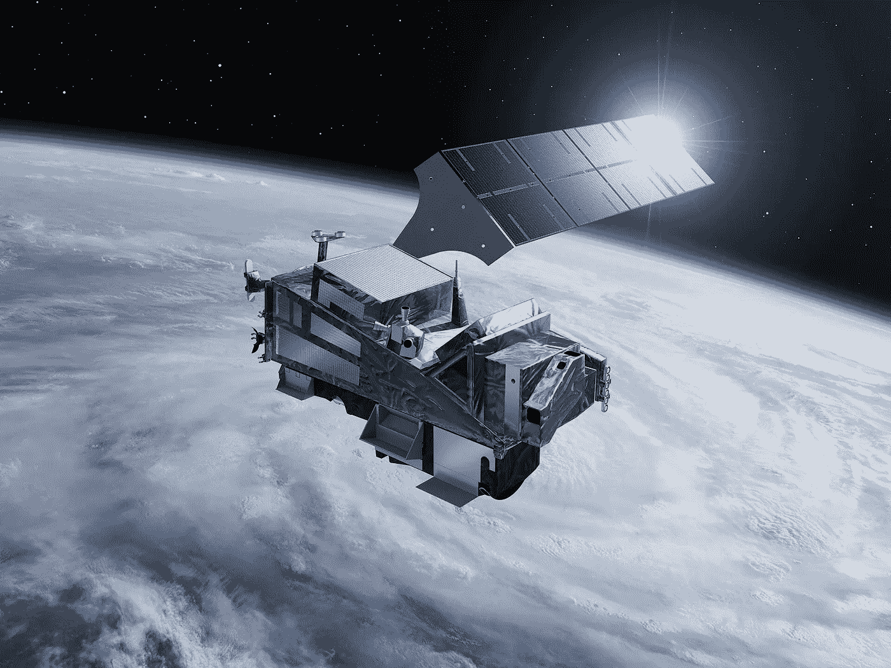
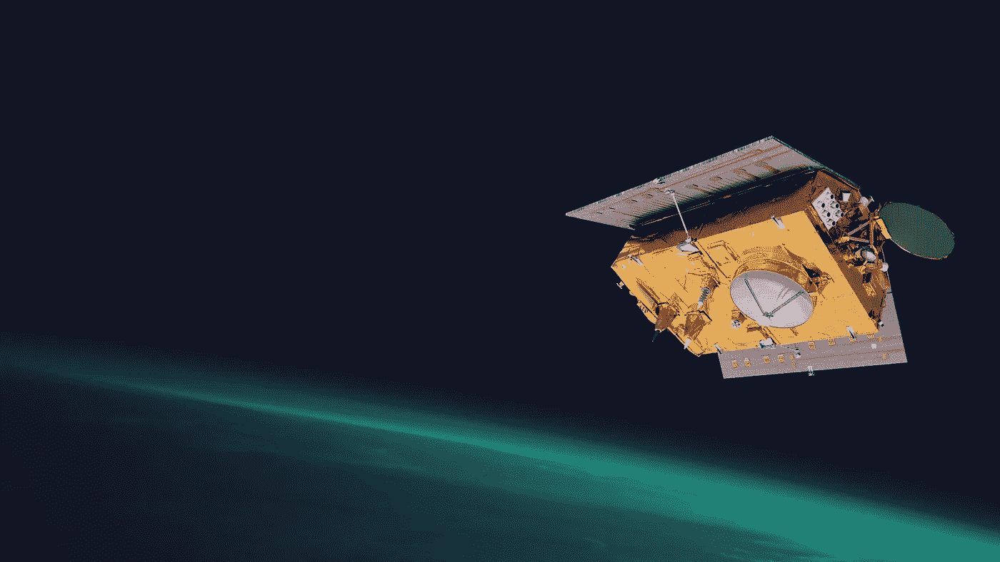

# 我在欧洲航天局的 YGT 经历

> 原文：<https://medium.com/geekculture/earth-observation-with-the-copernicus-programme-data-5cff5a591478?source=collection_archive---------18----------------------->

Photo by [NASA](https://unsplash.com/@nasa?utm_source=medium&utm_medium=referral) on [Unsplash](https://unsplash.com?utm_source=medium&utm_medium=referral)

## 了解哨兵任务，开始使用 AI4EO

## 介绍

我非常幸运地被欧洲航天局的年轻毕业实习生项目录取，并与该领域的专业人士密切合作了整整一年。我欠欧空局很多，因为它让我成长为一个人，也让我在专业上成长。
此外，我还参加了三年一次的最大的地球观测研讨会，即**生命星球研讨会** (LPS 2022)。在这里，我遇到了来自加州理工学院或帝国理工学院等知名大学以及美国宇航局和谷歌等重要机构的专业人士和学生。

我的作用是解释和促进对欧空局提供的几个卫星数据集的访问，以便科学家和工程师可以在他们的项目中使用和整合它们。我学到了很多关于地球观测的知识，因为我想继续在这个空间领域工作，所以我决定写这篇关于哥白尼计划的短文，这可能是迄今为止最重要的地球观测计划。

😁这里展示的是我与卢卡·帕米塔诺的自拍照，卢卡·帕米塔诺是国际舞台上最伟大的宇航员之一，也是在德国波恩举行的生命星球研讨会上的欧洲骄傲。

Selfie with Luca Parmitano (Image by Author)

## **什么是 EO？**

> **地球观测** ( **EO** )是收集关于地球物理、化学和生物系统的信息。它可以通过遥感技术(地球观测卫星)或通过地面或空中平台(例如气象站和气象气球)中的直接接触传感器来实现。

## 关于哥白尼

哥白尼是迄今为止最雄心勃勃的地球观测计划。欧洲的哥白尼计划已经在我们关爱地球的方式上迈出了重要的一步。哥白尼由一个复杂的系统组成，该系统从多个来源收集信息，包括 30 多个地球观测卫星。

哥白尼卫星有两种类型:

1.  欧空局**开发的专用哨兵任务**
2.  来自其他太空机构的现有和计划中的任务称为**贡献任务**也为哥白尼提供数据

每个哨兵任务都携带最先进的技术，以提供一系列补充图像。生成的数据对全球用户开放，你可以从哥白尼哨兵中心下载。

Sentinel Hub 是一种卫星影像服务和 API，可用于检索数据。使用卫星进行地球观测可以定期看到整个地球，这对下游和上游应用都非常重要。

主要存在两种类型的卫星:

1.  **光学-** 像从太空中拍照，受云层和大气影响。因为它也受到阳光的影响，我们有白天和夜晚的照片
2.  **雷达**——不受云层影响，更难掌握，它们有自己的光。

**波段/通道:**探测器能看到的电磁频谱的间隔。你可以想象不同的颜色。每颗卫星都有多个探测器。

这些卫星数据有助于在*食品安全、城市规划、空气质量、预测、洪水管理、干旱检测、飞行安全、漏油检测和漂移预测、森林监测、海洋污染、作物健康和疾病检测、探险旅游*等领域开发商业机会。

# 哥白尼哨兵家族

**Sentinel-1** ([Source](https://sentinels.copernicus.eu/web/sentinel/missions/sentinel-1))

> Sentinel-1 是一种极地轨道全天候陆地和海洋雷达成像服务。其中第一颗卫星" 1A 哨兵"于 2014 年 4 月 3 日由联盟号火箭从法属圭亚那的欧洲航天港发射，1B 哨兵于 2016 年 4 月 25 日发射。

**Sentinel-2** ([Source](https://www.google.com/imgres?imgurl=https%3A%2F%2Fwww.esa.int%2Fvar%2Fesa%2Fstorage%2Fimages%2Fesa_multimedia%2Fimages%2F2015%2F03%2Fsentinel-2%2F15292660-1-eng-GB%2FSentinel-2_pillars.jpg&imgrefurl=https%3A%2F%2Fwww.esa.int%2FEnabling_Support%2FOperations%2FSentinel-2_operations&tbnid=aP_yYFJyuLRxWM&vet=12ahUKEwjjy-bclI36AhXUwQIHHRk7DSYQMygBegUIARDEAQ..i&docid=CXVu-4AcbxaJhM&w=1920&h=1080&q=sentinel%202&hl=it&ved=2ahUKEwjjy-bclI36AhXUwQIHHRk7DSYQMygBegUIARDEAQ))

> **Sentinel-2** 是一项极地轨道、多光谱高分辨率成像任务，用于陆地监测。这一任务为许多实际应用提供了及时的信息，从监测世界植被的健康状况和土地使用方式的变化，到绘制遭受自然灾害的地区。2A 哨兵项目于 2015 年 6 月 23 日启动，2B 哨兵项目于 2017 年 3 月 7 日启动。

**Sentinel-3** ([Source](https://sentinels.copernicus.eu/web/sentinel/missions/sentinel-3/overview/mission-summary))

> **Sentinel-3** 是一个多仪器任务，以高端精度和可靠性测量海面地形、海面和陆地表面温度、海洋颜色和陆地颜色。该任务支持海洋预报系统，以及环境和气候监测。哨兵-3A 于 2016 年 2 月 16 日发射。3B 哨兵于 2018 年 4 月 25 日加入其在轨孪生卫星。

**Sentinel-4** ([Source](https://www.eumetsat.int/sentinel-4))

> **Sentinel-4** 致力于监测关键空气质量微量气体和气溶胶爱欧洲。它由一台高分辨率光谱仪和欧洲气象卫星组织的热红外探测器提供的数据组成，由地球静止气象卫星第三代卫星携带。

**Sentinel-5P** ([Source](https://www.esa.int/Enabling_Support/Operations/Sentinel-5P_operations))

> **Sentinel-5 的前身**卫星任务是 Sentinel-5 的前身，提供影响空气质量和气候的多种微量气体和气溶胶的及时数据。哨兵-5P 于 2017 年 10 月 13 日发射。

**Sentinel-5** ([Source](https://www.esa.int/ESA_Multimedia/Images/2017/02/Sentinel-5))

> **Sentinel-5** 的主要目标是进行高时空分辨率的大气测量，涉及空气质量、气候作用力、臭氧和紫外线辐射，并提供每日全球覆盖。

Sentinel-6 ([Source](https://www.eumetsat.int/sentinel-6))

> Sentinel-6 携带一个雷达高度计来测量全球海面高度，主要用于业务海洋学和气候研究。

## 数据资源

我把下载 EO 域数据的资源链接留在这里，这样你就可以立即开始你的项目了！

 [## 主页

### 地球在线提供欧洲航天局在地球观测领域的新闻和信息。的…

earth.esa.int](https://earth.esa.int/eogateway)  [## 哥白尼空间组件数据存取

### 自 2010 年以来，各种各样的地球观测数据已经产生，以满足哥白尼的需要…

spacedata.copernicus.eu](https://spacedata.copernicus.eu/)  [## 开放式接入集线器

### 为更新数据中心软件安排了一系列维护活动。维护会影响…

哥白尼](https://scihub.copernicus.eu/)  [## 帝雅斯

### 欧洲委员会为中国的发展提供了财政支持。

www .哥白尼. eu](https://www.copernicus.eu/it/accesso-ai-dati/dias)  [## 谷歌地球引擎

### 由谷歌的云基础设施支持观看视频谷歌地球引擎结合了数 Pb 的卫星目录…

earthengine.google.com](https://earthengine.google.com/)  [## 地球观测数据| AWS 公共部门博客

### GREENSPIN 是一家来自德国维尔茨堡的初创公司，致力于改善农业的数据分析领域…

aws.amazon.com](https://aws.amazon.com/blogs/publicsector/tag/earth-observation-data/) 

## 最后的想法

这篇文章仅仅是对地球观测世界的一个简单介绍，这个市场正在越来越大，数据科学家和其他人的新工作岗位每天都在增加。
在未来，我会写更多关于如何使用人工智能算法的文章，特别是计算机视觉算法，来利用这些数据，创造出有价值或能帮助环境的东西，这将是主要目标。

# 结束了

*马赛洛·波利蒂*

[Linkedin](https://www.linkedin.com/in/marcello-politi/) ， [Twitter](https://twitter.com/_March08_) ， [CV](https://march-08.github.io/digital-cv/)