# 将 Daily.co 视频通话支持添加到 React 应用程序的最简单方法

> 原文：<https://medium.com/geekculture/easiest-way-to-add-daily-co-video-call-support-to-your-react-app-19ad97441df3?source=collection_archive---------9----------------------->

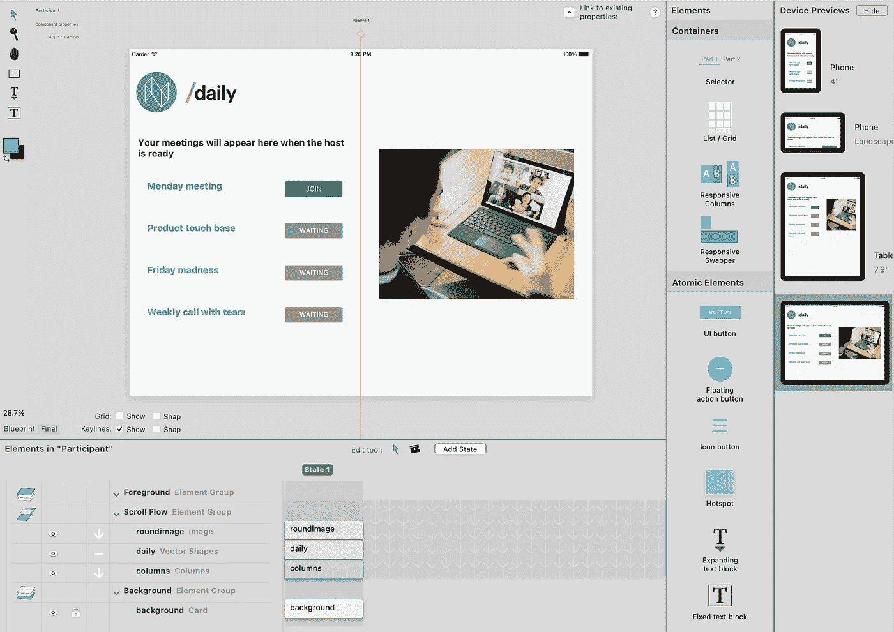

Daily.co 为将他们的视频会议 API 添加到您的 web 应用程序提供了出色的开发体验。他们还提供了[“预建用户界面”](https://www.daily.co/blog/prebuilt-ui/)，这通常可以满足视频会议用户界面的所有需求。

# React Studio 的日常预建 UI 插件

我们将 Daily 的预构建 UI 片段包装到 React Studio 插件中。你可以从 React Studio 的插件商店下载插件。该插件使用起来非常简单，你只需在 React Studio 项目的屏幕或组件上添加并对齐插件元素，然后将“url”链接到你的房间 url 属性。如果房间总是保持不变，您也可以对 url 使用静态设置。

## 动态房间 url

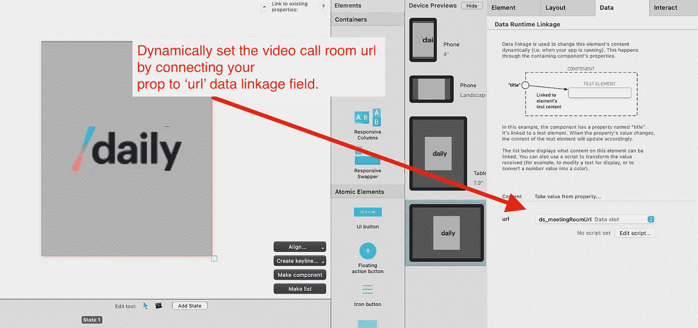

Dynamic video call room

## 固定房间 url

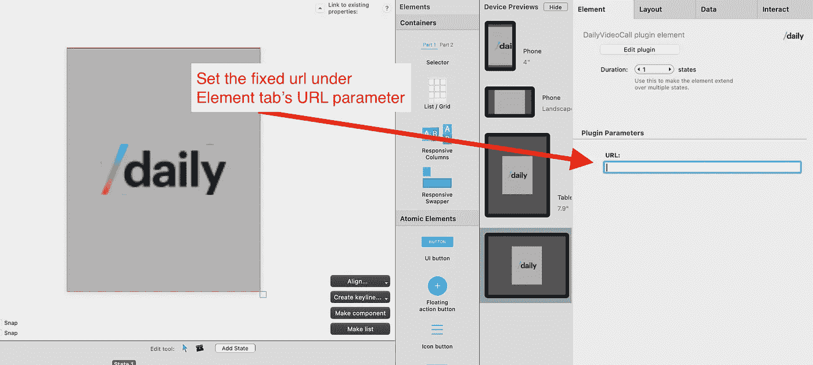

Fixed video call room

> 我假设您知道使用 React Studio 和将您的 UI 连接到 Xano 后端的所有基础知识。如果你是 Xano 和 React 工作室[的初学者，看看这些视频](https://www.youtube.com/watch?v=9vEh8tSLEJ4&list=PLKrYy47a9BRmQ1ZZXRm3TXdpt7KKGlqLB)。

# 教师行政；我的瑜伽馆演示应用

现在我们知道了如何为视频会议应用程序配置 UI，但是我们如何从应用程序中动态地创建新的每日视频通话室呢？

答案很简单:我们在 [Xano](https://xano.io/reactstudio-signup) 中创建一个自定义 API 端点，并配置该端点来调用日报的 API 并“请求”一个新的视频会议室。

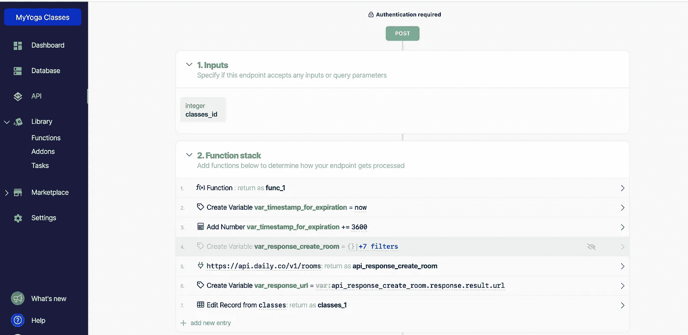

Xano’s endpoint

这里是我在 Xano 的[无代码后端构建器中的自定义端点的一个例子。一开始看起来可能有点吓人，但这很简单。接下来我将分解这些步骤:](https://xano.io/reactstudio-signup)

1.  我创建了一个名为“Func_1”的自定义函数，它简单地检查用户角色是教师还是管理员。

2.创建一个采用当前时间戳的变量。稍后，当我们调用 Daily 的 API 来创建一个视频会议室时，将使用该变量，该视频会议室将在一小时后自动删除。

3.将小时添加到时间戳(3600)秒。

4.我根据从 Daily 的管理员那里获得的示例 API 响应创建了一个 JSON 变量。这包含了当我们调用它时，每日 API 将返回的内容。基本上，我们唯一需要的是房间的 URL，但我会在下一阶段回到这个问题。

5.在这一步中，我们对 Daily 的 API 进行实际的 POST 调用。这可能是最重要的部分。我简单地使用了 Daily 的 [API 文档](https://docs.daily.co/reference#create-room)，用我们的 Daily API 键创建了一个工作 POST 调用，并将其粘贴到 Xano 的外部 API 请求中。

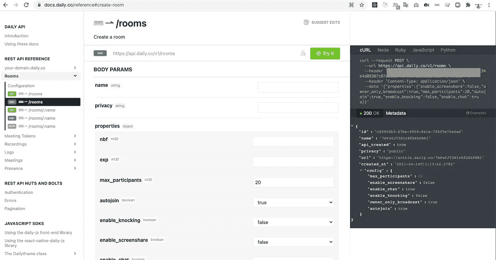

5\. Daily’s API documentation

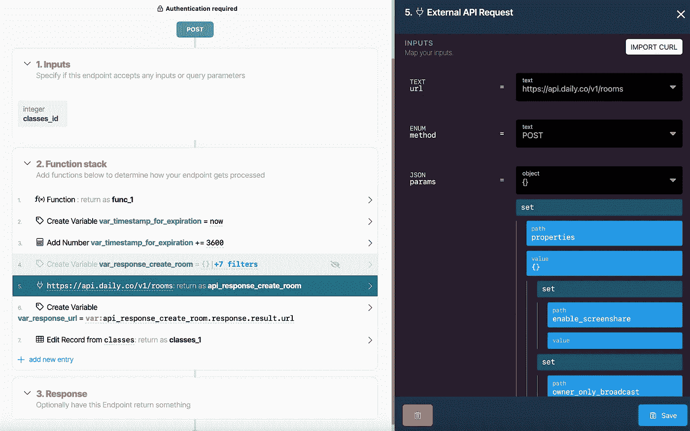

5\. External API request

6.我们创建一个变量，它从每日创建房间 API 的 JSON 响应中选择房间 url。这个 URL 将是我们用来将预建的 UI 插件连接到实际调用的链接。

7.我们将把房间 URL 保存到 classes 表中，并将 class_active 值设置为“true”。然后，当类处于活动状态并启动时，在应用程序的 UI 中使用该值来显示“Join”。

7\. Edit class record in Xano

就这样，现在我们有了一个可以从 UI 调用的端点。接下来我将展示我是如何在我的 MyYogaStudio 演示应用程序中做到这一点的。

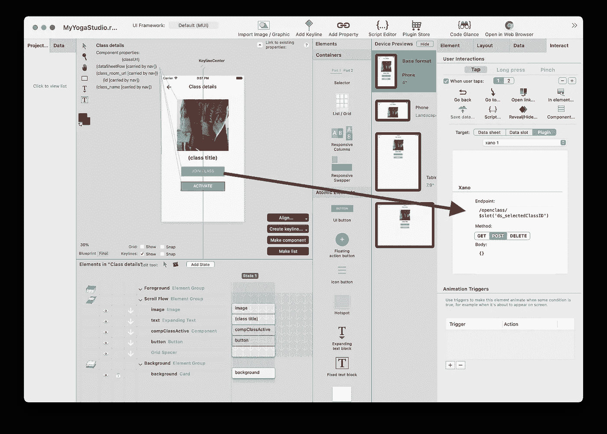

Activate (start) class interaction

Yoga 应用程序的教师管理页面的截屏几乎是不言自明的。当教师单击“激活类”按钮时，它只是调用我们刚刚在 Xano 中创建的端点。端点 url 设置为/openclass/ <data slot="" value="">,这意味着我们将数据槽值(教室 id)注入到端点路径中。</data>

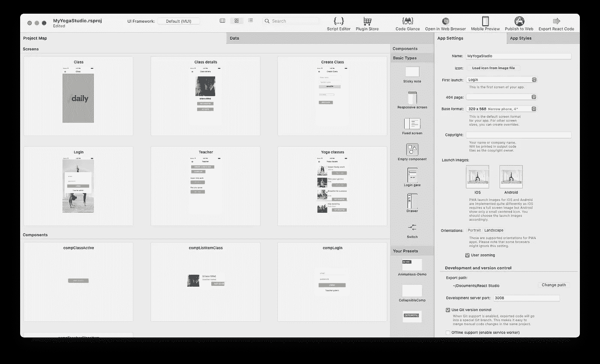

MyYogaStudio example Web app

## MyYogaStudio 最终用户屏幕

app 本身真的很简单；它从登录门开始，主屏幕“只是”一个瑜伽课程列表。列表中的每个类项目包含一个具有两种状态的组件:“加入类”和“未开始”。在列表中，我们根据“class_active”列中的值显示状态。

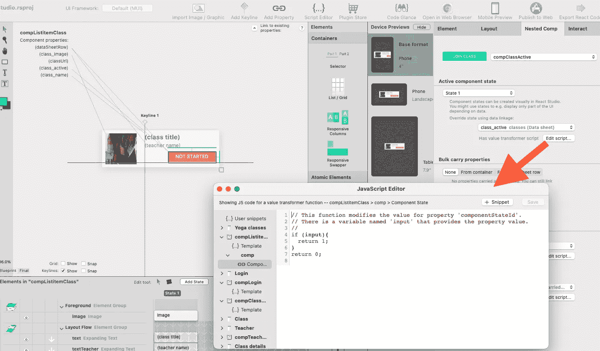

Script: if the value is true then the “Join class” button is shown (the second state) in the component

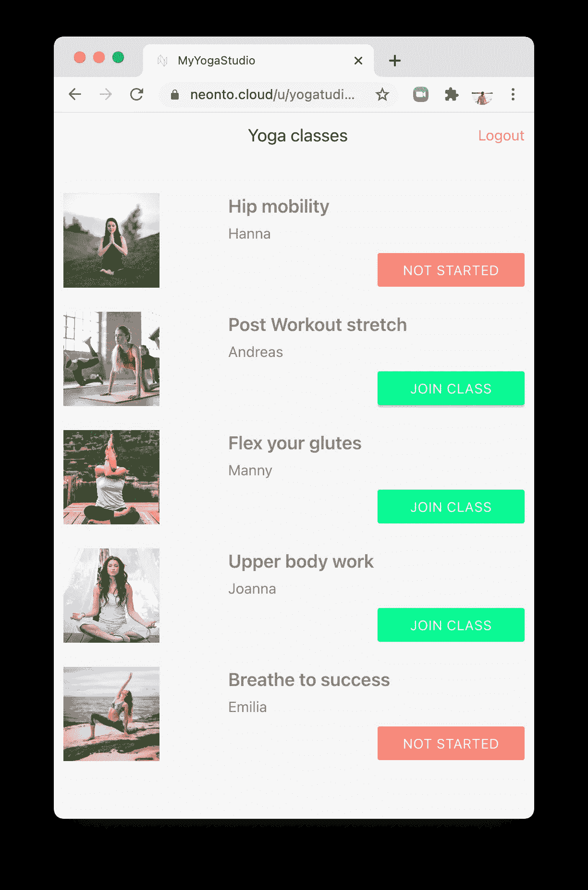

Screen shot of the Yoga class list with three open classes

当用户单击加入类按钮时，按钮交互被设置为将类 url 保存到数据槽，然后转到指向类屏幕的交互。班级屏幕只是一个带有全屏日常插件的屏幕。Daily plugin 从一个“房间 url”数据槽中获取房间 url，我们在第一次交互中用名为 Url 的属性填充这个数据槽。

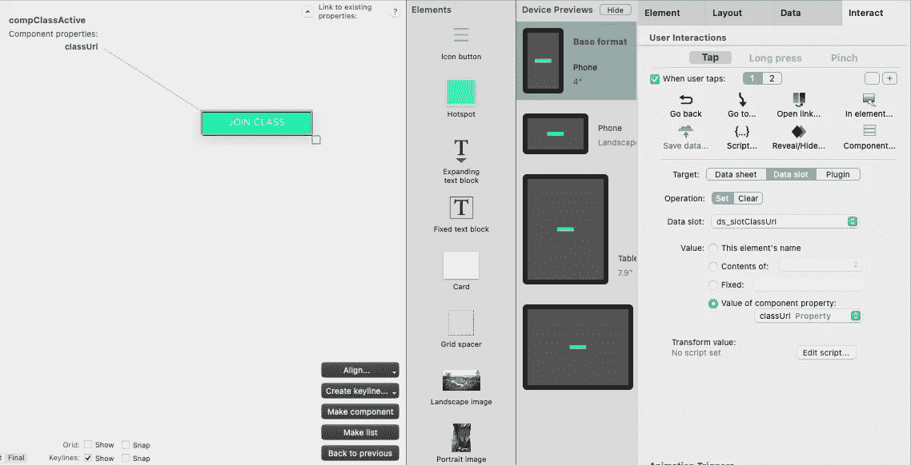

1 .Interaction: Save a room url to data slot

2\. interaction: Go to screen Class

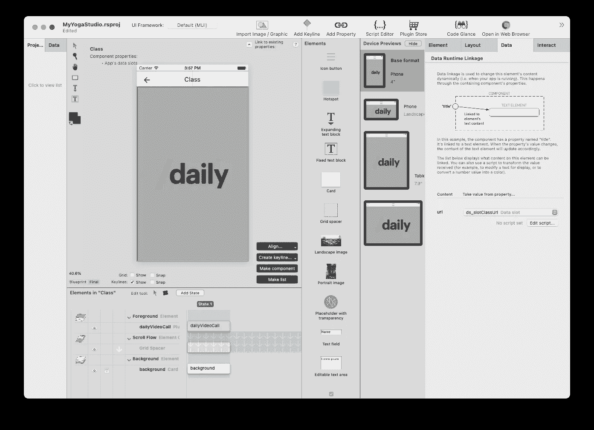

Class screen

这里有一个到我的瑜伽课堂演示应用的[链接。用模拟账户登录，试着点击一些课程。当我写这篇文章的时候，每日房间是活跃的，但是当你读这篇文章的时候他们可能已经到期了。即使实际的视频通话不再可用，仍然可以看到主要思想。](https://neonto.cloud/u/yogatudioemo)

如果您对 React Studio 有任何想法，请告诉我们

我们的论坛[https://discuss.reactstudio.com/](https://discuss.reactstudio.com/)还是 hello@neonto.com

从 www.reactstudio.com[下载 React Studio](https://www.reactstudio.com)

## 其他有趣的故事

 [## React Studio + Xano 无代码后端构建器= ❤️

### 我们有一些消息，你们所有的应用开发者都会喜欢的！

medium.com](/swlh/react-studio-xano-no-code-backend-builder-️-3f537a5d58d4)  [## 在 5 分钟内将本地化添加到 React app

### React Studio 项目有内置的本地化功能，这是非常强大的，即使许多用户甚至不…

reactstudio.medium.com](https://reactstudio.medium.com/add-localisation-to-react-app-in-5-minutes-57d80df6e07c)